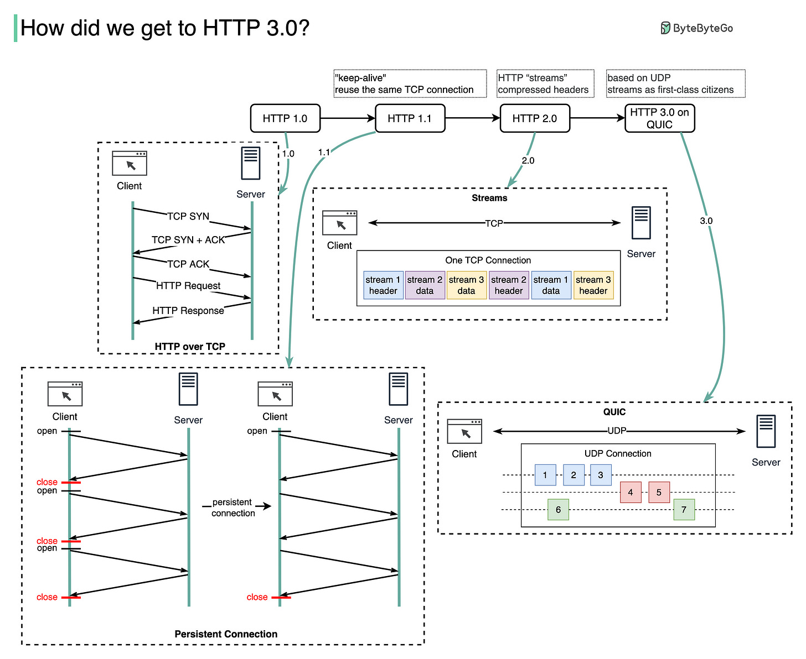
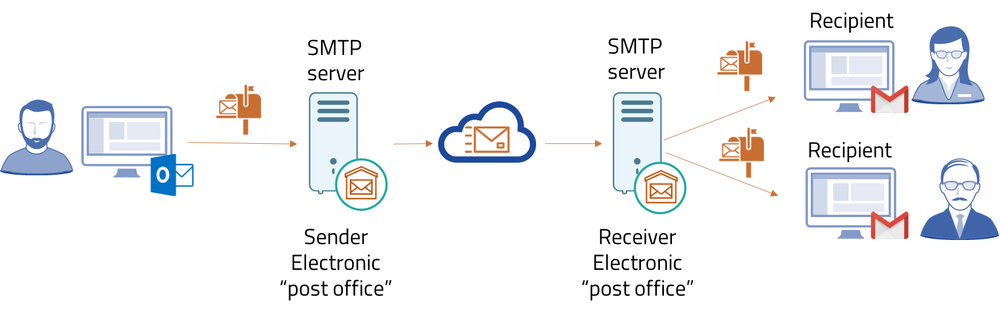
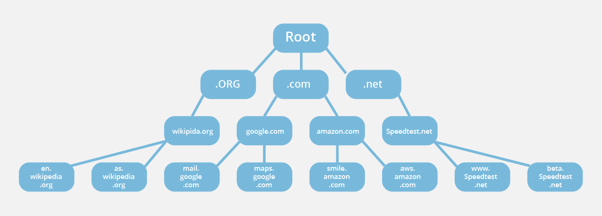

[toc]

# Application Layer

## Overview

**Prompt: Tell me some basics about network application layer.**

The network application layer, often referred to simply as the "application layer," is the topmost layer of the OSI (Open Systems Interconnection) model and the TCP/IP protocol suite. It is the layer closest to end-users and is responsible for providing network services and application-level communication. Here are some basics about the network application layer:

1. **End-User Interaction**: The application layer interacts directly with end-users and their applications. It includes various protocols and services that enable communication and data exchange between software applications running on different devices connected to the network.

2. **Application Protocols**: The application layer encompasses a wide range of application protocols, each designed for specific purposes. Examples include HTTP for web browsing, SMTP for email, FTP for file transfer, and DNS for domain name resolution.

3. **User Interface**: This layer provides the user interface for accessing network services. It's where users interact with software applications, such as web browsers, email clients, and instant messaging programs.

4. **Data Presentation**: The application layer is responsible for data presentation and format conversion, ensuring that data is in a format that can be understood by the recipient's application.

5. **Data Exchange and Communication**: It manages end-to-end communication and data exchange between applications on different devices. This includes setting up and terminating connections and ensuring data reliability and integrity.

6. **Common Application Services**: The application layer offers a variety of common application services, such as authentication, authorization, and security services to protect data during transmission.

7. **Application-Specific Services**: In addition to common services, the application layer provides application-specific services unique to each protocol. For example, HTTP provides services for web browsing, while FTP offers services for file transfer.

8. **Port Numbers**: The application layer uses port numbers to identify specific applications and services. Port numbers, combined with IP addresses, allow network devices to direct data to the appropriate application on a host.

9. **Examples of Application Layer Protocols**:
   - **HTTP (Hypertext Transfer Protocol)**: Used for web browsing and transmitting web pages.
   - **SMTP (Simple Mail Transfer Protocol)**: Used for sending and receiving email.
   - **FTP (File Transfer Protocol)**: Used for transferring files between hosts.
   - **POP3 (Post Office Protocol version 3)** and **IMAP (Internet Message Access Protocol)**: Used for retrieving email from servers.
   - **DNS (Domain Name System)**: Resolves domain names to IP addresses.
   - **SSH (Secure Shell)**: Provides secure remote access and file transfer.
   - **Telnet**: Provides remote access to hosts, but it is less secure than SSH.

10. **Security Considerations**: Security is a crucial aspect of the application layer. Many application layer protocols include features like encryption, authentication, and access control to protect data and user privacy.

In summary, the application layer plays a vital role in enabling user interactions with networked applications and services. It encompasses a wide range of protocols and services that are essential for various forms of data exchange and communication on the internet and other computer networks.

## HTTP

### Overview

**Prompt: Give me an overview about HTTP protocol.**

The Hypertext Transfer Protocol, or HTTP, is a fundamental protocol used for transferring data over the World Wide Web. It defines the structure and semantics of the communication between a client (usually a web browser) and a server (where web content is hosted). 

   - **Client-Server Model:** HTTP follows a client-server model where a client (usually a web browser) requests resources, and a server responds with those resources (typically web pages, images, or other data).

   - **Stateless Protocol:** HTTP is a stateless protocol, meaning that each request-response cycle is independent, and the server doesn't maintain any information about previous requests. To handle state, technologies like cookies are often used.

   - **Text-Based:** HTTP messages are text-based and consist of a request sent by the client and a response sent by the server. These messages include headers and, optionally, a message body.

### Component

**Prompt: Give me an introduction about key components for HTTP request and response.**

HTTP (Hypertext Transfer Protocol) requests and responses are the fundamental building blocks of web communication. They allow clients (e.g., web browsers or applications) to request resources from servers and for servers to respond with those resources. Here's an introduction to the key components of an HTTP request and response:

**HTTP Request Components:**

1. **HTTP Method:** This is the first part of an HTTP request and defines the action the client wants to perform. Common HTTP methods include:
   - **GET:** Retrieve data from the server.
   - **POST:** Send data to the server to create a new resource.
   - **PUT:** Update an existing resource on the server.
   - **DELETE:** Remove a resource on the server.
   - **HEAD:** Retrieve the headers of a resource without its body.
   - **OPTIONS:** Inquire about the communication options available for a resource.
   - And more.

2. **URL (Uniform Resource Locator):** The URL specifies the location of the resource the client wants to interact with. It consists of the following components:
   - **Scheme:** Indicates the protocol being used, typically "http" or "https."
   - **Host:** Identifies the server's domain name or IP address.
   - **Port (optional):** Specifies the port on which the server is listening (e.g., 80 for HTTP, 443 for HTTPS).
   - **Path:** Describes the specific resource or endpoint on the server.
   - **Query (optional):** Contains parameters for the request, typically used in GET requests.
   - **Fragment (optional):** Refers to a specific section within the resource.

3. **Headers:** HTTP headers provide additional information about the request, including details about the client, the type of data it can accept, and more. Common headers include:
   - **User-Agent:** Identifies the client, usually the web browser or application.
   - **Accept:** Specifies the acceptable media types for the response.
   - **Authorization:** Provides credentials for authentication.
   - **Content-Type:** Describes the format of the data being sent (in the request body).
   - Many others, depending on the specific use case.

4. **Message Body (optional):** Some HTTP requests include a message body, which contains data to be sent to the server. This is common in POST and PUT requests, where data like form submissions or JSON payloads are included.

**HTTP Response Components:**

1. **Status Code:** The HTTP response always starts with a three-digit status code, which indicates the outcome of the request. Common status codes include:
   - **200 OK:** The request was successful, and the response contains the requested data.
   - **404 Not Found:** The requested resource was not found on the server.
   - **500 Internal Server Error:** An error occurred on the server while processing the request.
   - Many other status codes, each with a specific meaning.

2. **Headers:** Similar to request headers, response headers provide metadata about the response. They may include information about the server, the content type, caching directives, and more.

3. **Message Body (optional):** The response's message body contains the actual data being sent back to the client. For example, in the case of an HTML page, an image, or JSON data.

Understanding the components of HTTP requests and responses is essential for web developers and anyone working with web services and APIs. These components facilitate the exchange of data and the functioning of the World Wide Web.

### Session and Cookie

**Prompt: What are session and cookie?**

Sessions and cookies are closely related to HTTP and are commonly used for maintaining state and enhancing the functionality of web applications. Here's an explanation of both concepts and how they relate to HTTP:

**1. Cookies:**
   - **What are Cookies?** Cookies are small pieces of data that a web server sends to a user's web browser. These cookies are stored locally on the user's device and are sent back to the server with every subsequent HTTP request. They are typically in the form of key-value pairs.

   - **Purpose:** Cookies serve various purposes, including session management, user tracking, and personalization. For example, they can remember a user's login status, preferences, and items in a shopping cart.

   - **How They Work:** When a server sends a cookie to a client, the client's browser stores it. The cookie is then included in the HTTP request headers when the client makes subsequent requests to the same server. This allows the server to identify and remember the client.

   - **Security:** Cookies can be used for both benign and malicious purposes. To enhance security and privacy, features like secure cookies (sent only over HTTPS) and HttpOnly cookies (inaccessible to JavaScript) have been introduced.

**2. Sessions:**
   - **What is a Session?** A session is a logical, temporary connection or interaction between a client and a server. It allows the server to associate a series of related HTTP requests from the same client as part of a single session. Sessions are essential for maintaining state across multiple HTTP requests, especially in web applications.

   - **Purpose:** Sessions are used to keep track of user-specific data and state, such as user authentication, shopping cart contents, and application settings, throughout a user's visit to a website.

   - **How They Work:** A session typically involves the use of cookies. When a user logs into a web application, a unique session ID is generated by the server and associated with that user. This session ID is often stored in a cookie on the user's device. Subsequent requests from the user's browser include this session ID in the cookie, allowing the server to identify the user and retrieve their session data.

   - **Server-Side Storage:** Session data is typically stored on the server. The server associates the session ID in the cookie with the relevant session data. This allows for secure management of sensitive information.

In summary, sessions and cookies are closely related to HTTP and are used to manage user-specific data and maintain state in web applications. Cookies, as small pieces of data sent between the client and server, are a common means to implement sessions by storing session identifiers. These mechanisms enhance the functionality and personalization of web applications, but it's important to use them responsibly to safeguard user privacy and security.

### Web Cache

**Prompt: What is web caching?**

Web caching is a technique used in computer networks and web servers to temporarily store copies of web resources (such as HTML pages, images, stylesheets, and JavaScript files) to serve them to users more efficiently. The primary purpose of web caching is to reduce latency, bandwidth usage, and server load while improving the user experience. Here's how web caching works and why it is important:

**How Web Caching Works:**

1. **Request for a Web Resource:** When a user's web browser or a client requests a web resource (e.g., a web page), the request is sent to the web server hosting that resource.
2. **Server Response:** The web server processes the request and sends back the requested resource along with relevant HTTP headers.
3. **Caching:**
   - **Client-Side Caching:** The client's web browser may cache the resource locally, storing it in a temporary storage location on the user's device. This allows the client to reuse the locally stored resource without making another request to the server if the same resource is needed in the future.
   - **Proxy Caching:** Intermediate devices like caching proxies or Content Delivery Networks (CDNs) can also cache resources. These devices intercept and store web resources on their servers, serving them to multiple clients when requested.
4. **Cache Validation:** Cached resources are periodically checked for freshness. The cache will typically include metadata in HTTP headers (e.g., "Last-Modified," "ETag") to determine whether the resource is still valid.
5. **Cache Retrieval:** When the user requests the same resource again or when another client requests the same resource, the cache checks whether it has a fresh copy of the resource. If the resource is still valid, the cache serves it directly to the client, reducing the need to retrieve it from the origin server.

### History

**Prompt: Compare HTTP 1.0, HTTP 1.1, HTTP 2.0, and HTTP 3.0.**

Certainly! Here's a comparison of HTTP 1.0, HTTP 1.1, HTTP 2.0, and HTTP 3.0, highlighting key differences and improvements between these HTTP versions:

**HTTP 1.0:**
1. **Year of Release:** 1996
2. **Connection Handling:** Each HTTP request/response required a separate connection to the server, leading to high overhead.
3. **Request Methods:** Supported basic request methods, including GET, POST, HEAD, PUT, and DELETE.
4. **Header Support:** Minimal header support; no headers for fine-grained control.
5. **Header Compression:** No header compression; all headers sent in plain text.
6. **Multiplexing:** No support for multiplexing, leading to high latency and slower page loading times.
7. **Security:** No built-in security features.
8. **Stateless:** HTTP 1.0 is a stateless protocol; each request/response is independent of others.

**HTTP 1.1:**
1. **Year of Release:** 1997
2. **Connection Handling:** Introduced persistent connections (keep-alive) to reduce the overhead of establishing new connections for each request.
3. **Request Methods:** Expanded support for request methods.
4. **Header Support:** Introduced various header fields, allowing for more fine-grained control and information transfer.
5. **Header Compression:** No header compression; headers sent in plain text.
6. **Multiplexing:** No native support for multiplexing; persistent connections help but are limited in performance improvements.
7. **Security:** Encouraged the use of secure connections (HTTPS) but didn't enforce it.
8. **Stateless:** HTTP 1.1 remained a stateless protocol.

**HTTP 2.0:**
1. **Year of Release:** 2015
2. **Connection Handling:** Introduced full multiplexing, allowing multiple requests and responses to be sent in parallel over a single connection.
3. **Request Methods:** Retained and expanded the range of request methods.
4. **Header Support:** Introduced header compression using HPACK, reducing header overhead.
5. **Multiplexing:** Full support for multiplexing, significantly reducing latency and improving page loading times.
6. **Security:** Encouraged the use of secure connections (HTTPS), and many modern browsers and servers only support HTTP/2 over HTTPS.
7. **Stateless:** HTTP/2 is a stateless protocol like its predecessors.

**HTTP 3.0:**
1. **Year of Release:** 2020
2. **Protocol Base:** Built on the QUIC protocol, using UDP instead of TCP for faster and more reliable connections.
3. **Connection Handling:** Faster connection establishment and migration, and improved handling of unreliable networks.
4. **Multiplexing:** Full multiplexing support similar to HTTP/2 but with additional benefits from the underlying QUIC protocol.
5. **Header Support:** Like HTTP/2, includes header compression for efficient data transfer.
6. **Security:** Encourages the use of secure connections, with all connections encrypted by default.
7. **No Head-of-Line Blocking:** Avoids head-of-line blocking to ensure the efficient delivery of data.
8. **Connection Migration:** Supports connection migration, which is particularly useful for mobile devices with changing network conditions.
9. **Reduced Round-Trips:** Significantly reduces round-trip times, improving page loading times.

HTTP 3.0 represents a substantial improvement over its predecessors, particularly in terms of performance, security, and efficiency. It is designed to address the challenges of modern web applications and networks, offering a faster and more reliable web experience.

### HTTPS

**Prompt: How does HTTPS work?**

HTTPS (Hypertext Transfer Protocol Secure) is a secure version of HTTP (Hypertext Transfer Protocol), the protocol used for transmitting data between a user's web browser and a website. HTTPS employs encryption and authentication mechanisms to ensure the confidentiality and integrity of the data being transmitted. Here's how HTTPS works:

1. **Handshake and Key Exchange:**
   - When a user's web browser makes a request to access a website secured with HTTPS (usually by typing "https://" before the URL), the server hosting the website responds with a digital certificate. This certificate contains the server's public key and some information about the website.
   - The user's browser then checks the certificate to verify its authenticity. This is done by confirming that the certificate is signed by a trusted Certificate Authority (CA). Web browsers come with a list of trusted CAs, and the certificate must be signed by one of them.
   - If the certificate is valid, the user's browser generates a random symmetric encryption key known as the session key. The browser encrypts this session key with the server's public key and sends it back to the server.

2. **Key Exchange:**
   - The server, using its private key, decrypts the session key provided by the browser. Now, both the client and server have the same symmetric session key. This key is used for encrypting and decrypting data during the session.

3. **Secure Data Transfer:**
   - With the session key in place, the browser and server can communicate securely. All data transmitted between them is encrypted using symmetric encryption algorithms like AES (Advanced Encryption Standard).
   - This encryption ensures that even if someone intercepts the data being transmitted, they cannot understand or modify it without the session key.

4. **Data Integrity:**
   - In addition to encryption, HTTPS also ensures data integrity. This means that the data cannot be tampered with during transmission. This is achieved through the use of cryptographic hash functions.
   - Before sending data, the sender calculates a hash of the data and includes it in the transmission. The recipient checks the data's integrity by recalculating the hash and comparing it to the received hash. If they match, the data is considered intact.

5. **Certificate Revocation:**
   - Certificates have a limited validity period, and they can be revoked if they are compromised or if the server's information changes. Browsers regularly check the status of certificates with CAs to ensure their validity.

In summary, HTTPS works by establishing a secure connection between the user's browser and the web server through encryption and authentication. This ensures that data is kept confidential and cannot be tampered with during transmission. It has become a fundamental component of web security, particularly for protecting sensitive information like login credentials, payment data, and personal details on websites.

## SMTP

### Workflow

**Prompt: What's the workflow of sending email and how does SMTP work in the workflow?**

The workflow of sending an email involves several steps, with SMTP (Simple Mail Transfer Protocol) playing a critical role in the process. Here's an overview of the email sending workflow and how SMTP works within it:

1. **Message Composition:**
   - The sender composes an email message using an email client, such as Outlook, Gmail, or Thunderbird.
   - The message includes the recipient's email address, subject, message body, and any attachments.

2. **SMTP Client Configuration:**
   - The sender's email client or server is configured to use an SMTP server for sending emails.
   - The client/server settings include the hostname or IP address of the SMTP server, port number (usually 25 for unencrypted or 587 for encrypted communication), and authentication credentials if required.

3. **Connection Establishment:**
   - When the sender clicks the "Send" button, the email client or server initiates a connection to the SMTP server. This connection typically uses TCP/IP.
   - If encryption is enabled (e.g., using STARTTLS), a secure connection is established, ensuring data privacy.

4. **Recipient's Domain Resolution:**
   - The SMTP server extracts the recipient's email domain from the recipient's email address (e.g., "recipient@example.com").
   - It queries the DNS (Domain Name System) to obtain the IP address of the recipient's mail server.

5. **Handshake and Authentication:**
   - The sender's SMTP client and the recipient's SMTP server engage in an initial handshake to confirm the connection.
   - If required, the sender's client provides authentication credentials (username and password) to verify its identity to the recipient's server.

6. **Message Transfer:**
   - With the connection established and authentication (if needed) completed, the sender's email client or server transfers the email message to the SMTP server.
   - The SMTP server accepts the email and queues it for further processing.

7. **Recipient's Server Processing:**
   - The recipient's SMTP server receives the email and performs various checks.
   - It verifies the recipient's email address, checks for spam, and decides whether to deliver the email to the recipient's mailbox.

8. **Delivery Confirmation:**
   - The recipient's SMTP server sends a delivery confirmation or a bounce message (also known as a non-delivery report or NDR) to the sender's SMTP server.
   - This confirmation indicates the status of the email delivery.

9. **Recipient Access:**
   - The recipient can access their email mailbox using an email client or webmail interface.
   - Email retrieval protocols like IMAP (Internet Message Access Protocol) or POP3 (Post Office Protocol) are used to access and retrieve the email message from the recipient's email server.

10. **Message Storage:**
    - The email message is stored in the recipient's mailbox on the email server.
    - The recipient can organize, read, reply to, forward, or delete the email as desired.

11. **Recipient Notification:**
    - The recipient's email client or webmail interface may notify them of the arrival of a new email.
    - Notifications can be in the form of pop-up alerts, sound signals, or email count updates.

SMTP plays a crucial role in this workflow by facilitating the secure and reliable transmission of email messages from the sender's client or server to the recipient's email server. It ensures that the message is correctly addressed and delivered to the recipient's mailbox. Additionally, SMTP servers exchange status information to inform both sender and recipient of the email's delivery status.

### Protocol

**Prompt: What is IMAP/POP3 protocol?**

IMAP (Internet Message Access Protocol) and POP3 (Post Office Protocol, version 3) are two of the most commonly used email retrieval protocols. They serve the purpose of enabling email clients to access email messages from a mail server. Here's an overview of IMAP and POP3 and why they are needed:

**IMAP (Internet Message Access Protocol):**

1. **Functionality:** IMAP is a more advanced and feature-rich email retrieval protocol compared to POP3. It allows users to access their email messages on a remote mail server and manipulate them as if they were stored locally.

2. **Server-Side Storage:** With IMAP, email messages are stored on the server. Users can organize, read, reply to, and manage their email messages directly on the server.

3. **Multiple Devices:** IMAP is ideal for users who access their email from multiple devices (e.g., desktop computer, laptop, smartphone). Since messages are stored on the server, changes made on one device are reflected on all devices.

4. **Synchronization:** IMAP synchronizes the email client with the server, ensuring that read/unread status, folders, and other changes are consistent across devices.

5. **Efficiency:** IMAP allows users to download only the email headers or parts of messages, saving bandwidth and reducing data transfer time.

6. **Offline Access:** Many email clients offer offline access with IMAP. Users can cache copies of their emails for offline reading and composing.

7. **Folder Management:** IMAP supports the management of folders and subfolders on the server, providing a structured organization for emails.

8. **Email Retention:** Emails are typically retained on the server, so users can access their entire email history.

**POP3 (Post Office Protocol, version 3):**

1. **Functionality:** POP3 is a simpler email retrieval protocol that focuses on downloading email messages from a mail server to a local email client.

2. **Local Storage:** POP3 downloads email messages to the user's device, removing them from the server (although some configurations can leave a copy on the server).

3. **Single Device:** POP3 is suitable for users who access their email from a single device, such as a desktop computer.

4. **Limited Synchronization:** POP3 doesn't synchronize read/unread status or folders across multiple devices. Each device accessing the account sees its own copy of emails.

5. **Data Transfer:** POP3 downloads the entire content of email messages, which can be inefficient in terms of data transfer.

6. **No Folder Management:** POP3 typically doesn't support server-side folder management. Folder organization is usually done on the local email client.

In summary, IMAP and POP3 are essential because they provide different email retrieval options to accommodate users with varying needs and preferences. IMAP is a more versatile and feature-rich protocol, while POP3 is simpler and better suited for a single-device email setup. The choice between them depends on the user's specific email management requirements.

## P2P

### Overview

**Prompt: Give me an introduction about P2P protocol**

Peer-to-Peer (P2P) is a network protocol and architecture that enables direct communication and collaboration between individual computers (peers) on a network, rather than relying on a centralized server or authority. In a P2P network, each peer has equal status and can act as both a client and a server, sharing resources and data directly with other peers. Here's an introduction to P2P protocol and its key features:

**Key Characteristics of P2P Protocol:**

1. **Decentralization:** P2P networks are decentralized, meaning there is no central server or authority that controls and mediates communication. Peers communicate directly with one another.

2. **Equal Status:** In a P2P network, all peers have equal status and can initiate communication or share resources without relying on a central hub.

3. **Resource Sharing:** P2P networks are known for resource sharing. Peers can share various resources, including files, processing power, and network bandwidth.

4. **Scalability:** P2P networks can be highly scalable. As more peers join the network, it can become more robust and capable of handling increased traffic and resource sharing.

5. **Redundancy:** P2P networks often exhibit redundancy, as multiple copies of the same data or resources may exist across different peers. This can improve fault tolerance.

6. **Resilience:** P2P networks are resilient to single points of failure because there is no central server. If one peer goes offline, others can continue to function.

7. **Anonymity:** P2P networks can offer a degree of anonymity, as communication does not necessarily pass through a central authority that can log or monitor it.

**Applications of P2P Protocol:**

1. **File Sharing:** P2P networks are widely used for file sharing, with protocols like BitTorrent enabling users to distribute and download large files efficiently.

2. **Streaming:** P2P streaming applications use the protocol to distribute video and audio content directly from users' devices, reducing the load on centralized servers.

3. **Voice and Video Calls:** Some peer-to-peer communication applications enable users to make voice and video calls directly between devices.

4. **Decentralized Computing:** P2P networks can be harnessed for decentralized computing and distributed computing projects, allowing peers to contribute processing power to solve complex tasks or calculations.

5. **Blockchain Technology:** Many blockchain networks are based on P2P principles, enabling participants to validate and share transactions without relying on a central authority.

6. **Collaboration:** P2P networks can be used for collaborative purposes, such as sharing documents, data, or other resources among a group of peers.

7. **Messaging:** P2P messaging applications allow users to exchange text and multimedia messages directly between devices, often with end-to-end encryption for privacy.

P2P protocols and networks have transformed various aspects of digital communication and data sharing. They offer the advantages of decentralization, scalability, and resource sharing, making them particularly well-suited for applications where resilience, privacy, and efficiency are important. However, P2P networks also pose challenges related to security and intellectual property, as they can facilitate the distribution of copyrighted content and peer-to-peer attacks if not properly managed.

### BitTorrent

**Prompt: What's the workflow to send file through BitTorrent**

BitTorrent is a peer-to-peer (P2P) file-sharing protocol that enables users to distribute and download files from multiple sources. Here's an overview of the workflow for sending a file through BitTorrent:

**File Sender's Perspective:**

1. **Choose a BitTorrent Client:** The user who wants to send a file via BitTorrent needs to install a BitTorrent client on their computer. Popular BitTorrent clients include uTorrent, BitTorrent, qBittorrent, and Transmission.

2. **Create a Torrent File:**
   - The sender creates a torrent file using their BitTorrent client. This file contains metadata about the shared file, such as its name, size, and a list of trackers (servers that help facilitate communication between peers).
   - The torrent file has a .torrent file extension.

3. **Share the Torrent File:** The sender shares the torrent file with potential downloaders. This can be done by sharing the .torrent file via email, direct link, or by uploading it to a torrent website or tracker. Recipients of the .torrent file will use it to initiate the download.

**Recipient's Perspective:**

1. **Install a BitTorrent Client:** Recipients who want to download the shared file need to install a BitTorrent client on their computer, just like the sender.

2. **Download the Torrent File:** The recipient downloads the .torrent file shared by the sender.

3. **Open the Torrent File:**
   - The recipient opens the downloaded .torrent file with their BitTorrent client.
   - The client reads the metadata within the .torrent file, including the list of trackers and information about the file to be downloaded.

4. **Connecting to Peers:**
   - The BitTorrent client connects to the tracker(s) listed in the .torrent file to discover other peers sharing the same file.
   - It also establishes connections with these peers to download the file.

5. **Downloading Chunks:**
   - The file is divided into smaller pieces or chunks, and each peer downloads these chunks from one another.
   - Peers download chunks from multiple sources in parallel, improving download speed and reliability.

6. **Seeding:** Once a recipient has downloaded the entire file, their BitTorrent client may continue to upload (seed) the file to other peers in the swarm, helping to distribute the file further.

7. **Upload and Download Management:**
   - BitTorrent clients allow users to manage settings like upload/download speed limits, scheduling, and the number of active torrents.
   - Users can pause, resume, and prioritize specific torrents in their client.

8. **Completion and Verification:** The BitTorrent client verifies the integrity of downloaded chunks, ensuring the completeness of the file.

9. **Share and Continue:** After downloading the file, recipients can keep the downloaded content on their computer, share it with others by seeding, or stop sharing and delete the torrent from their client.

The BitTorrent protocol's distributed nature and ability to leverage the upload capacity of all participating peers make it an efficient and resilient way to share large files. It's commonly used for sharing large media files, open-source software, and other content where distributing the load across multiple sources is beneficial.

## DNS

**Prompt: Give me an introduction about DNS.**

DNS, or Domain Name System, is a fundamental technology that plays a crucial role in the functioning of the internet. It serves as the internet's address book, translating human-friendly domain names (e.g., www.example.com) into numerical IP (Internet Protocol) addresses (e.g., 192.0.2.1) that computers and network devices use to identify each other on the internet. Here's an introduction to DNS and its key features:

**Key Concepts of DNS:**

1. **Domain Names:** Domain names are user-friendly labels used to identify websites and resources on the internet. They are hierarchical, with the top-level domain (TLD) on the right (e.g., .com, .org) and subdomains on the left (e.g., www, mail).

2. **IP Addresses:** IP addresses are numerical labels assigned to every device connected to the internet. They are used for routing data between devices and identifying their locations on the internet.

3. **Resolution:** DNS resolution is the process of converting domain names into IP addresses. When you type a domain name into a web browser, DNS resolution occurs behind the scenes to locate the corresponding IP address.

4. **DNS Servers:** DNS servers are specialized computers that store and manage DNS records. They are distributed worldwide and work together to ensure efficient domain-to-IP address resolution.

### Workflow

**Prompt: What is the workflow for DNS resolution?**

1. **Domain Name Query:** When you enter a domain name (e.g., [www.example.com](http://www.example.com/)) in your web browser, your device initiates a DNS query to find the corresponding IP address.
2. **Local DNS Resolver:** Your device typically contacts a local DNS resolver, such as one provided by your internet service provider (ISP). The local resolver may have a cached record of the domain-IP mapping or query authoritative DNS servers to resolve the domain.
3. **Authoritative DNS Servers:** If the local DNS resolver does not have the needed information in its cache, it contacts authoritative DNS servers for the specific domain. These authoritative servers are responsible for a particular domain's DNS records.
4. **Recursive Queries:** The authoritative DNS servers, in turn, may perform recursive queries to find the IP address. They consult higher-level DNS servers if they don't have the information in their cache.
5. **Response:** The IP address is obtained from the authoritative DNS servers and sent back to the local resolver, which caches the record for future use.
6. **Local Caching:** The local resolver provides the IP address to your device, which caches the result for a limited time. This reduces the need for repeated DNS queries for frequently visited websites.
7. **Connection:** With the IP address in hand, your device can establish a connection to the web server associated with the domain, allowing you to access the website.

### Nameserver

**Prompt: Give me an introduction about DNS server.**

A DNS name server, also commonly referred to as a DNS server or nameserver, is a fundamental component of the Domain Name System (DNS). Its primary role is to resolve domain names (e.g., www.example.com) into corresponding IP addresses (e.g., 192.0.2.1) or other DNS records. DNS name servers play a critical role in the internet's functionality and facilitate the efficient routing of data across the web. Here's an overview of DNS name servers and their key functions:

**Key Functions of DNS Name Servers:**

1. **Domain Name Resolution:** DNS name servers are responsible for the process of domain name resolution, which involves converting human-readable domain names into numerical IP addresses. This translation allows computers and network devices to locate and communicate with each other on the internet.

2. **Authoritative Data:** DNS name servers store and manage authoritative DNS data for specific domains. This authoritative data includes DNS records like A records (for IPv4 addresses), AAAA records (for IPv6 addresses), MX records (for email server addresses), CNAME records (for aliasing), and more.

3. **Caching:** DNS name servers can cache DNS records that they've recently looked up. This caching mechanism reduces the need to query authoritative DNS servers for frequently accessed domain names, improving DNS resolution speed and efficiency.

4. **Zone Management:** DNS name servers are responsible for managing specific DNS zones, which are portions of the DNS namespace. Each DNS zone corresponds to a domain, and the authoritative name server for that domain controls the DNS records within its zone.

5. **Name Resolution Hierarchy:** DNS name servers are organized hierarchically. The root servers, top-level domain (TLD) servers, and authoritative name servers work together to provide complete domain name resolution. The hierarchy helps distribute the load and facilitate efficient DNS queries.

**Types of DNS Name Servers:**

1. **Recursive DNS Servers:** These servers are responsible for receiving DNS queries from clients (e.g., web browsers) and performing the entire resolution process on behalf of the client. They send queries to authoritative DNS servers to obtain IP addresses or other DNS records and then provide the results to the client. Recursive DNS servers are typically provided by ISPs.

2. **Authoritative DNS Servers:** These servers store and manage DNS records for specific domains. They respond to DNS queries with authoritative information about the domains they are responsible for. Organizations or domain registrars often operate authoritative DNS servers for their domains.

3. **Root DNS Servers:** There are 13 root DNS servers distributed worldwide. These servers do not have information about specific domain names but direct queries to TLD (top-level domain) servers. Root servers play a critical role in the initial stages of DNS resolution.

4. **TLD DNS Servers:** Top-level domain (TLD) servers, like those for .com, .org, or .net, manage the DNS records for the TLDs they represent. They help direct queries to the authoritative DNS servers responsible for specific domains within their TLD.

DNS name servers are a fundamental component of the internet's infrastructure, ensuring that domain names can be translated into IP addresses, making web navigation user-friendly and efficient. They work together in a distributed and hierarchical manner to provide robust and reliable DNS resolution services.

## CDN

**Give me an introduction about CDN.**

A Content Delivery Network (CDN) is a distributed network of strategically placed servers designed to enhance the performance, security, and reliability of delivering web content to end users. CDNs work by reducing the physical distance and network latency between a content's source (origin server) and the end user's device. Here's an introduction to Content Delivery Networks and their key features:

**Key Features and Functions of CDNs:**

1. **Content Caching:** CDNs cache copies of web content, including web pages, images, videos, scripts, and other digital assets, on their servers. When a user requests content, the CDN serves it from the nearest edge server, reducing the time it takes to load web pages and content.

2. **Load Balancing:** CDNs distribute user requests across multiple edge servers to ensure even traffic distribution and prevent overloading of a single server. This improves the scalability and reliability of web services.

3. **Reduced Latency:** CDNs reduce network latency by serving content from servers located geographically closer to the user. This minimizes the delay in content retrieval, resulting in faster loading times for web pages and media.

4. **Improved Redundancy:** CDNs provide redundancy and fault tolerance by distributing content across multiple servers in different locations. This ensures that content remains available even if one server or data center experiences issues.

5. **Distributed Network:** CDNs typically have a global network of edge servers in various regions and countries. This distribution helps deliver content to users worldwide with minimal delay.

6. **Security and DDoS Protection:** CDNs often include security features to mitigate Distributed Denial of Service (DDoS) attacks, protecting websites and web applications from traffic surges and malicious activities.

7. **Scalability:** CDNs can scale dynamically to handle increased traffic during peak periods, ensuring websites remain responsive and available.

8. **Analytics and Reporting:** Many CDNs provide analytics and reporting tools that allow website owners to monitor traffic, performance, and user behavior.

9. **Content Optimization:** CDNs can optimize content delivery by compressing images, using HTTP/2 and HTTP/3 protocols, and implementing other techniques to enhance website performance.

**Benefits of CDNs:**

1. **Faster Page Loading:** CDNs significantly reduce the time it takes to load web pages and content, leading to improved user experiences.

2. **Global Reach:** CDNs make it possible to serve content to users around the world, even if the content's origin server is located in a specific region.

3. **High Availability:** CDNs enhance the reliability and availability of web services, reducing the risk of downtime.

4. **Bandwidth Savings:** CDNs offload traffic from the origin server, reducing bandwidth costs for website owners.

5. **Scalability:** CDNs help websites handle traffic spikes and scalability challenges.

6. **Security:** CDNs provide security features to protect against various online threats.

CDNs are widely used by websites, e-commerce platforms, content providers, and businesses to deliver a fast and reliable online experience to their users. Popular CDN providers include Akamai, Cloudflare, Amazon CloudFront, and Fastly, among others.
