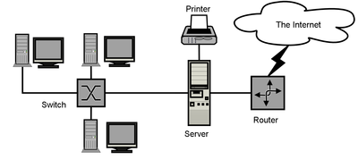
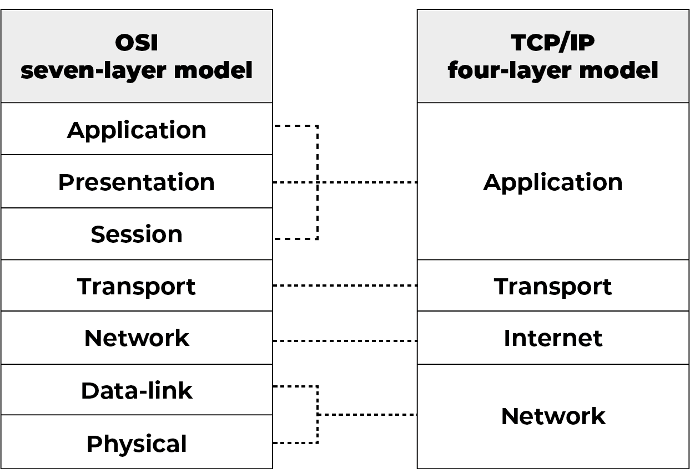

[toc]

# Introduction

## Structure

**Prompts: What's the structure of the entire computer network?**

The structure of an entire computer network can be described using the concept of network cores and network edges, which are often associated with the core network infrastructure and the end-user devices, respectively. This concept helps to understand the functional divisions within a network. Here's an overview of the structure, including network cores and network edges:

1. **Network Edges**:

   - **End Devices**: These are the devices at the outermost edges of the network and include computers, laptops, smartphones, servers, IoT devices, and more. End devices are where users and applications interact with the network.
   
   - **Access Points (APs)**: In wireless networks, access points provide connectivity for Wi-Fi-enabled devices.

   - **User Interfaces**: These are the interfaces that allow users to interact with the network, such as web browsers, email clients, and various applications.

   - **Network Access Points**: These are points of entry to the network, where end devices connect. They may include wired connections (e.g., Ethernet ports) and wireless connections (e.g., Wi-Fi access points).

2. **Network Core**:

   - **Switches and Routers**: These are critical components in the core network. 
     - **Switches** operate at the data link layer (Layer 2) and are used to connect devices within the same local area network (LAN).
     - **Routers** operate at the network layer (Layer 3) and are responsible for forwarding data between different networks, making routing decisions based on IP addresses.

   - **Backbone Networks**: High-capacity, high-speed connections that form the backbone of the network, connecting various parts of the network together.

   - **Internet Service Providers (ISPs)**: ISPs connect to the core of the internet and provide network access to organizations and end users. They play a crucial role in routing data between networks.

   - **Data Centers**: Data centers are facilities that host servers and applications, providing services over the network. They are a vital part of many network architectures.

   - **Network Services**: Core networks often host critical network services such as DNS servers, DHCP servers, and firewalls, which help manage and secure network traffic.

3. **Protocols and Standards**:

   - Various networking protocols and standards, such as TCP/IP, BGP (Border Gateway Protocol), OSPF (Open Shortest Path First), and others, govern how data is routed within the network.

4. **Security Measures**:

   - **Firewalls**: Core network components are typically protected by firewalls to prevent unauthorized access.

   - **Intrusion Detection and Prevention Systems (IDS/IPS)**: These systems monitor and respond to network threats.

   - **Virtual Private Networks (VPNs)**: Secure connections are used to protect data in transit.

5. **Network Management and Monitoring**:

   - Network management software, SNMP (Simple Network Management Protocol), and various monitoring tools are used to configure, monitor, and manage core network devices.

The network core is responsible for routing and transmitting data between different network segments, while network edges include the devices and interfaces through which end users and applications access the network. Together, they form the foundational structure of a computer network. The specific architecture, components, and design of a network will vary based on the organization's needs and the scale of the network.

### Circuit Switching

Circuit switching is a traditional method of communication in which a dedicated communication path, or "circuit," is established between two parties for the entire duration of their conversation. It is often associated with the Public Switched Telephone Network (PSTN). In circuit switching, resources, including bandwidth and routing, are reserved for the duration of the call. This ensures a consistent and predictable quality of service, making it ideal for real-time applications like voice calls. However, circuit switching is less efficient in terms of resource utilization and is not well-suited for variable or bursty data traffic. It can lead to periods of inactivity where resources are underutilized.

### Packet Switching

Packet switching is the dominant method used in modern computer networks, including the internet. Instead of dedicating a continuous circuit, data is divided into small packets that are individually transmitted across the network. These packets can take different routes, may arrive out of order, and are reassembled at the destination. Packet switching is efficient in terms of resource utilization, adapts well to varying data traffic, and is highly scalable. It is the foundation of digital communication, enabling the efficient transfer of data, including text, images, video, and voice, across global networks.

### Comparison

1. **Resource Usage**:
   - Circuit Switching: Resources are reserved for the entire call duration, even during periods of silence. This can be inefficient.
   - Packet Switching: Resources are shared dynamically among multiple data streams, leading to efficient resource utilization.
2. **Predictability**:
   - Circuit Switching: Offers predictable and consistent quality of service but at the cost of potential underutilization of resources during silent periods.
   - Packet Switching: Adapts to variable data traffic and is more efficient, but it may not guarantee the same level of predictability as circuit switching.
3. **Scalability**:
   - Circuit Switching: Less scalable due to the need to allocate dedicated circuits for each communication.
   - Packet Switching: Highly scalable, as new connections can be established without the need for dedicated resources.
4. **Suitability for Data Types**:
   - Circuit Switching: Well-suited for real-time, constant-bit-rate applications like voice calls.
   - Packet Switching: Versatile and suitable for a wide range of data types, including text, multimedia, and interactive data.
5. **Fault Tolerance**:
   - Circuit Switching: Susceptible to failures in the dedicated circuit, which can disrupt communication.
   - Packet Switching: Can adapt to network failures by rerouting packets, providing greater fault tolerance.
6. **Cost Efficiency**:
   - Circuit Switching: Can be costly, especially for idle resources during non-peak times.
   - Packet Switching: Cost-efficient due to dynamic resource allocation and sharing.

## Performance

**Prompt: What are some common metrics to evaluate computer networks performance?**

Evaluating the performance of computer networks involves measuring various key metrics to ensure that the network meets its intended goals and operates efficiently. Here are some common metrics used to evaluate computer network performance:

1. **Latency**: Latency measures the delay in data transmission between source and destination. It can be categorized into different types, including:
   - **Round-Trip Time (RTT)**: The time taken for a packet to travel from the source to the destination and back.
   - **One-Way Latency**: The time it takes for a packet to travel from the source to the destination (or vice versa) without returning.
2. **Bandwidth**: Bandwidth refers to the maximum data transfer rate of a network link, usually measured in bits per second (bps), kilobits per second (Kbps), megabits per second (Mbps), or gigabits per second (Gbps).
3. **Throughput**: Throughput is the actual data transfer rate in a network, which may be lower than the available bandwidth due to factors like network congestion and protocol overhead.
4. **Packet Loss**: Packet loss is the percentage of data packets that do not reach their destination. High packet loss can indicate network congestion or issues with network hardware.
5. **Jitter**: Jitter measures the variation in packet delay over time. Consistent and low jitter is important for real-time applications like VoIP or video conferencing.

### Throughput

**Prompt: Tell me the formula to calculate throughput of computer network.**

Throughput (in bits per second, bps) = (Data Size in bits) / (Time in seconds)

You can also calculate throughput in bytes per second (Bps) using the following formula:

Throughput (in bytes per second, Bps) = (Data Size in bytes) / (Time in seconds)

### Latency

**Prompt: Tell me the formula to calculate latency of computer network.**

The formula to calculate the latency (delay) of a computer network can be broken down into several components:

Total Latency (L) = Transmission Delay (T) + Propagation Delay (P) + Processing Delay (P) + Queueing Delay (Q)

Here's a brief explanation of each component:

1. **Transmission Delay (T)**: This is the time it takes to push all the bits of a packet onto the network medium. It's calculated using the formula: T = (Packet Size in bits) / (Link Bandwidth in bits per second).

2. **Propagation Delay (P)**: Propagation delay is the time it takes for a signal to travel from the sender to the receiver over the physical medium. It's calculated using the formula: P = (Distance between sender and receiver) / (Propagation Speed).

3. **Processing Delay (P)**: This is the time it takes for a network device (e.g., router or switch) to process a packet. It can vary based on the device and its workload.

4. **Queueing Delay (Q)**: Queueing delay occurs when a packet has to wait in a queue at a network device because the device is busy processing other packets. It can be challenging to calculate precisely and depends on the network's congestion and the queuing algorithms in use.

The total latency combines these components to give you the overall delay a packet experiences as it travels through the network. Keep in mind that in practical network scenarios, other factors like transmission media characteristics, routing, and network congestion can also influence latency. The above formula provides a simplified view of network latency, and real-world latency can be more complex to calculate due to these additional factors.

## Layers

**Prompt: What is network layers?**

Network layers refer to a conceptual framework used to design and understand the functionality of networking protocols and devices in a systematic and organized way. The layers represent distinct levels of communication and provide a structured approach to network design, management, and troubleshooting.

### OSI

1. **Physical Layer (Layer 1)**: The physical layer deals with the transmission and reception of raw binary data over the physical medium. It encompasses physical hardware aspects like cables, connectors, and signaling.
2. **Data Link Layer (Layer 2)**: The data link layer is responsible for the reliable transmission of data between directly connected nodes. It also handles error detection and correction. Ethernet and Wi-Fi operate at this layer.
3. **Network Layer (Layer 3)**: The network layer is responsible for routing packets between different networks. It includes IP (Internet Protocol) and routing protocols that determine the path data should take to reach its destination.
4. **Transport Layer (Layer 4)**: The transport layer is responsible for end-to-end communication between devices. It ensures data integrity, reliability, and flow control. TCP (Transmission Control Protocol) and UDP (User Datagram Protocol) are commonly used at this layer.
5. **Session Layer (Layer 5)**: The session layer manages the establishment, maintenance, and termination of communication sessions between devices. It handles tasks like session synchronization and checkpointing.
6. **Presentation Layer (Layer 6)**: The presentation layer is responsible for data translation, encryption, and compression. It ensures that data is in a format that can be understood by the application layer.
7. **Application Layer (Layer 7)**: The application layer is the top layer and is closest to the end-user. It includes various application protocols for services like email (SMTP), web browsing (HTTP), file transfer (FTP), and more.

### TCP/IP

The TCP/IP model is a more simplified version compared to the OSI model. It has four layers:

1. **Link Layer**: This is equivalent to the combination of the physical and data link layers in the OSI model. It deals with the transmission of data within a local network, such as Ethernet or Wi-Fi.
2. **Internet Layer**: This corresponds to the network layer in the OSI model. It is responsible for routing packets across networks and includes the Internet Protocol (IP).
3. **Transport Layer**: This corresponds to the transport layer in the OSI model. It provides end-to-end communication and includes TCP and UDP.
4. **Application Layer**: This combines the functionality of the session, presentation, and application layers in the OSI model. It is the closest to the user and includes various application protocols for network services.
