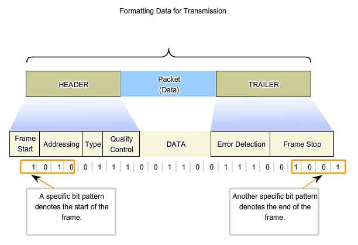

[toc]

# Link Layer

## Overview

**Prompt: Give me an introduction about network link layer.**

The network link layer, often referred to as Layer 2 in the OSI (Open Systems Interconnection) model, is a crucial component of computer networking. It serves as an intermediary layer that facilitates communication between devices within the same local network. Here's an overview of the network link layer:

1. **Addressing and Framing:** One of the primary functions of the link layer is to encapsulate data into frames. Each device on a network at this layer is assigned a unique identifier, such as a Media Access Control (MAC) address for Ethernet networks. These addresses are used for addressing and directing data frames to the intended recipient.

2. **Error Detection and Correction:** The link layer is responsible for detecting and, in some cases, correcting errors that may occur during data transmission over the network medium. This ensures data integrity as it traverses the local network.

3. **Flow Control:** The link layer manages the flow of data between devices to prevent congestion and ensure efficient communication. Flow control mechanisms can include techniques like buffering, throttling, and acknowledgments.

4. **Media Access Control (MAC):** MAC protocols are used to determine how devices share and access the physical transmission medium, be it a wired medium like Ethernet cables or wireless channels like Wi-Fi. Different MAC protocols define how multiple devices can transmit data without interfering with each other.

5. **Switching and Bridging:** Devices like network switches and bridges operate at the link layer. They play a crucial role in forwarding data frames within the local network based on MAC addresses, increasing the efficiency of data transmission by minimizing unnecessary traffic.

6. **Local Area Network (LAN) Topology:** The link layer defines the local network's topology, which can be a bus, star, ring, or mesh configuration. The choice of topology affects how data is transmitted and received within the local network.

7. **Ethernet and Wi-Fi:** The most common data link layer technologies include Ethernet for wired connections and Wi-Fi for wireless connections. These technologies are prevalent in local network environments and rely on distinct standards and protocols.

8. **Layer Interaction:** The link layer works in conjunction with the network layer (Layer 3) above it. Devices at the link layer use the network layer information to determine how to forward data to devices outside the local network. They perform this by interacting with routers and making routing decisions.

9. **Security:** While the primary focus of the link layer is on the efficient transmission of data within a local network, it also plays a role in network security. Security measures, such as Virtual LANs (VLANs) and access control lists, are often implemented at this layer to control access and enhance network security.

In summary, the network link layer is a critical component in local area networking, responsible for addressing, framing, error detection, flow control, and media access control. It ensures the efficient and reliable exchange of data within a local network, serving as a bridge between the physical hardware and the higher layers of the OSI model.

## Frame

**Prompt: How does link layer frame look like?**

A link layer frame varies in structure and content depending on the specific networking technology being used, but I can provide an example of what a basic Ethernet frame, one of the most common types, looks like. An Ethernet frame typically consists of the following components:

1. Preamble: The preamble is a series of alternating 1s and 0s used to signal the receiving device that a frame is coming. It helps in synchronization and clock recovery.

2. Start Frame Delimiter (SFD): The SFD marks the end of the preamble and the start of the frame. It typically consists of a specific bit sequence, which is 10101011 (in hexadecimal, 0x55), and is used to indicate the start of the frame.

3. Destination MAC Address: This field contains the MAC (Media Access Control) address of the device to which the frame is being sent. It is typically 6 bytes in length and uniquely identifies the recipient.

4. Source MAC Address: This field contains the MAC address of the device sending the frame, also 6 bytes in length.

5. EtherType/Length: This field can serve two purposes. If the value is less than 0x0600 (1536 in decimal), it represents the length of the frame's data portion. If the value is greater than or equal to 0x0600, it signifies the type of the protocol used in the data portion of the frame.

6. Data: This is the actual payload of the frame, containing the data to be transmitted. Its structure and content vary depending on the specific network protocol in use.

7. Frame Check Sequence (FCS): The FCS field contains error-checking information, often in the form of a CRC (Cyclic Redundancy Check) value, which is used to detect and correct errors in the frame during transmission.

8. Frame Status/Interframe Gap: This portion marks the end of the frame and allows for a gap before the transmission of the next frame. It ensures that there is a clear separation between frames.

Keep in mind that different networking technologies, like Wi-Fi or Token Ring, may have variations in frame structures. Additionally, the frame sizes and fields may vary, but this example provides a basic understanding of what an Ethernet frame looks like.

## MAC

**Give me an introduction about Media Access Control.**

Media Access Control (MAC) is a critical sublayer within the data link layer of the OSI (Open Systems Interconnection) model, primarily responsible for managing the access to shared network resources and controlling the flow of data on a local area network (LAN). The MAC layer plays a vital role in coordinating how devices connected to the same network medium, such as an Ethernet cable or a wireless radio channel, share and transmit data packets.

Here's an overview of key aspects related to Media Access Control:

1. **Addressing**: One of the primary functions of the MAC layer is to assign and manage unique Media Access Control addresses (MAC addresses) for every network interface or network adapter within a device. These MAC addresses are essential for device identification within the local network and play a crucial role in ensuring data packets are delivered to the correct destination.

2. **Frame Framing**: The MAC layer defines the structure of data frames, which are the packets of data that devices use to communicate over the network. Each frame typically includes the source and destination MAC addresses, as well as control information to manage data transmission.

3. **Access Control Protocols**: The MAC layer utilizes various access control protocols, such as CSMA/CD (Carrier Sense Multiple Access with Collision Detection) in Ethernet networks, to manage access to the shared network medium. These protocols help avoid data collisions and ensure that devices take turns transmitting data to prevent interference and collisions.

4. **Error Detection**: The MAC layer includes mechanisms for detecting errors in transmitted frames. It often incorporates error-checking codes, like the Frame Check Sequence (FCS), to verify the integrity of received data frames.

5. **Prioritization**: Some MAC implementations support frame prioritization, allowing devices to transmit certain types of data with higher priority than others. This is particularly important in networks with time-sensitive data, like voice or video.

6. **Wired and Wireless Networks**: While commonly associated with wired Ethernet networks, the MAC layer also plays a critical role in wireless LANs. In wireless networks, it manages access to the shared radio channel, and protocols like CSMA/CA (Carrier Sense Multiple Access with Collision Avoidance) are used to avoid collisions in the absence of wired mediums.

7. **MAC Sublayers**: The MAC layer is often divided into two sublayers: the Logical Link Control (LLC) sublayer and the MAC sublayer. The LLC sublayer focuses on managing logical communication between devices, while the MAC sublayer deals with the physical transmission of data frames.

In summary, the Media Access Control layer is a fundamental component of data link layer operations in local area networks. It ensures that multiple devices connected to the same network medium can effectively share that medium, control access, and transmit data without causing conflicts or collisions. By defining access control protocols and framing structures, the MAC layer facilitates the reliable and efficient communication of devices on a network.

## Error Detection

**Prompt: How does CRC checksum work?**

The CRC (Cyclic Redundancy Check) is a type of checksum used in the link layer of the OSI model to detect errors in transmitted data frames. It is a widely used method for error-checking in network communication. Here's how CRC checksum works in the link layer:

1. Frame Generation: When a device at the link layer prepares a data frame for transmission, it calculates the CRC value. This value is derived from the content of the frame, excluding the FCS (Frame Check Sequence) field itself.

2. Polynomial Division: The CRC calculation is based on polynomial division. A specific polynomial, often represented as a binary number, is used as a divisor. The sender's device treats the frame's content as a binary number and divides it by the CRC polynomial.

3. Appending the CRC: The resulting remainder from the polynomial division is the CRC value. This value is then appended to the end of the frame in the FCS field.

4. Frame Transmission: The complete frame, including the data and the appended CRC value, is transmitted over the network.

5. Receiver's CRC Calculation: When the receiving device receives the frame, it performs a similar CRC calculation. It takes the frame's content (excluding the FCS) and divides it by the same CRC polynomial. If the received frame is error-free, the receiver's CRC calculation will result in a remainder of all zeros.

6. Error Detection: The receiver compares the calculated CRC remainder with the FCS value in the received frame. If they match (both are zeros), the frame is assumed to be error-free. If there is a mismatch, it indicates that the frame has experienced transmission errors, and it is considered damaged.

7. Discarding or Requesting Retransmission: When an error is detected, the receiver may take appropriate action. It can either discard the frame if the error is beyond correction or request retransmission of the frame from the sender.

CRC is a highly effective error-detection mechanism because it can detect various types of errors, including bit errors, transpositions, and burst errors, with a high probability. While CRC can detect errors, it cannot correct them; it can only inform the receiver and sender when errors are present. This ensures that data integrity is maintained in link-layer communications, contributing to the reliability of network transmission.

## LAN

### Overview

**Give me an introduction about LAN.**

A LAN, or Local Area Network, is a fundamental component of modern computer networking that facilitates the connection and communication of devices within a limited geographic area, typically within a single building or a small group of closely situated buildings. LANs are a vital part of our everyday technological infrastructure and play a pivotal role in connecting computers, devices, and resources for various purposes.

Key characteristics and components of LANs include:

1. **Geographical Scope**: LANs are designed to cover a relatively small geographic area, such as a home, office, school, or a single campus. They are typically limited to a few kilometers in size.

2. **Topology**: LANs can use various network topologies, including bus, ring, star, or mesh, to interconnect devices. The choice of topology depends on the network's requirements and the technology in use.

3. **High Data Transfer Rates**: LANs are known for their high data transfer speeds, often exceeding those of wide area networks (WANs) and the internet. Common LAN technologies, like Ethernet, Gigabit Ethernet, and Wi-Fi, offer fast and reliable data transmission.

4. **Shared Resources**: LANs enable the sharing of resources like printers, files, and internet connections among connected devices. This shared access to resources is a fundamental advantage of LANs.

5. **Local Control**: LANs are typically administered by a local network administrator or IT team, allowing for more direct control and customization of network configurations and security settings.

6. **Protocols and Standards**: LANs rely on specific protocols and standards to ensure interoperability between devices. Ethernet, TCP/IP, and Wi-Fi are common standards used in LANs.

7. **Security Measures**: LANs implement security measures to protect data and resources. Firewalls, encryption, access controls, and intrusion detection systems are commonly used to safeguard network integrity.

8. **Scalability**: LANs can be easily expanded by adding more devices, and network segments can be interconnected to create larger networks.

9. **Wired and Wireless**: LANs can be implemented using wired technologies (e.g., Ethernet cables) or wireless technologies (e.g., Wi-Fi), providing flexibility in network design.

LANs are essential for a wide range of applications, from simple home networks that connect personal computers and smart devices to complex corporate networks that support the operations of an entire organization. They enable local data sharing, internet connectivity, and collaborative work among connected devices. LANs are the building blocks of broader network structures, such as WANs and the internet, and they are integral to our modern digital world, enabling efficient communication and resource sharing within confined geographic areas.

### Ethernet

**Give me an introduction about Ethernet.**

Ethernet is a widely used and foundational technology in computer networking that provides the basis for local area networks (LANs). It is a set of networking standards and protocols that define how data packets should be formatted, addressed, transmitted, and received on a LAN. Ethernet technology is known for its reliability, scalability, and high data transfer rates, making it the backbone of many wired LANs and even some wireless networks.

Key aspects of Ethernet include:

1. **Data Link Layer Protocol**: Ethernet operates at the data link layer of the OSI (Open Systems Interconnection) model. It is responsible for framing data, addressing data packets using MAC (Media Access Control) addresses, and managing access to the network medium.

2. **CSMA/CD**: Ethernet traditionally used a collision detection method called CSMA/CD (Carrier Sense Multiple Access with Collision Detection) to manage access to the shared network medium. However, this method has become less relevant with the widespread use of switches in modern Ethernet networks.

3. **Varieties of Ethernet**: Ethernet has evolved over the years, with different variations and speeds. Some common ones include 10BASE-T (10 Mbps), 100BASE-TX (100 Mbps), and Gigabit Ethernet (1 Gbps). The most recent standards offer even higher speeds, such as 10 Gbps, 40 Gbps, and 100 Gbps Ethernet.

4. **Cabling**: Ethernet networks can use various types of cabling, including twisted-pair copper cables (e.g., Cat 5e, Cat 6, Cat 6a), fiber optic cables for high-speed and long-distance connections, and coaxial cables (though less common today).

5. **Scalability**: Ethernet LANs can be easily scaled by adding more devices, switches, and routers. This makes Ethernet suitable for both small home networks and large enterprise networks.

6. **Broadcast and Collision Domains**: Ethernet networks are segmented into broadcast domains and collision domains. Broadcast domains are defined by routers or layer 3 switches, while collision domains are related to network segments where devices may contend for access to the network medium.

7. **Full Duplex**: In modern Ethernet networks, full-duplex communication is widely used, which means that devices can simultaneously transmit and receive data. This eliminates the need for collision detection and improves network efficiency.

8. **Unicast, Multicast, and Broadcast**: Ethernet frames can be addressed for unicast (one specific recipient), multicast (a selected group of recipients), or broadcast (all devices on the network).

9. **Reliability**: Ethernet is known for its reliability and error-checking mechanisms, with the Frame Check Sequence (FCS) used to detect and discard frames with errors.

Ethernet technology is the cornerstone of most wired LANs and is commonly used in various settings, including homes, businesses, data centers, and educational institutions. It has continually evolved to meet the increasing demands for faster data transfer rates and more efficient network operations. As a result, Ethernet remains a dominant and ever-adapting force in the world of computer networking.

### WI-FI

**Prompt: Give me an introduction about WI-FI.**

Wi-Fi, short for "Wireless Fidelity," is a popular and widely used technology that enables wireless local area networking (WLAN) and provides wireless access to the internet. It has become an integral part of our daily lives, allowing us to connect computers, smartphones, tablets, and a variety of devices to the internet and local networks without the need for physical cables.

Here are some key aspects of Wi-Fi:

1. **Wireless Connectivity**: Wi-Fi technology allows devices to connect to a local network and the internet without the use of physical cables. This wireless connectivity is achieved through radio signals, typically operating in the 2.4 GHz and 5 GHz frequency bands.

2. **Wi-Fi Standards**: Wi-Fi is based on a set of IEEE (Institute of Electrical and Electronics Engineers) standards, the most common of which are IEEE 802.11a, 802.11b, 802.11g, 802.11n, 802.11ac, and 802.11ax (Wi-Fi 6). These standards define the data rates, frequency bands, and other technical aspects of Wi-Fi.

3. **Hotspots**: Wi-Fi hotspots are access points where users can connect to the internet or a local network wirelessly. These hotspots can be found in various locations, including cafes, airports, hotels, homes, and businesses.

4. **Wireless Routers**: A wireless router is a central device that connects to the internet and provides a Wi-Fi network within a specific range. It allows multiple devices to connect and share the internet connection. Routers often have security features like WPA (Wi-Fi Protected Access) to protect the network.

5. **Security**: Wi-Fi networks can be secured using various encryption and authentication methods to protect data and network integrity. Common security protocols include WEP (Wired Equivalent Privacy), WPA, and WPA2/WPA3.

6. **Mobility**: One of the primary advantages of Wi-Fi is mobility. Users can move freely within the coverage area of a Wi-Fi network without losing their connection. This makes Wi-Fi ideal for mobile devices like smartphones and laptops.

7. **Range and Speed**: The range and speed of a Wi-Fi network depend on factors such as the Wi-Fi standard, frequency band, and the presence of obstacles. Newer Wi-Fi standards offer higher speeds and improved range.

8. **Use Cases**: Wi-Fi is used in a wide range of applications, from home and office networks to public access points. It's used for internet access, file sharing, streaming media, and IoT (Internet of Things) devices.

9. **Interference**: Wi-Fi networks can be affected by interference from other wireless devices and physical obstacles. Proper network planning and channel selection are essential to minimize interference.

Wi-Fi has revolutionized the way we access information and communicate, making it possible to be online from virtually anywhere within a Wi-Fi-enabled area. It has not only changed the way we connect our devices but also how businesses offer services and how people stay connected in public spaces. Wi-Fi technology continues to evolve with new standards and innovations to meet the growing demands for faster and more reliable wireless connectivity.