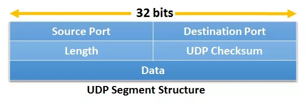
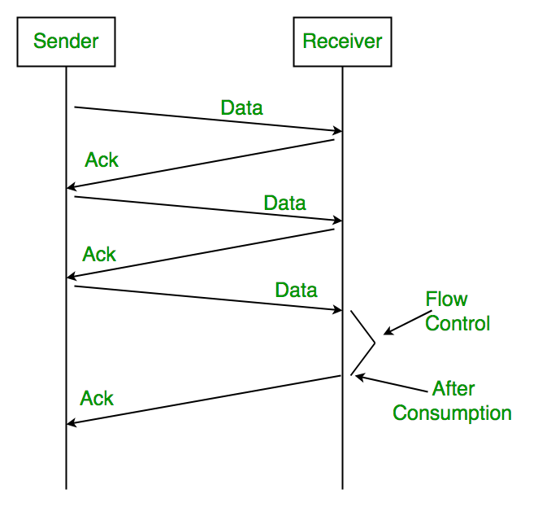
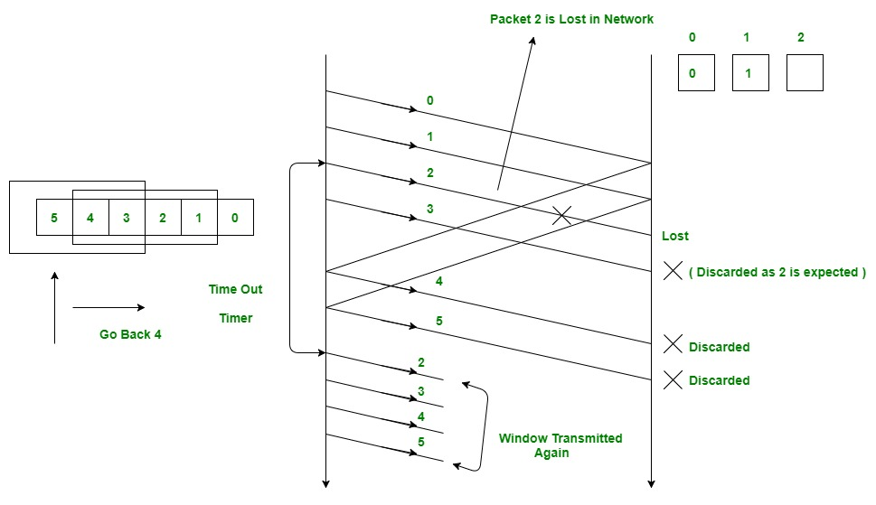
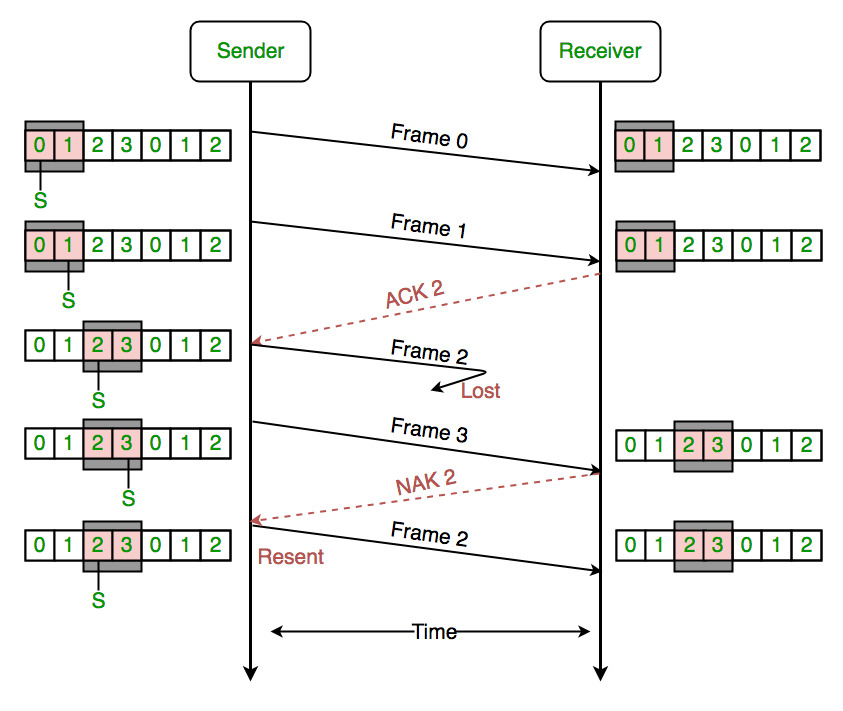
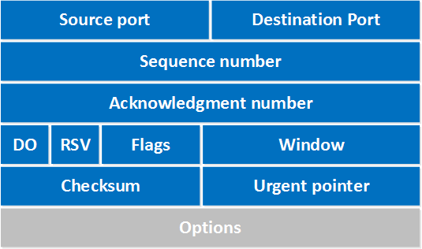
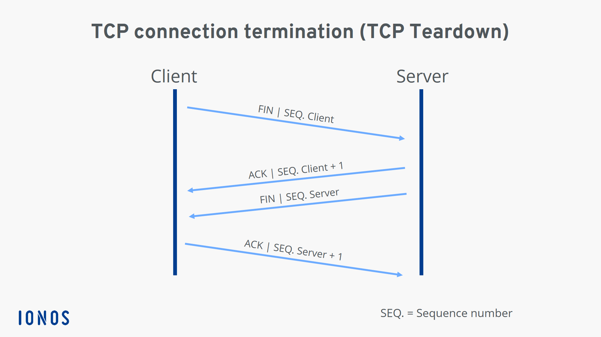

[toc]

# Transport Layer

## Overview

**Prompt: Give me an introduction about computer network transport layers.**

The computer network transport layer is a critical component of the OSI (Open Systems Interconnection) model, which serves as a framework for understanding and implementing network communication. It is the fourth layer in the OSI model and plays a pivotal role in ensuring data transmission reliability and end-to-end communication.

The primary purpose of the transport layer is to provide end-to-end communication services for applications and devices that are located on different hosts within a network. This layer accomplishes this by managing data segmentation, error detection and correction, flow control, and ensuring that data arrives in the correct order. In essence, it acts as the bridge between the application layer, where user data originates, and the network layer, responsible for routing data across the network.

Key functions of the transport layer include:

1. **Segmentation and Reassembly:** The transport layer breaks down large messages into smaller segments for transmission and reassembles them at the receiving end. This segmentation enables efficient use of network resources.

2. **Error Detection and Correction:** The transport layer is responsible for error detection and, in some cases, correction. It ensures that data arrives intact and, if necessary, requests retransmission of lost or corrupted segments.

3. **Flow Control:** Flow control mechanisms prevent congestion in the network by regulating the rate at which data is sent. This helps ensure that data is delivered without overwhelming the receiving end.

4. **Multiplexing and Demultiplexing:** The transport layer uses port numbers to multiplex and demultiplex data, allowing multiple applications on the same device to communicate simultaneously. Port numbers identify specific applications or services.

Two well-known transport layer protocols are the Transmission Control Protocol (TCP) and the User Datagram Protocol (UDP). TCP is connection-oriented and offers reliability, error recovery, and sequencing of data, making it suitable for applications that require guaranteed delivery, such as web browsing and email. In contrast, UDP is connectionless, offering minimal overhead and faster transmission but without the same level of reliability. UDP is commonly used in applications like real-time video streaming and online gaming.

In summary, the transport layer is a fundamental part of computer networking that plays a crucial role in ensuring that data is transmitted reliably and efficiently between devices and applications on a network, making it an essential element of modern communication systems.

## UDP

### Overview

**Prompt: Give me an introduction about UDP protocol.**

User Datagram Protocol (UDP) is a connectionless and lightweight transport layer protocol that operates within the Internet Protocol (IP) suite. Unlike the Transmission Control Protocol (TCP), which is connection-oriented and designed for reliable data transfer, UDP focuses on simplicity, efficiency, and minimal overhead. Here is an introduction to the UDP protocol:

**1. Connectionless Communication:** UDP is a connectionless protocol, meaning it doesn't establish a dedicated connection or maintain state information between sender and receiver before transmitting data. This makes it faster and more suitable for applications where low latency and reduced overhead are critical.

**2. Minimal Overhead:** UDP has a minimal header overhead compared to TCP. This is because UDP lacks the complex features such as sequence numbers, acknowledgments, and flow control that TCP offers. As a result, UDP is often used in scenarios where low overhead and high-speed data transmission are priorities.

**3. Unreliable Data Transfer:** Unlike TCP, which guarantees reliable data transfer by retransmitting lost or corrupted packets, UDP does not provide mechanisms for error detection, correction, or retransmission. It simply sends the data packets and assumes that the underlying network will deliver them as best as it can. This makes UDP suitable for applications where occasional packet loss or errors are acceptable, such as real-time audio or video streaming.

**4. Low Latency:** UDP's lack of connection establishment and error recovery mechanisms makes it ideal for applications that require low latency. Real-time applications like online gaming, voice over IP (VoIP), and streaming media benefit from UDP's ability to transmit data quickly without the added delays associated with TCP's handshakes and retransmissions.

**5. Multicast and Broadcast Support:** UDP is well-suited for multicast and broadcast communication. Multicast allows a single sender to reach multiple receivers efficiently, making it suitable for streaming and distribution of data to a group of recipients, such as video conferencing. Broadcast, on the other hand, sends data to all devices on a network segment.

**6. Simplicity and Flexibility:** UDP's simplicity and lack of connection state make it highly versatile. It can be used for various types of applications, including network discovery, DNS (Domain Name System) queries, and simple request-response interactions.

**7. Port Numbers:** Like TCP, UDP uses port numbers to identify different services and applications running on a device. This allows multiple applications to coexist on the same device and communicate through different UDP ports.

In summary, UDP is a protocol that prioritizes speed, simplicity, and low overhead at the expense of some reliability and error recovery. It is commonly employed in real-time and latency-sensitive applications where occasional data loss can be tolerated. Understanding the strengths and weaknesses of UDP is essential when selecting the appropriate transport protocol for specific networking needs.

### UDP Segment

**Prompt: What does UDP segment look like?**

A User Datagram Protocol (UDP) segment, like any network protocol, is composed of a header and, in some cases, payload data. The UDP header is relatively simple and consists of the following fields:

1. **Source Port (16 bits):** This field identifies the source application or service that is sending the UDP segment. It's a 16-bit number that ranges from 0 to 65535.

2. **Destination Port (16 bits):** This field specifies the destination application or service that should receive the UDP segment. Like the source port, it's also a 16-bit number ranging from 0 to 65535.

3. **Length (16 bits):** This field indicates the total length of the UDP segment, including the header and payload, measured in bytes. The minimum length of a UDP segment is 8 bytes (header without payload).

4. **Checksum (16 bits):** The UDP checksum field is optional, and it is used for error checking. If a checksum is present, it covers both the UDP header and the data payload. If the checksum is set to 0, it indicates that no checksum is being used.

5. **Data:** The UDP segment's payload contains the actual data being transmitted. The length of the data payload can vary depending on the value specified in the Length field.

## Reliable Data Transfer

### RDT 1.0

**Prompt: Give me an introduction about RDT 1.0 protocol.**

**Overview:**

- RDT 1.0 is a highly simplified version of a reliable data transfer protocol.
- It operates under the assumption of a perfectly reliable channel for data transmission, where data sent by the sender will always be received correctly by the receiver without any losses or corruption.
- While this scenario is unrealistic in real-world network environments, RDT 1.0 serves as a starting point for explaining the fundamentals of reliable data transfer.

**Key Characteristics:**

- No error detection or correction mechanisms are included in RDT 1.0.
- It assumes that data sent is received without any errors, losses, or corruption.
- RDT 1.0 essentially demonstrates the most basic form of reliable data transfer where no special measures are taken to handle errors or ensure data integrity.

**Operation:**

1. The sender (transmitter) sends data to the receiver (receiver).
2. The receiver, operating under the assumption of a perfect channel, directly passes the received data to the application layer without any error-checking or acknowledgment process.

### RDT 2.0

**Prompt: Give me an introduction about RDT 2.0 protocol.**

**Overview:**

- RDT 2.0 is an extension of the RDT protocol family that aims to provide reliability in communication over potentially unreliable networks.
- It introduces error detection mechanisms, such as checksums, which help detect errors in the received data packets, ensuring that corrupted packets are identified.

**Key Characteristics:**

- Error detection: RDT 2.0 includes the use of simple checksums to detect errors in the received data packets.
- Still operates under the assumption of a reliable channel, meaning it doesn't address error correction or the retransmission of lost or corrupted packets.
- RDT 2.0 serves as an intermediate step in understanding the principles of error detection and the need for more advanced protocols in real-world network environments.

**Operation:**

1. The sender (transmitter) calculates a checksum for each data packet and appends it to the packet before transmission.
2. The receiver (receiver) checks the received data packet for errors by verifying the checksum.
3. If the checksum is valid and the packet is error-free, the receiver passes the data to the application layer.
4. If the checksum is invalid, indicating a corrupted packet, the receiver discards the packet.

### RDT 3.0

**Prompt: Give me an introduction about RDT 3.0 protocol.**

**Overview:**

- RDT 3.0 is an advanced version of the RDT protocol series, focusing on the reliable transmission of data between two communicating devices.
- It is designed to handle errors and ensure data integrity in scenarios where data packets may be lost or corrupted during transmission.

**Key Characteristics:**

- Error detection and correction: RDT 3.0 employs sophisticated error detection mechanisms, such as cyclic redundancy checks (CRC), to identify errors in received data packets. It also includes the ability to correct certain types of errors.
- Retransmission: In the presence of errors, RDT 3.0 has the capability to retransmit specific data packets that are detected as corrupted or lost, ensuring reliable data delivery.
- Acknowledgment-based: Like its predecessors, RDT 3.0 relies on acknowledgments (ACKs) from the receiver to confirm the successful reception of data packets and to request retransmissions as necessary.
- Timeout management: RDT 3.0 includes a critical timeout mechanism that triggers the retransmission of data packets when expected acknowledgments are not received within a specified time frame.

**Operation:**

1. The sender (transmitter) sends data packets to the receiver (receiver) as part of the communication process.
2. Each data packet is equipped with an error detection code, such as a CRC, for verifying data integrity.
3. The receiver checks the received data packets for errors. If an error is detected, the receiver may request retransmission of the specific corrupted packet.
4. The sender sets a timeout value for each data packet, representing the maximum time it is willing to wait for an acknowledgment.
5. Upon a timeout expiration for a specific packet, the sender retransmits the data packet for which the acknowledgment was not received.

### Stop and Wait

- **Overview:** Stop-and-Wait is one of the simplest ARQ protocols. It operates as a one-way communication model, with the sender transmitting one data packet and then waiting for an acknowledgment from the receiver before sending the next packet.
- **Advantages:** Simplicity and ease of implementation make it a straightforward protocol for point-to-point communication.
- **Disadvantages:** Inefficient use of bandwidth and limited throughput, as the sender can only transmit one packet at a time. Additionally, there may be significant idle time while waiting for acknowledgments.

### Go Back N

- **Overview:** Go-Back-N is a sliding window protocol that allows the sender to transmit multiple packets before waiting for acknowledgments. The sender maintains a window of unacknowledged packets, and upon the receipt of acknowledgments, the window slides forward.

- **Advantages:** Improved efficiency and higher throughput compared to Stop-and-Wait. It reduces idle time and better utilizes network resources.

- **Disadvantages:** If a packet is lost, all subsequent packets in the window must be retransmitted, potentially leading to unnecessary retransmissions and inefficiency.

### Selective Repeat

- **Overview:** Selective Repeat is another sliding window protocol, but it allows the sender to selectively retransmit only the lost or corrupted packets rather than resending the entire window.
- **Advantages:** Efficient use of network resources as it minimizes unnecessary retransmissions. It is suitable for environments with a moderate level of packet loss.
- **Disadvantages:** Slightly more complex to implement than Go-Back-N, but it offers improved efficiency in terms of network bandwidth usage.

## TCP

### Overview

**Give me an introduction about TCP protocol.**

The Transmission Control Protocol (TCP) is a fundamental and widely used transport layer protocol within the Internet Protocol (IP) suite. It is designed to facilitate reliable and connection-oriented communication between devices on a network. Here is an introduction to the TCP protocol:

1. **Connection-Oriented Communication:** TCP is known for its connection-oriented communication model. Before data transfer begins, a TCP connection is established through a three-way handshake, which involves the exchange of control messages between the sender and receiver. This ensures that both parties are ready to communicate and establishes a dedicated communication channel for data transfer.

2. **Reliable Data Transfer:** TCP offers reliable data transfer by providing features such as acknowledgment of data receipt, sequence numbering, and retransmission of lost or corrupted data packets. When the sender transmits data, it waits for acknowledgments from the receiver, and if an acknowledgment is not received within a certain time, it retransmits the data. This mechanism guarantees that data is delivered accurately and in the correct order.

3. **Flow Control:** TCP implements flow control mechanisms to prevent congestion in the network. It uses a sliding window approach to manage the rate at which data is sent, ensuring that the sender does not overwhelm the receiver. Flow control helps maintain efficient data transmission while preventing network congestion.

4. **Full Duplex Communication:** TCP supports full-duplex communication, which means that data can be transmitted in both directions simultaneously within the same connection. This enables bidirectional communication and efficient data exchange between devices.

5. **Error Detection and Correction:** TCP uses checksums to verify the integrity of data packets. If a packet is found to be corrupted during transmission, it is discarded, and the sender is notified through a request for retransmission.

6. **Congestion Control:** TCP includes congestion control mechanisms that adapt the sending rate to the current network conditions. It helps prevent network congestion and ensures fair resource sharing among different connections.

7. **Ports:** TCP uses port numbers to identify specific applications or services on devices. This allows multiple applications to run on the same device and communicate over the network via distinct port numbers.

8. **Multiplexing:** TCP can multiplex multiple data streams on a single connection using port numbers, allowing various applications to share the same network connection without interfering with one another.

9. **Widely Supported:** TCP is supported by most modern operating systems and is the foundation for a wide range of network applications, including web browsing, email, file transfer, remote access (SSH), and many more.

In summary, TCP is a robust and versatile transport layer protocol that emphasizes reliability, error recovery, and connection-oriented communication. It is a cornerstone of the internet and serves as the foundation for many applications that require guaranteed data delivery and accurate transmission.

### TCP Segment

**Prompt: What does TCP segment look like?**

A Transmission Control Protocol (TCP) segment consists of a header and, optionally, a data payload. The TCP header contains various fields that control and manage the transmission of data. Here's an overview of what a TCP segment looks like:

1. **Source Port (16 bits):** This field indicates the port number of the sender's application or process. It's a 16-bit value, so it can range from 0 to 65535.

2. **Destination Port (16 bits):** This field specifies the port number of the receiver's application or process. Like the source port, it's a 16-bit value, ranging from 0 to 65535.

3. **Sequence Number (32 bits):** This field is used to keep track of the order of data packets within a TCP connection. It specifies the sequence number of the first data byte in the current segment.

4. **Acknowledgment Number (32 bits):** This field acknowledges the receipt of data up to a certain sequence number. It indicates the next expected sequence number that the sender should send.

5. **Data Offset (4 bits):** This field specifies the length of the TCP header in 32-bit words. This is important because the TCP header length can vary due to optional fields, such as options or padding.

6. **Reserved (6 bits):** These bits are reserved for future use and are currently set to zero.

7. **Flags (6 bits):** The Flags field contains a combination of control bits that define the purpose and status of the TCP segment. Common flags include:
   - **URG (Urgent Pointer):** Indicates that urgent data is present in the segment.
   - **ACK (Acknowledgment):** Acknowledges the receipt of data.
   - **PSH (Push Function):** Requests the data to be pushed to the receiving application immediately.
   - **RST (Reset the Connection):** Resets the connection.
   - **SYN (Synchronize Sequence Numbers):** Initiates a connection.
   - **FIN (Finish):** Closes the connection.

8. **Window Size (16 bits):** The window size field indicates the size of the sender's receive window, which is used for flow control. It specifies the amount of data, in bytes, that the sender is willing to accept without further acknowledgment from the receiver.

9. **Checksum (16 bits):** The checksum field is used to detect errors in the TCP header and data. It helps ensure the integrity of the transmitted segment.

10. **Urgent Pointer (16 bits):** If the URG flag is set, this field indicates the offset from the sequence number of the last byte in the segment where urgent data begins.

11. **Options (variable length):** This field can contain optional information and is of variable length. Common options include Maximum Segment Size (MSS), Timestamps, and Window Scale.

12. **Padding (variable length):** If necessary to align the header to a 32-bit boundary, padding can be added to ensure proper alignment.

13. **Data:** The TCP segment may contain a data payload, which carries the actual application data being transmitted. The length of the data payload varies depending on the amount of data being sent.

The TCP header is more extensive than the User Datagram Protocol (UDP) header because it includes many features related to reliability, flow control, and error detection and correction. This complexity makes TCP suitable for applications that require guaranteed and ordered data delivery, such as web browsing and file transfers.

### TCP Connection

**Prompt: How to initiate a TCP connection?**

Initiating a TCP connection involves a three-way handshake process between the sender (client) and the receiver (server). The three-way handshake establishes a reliable and connection-oriented communication channel. Here are the steps to initiate a TCP connection:

1. **Client (Sender) Sends a SYN (Synchronize) Packet:**
   
   - The client, which wants to establish a connection with a server, sends an initial TCP packet with the SYN flag set to 1 (indicating the start of a new connection).
   - The client also selects an initial sequence number (ISN) for the conversation. This sequence number is chosen randomly or based on certain algorithms.

2. **Server (Receiver) Responds with a SYN-ACK Packet:**

   - Upon receiving the SYN packet from the client, the server acknowledges the reception of the SYN packet by sending a response.
   - The server also selects its own initial sequence number for this connection (Server ISN) and includes it in the acknowledgment.
   - The server sets the SYN and ACK flags to 1, indicating acknowledgment of the client's request and the initiation of a new connection.

3. **Client Acknowledges with an ACK Packet:**

   - When the client receives the SYN-ACK packet from the server, it acknowledges the reception.
   - The client sets the ACK flag to 1 in its acknowledgment packet.
   - The acknowledgment number in the packet is set to the Server ISN + 1, indicating that the client acknowledges the receipt of the server's acknowledgment.

At this point, the three-way handshake is complete, and the TCP connection is considered established. Both the client and server can now exchange data over this connection.

**Prompt: How to close a TCP Connection?**

Closing a TCP connection is a coordinated process between the sender (client) and the receiver (server) to ensure the orderly termination of the connection. The process typically involves a four-way handshake. Here are the steps to close a TCP connection:

1. **Client Sends a FIN (Finish) Packet:**
   - When the client has no more data to send and wants to terminate the connection, it sends a TCP packet with the FIN flag set to 1. This indicates that the client is done sending data and wants to close the connection.
   - The client may still receive data from the server and can acknowledge it, but it will not send any more data after this point.
2. **Server Acknowledges the FIN Packet:**
   - Upon receiving the FIN packet from the client, the server acknowledges it by sending an acknowledgment (ACK) packet. The server is indicating that it has received the client's request to close the connection.
   - However, the server may still have data to send, and it can continue to do so until it is ready to close the connection.
3. **Server Sends Its Own FIN Packet:**
   - Once the server is ready to close the connection, it sends its own FIN packet. This indicates that the server has completed sending data and is ready to terminate the connection.
   - The server also sets the ACK flag in this packet to acknowledge the receipt of the client's FIN packet.
4. **Client Acknowledges the Server's FIN Packet:**
   - The client, upon receiving the server's FIN packet, acknowledges it with an ACK packet. This acknowledgment indicates that the client is aware of the server's intention to close the connection.

After this four-way handshake is complete, the TCP connection is considered closed. Both the client and server can release the resources associated with the connection, and the connection is no longer available for data exchange.

### Flow Control

1. **Congestion Avoidance:** Before data transmission begins, the two devices (sender and receiver) establish a maximum segment size (MSS) and the initial window size. The sender's maximum window size represents the maximum amount of unacknowledged data that can be in transit.
2. **Sender's Perspective:** The sender transmits data segments and keeps track of the amount of unacknowledged data in transit. As acknowledgments are received, the sender's window size increases, allowing it to send more data. If the window size decreases, the sender reduces the rate of data transmission.
3. **Receiver's Perspective:** The receiver advertises its available buffer space as the window size in its acknowledgments. A smaller window size indicates less available buffer space, while a larger window size indicates more buffer space.
4. **Dynamic Adjustment:** As data is successfully received and processed by the receiver, the window size increases, allowing the sender to send more data. Conversely, if the receiver's buffer is filling up, it advertises a smaller window size, causing the sender to reduce the rate of transmission.

### Congestion Control

1. **Congestion Window (cwnd):** The congestion window is a key parameter that determines the number of unacknowledged data packets the sender can have in transit. It controls the sender's transmission rate. TCP adjusts the congestion window dynamically based on network conditions.
2. **Slow Start:** TCP uses a "slow start" phase at the beginning of a connection to gradually increase the congestion window, allowing the sender to test and adapt to the available network bandwidth.
3. **Congestion Avoidance:** After the slow start phase, TCP enters a congestion avoidance phase. During this phase, it increases the congestion window more slowly, avoiding rapid congestion. TCP monitors acknowledgments and adjusts the window size accordingly.
4. **Fast Recovery:** When TCP detects congestion or packet loss, it enters a "fast recovery" phase. During this phase, it reduces the congestion window but does not return to the slow start phase, allowing for faster recovery from congestion.
5. **Explicit Congestion Notification (ECN):** ECN is a mechanism that allows routers in the network to notify TCP about impending congestion. When ECN is supported, TCP can respond to congestion signals more quickly and avoid overloading the network.
6. **Timeouts:** TCP uses timeout values to retransmit lost packets. If a timeout occurs, it's an indication of severe network congestion. TCP may respond by reducing its congestion window and retransmitting lost packets.
