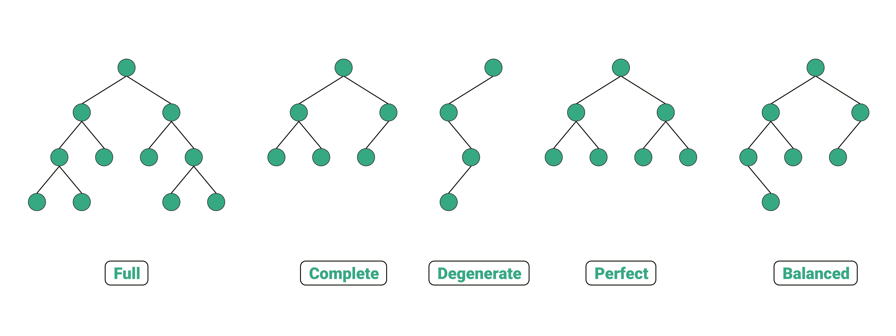
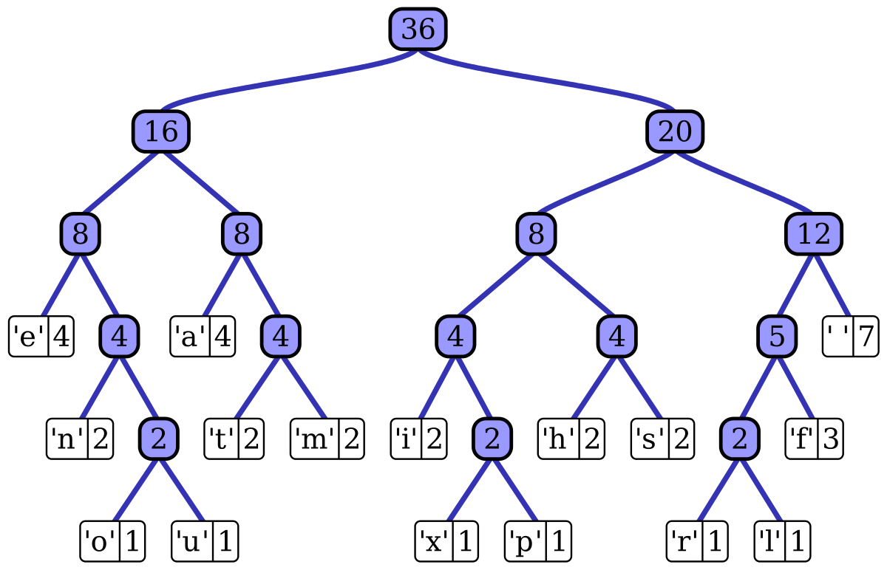

[toc]

# Tree

## Binary Tree

### Concepts



1. **Structure:** In a binary tree, each node has, at most, two children, which are themselves binary trees. Nodes in a binary tree consist of a data element (or value) and references (or pointers) to the left and right children.
2. **Root:** The topmost node of the tree is called the root. It serves as the starting point for accessing all other nodes in the tree.
3. **Leaf Nodes:** Nodes with no children are referred to as leaf nodes. These are the endpoints of the tree.
4. **Internal Nodes:** Nodes with one or more children are known as internal nodes. They form the branching points of the tree.
5. **Height:** The height of a binary tree is the length of the longest path from the root to a leaf node. It represents the depth or level of the tree.

### Traversal

```python
class TreeNode:
    def __init__(self, value):
        self.val = value
        self.left = None
        self.right = None

# Preorder traversal: Root -> Left -> Right
def preorder_traversal(root):
    if root is not None:
        print(root.val, end=" ")  # Process the current node
        preorder_traversal(root.left)  # Recursively traverse the left subtree
        preorder_traversal(root.right)  # Recursively traverse the right subtree

# Inorder traversal: Left -> Root -> Right
def inorder_traversal(root):
    if root is not None:
        inorder_traversal(root.left)  # Recursively traverse the left subtree
        print(root.val, end=" ")  # Process the current node
        inorder_traversal(root.right)  # Recursively traverse the right subtree

# Postorder traversal: Left -> Right -> Root
def postorder_traversal(root):
    if root is not None:
        postorder_traversal(root.left)  # Recursively traverse the left subtree
        postorder_traversal(root.right)  # Recursively traverse the right subtree
        print(root.val, end=" ")  # Process the current node
```

### Construction

```python
class TreeNode:
    def __init__(self, value):
        self.val = value
        self.left = None
        self.right = None

def build_tree(preorder, inorder):
    if not preorder or not inorder:
        return None

    # The first element in the preorder list is the root
    root_val = preorder[0]
    root = TreeNode(root_val)

    # Find the root in the inorder list to divide it into left and right subtrees
    root_idx_inorder = inorder.index(root_val)

    # Recursively build the left and right subtrees
    root.left = build_tree(preorder[1:1 + root_idx_inorder], inorder[:root_idx_inorder])
    root.right = build_tree(preorder[1 + root_idx_inorder:], inorder[root_idx_inorder + 1:])

    return root

def build_tree(inorder, postorder):
    if not inorder or not postorder:
        return None

    # The last element in the postorder list is the root
    root_val = postorder[-1]
    root = TreeNode(root_val)

    # Find the root's index in the inorder list
    root_idx_inorder = inorder.index(root_val)

    # Recursively build the right and left subtrees (note the order due to postorder)
    root.right = build_tree(inorder[root_idx_inorder + 1:], postorder[:root_idx_inorder])
    root.left = build_tree(inorder[:root_idx_inorder], postorder[root_idx_inorder:-1])

    return roo
```

### Serialization

Serializing and deserializing a binary tree involves converting a binary tree into a string representation and then converting it back into a binary tree. This process is often used to store or transmit a binary tree's structure, allowing it to be reconstructed later. In this explanation, we'll use a simple format where nodes are represented as strings separated by delimiters.

**Serialization:**

To serialize a binary tree, you can use a depth-first traversal approach (e.g., preorder) and store the nodes' values in the desired format. Here's how you can serialize a binary tree in Python:

```python
class TreeNode:
    def __init__(self, value):
        self.val = value
        self.left = None
        self.right = None

def serialize(root):
    if not root:
        return "None"  # Represent None (null) nodes with a special marker
    left = serialize(root.left)
    right = serialize(root.right)
    return str(root.val) + "," + left + "," + right
```

This code serializes the binary tree into a comma-separated string where "None" represents null nodes.

**Deserialization:**

To deserialize a string back into a binary tree, you need to parse the string and reconstruct the tree. This process can be done using a recursive approach. Here's how you can do it in Python:

```python
def deserialize(data):
    def build_tree(values):
        value = values.pop(0)
        if value == "None":
            return None
        node = TreeNode(int(value))
        node.left = build_tree(values)
        node.right = build_tree(values)
        return node

    values = data.split(",")
    root = build_tree(values)
    return root
```

The `deserialize` function parses the serialized string, splitting it into values separated by commas. Then, it uses a recursive helper function, `build_tree`, to reconstruct the binary tree structure from the parsed values.

The `serialize` and `deserialize` functions work together to convert a binary tree into a string format and then reconstruct the tree from that string, preserving its original structure.

## Binary Search Tree

### Concepts

**Binary Search Tree Property:**
For every node in the tree, the values of nodes in its left subtree are less than or equal to the value of the node, and the values of nodes in its right subtree are greater than the value of the node.

This property ensures that elements in a binary search tree are stored in a way that allows for fast search operations, similar to searching in a sorted array. By following the property, you can quickly eliminate large portions of the tree when searching for a particular element, reducing the search time to logarithmic complexity.

Here are some key features and concepts associated with binary search trees:

1. **Binary Tree Structure:** A binary search tree is a binary tree, which means that each node can have at most two children: a left child and a right child. This tree structure allows for efficient searching and sorting.

2. **Ordering:** The BST property ensures that elements are ordered from left to right in a way that makes it easy to perform operations like finding the minimum or maximum value, inserting new elements, and deleting elements.

3. **Balanced BSTs:** A balanced binary search tree is one in which the left and right subtrees of any node are approximately the same height. This balance ensures that the tree remains efficient and prevents it from degrading into a linked list-like structure, which could happen if elements are inserted in a specific order.

4. **Operations:**
   - **Search:** You can efficiently search for a specific element in a binary search tree with an average time complexity of O(log n), where n is the number of elements.
   - **Insertion:** Inserting an element in a binary search tree also takes O(log n) time on average.
   - **Deletion:** Deleting an element from a BST typically takes O(log n) time on average, similar to insertion and search.

5. **Inorder Traversal:** Performing an inorder traversal of a BST visits all nodes in ascending order, making it a useful way to retrieve elements in sorted order.

Binary search trees have various real-world applications, such as database indexing, symbol tables in compilers, file systems, and more. However, it's important to note that the efficiency of BST operations relies on the tree's balance, and in the worst-case scenario, a skewed binary search tree can degrade to a linked list with O(n) complexity for search, insertion, and deletion. To address this issue, self-balancing binary search trees, such as AVL trees and Red-Black trees, are often used to maintain balance automatically during operations.

### Operation

Performing search, insertion, and deletion in a binary search tree (BST) in Python involves manipulating the structure of the tree while maintaining the properties of a BST, where the left subtree of a node contains only nodes with keys less than the node's key, and the right subtree contains only nodes with keys greater than the node's key.

Here is how you can perform these operations:

1. **Search** in a Binary Search Tree:
   To search for a value in a BST, you start at the root and compare the value you're looking for with the current node. Depending on whether the value is smaller or larger than the current node's value, you traverse to the left or right subtree. Repeat this process until you find the value or reach a leaf node (null). Here's a Python function for searching:

```python
class TreeNode:
    def __init__(self, key):
        self.key = key
        self.left = None
        self.right = None

def search(root, key):
    if root is None or root.key == key:
        return root
    if root.key < key:
        return search(root.right, key)
    return search(root.left, key)
```

2. **Insertion** in a Binary Search Tree:
   To insert a new value into a BST, you start at the root and follow the same logic as searching. When you reach a leaf node (null), you insert the new node as the left or right child, depending on whether the value is smaller or larger than the current node's value. Here's a Python function for insertion:

```python
def insert(root, key):
    if root is None:
        return TreeNode(key)
    if key < root.key:
        root.left = insert(root.left, key)
    else:
        root.right = insert(root.right, key)
    return root
```

3. **Deletion** in a Binary Search Tree:
   Deletion in a BST is a bit more complex because you need to consider various cases. There are three cases to consider:
   - If the node to be deleted has no children, simply remove it.
   - If the node has one child, replace it with its child.
   - If the node has two children, find the in-order successor (or predecessor), which is the smallest (or largest) node in the right (or left) subtree, replace the node with the in-order successor, and then recursively delete the in-order successor.

Here's a Python function for deletion:

```python
def delete(root, key):
    if root is None:
        return root

    if key < root.key:
        root.left = delete(root.left, key)
    elif key > root.key:
        root.right = delete(root.right, key)
    else:
        if root.left is None:
            return root.right
        elif root.right is None:
            return root.left
        root.key = find_min_value(root.right)
        root.right = delete(root.right, root.key)

    return root

def find_min_value(node):
    while node.left:
        node = node.left
    return node.key
```

These functions allow you to perform basic search, insertion, and deletion operations on a binary search tree in Python.

### Balanced Binary Search Tree

1. **The Need for Balance:** While a basic BST supports fast searches, its performance can degrade if the tree becomes unbalanced. In the worst case, when elements are inserted in sorted or nearly sorted order, the tree can degenerate into a linked list, resulting in linear search times.
2. **Balanced BST Properties:** A balanced binary search tree enforces rules or properties that maintain balance. These properties vary depending on the type of balanced BST, but the fundamental goal is to ensure that the height of the left and right subtrees of each node **differs by at most one**.
3. **Efficiency of Operations:** A balanced BST ensures that operations like insertion, deletion, and searching have a time complexity of O(log n), where "n" is the number of elements in the tree. This makes balanced BSTs particularly useful for applications that require efficient storage and retrieval of data, such as databases, indexing, and symbol tables.

## Prefix Tree

A Prefix Tree, also known as a Trie (pronounced "try"), is a tree-like data structure that is used to store a dynamic set of strings or sequences, typically in a way that allows for efficient and fast retrieval, insertion, and searching of these sequences. The name "Trie" comes from the word "retrieval," which accurately describes its primary purpose.

1. **Node Structure:** Each node represents a single character or symbol. The root node is typically an empty node, and it has child nodes corresponding to the first character of each string in the set. The edges between nodes represent the characters or symbols.
2. **Path to a Node:** Traversing the path from the root to a node spells out a sequence or string formed by the characters along the way.
3. **Terminating Nodes:** Nodes that mark the end of a sequence are often marked as "terminal" or "end-of-string" nodes. These nodes typically do not have any children, as they indicate the end of a sequence.
4. **Common Prefixes:** If multiple sequences share a common prefix, the tree structure allows these sequences to share the same path for a portion of their characters. This is a key feature that makes Prefix Trees efficient for storing and searching for words or strings with shared prefixes.

```python
class TrieNode:
    def __init__(self):
        self.children = {}
        self.is_end_of_word = False

class Trie:
    def __init__(self):
        self.root = TrieNode()

    def insert(self, word):
        node = self.root
        for char in word:
            if char not in node.children:
                node.children[char] = TrieNode()
            node = node.children[char]
        node.is_end_of_word = True

    def search(self, word):
        node = self.root
        for char in word:
            if char not in node.children:
                return False
            node = node.children[char]
        return node.is_end_of_word

    def starts_with(self, prefix):
        node = self.root
        for char in prefix:
            if char not in node.children:
                return False
            node = node.children[char]
        return True

# Example usage:
trie = Trie()
words = ["apple", "app", "apricot", "banana", "bat"]
for word in words:
    trie.insert(word)

print(trie.search("apple"))     # True
print(trie.search("ap"))        # False
print(trie.starts_with("app"))  # True
```

## Huffman Tree



```python
import heapq
from collections import defaultdict

class Node:
    def __init__(self, char, freq):
        self.char = char
        self.freq = freq
        self.left = None
        self.right = None

    def __lt__(self, other):
        return self.freq < other.freq

def build_huffman_tree(data):
    frequency = defaultdict(int)

    # Calculate the frequency of each character in the data
    for char in data:
        frequency[char] += 1

    # Create a priority queue (min-heap) for the nodes
    min_heap = [Node(char, freq) for char, freq in frequency.items()]
    heapq.heapify(min_heap)

    # Build the Huffman tree
    while len(min_heap) > 1:
        left = heapq.heappop(min_heap)
        right = heapq.heappop(min_heap)
        merge_node = Node(None, left.freq + right.freq)
        merge_node.left = left
        merge_node.right = right
        heapq.heappush(min_heap, merge_node)

    return min_heap[0]

def generate_huffman_codes(root, code="", mapping={}):
    if root is not None:
        if root.char is not None:
            mapping[root.char] = code
        generate_huffman_codes(root.left, code + "0", mapping)
        generate_huffman_codes(root.right, code + "1", mapping)

def huffman_compress(data):
    root = build_huffman_tree(data)
    mapping = {}
    generate_huffman_codes(root, "", mapping)

    compressed_data = ""
    for char in data:
        compressed_data += mapping[char]

    return compressed_data, root

def huffman_decompress(compressed_data, root):
    decompressed_data = ""
    current = root

    for bit in compressed_data:
        if bit == "0":
            current = current.left
        else:
            current = current.right

        if current.char is not None:
            decompressed_data += current.char
            current = root

    return decompressed_data

if __name__ == "__main__":
    data = "this is an example for huffman encoding"
    compressed_data, root = huffman_compress(data)
    print("Original Data:", data)
    print("Compressed Data:", compressed_data)

    decompressed_data = huffman_decompress(compressed_data, root)
    print("Decompressed Data:", decompressed_data)

```

1. `Node` class represents a node in the Huffman tree. Each node has a character (or None for internal nodes), a frequency, and references to its left and right children.
2. `build_huffman_tree` function calculates the frequency of each character in the input data, creates a priority queue (min-heap) of nodes, and builds the Huffman tree.
3. `generate_huffman_codes` function generates Huffman codes for each character in the tree by traversing it and assigning "0" for left edges and "1" for right edges.
4. `huffman_compress` takes the input data and the Huffman tree root and compresses the data by replacing characters with their Huffman codes.
5. `huffman_decompress` takes the compressed data and the Huffman tree root and decompresses it by traversing the tree based on the compressed bits.
6. The example at the end shows how to use the Huffman tree to compress and decompress data.

## Segment Tree

