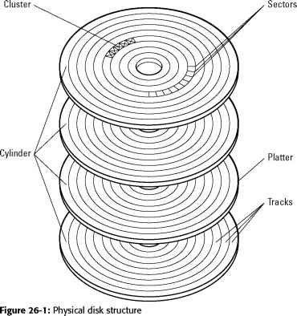

[toc]

## Normalization

### Non-normalized Problem

- Redundancy: Non-normalized data with redundancy for some attributes often has insertion anomaly, delete anomaly or update anomaly problems
- Information loss: Decomposing a table into multiple tables can enforce functional dependencies, but improper handling of shared attributes may lead to information loss and inaccurate data representation.
- Dependency loss: Dependency loss happens when decomposing a table into multiple tables, leading to the inability to enforce functional dependencies that existed in the original table.

### Functional Dependency

- Functional dependencies express relationships between sets of attributes in a relation.
- For each value of X in R, there is precisely one value of Y in R that is functionally dependent on X.
- Full functional dependencies are those where Y is dependent on X, and Y is not dependent on any proper subset of X.
- Keys are used to enforce functional dependencies. Making X the key in a relation enforces the dependency that X determines Y.
- Enforcing functional dependencies ensures uniqueness and establishes a one-to-one relationship between X and Y values in the relation.

### Normal Form

- First normal form (1NF) requires that all domain values in a relation R are atomic (indivisible). All relations are automatically in 1NF, as they are data structures with atomic values.
- Second normal form (2NF) is achieved when R is in 1NF, and every non-key attribute is fully dependent on the key.
- Third normal form (3NF) is attained when R is in 2NF, and every non-key attribute is non-transitively dependent on the key.
- Boyce-Codd normal form (BCNF) is reached when R is in 3NF, and every determinant (set of attributes) is a candidate key. A determinant is a set of attributes in R on which some other attribute is fully functionally dependent.

### Armstrong Rule

- The rule of **reflexivity** states that if Y is a subset of X, then X functionally determines Y.
- The rule of **augmentation** states that if X functionally determines Y, then WX (X with additional attributes) functionally determines WY (Y with additional attributes).
- The rule of **transitivity** states that if X determines Y, and Y determines Z, then X determines Z through transitivity.

## Architecture

### Data Storage

- Secondary storage is a physical disk and holds data and applications
- Main memory (RAM) stores currently running programs and their data
- CPU can only query and update data in main memory.
- Data is transported between disk and main memory using a bus.

### Data Access

- Main memory access takes about 30 nanoseconds (10^-7 seconds).
- Disk access takes about 10 milliseconds (10^-2 seconds).
- Main memory access is about 100,000 times faster than disk access.

### Disk Structure

- Disk consists of circular platters, read-write heads, and an actuator.
- Platter surfaces are split into sectors (512 bytes) and tracks.
- Collection of tracks passing under the heads is called a cylinder.

- Blocks are a unit of information transferred between disk and main memory.
- Several records can be stored in a single block.
- Files consist of multiple blocks connected by address pointers.

### Data Seek

- Seek times take 3-8ms, rotational delays take 2-3ms, and transfer times take 0.5-1ms.
- Page fault (disk to main memory transfer) takes approximately 10ms.
- Bulk transfers (extent transfers) can save seek and rotational delay costs.

- Buffer space may be needed for bulk transfers.
- Least Recently Used (LRU) strategy is a common buffer management approach.

## Data Organization

### Heap

- Heap is an unsorted data file organization strategy.
- Searching for a record in a heap requires scanning data pages as the location is unknown. On average, searching a heap with N data blocks requires examining N/2 data blocks.
- Sorted files improve lookup time compared to unsorted heaps. Even with sorted data, searching block by block still requires examining about half of the blocks on average.
- Binary search is a search technique used with sorted data. Binary search divides the search space in half on each iteration, making it more efficient. The time complexity of binary search for N blocks is log2(N).
- Binary search is significantly faster than linear search for large datasets. Binary search scales logarithmically, while linear search scales linearly with the number of blocks (N).

### Index

- Sparse primary index: Iterates through data blocks, appends the key value of the first record and a pointer to that block to the index block. The index is sorted. Ratio of index blocks to data blocks is called **fanout**
- Dense primary index: Iterates through data blocks, appends key value of each record and a pointer to that block to the index block. The index is sorted. Dense index has one index entry per record, while sparse index has one per data block.
- Secondary Index: Built when indexing records based on non-key attribute values. Secondary indices must be dense and are suited for point queries.

- Multilevel Index: Multilevel indices reduce search space further and improve efficiency. Top-level index points to lower-level indices. Searching through multilevel index is still logarithmic in n with base equal to the fanout.
- B+ tree index: In a B+ tree, data resides in leaf nodes, while other nodes are index nodes. B+ tree remains balanced, maintaining similar distance from root to leaves for all leaves. Overflows at lower levels rarely propagate up more than one or two levels, if at all.

### Hashing

- In static hashing, key values are mapped to buckets using a hash function, h. A good hash function should distribute values uniformly, avoid collisions, and fill the buckets as much as possible.
- Inserting records involves hashing the key to find the bucket, then locating or allocating the data block associated with that bucket, and writing the record to the block. If a data block is full, a new block is allocated for records associated with that bucket, and its pointer is stored in the previous block.
- To find a record, input the key to the hash function, get the bucket number, look up the block address in the directory, and access the block for the record.
- Static hashing provides constant time data access but may lead to longer chains of data blocks over time. Dynamic hash functions can expand the address space to maintain constant data access cost.
- A good hash function is essential to allocate records uniformly across buckets to avoid uneven chain lengths and degraded search performance.