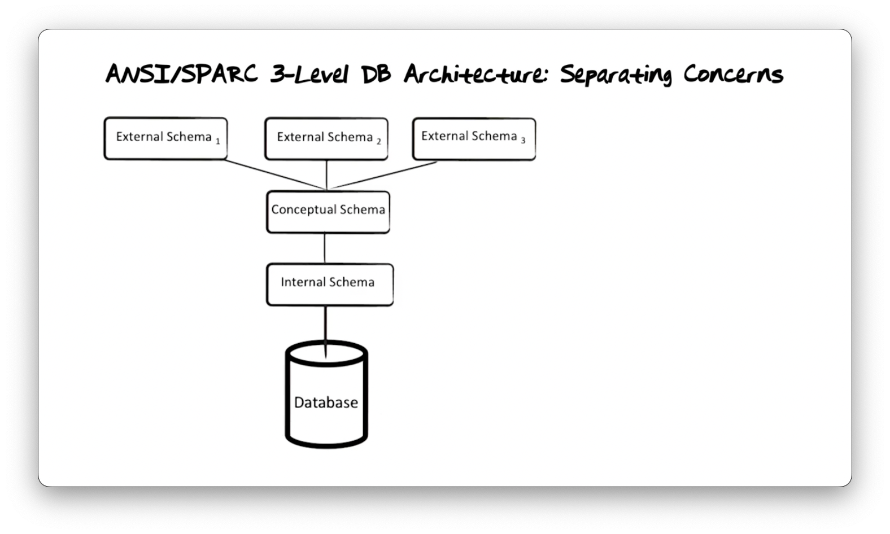
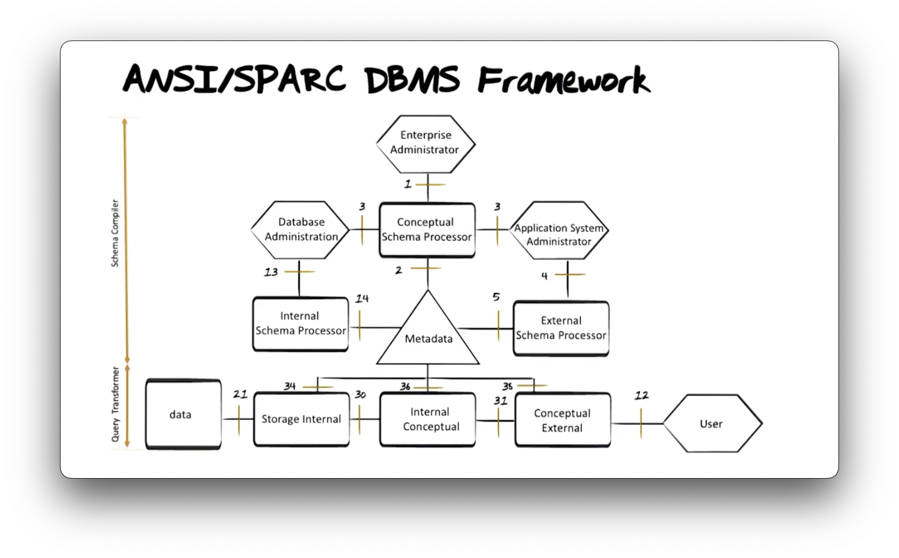

[toc]

## Databases

A *database* is an organized collection of inter-related data that models some aspect of the real-world.

A database management system (DBMS) is the software that manages a database.

A general-purpose DBMS is designed to allow the definition, creation, querying, updation, and administration of databases.

## Data Models

A *data model* is a collection of concepts for describing the data in a database. 

### Data Structure

- Data is represented using tables in the relational model. Tables consist of columns (attributes) and rows (entries).
- The number of columns is the degree of the table, and the number of rows is the cardinality. Each column has an associated data type that defines the domain of values it can hold.
- The schema defines the structure of the data and is relatively stable. The schema of a table includes the table name, column names, and column data types.
- Rows in the table represent the current state of reality as modeled by the table's structure.

### Constraints

- Constraints are rules defined to restrict the data values permitted in a system.
- Constraints go beyond the schema and column data types to provide additional restrictions.
- Common constraints include primary key constraint, unique constraint, not null constraint, etc.

### Operations

- We use **operations** to retrieve and change data.
- Common operations include select, delete, insert, etc.

### Integrity and Consistency

- Integrity refers to how accurately the database reflects reality.
- Poor integrity can be seen when the information in the database does not match the actual state of the data in reality.
- Consistency relates to the absence of internal conflicts within a database.
- Inconsistencies can occur when there are conflicting or contradictory values across different tables or columns within a table.

### Surrogate

- To record the information of regular users, a RegularUser table can be created in the database with Email, Name, and Address columns.
- Changes in the recorded information can occur over time, such as a user's name or address.
- An alternative approach to implementing the table is to include an additional column called UserID, which stores system-generated unique identifiers.
- These unique identifiers act as surrogates to identify users in the real world, even if other information about them changes.
- The use of surrogates provides a more reliable and consistent means of identifying users, regardless of any changes to their personal details.

## Database Architecture

- Database data is an extension of the schema, representing permitted data instances. The separation of schema from data enables efficient data access. 
- The ANSI/SPARC three-level architecture includes conceptual, internal, and external schema. Conceptual schema focuses on data meaning, internal schema on storage, and external schema on application-specific use.
- The database management system translates queries and responses between schema for efficient data retrieval and presentation.

### Conceptual Schema

- The conceptual schema describes general and time-invariant structures of reality.
- It does not involve data representation, physical organization, access, or use.
- The conceptual schema defines the table and its columns.
- Queries can be written against the conceptual schema to fetch specific data.
- The conceptual schema does not control the display or underlying data access.

### External Schema

- The external schema represents a subset of information derived from the conceptual schema.
- It is designed to cater to the specific needs of a particular user group.
- An external schema can be created using the "create view" statement.
- Views serve as a window into the database rather than physically existing as separate tables.

### Internal Schema

- The internal schema describes the physical representation of data specified in the conceptual schema.
- Indexing is a primary technique used at the internal schema level. It aims to optimize query and update performance.
- Indexes are not directly accessed by applications, allowing for flexibility in replacing or removing indexes without impacting the applications.

### Data Independence

- Physical data independence refers to the ability to modify the internal schema without affecting external schema-based applications.
- Logical data independence describes how much we can change the conceptual schema without changing the applications that run on the external schemata.

## DBMS Framework

- The ANSI/SPARC DBMS Framework was proposed in 1975 and defines the components of a three-level architecture.

- The schema compiler is responsible for handling schema definitions. The enterprise administrator defines conceptual schemata, the application system administrator defines external schemata, and the database administrator defines internal schemata.
- The schema definitions are checked for syntax correctness and stored in the metadatabase.
- The query transformer translates user queries from the external schema level to the conceptual schema level and then to the internal schema level.
- The internal schema to storage transformer translates the query into operating system calls to retrieve data from storage.
- The process is reversed when the database system prepares a response to return to the user.
- In production database systems, this process is optimized for efficiency, but the overall functionality remains the same.

