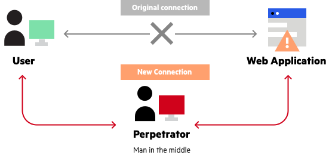

[toc]

# Web Security

## API Security

### Overview

**What are some common API authorization methods?**

API authorization methods are mechanisms used to control access to web APIs, ensuring that only authorized users or applications can make requests and access protected resources. Several common API authorization methods include:

1. **API Keys**:
   - API keys are unique strings issued to developers or applications.
   - Developers include their API key in the request headers or query parameters.
   - The server checks the API key's validity to grant or deny access.
   - API keys are relatively simple to implement but can be less secure if mishandled or exposed.

2. **OAuth 2.0**:
   - OAuth 2.0 is a widely adopted authorization framework that allows applications to obtain access tokens to act on behalf of users.
   - It provides different grant types, including:
     - Authorization Code: Used for web applications and Single Sign-On (SSO) scenarios.
     - Implicit: Designed for client-side applications, like JavaScript apps.
     - Client Credentials: Used for application-to-application communication.
     - Resource Owner Password Credentials: Allows users to provide their credentials directly to the client.
   - OAuth 2.0 is versatile and suitable for various scenarios, including third-party integrations and SSO.

3. **Bearer Tokens**:
   - Bearer tokens are often used in conjunction with OAuth 2.0.
   - After successful authentication, an access token (bearer token) is issued.
   - The client includes this token in the request headers.
   - The server validates the token and grants access if valid.
   - Bearer tokens are simple but must be handled securely, as they grant access without additional proof of identity.

4. **JWT (JSON Web Tokens)**:
   - JWTs can be used for both authentication and authorization.
   - They are self-contained tokens that can carry user claims and roles.
   - Servers verify the JWT's integrity and expiration before granting access.
   - JWTs are suitable for stateless authentication and fine-grained authorization.

5. **Basic Authentication**:
   - Basic Authentication involves sending a username and password encoded in the request headers.
   - The credentials are typically base64-encoded.
   - While straightforward, Basic Authentication is less secure because credentials can be intercepted if not used over HTTPS.

6. **Token-Based Authentication**:
   - Token-based authentication systems generate tokens upon successful login.
   - These tokens are then used for subsequent requests.
   - Tokens can be stored server-side or in a database.
   - This method offers scalability and security benefits.

7. **Role-Based Access Control (RBAC)**:
   - RBAC is not a specific authentication method but rather an authorization strategy.
   - It defines roles and permissions for users or applications.
   - Users are assigned roles, and each role has a set of permissions.
   - Access control decisions are based on the user's role and the required permissions.

8. **API Gateway and Access Control Lists (ACL)**:
   - An API gateway acts as an intermediary between clients and APIs.
   - It can enforce access control using Access Control Lists.
   - ACLs define which clients or users can access specific endpoints or resources.

9. **Custom Tokens and Signatures**:
   - Some APIs implement custom token formats and cryptographic signatures to authenticate and authorize requests.
   - These tokens can carry various claims and are validated by the server.

The choice of API authorization method depends on factors like the level of security required, the complexity of the application, and the specific use case. It's important to implement the chosen method correctly and follow security best practices to protect API resources and user data.

### OAuth

**Prompt: Tell me the basics about OAuth.**

OAuth (Open Authorization) is an open standard and protocol that enables secure authorization and delegated access to resources, typically on the internet. It allows users to grant third-party applications limited access to their resources without sharing their credentials (e.g., username and password) directly. OAuth is widely used for enabling Single Sign-On (SSO) and secure API access. Here are some basics about OAuth:

1. **Roles**:
   - **Resource Owner**: The resource owner is the user who owns the data and grants access to it. This user authorizes third-party applications to access their data without sharing credentials.
   - **Client**: The client is the third-party application or service that wants to access the user's data.
   - **Authorization Server**: The authorization server is responsible for authenticating the user and issuing access tokens to authorized clients. It often includes identity providers.
   - **Resource Server**: The resource server hosts the user's protected resources, which the client wants to access. It verifies access tokens to ensure the client has the necessary permissions.

2. **OAuth Flow**:
   - OAuth defines various grant types or flows, depending on the use case. Some common ones include:
     - **Authorization Code**: Used for web and mobile applications. The client is issued an authorization code after the user's consent. The client then exchanges this code for an access token.
     - **Implicit**: Used for client-side applications (e.g., JavaScript apps). The access token is issued directly to the client after user consent.
     - **Client Credentials**: Used for application-to-application authentication. The client sends its credentials (client ID and secret) to obtain an access token.
     - **Resource Owner Password Credentials**: Allows users to provide their credentials directly to the client, usually in scenarios where the client is highly trusted.
   - Each flow is designed for specific security and use-case requirements.

3. **Access Tokens**:
   - Access tokens are the core of OAuth. They are short-lived, limited-use tokens issued by the authorization server.
   - Access tokens grant clients access to specific resources on the resource server on behalf of the user.
   - They can be either self-contained (JWT) or reference tokens.
   - Access tokens can have various scopes, indicating the specific permissions granted to the client.

4. **Scopes**:
   - Scopes are permissions associated with an access token.
   - When the user grants access to a client, they specify which scopes the client is allowed to use.
   - Clients can only access the resources and perform actions associated with the granted scopes.

5. **Refresh Tokens**:
   - Some OAuth flows provide refresh tokens along with access tokens.
   - Refresh tokens allow clients to obtain new access tokens without requiring user intervention.
   - They are typically long-lived and should be stored securely.

6. **Security**:
   - OAuth is designed to be secure, but its security depends on proper implementation.
   - Use of HTTPS is essential to protect data in transit.
   - Properly configure the authorization server and validate tokens on the resource server.

7. **OAuth 2.0 vs. OAuth 1.0**:
   - OAuth 2.0 is the current version and is more widely used. It's considered more flexible and easier to implement.
   - OAuth 1.0a is an older version with more stringent security requirements, including request signing.

OAuth is a versatile and widely adopted standard for secure authorization and authentication in web and mobile applications. It is commonly used for scenarios like allowing third-party app access to user data (e.g., social login), enabling Single Sign-On (SSO), and securing access to APIs. Understanding OAuth is crucial for developers building secure and user-friendly applications that require access to protected resources.

### JWT

**Prompt: Tell me basics about JWT auth.**

JWT, or JSON Web Token, is a widely used method for securely transmitting information between parties as a compact, self-contained data structure. It is commonly used for authentication and authorization in web applications and APIs. Here are the basics of JWT authentication:

1. **Token Structure**: A JWT is a string consisting of three parts separated by dots: header, payload, and signature. These parts are base64-encoded JSON objects.

   - Header: Contains metadata about the type of token (JWT) and the signing algorithm being used (e.g., HMAC SHA256 or RSA).
   - Payload: Contains claims or statements about the user or entity and additional data. There are three types of claims: registered, public, and private claims. Registered claims include standard claims like "iss" (issuer), "sub" (subject), "exp" (expiration time), and more.
   - Signature: Used to verify that the sender of the JWT is who it says it is and to ensure that the message wasn't tampered with during transmission. The signature is created by combining the header and payload, and signing it with a secret or private key.

2. **Authentication Process**:
   - User logs in with their credentials (e.g., username and password) on the authentication server.
   - Upon successful login, the server generates a JWT token.
   - The server sends this JWT token to the client.
   - The client stores the JWT token, typically in local storage or a cookie.
   - For each subsequent request to a protected resource, the client includes the JWT token in the request headers.
   - The server validates the token to ensure it's not expired, has a valid signature, and other checks according to its configuration.
   - If the token is valid, the server processes the request; otherwise, it denies access.

3. **Statelessness**: JWTs are stateless, meaning the server does not need to store session data for authenticated users. This makes JWTs suitable for scaling applications horizontally.

4. **Token Expiration**: JWTs often have an expiration time (the "exp" claim), after which they are no longer considered valid. This helps improve security by reducing the window of opportunity for an attacker to use a stolen token.

5. **Use Cases**:
   - Authentication: JWTs can be used for user authentication, allowing clients to access protected resources on a server.
   - Single Sign-On (SSO): JWTs can be used in SSO systems, where a user logs in once and gains access to multiple services without needing to log in again.
   - Authorization: JWTs can carry authorization data, allowing fine-grained control over what a user can access within an application.

6. **Security Considerations**:
   - Keep secrets secure: If using a secret key to sign tokens, ensure it is kept secret and not exposed.
   - Token validation: Implement robust token validation on the server to prevent tampering and token forgery.
   - Token storage: Store tokens securely on the client side, and consider using HttpOnly cookies for added security.

JWT authentication is widely adopted because it provides a secure and efficient way to handle authentication and authorization in modern web applications and APIs while being easy to implement and use. However, it's essential to understand its security implications and follow best practices to ensure the protection of sensitive data.

## Man-in-the-Middle Attack

**Prompt: What is the man in the middle attack?**

A Man-in-the-Middle (MitM) attack is a type of cybersecurity attack where an attacker intercepts or eavesdrops on the communication between two parties without their knowledge. The attacker secretly intercepts the data being transmitted between the two parties and may even modify or manipulate the data in transit. The parties involved in the communication typically believe they are communicating directly with each other, but the attacker is surreptitiously sitting in the middle, hence the name "Man-in-the-Middle."

MitM attacks can occur in various forms and can target different types of communication, such as:

1. **Network-based MitM Attack**: In this scenario, the attacker positions themselves between the two parties by intercepting and forwarding network traffic. This can happen in unsecured Wi-Fi networks, where an attacker can intercept data packets between a user and the network.

2. **HTTPS Spoofing**: Attackers may set up a fake website with a similar URL to the legitimate site, hoping to trick users into thinking they are on the real site. This is often used for phishing attacks.

3. **Email Hijacking**: Attackers may compromise email accounts and then impersonate the victim, sending and receiving emails on their behalf. This can be used for various fraudulent purposes.

4. **Secure Sockets Layer (SSL) Stripping**: In cases where a website uses HTTPS for secure communication, the attacker may try to strip the encryption by downgrading the connection to HTTP, making it easier to intercept and modify data.

5. **Bluetooth MitM Attacks**: In Bluetooth connections, attackers may intercept data transmitted between devices, potentially gaining access to sensitive information.

MitM attacks are a serious security concern because they can lead to data theft, unauthorized access, identity theft, and the compromise of confidential information. To mitigate MitM attacks, encryption and secure communication protocols, like HTTPS and Virtual Private Networks (VPNs), are commonly used. It's essential to use secure and trusted networks and be cautious about the websites and services you use to minimize the risk of falling victim to MitM attacks.