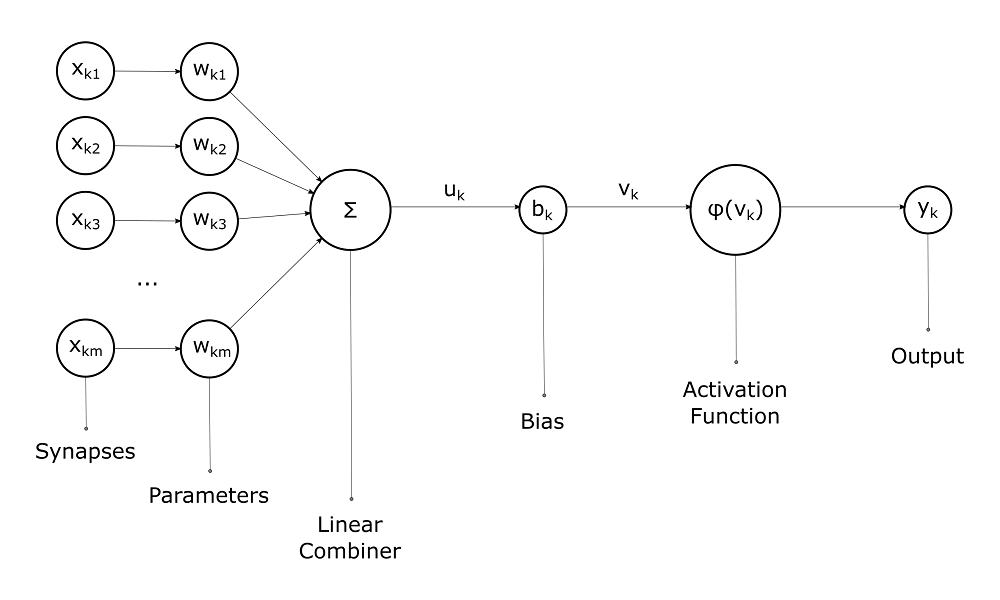
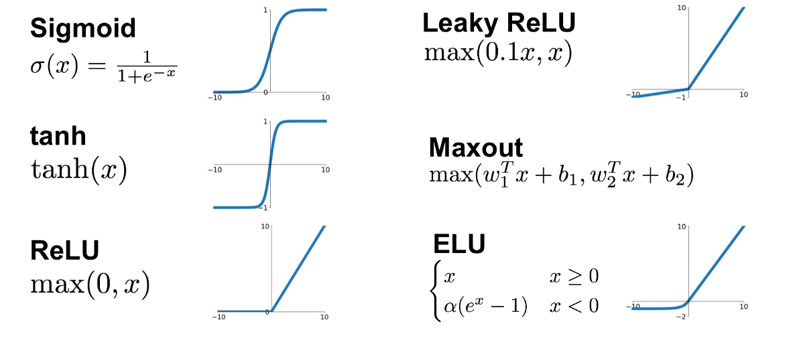
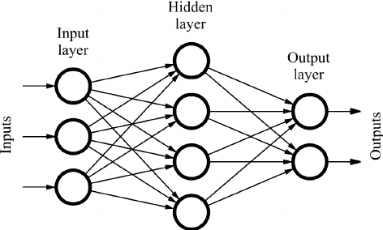
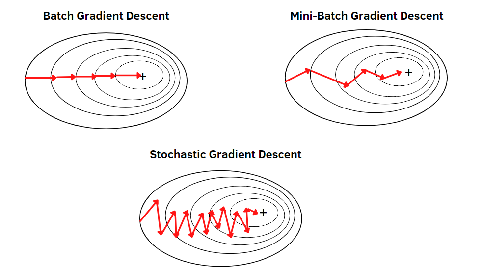
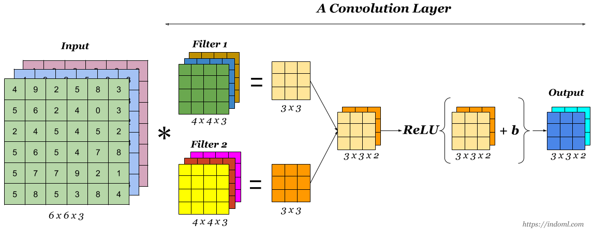
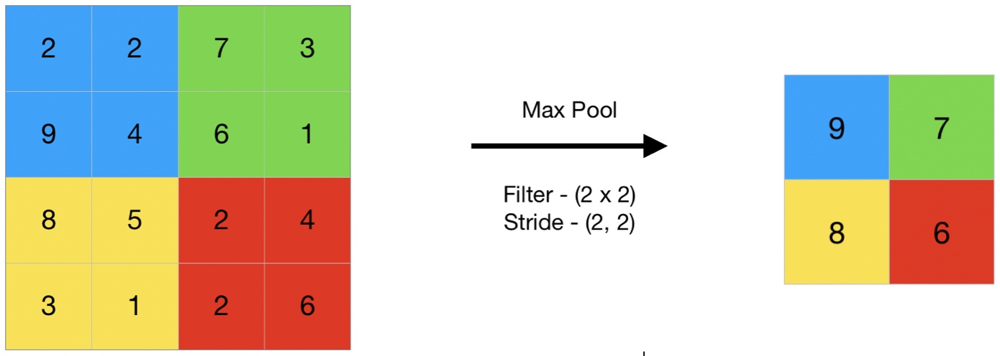
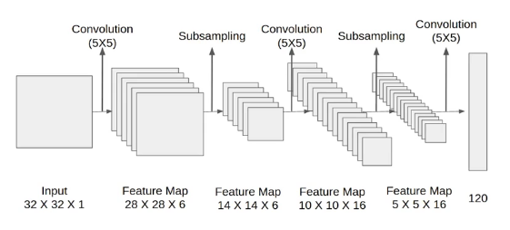
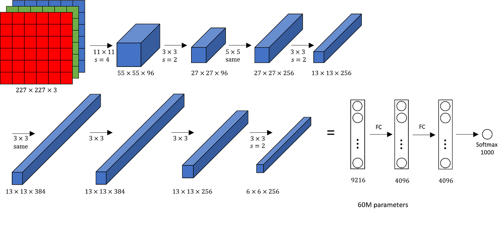

[toc]

# Deep Learning

## Concept

- **Neural Networks**: At the core of deep learning are artificial neural networks, which consist of neurons (nodes) arranged in layers. A typical network comprises an input layer, multiple hidden layers, and an output layer.
- **Learning Process**: Neural networks learn by adjusting weights and biases within their neurons. This process is typically achieved through backpropagation, where the network adjusts its parameters based on the error of its predictions.
- **Convolutional Neural Networks (CNNs)**: Specialized for processing structured grid data such as images, CNNs use convolutional layers to efficiently recognize spatial hierarchies in data.
- **Recurrent Neural Networks (RNNs)**: Designed for sequential data (e.g., time series or text), RNNs have the unique feature of using their internal state (memory) to process sequences of inputs.
- **Deep Learning Frameworks**: Tools such as TensorFlow, PyTorch, and Keras simplify the development of deep learning models by providing libraries for creating and training neural networks.

## Artificial Neural Networks

### Neurons

- **Inputs (x₁, x₂, ..., xn)**: Each neuron receives multiple inputs. These inputs can be raw data or outputs from other neurons.
- **Weights (w₁, w₂, ..., wn)**: Each input is assigned a weight that represents its importance. The neural network learns by updating these weights.
- **Bias (b)**: A bias term is added to the input-weight product, allowing the neuron to adjust the output along the activation function independently of its inputs.
- **Activation Function**: This function is applied to the weighted sum of the inputs plus the bias. It determines whether a neuron should be activated or not, influencing the neuron's output.
  - **Sigmoid**: Maps the input to a value between 0 and 1, useful for binary classification.
  - **ReLU (Rectified Linear Unit)**: Outputs the input if it's positive; otherwise, it outputs zero. It's widely used for its computational efficiency and because it allows models to learn fast and effectively.
  - **Tanh (Hyperbolic Tangent)**: Similar to the sigmoid but maps the input to values between -1 and 1, making it more suitable for certain types of normalized data.

### Feedforward Network

- **Input Layer**: The first layer that receives the input signal to be processed. Each neuron in the input layer represents a feature of the input data.
- **Hidden Layers**: One or more layers that perform computations with signals received from the previous layer. Each neuron in these layers applies a weighted sum on its inputs, adds a bias, and then passes the result through an activation function.
- **Output Layer**: The final layer that produces the network's output. For classification tasks, this layer often uses a softmax activation function to output probabilities corresponding to each class.

### Back Propagation

1. **Initialize Weights**: Randomly initialize the network's weights.
2. **Perform a Forward Pass**: Compute the output of the network and the loss.
3. **Compute Gradients (Backward Pass)**: Use the chain rule to calculate the gradients of the loss function with respect to each weight.
4. **Update Weights**: Adjust the weights by a fraction (defined by the learning rate) of their gradients.
5. **Repeat**: Perform multiple iterations of forward and backward passes with weight updates until the network's performance is satisfactory or a certain number of iterations is reached.

### Loss Functions

- Regression: Mean Squared Error (MSE) computes the average of the squares of the errors between the actual values ($y$) and the predicted values ($\hat{y}$). It's widely used in regression problems.

$$
MSE=\frac{1}{n}\sum_{i=1}^{n}(y_i-\hat{y_i})^2
$$

- Classification: Cross-entropy loss measures the performance of a classification model whose output is a probability value between 0 and 1. Often used in conjunction with the softmax function in the output layer for multiclass classification problems.

$$
Cross-Entropy=-\sum_{i=1}^n\sum_{c=1}^My_{ic}log(\hat{y_{ic}})
$$

### Optimization

- Batch Gradient Descent: BGD computes the gradient of the loss function with respect to the parameters (\(\theta\)) for the entire training dataset.

  - **Update Rule**: $\theta = \theta - \eta \nabla_\theta J(\theta)$, where $\eta$ is the learning rate, and $J(\theta)$ is the cost function computed over the whole dataset.

  - **Accuracy**: Provides accurate updates as it considers the entire dataset.

  - **Speed**: Can be very slow with large datasets because it requires the entire dataset to be in memory and processes it all at once.

  - **Convergence**: Guaranteed to converge to the global minimum for convex error surfaces and to a local minimum for non-convex surfaces.

- Stochastic Gradient Descent: SGD updates the parameters for each training example one by one.

  - **Update Rule**: $\theta = \theta - \eta \nabla_\theta J(\theta; x^{(i)}, y^{(i)})$, where $x^{(i)}, y^{(i)}$ is a single training example.

  - **Speed**: Much faster per iteration than BGD because it updates the weights after each training example.

  - **Noise**: Updates are noisy (high variance), which can help escape local minima but may also prevent convergence to the exact minimum.

  - **Convergence**: The noisiness means it may never "settle" into a minimum but can oscillate in a small region, providing a good approximation.

- Mini-Batch Gradient Descent: MGD divides the training dataset into small batches and updates the model's parameters for each batch.

  - **Update Rule**: $\theta = \theta - \eta \nabla_\theta J(\theta; X_{\text{mini-batch}}, Y_{\text{mini-batch}})$, where $X_{\text{mini-batch}}, Y_{\text{mini-batch}}$ is a subset of the training data.

  - **Balance**: Strikes a balance between the efficiency of SGD and the stability of BGD.

  - **Speed**: Faster than BGD because it processes batches of the dataset at a time, which can be efficiently parallelized on modern hardware.

  - **Convergence**: More stable convergence than SGD but with some of the benefits of noise, helping to escape local minima.

- **Gradient descent with Momentum:** Accelerates SGD in the relevant direction and dampens oscillations, improving convergence speed

$$
v_{dW^{[l]}} = \beta v_{dW^{[l]}} + (1 - \beta) dW^{[l]}
$$

$$
v_{db^{[l]}} = \beta v_{db^{[l]}} + (1 - \beta) db^{[l]}
$$

$$
W^{[l]} := W^{[l]} - \alpha v_{dW^{[l]}}
$$

$$
b^{[l]} := b^{[l]} - \alpha v_{db^{[l]}}
$$

- **Adagrad (Adaptive Gradient Problem):** Adapts the learning rate to the parameters, performing smaller updates for parameters associated with frequently occurring features, and larger updates for parameters associated with infrequent features.

$$
s_{dw} = s_{dw} + (dw)^2
$$

$$
s_{db} = s_{db} + (db)^2
$$

$$
w := w - \frac{\alpha}{\sqrt{s_{dw} + \epsilon}}dw
$$

$$
b := b - \frac{\alpha}{\sqrt{s_{db} + \epsilon}}db
$$

- **RMSprop (Root Mean Square Propagation): **Addresses AdaGrad's radically diminishing learning rates by using a moving average of squared gradients to normalize the gradient. This ensures the learning rate doesn't decrease too quickly.

$$
s_{dw} = \beta s_{dw} + (1 - \beta)(dw)^2
$$

$$
s_{db} = \beta s_{db} + (1 - \beta)(db)^2
$$

$$
w := w - \frac{\alpha}{\sqrt{s_{dw} + \epsilon}}dw
$$

$$
b := b - \frac{\alpha}{\sqrt{s_{db} + \epsilon}}db
$$

- **Adam (Adaptive Moment Estimation): **Combines ideas from RMSprop and SGD with momentum by keeping an exponentially decaying average of past gradients and squared gradients. It adjusts the learning rate for each weight individually.

$$
v_{dW} = \beta_1 v_{dW} + (1 - \beta_1) dW
$$

$$
v_{db} = \beta_1 v_{db} + (1 - \beta_1) db
$$

$$
s_{dW} = \beta_2 s_{dW} + (1 - \beta_2) {(dW)}^2
$$

$$
s_{db} = \beta_2 s_{db} + (1 - \beta_2) {(db)}^2
$$

$$
v^{corrected}_{dW} = \frac{v_{dW}}{1-{\beta_1}^t}
$$

$$
v^{corrected}_{db} = \frac{v_{db}}{1-{\beta_1}^t}
$$

$$
s^{corrected}_{dW} = \frac{s_{dW}}{1-{\beta_2}^t}
$$

$$
s^{corrected}_{db} = \frac{s_{db}}{1-{\beta_2}^t}
$$

$$
W := W - \frac{\alpha}{{\sqrt{s^{corrected}_{dW}} + \epsilon}}v^{corrected}_{dW}
$$

### Regularization

- **Dropout:** Dropout randomly "drops" (i.e., temporarily removes) a proportion of neurons in the network during training at each iteration, preventing them from participating in forward pass and backpropagation. This randomness forces the network to learn more robust features that are useful in conjunction with many different random subsets of the other neurons.

- **Batch Normalization:** Batch normalization standardizes the inputs to a layer for each mini-batch. This stabilizes the learning process and dramatically reduces the number of training epochs required to train deep networks.

- **Early Stopping:** Early stopping involves monitoring the network's performance on a validation set and stopping training when performance deteriorates, as evidenced by an increase in validation set error.

- **Data Augmentation: **Data augmentation artificially increases the size and variability of the training dataset by applying random transformations (e.g., rotation, scaling, cropping, flipping, or changing the lighting conditions) to the existing training samples. This helps the model generalize better to new, unseen data.

## Convolutional Neural Networks

### Architecture

- **Convolutional Layer: **The convolutional layer is the core building block of a Convolutional Neural Network (CNN). Its primary function is to detect patterns such as edges, colors, textures, and complex shapes within the input images.
  - **Filters/Kernels**: A convolutional layer consists of several filters (or kernels) that are small but extend through the full depth of the input volume. For instance, in an RGB image, a filter would have a depth of 3, corresponding to the three color channels.
  - **Convolution Operation**: As a filter is slid (or convolved) across the input image, it performs element-wise multiplication with the part of the image it covers and sums up these multiplications. This process is repeated across the entire image, producing a feature map for each filter.
  - **Strides**: The stride determines how much the filter moves across the image. A stride of 1 moves the filter one pixel at a time, while a larger stride moves the filter more pixels, reducing the size of the output feature map.
  - **Padding**: To control the size of the feature maps, padding can be added to the input image. Zero-padding pads the input image with zeros around the border, allowing for control over the spatial size of the output volumes.
  - **Activation Function**: Typically, after a convolution operation, an activation function like ReLU (Rectified Linear Unit) is applied to introduce non-linearity, enabling the network to learn complex patterns.

- **Pooling Layer: **Pooling layers follow convolutional layers and are used to reduce the spatial dimensions (width and height) of the input volume for the next convolutional layer. This reduction in dimensionality means less computation and memory usage, as well as less chance of overfitting.
  - **Max Pooling**: The most common form of pooling, where the maximum element is selected from the region of the feature map covered by the filter, typically of size 2x2.
  - **Average Pooling**: Calculates the average of the elements in the region of the feature map covered by the filter.
  - **Global Pooling**: Reduces each feature map to a single value by taking the average or maximum of all elements in the feature map.

### LeNet

- **Input Layer**: The original LeNet-5 architecture accepts a 32×32 pixel grayscale image as input. This size is chosen to ensure that the handwritten digits fit well within the field of view of the convolutional layers.
- **Convolutional Layers**: The network uses convolutional layers with small filter sizes (e.g., 5×5) to learn spatial hierarchies of features from the input image. These layers apply a set of learnable filters to the input, creating a series of feature maps.
- **Activation Functions**: After each convolutional layer, an activation function, typically the sigmoid or tanh in the original LeNet-5 model, is applied to introduce non-linearity into the model, allowing it to learn more complex patterns.
- **Pooling (Subsampling) Layers**: LeNet uses average pooling layers (also known as subsampling) to reduce the spatial dimensions of the feature maps, thereby reducing the computational complexity and helping to make the representation more invariant to small translations of the input.
- **Fully Connected Layers**: Towards the end of the network, fully connected layers are used to perform high-level reasoning based on the features extracted by the convolutional and pooling layers. The final layer uses a softmax activation function to output a probability distribution over the target classes.
- **Output Layer**: Produces the final classification output, with each neuron corresponding to a class label (e.g., digits 0-9 in the case of handwritten digit recognition).

### AlexNet

- **Convolutional Layers: **These layers perform convolution operations, applying filters (or kernels) to the input images to extract features such as edges, textures, and other patterns. The filters are learned during the training process.

- **ReLU (Rectified Linear Unit) Layers: **Follows directly after each convolutional layer and introduces non-linearity into the model, allowing it to learn complex patterns.

- **Pooling (Max Pooling) Layers: **These layers are used to reduce the spatial dimensions (width and height) of the input volume for the next convolutional layer. It helps to decrease the computational load, memory usage, and also helps to prevent overfitting.

- **Normalization Layers (Local Response Normalization): ** This layer enhances the computed activity of neurons that are more strongly activated while suppressing weaker activations, making the network less sensitive to high-frequency features and improving generalization.

- **Fully Connected Layers: ** These layers are used to flatten the high-level features learned by convolutional layers and combine them to form a model. The output from the last fully connected layer is fed to a softmax classifier to obtain the final classification probabilities for each class.

- **Dropout Layers: **Introduced just before the first and the second fully connected layers, dropout is a regularization technique to prevent overfitting in the neural network.

- **Softmax Output Layer: **The final layer in AlexNet is a softmax layer that outputs a distribution over the 1000 class labels, converting the scores into probabilities.

### VGG

### ResNet

## Recurrent Neural Networks

### Architecture

### GRU

### LSTM

### Sequence to Sequence

## Generative Models

### VAE

### GAN

### Autoencoders

