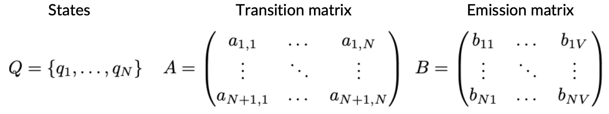
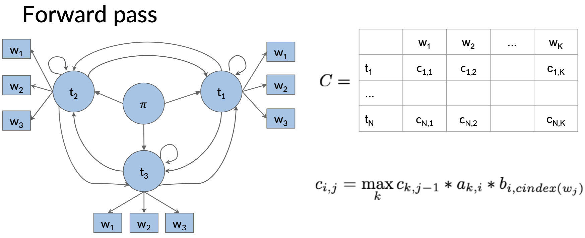
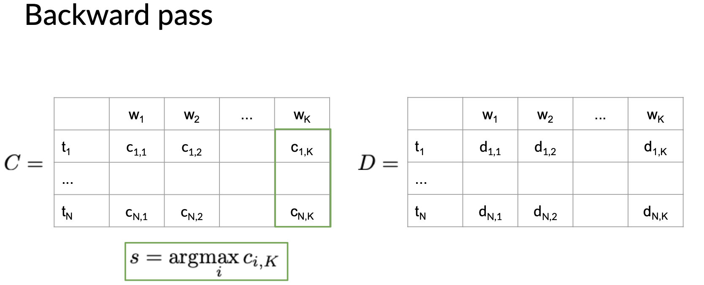
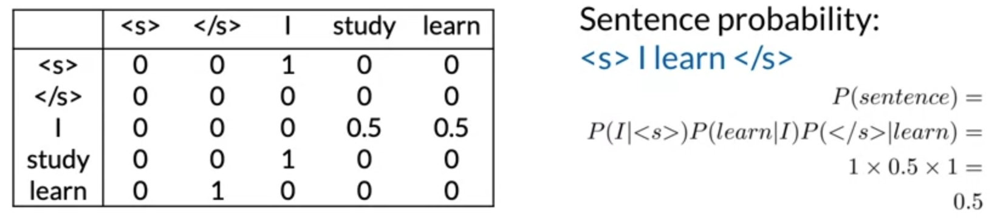
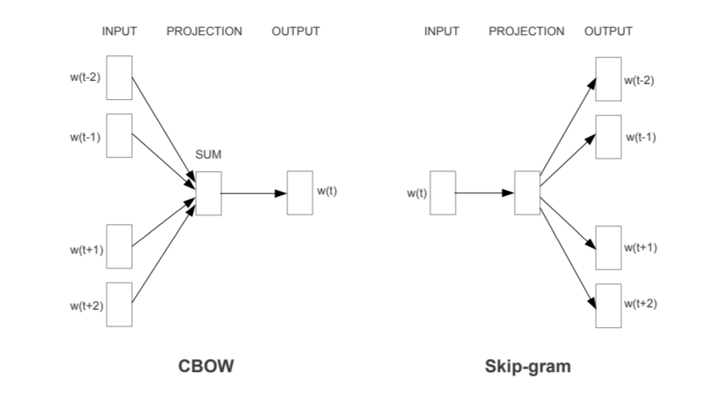
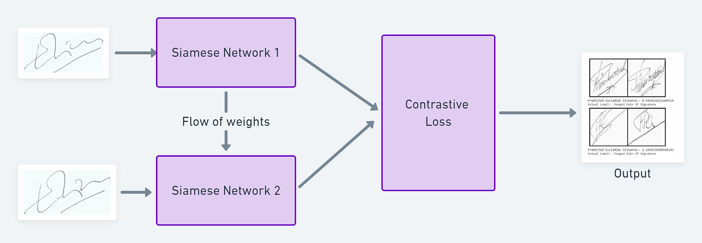
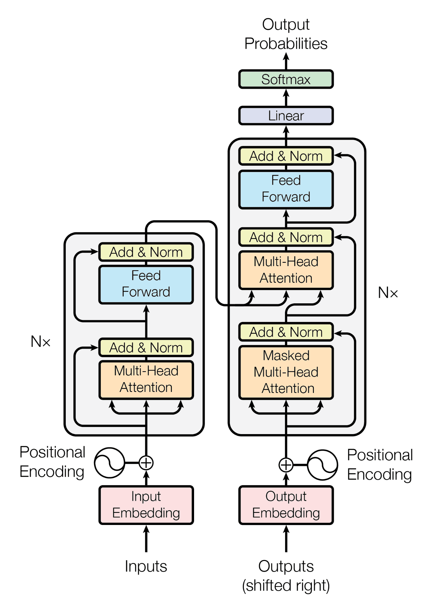
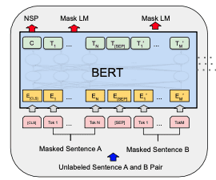

# Natural Language Processing

## Text Process

### Preprocess

- Tokenization: Splitting text into individual words, phrases, symbols, or other meaningful elements called tokens.

- Lowercasing: Converting all characters in the text to lowercase.

- Removing Punctuation and Special Characters: Eliminating punctuation marks and non-alphabetic characters.

- Removing Stop Words: Filtering out common words (e.g., "and", "the", "a") that appear frequently but offer little value in understanding the essence of the text.

- Stemming: Trimming words down to their root form, often resulting in a form that is not a valid word.

- Lemmatization: Converting words into their base or dictionary form, ensuring that the reduced form is a valid word.
- Part-of-Speech Tagging: Identifying and tagging each word's part of speech (e.g., noun, verb, adjective) based on its definition and context.

### Feature Engineering

- Bag of Words (BoW): Represents text as fixed-length vectors by counting the frequency of each word appearing in the document.

- Term Frequency-Inverse Document Frequency (TF-IDF): Weighs the frequency of each word in a document against its rarity across all documents, helping to highlight words that are more interesting and distinguishing for a document.

- Word Embeddings: Maps words or phrases to vectors of real numbers in a high-dimensional space, capturing semantic relationships between words.

- N-grams: Combines adjacent words into phrases of n items (e.g., bigrams are 2-word combinations), helping to preserve some order of words.

## Statistical Model

### Hidden Markov Model

- Transition probability: $P(t_i|t_{i-1})=\frac{C(t_{i-1},t_i)+\epsilon}{\sum_{j=1}^N C(t_{i-1},t_j)+N*\epsilon}$
- Emission probability: $P(w_i|t_i)=\frac{C(t_i,w_i)+\epsilon}{\sum_{j=1}^V C(t_i,w_j)+N*\epsilon}$

- Transition matrix: transition probability between each speech tags
- Emission matrix: emission probability between speech tag and word

Viterbi Algorithm:

### N-Gram Language Model

N-Gram probability: $P(w_N|w_1^{N-1})=\frac{w_1^{N-1}w_N}{C(w_1^{N-1})}$

Sequence Probability: $P(A,B,C,D)=P(A)P(B|A)P(C|A,B)P(D|A,B,C)$

N-Gram Language Model:

- Markov assumption: only last N words matter $P(w_N|w_1^{N-1})=P(w_N|w_{N-1})$ (Bigram)
- Start and end of sentence: start token \<s>, end token\</s>, add N-1 start tokens for N-Gram $model$

$$
p(A,B,C,D)=P(s)P(A|s)P(B|A)P(C|B)P(D|C)P(/s|D)
$$

Model Evaluation: 

- Perplexity: The smaller the perplexity, the better the model

$$
PP(W)=P(s_1,s_2,...,s_m)^{-1/m}
$$

$$
PP(W)=m\sqrt{\prod_{i=1}^m\prod_{j=1}^{|s_i|}\frac{1}{P(w_j^{(i)}|w_{j-1}^{(i)})}},for\ bigram\ model
$$

$$
PP(W)=m\sqrt{\prod_{i=1}^m\frac{1}{P(w_i|w_{i-1})}},concatenate\ all\ sentences
$$

Out of Vocabulary Words:

- Unknown words can be represented by UNK

Smoothing:

- Laplacian smoothing: $P(w_n|w_{n-1})=\frac{C(w_{n-1},w_n)+1}{C(w_{n-1})+V}$
- Add-k smoothing: $P(w_n|w_{n-1})=\frac{C(w_{n-1},w_n)+k}{C(w_{n-1})+k*V}$

- Backoff: if the higher n-gram probability is missing, then use the lower-order probability

- Interpolation: $\hat P(w_n|w_{n-2},w_{n-1})=\lambda_1P(w_n|w_{n-2},w_{n-1})+\lambda_2P(w_n|w_{n-1})+\lambda_3P(w_n)$

## Embedding

### CBOW

- **Input Layer**: The context words are represented as one-hot vectors and are input into the model. If the context size is *C* (i.e., *C* words before and after the target word), and the vocabulary size is *V*, the input layer will have *C* one-hot encoded vectors of size *V*.
- **Projection Layer**: The one-hot vectors are projected onto a shared, dense embedding layer, which reduces the dimensionality. This layer essentially averages the context word vectors.
- **Output Layer**: A softmax layer then predicts the target word. The model is trained to maximize the probability of the correct target word given the context words.

### Skip-Gram

- **Input Layer**: A single target word is represented as a one-hot vector and input into the model.
- **Projection Layer**: The one-hot vector is projected onto a dense embedding layer, similar to CBOW, but without averaging since there's only one input word.
- **Output Layer**: Multiple softmax layers predict the context words surrounding the target word. The model is trained to maximize the probability of the correct context words given a target word.

### GLOVE

1. **Co-occurrence Matrix Construction**: First, GloVe constructs a large matrix that represents the co-occurrence information of words within a corpus. Each element $X_{ij}$ of this matrix represents how often word *i* occurs in the context of word *j*, capturing the frequency of appearance of word pairs within a defined window size across the whole corpus.
2. **Learning Word Vectors**: The learning model then aims to minimize the difference between the dot product of the vector representations of two words and the logarithm of their co-occurrence probability. The objective function incorporates both these raw co-occurrence counts and the weighted function, which helps to address the disparity in word frequencies. The function is designed to give less weight to very frequent word pairs but still differentiate between rare and common pairs.

## Sequence Model

### Siamese Network

- **Architecture**: The core architecture of a Siamese network consists of two identical neural networks, each taking one of the two input vectors. The outputs of these networks are then fed into a metric function that computes a distance or similarity score between the inputs.
- **Weight Sharing**: The two subnetworks share the same weights and architecture, ensuring that they process their respective inputs in the same way. This shared learning helps the network learn more efficiently and reduces the number of parameters needed, which can mitigate overfitting.
- **Contrastive Loss**: Siamese networks often use a contrastive loss function during training. This type of loss function is designed to ensure that similar input pairs are brought closer together in the embedding space, while dissimilar pairs are pushed apart. This training approach enables the network to learn discriminative features that are effective at differentiating between inputs.

## Transformer

### Attention

The attention mechanism, at its core, involves computing a set of attention weights and using them to produce a weighted sum of some values. These weights determine the amount of "attention" or importance given to each part of the input data. Below are the formulas for different types of attention mechanisms, which highlight their distinct approaches to calculating these attention weights and the resulting context or output vectors.

**Soft Attention**:
$$
F(Q,K,V)=softmax(\frac{QK^T}{\sqrt{d_k}})V
$$
In this formula, $Q$, $K$, and $V$ stand for Query, Key, and Value matrices, respectively, and $d_k$ is the dimensionality of the keys. This type of attention allows for a distribution of focus across all positions with a gradient that is easily computable.

**Self-Attention (Intra-Attention)**:

Self-attention allows the model to attend to different positions of the same input sequence. The formula is similar to the soft attention mechanism but applied within a single sequence.
$$
F(Q,K,V)=softmax(\frac{QK^T}{\sqrt{d_k}})V
$$
Here, $Q$, $K$, and $V$ are derived from the same input sequence but transformed through different weight matrices.

**Multi-Head Attention**:

Multi-head attention runs the attention mechanism multiple times in parallel. The outputs are then concatenated and linearly transformed into the expected dimension. The formula for Multi-Head Attention is:
$$
F(Q,K,V)=Concat(head_1,...,head_h)W^O
$$

$$
head_i=A(QW_i^Q,KW_i^K,VW_i^V)
$$

In this setup, $W_i^Q$, $W_i^K$, $W_i^V$, and $W^O$ are parameter matrices, and $h$ is the number of heads.

### Transformer

- **Encoder**: The encoder maps an input sequence of symbol representations (words, for instance) to a sequence of continuous representations. The Transformer encoder consists of a stack of identical layers, each with two main sub-layers: a multi-head self-attention mechanism and a position-wise fully connected feed-forward network.
- **Decoder**: The decoder is responsible for transforming the encoder's output into the final output sequence. Like the encoder, the decoder is composed of a stack of identical layers. However, in addition to the two sub-layers found in the encoder layers, each decoder layer has a third sub-layer that performs multi-head attention over the encoder's output. This setup enables the decoder to focus on appropriate parts of the input sequence when producing the output.

- **Self-Attention**: This mechanism allows the model to weigh the importance of different words in the input sequence relative to each other. It's a crucial component for understanding the context and relationships between words in a sentence.
- **Multi-Head Attention**: By splitting the attention mechanism into multiple "heads," the model can simultaneously attend to information from different representation subspaces at different positions. This approach increases the model's ability to focus on various aspects of the context.
- **Positional Encoding**: Since the Transformer does not inherently process sequences in order (like RNNs or LSTMs), it uses positional encodings to give the model information about the position of each word in the sequence.

### BERT

- **Bidirectional Training**: Unlike previous models that processed text either from left to right or combined both left-to-right and right-to-left training, BERT is designed to read text in both directions simultaneously. This bidirectionality allows the model to understand the context of a word based on all of its surroundings (both left and right of the word).
- **Transformer Architecture**: BERT is based on the Transformer architecture, specifically utilizing its encoder mechanism. The Transformer model's ability to process words in relation to all other words in a sentence simultaneously allows BERT to capture the nuanced context of each word very effectively.
- **Pre-training and Fine-tuning**: BERT's approach involves two stages. In the pre-training phase, the model is trained on a large corpus of text with two unsupervised tasks: masked language modeling (MLM) and next sentence prediction (NSP). In the MLM task, some percentage of the input tokens are randomly masked, and the model needs to predict their original value. In the NSP task, the model learns to predict whether two sentences are consecutive. After pre-training, BERT can be fine-tuned with additional output layers to perform a wide variety of specific NLP tasks.

### GPT

- **Transformer Architecture**: At the heart of GPT is the Transformer architecture, which relies primarily on self-attention mechanisms to process input data. Unlike BERT, which uses the Transformer's encoder mechanism, GPT models utilize the Transformer's decoder for generating text. This design enables GPT to effectively predict the next word in a sequence, given all the previous words, allowing for the generation of coherent and contextually relevant text.
- **Autoregressive Model**: GPT models are autoregressive, meaning they predict the next token in a sequence based on the tokens that precede it. This capability makes GPT particularly well-suited for tasks that involve text generation, such as content creation, storytelling, and code generation.
- **Pre-training and Fine-tuning**: Similar to BERT, the GPT architecture involves two phases: pre-training and fine-tuning. During pre-training, the model is trained on a large corpus of text data, learning the statistical patterns of language. In the fine-tuning phase, GPT is adapted to specific tasks by training on a smaller, task-specific dataset. This approach allows the model to apply its general understanding of language to a wide range of tasks with minimal additional training.

## Prompt Engineering

- Write clear instructions

  - Include details in your query to get more relevant answers

  - Ask the model to adopt a persona

  - Use delimiters to clearly indicate distinct parts of the input

  - Specify the steps required to complete a task

  - Provide examples

  - Specify the desired length of the output

- Provide reference text

  - Instruct the model to answer using a reference text
  - Instruct the model to answer with citations from a reference text

- Split complex tasks into simpler subtasks

  - Use intent classification to identify the most relevant instructions for a user query
  - For dialogue applications that require very long conversations, summarize or filter previous dialogue
  - Summarize long documents piecewise and construct a full summary recursively

- Give the model time to "think"

  - Instruct the model to work out its own solution before rushing to a conclusion
  - Use inner monologue or a sequence of queries to hide the model's reasoning process
  - Ask the model if it missed anything on previous passes

- Use external tools

  - Use embeddings-based search to implement efficient knowledge retrieval
  - Use code execution to perform more accurate calculations or call external APIs
  - Give the model access to specific functions

- Test changes systematically

  - Evaluate model outputs with reference to gold-standard answers
