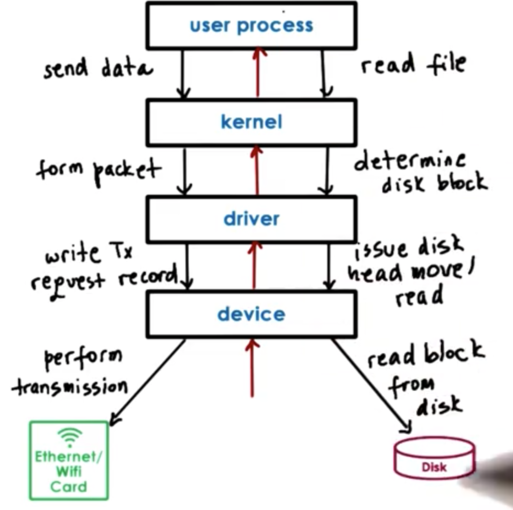
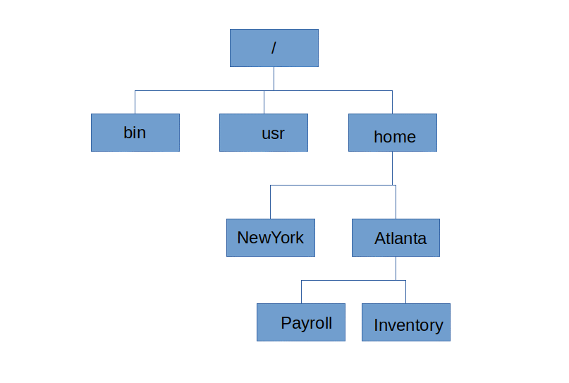
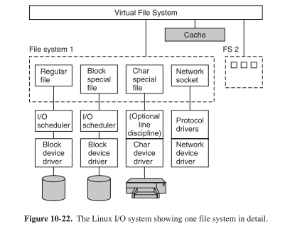

[toc]

# Device

## Introduction

### Devices

**Prompt: What are some common devices managed by operating system?**

Operating systems manage a wide array of devices, both internal and external, to ensure their proper functioning and interaction with software applications. Here are some common devices that operating systems typically manage:

1. **Central Processing Unit (CPU)**: The heart of the computer, where the OS schedules and manages the execution of processes and threads.
2. **Memory (RAM)**: The OS controls memory allocation, ensuring that applications have access to available RAM for data storage and execution.
3. **Hard Disk Drives (HDDs) and Solid-State Drives (SSDs)**: The OS manages storage devices for reading and writing data, including file systems and disk maintenance.
4. **Input Devices**:
   - **Keyboards**: The OS processes keystrokes and translates them into commands or text input.
   - **Mice and Touchpads**: The OS interprets mouse movements and clicks to control the cursor.
   - **Scanners**: The OS communicates with scanners to capture and process scanned images or documents.
   - **Webcams**: The OS manages webcams for video input, used in video conferencing, streaming, and recording.
5. **Display Devices**:
   - **Monitors**: The OS controls the display of visual information and graphics on the screen, including screen resolution and refresh rate.
   - **Graphics Cards (GPUs)**: The OS interacts with GPUs for rendering graphics and accelerating certain calculations.
6. **Audio Devices**:
   - **Speakers and Headphones**: The OS handles audio output, directing sound to the appropriate device.
   - **Microphones**: The OS captures and processes audio input for recording or voice commands.
7. **Storage Devices**:
   - **USB Drives**: The OS manages connections to external USB flash drives for data transfer.
   - **Optical Drives**: The OS interacts with CD/DVD/Blu-ray drives for reading and writing optical discs.
8. **Network Devices**:
   - **Network Interface Cards (NICs)**: The OS communicates with NICs to establish and maintain network connections, both wired and wireless.
   - **Routers and Modems**: The OS works with these devices to route data between different networks, enabling internet access.
9. **Printers and Scanners**: The OS facilitates printing and scanning functions, controlling print jobs and document scanning.

Operating systems are responsible for device discovery, configuration, resource allocation, and device driver management, ensuring a seamless and coordinated interaction between software and hardware across a wide range of devices.

### Overview

**Prompt: Give me an introduction about how operating system manage devices.**

Introduction to How Operating Systems Manage Devices:

Operating systems are the central software components that facilitate and manage the interactions between a computer's hardware and its software, including various input and output devices. Device management is a critical aspect of any operating system's functionality, ensuring that diverse hardware components can work harmoniously with software applications. Here's an overview of how operating systems manage devices:

1. **Device Abstraction**:
   Operating systems abstract hardware devices to present a uniform interface to software applications. This abstraction allows programmers to write software that can interact with devices without needing to know the intricate details of each piece of hardware. It also ensures hardware-independent code, making it easier to port applications across different systems.

2. **Device Drivers**:
   Device drivers are software components that act as intermediaries between the operating system and hardware devices. These drivers provide the necessary communication protocols and instructions for the OS to interact with specific hardware. The OS loads the appropriate drivers when a device is connected or at system boot.

3. **Plug and Play**:
   Many modern operating systems support plug and play functionality, which enables the automatic detection and configuration of new hardware devices. When a new device is connected, the OS identifies it, installs the required drivers, and makes the device ready for use without user intervention.

4. **Device Enumeration**:
   The operating system maintains a list of all available devices and their properties. This enumeration allows the OS to keep track of devices, their status, and their resource requirements. The Device Manager or a similar tool provides a user-friendly interface for managing devices.

5. **Resource Allocation**:
   The OS allocates system resources, such as memory addresses, input/output (I/O) ports, and interrupt lines, to different devices to ensure that they can function without conflicts. Proper resource management is crucial to avoid resource contention and system instability.

6. **Device Input and Output**:
   The OS manages input and output operations, coordinating data transfers between devices and software. It provides a set of system calls or APIs that applications can use to read from or write to devices. This includes handling user input from keyboards, mice, and touchscreens, as well as sending data to display screens, printers, and storage devices.

7. **Interrupt Handling**:
   Hardware devices often use interrupts to signal the CPU when they require attention. The OS manages these interrupts, ensuring that the CPU responds appropriately to device requests. This includes prioritizing and scheduling interrupt requests to prevent system bottlenecks.

8. **Device Configuration and Control**:
   Operating systems allow users to configure and control various device parameters, such as screen resolution, printer settings, and network adapters. Users can access these settings through graphical user interfaces or command-line tools.

9. **Power Management**:
   Many modern operating systems implement power management features to optimize energy consumption. They can control device power states, such as turning off unused components or putting the system into sleep mode to conserve energy.

10. **Error Handling and Recovery**:
    The OS provides mechanisms for error detection and recovery. When devices encounter issues, the operating system can diagnose problems, notify users or administrators, and attempt to recover from errors or failures gracefully.

Device management is a fundamental aspect of the overall user experience, ensuring that users can interact with a wide range of hardware devices seamlessly. It also plays a crucial role in system stability, resource allocation, and security by ensuring that devices are controlled and monitored effectively.

### Workflow

**Prompt: What are the workflow from user devices interaction to user process?**

1. **User Device Interaction**:
   - The user initiates an interaction with a device. This can involve various input devices like a keyboard, mouse, or touchscreen, or output devices like a display, speakers, or printer.

2. **Device Operation**:
   - The user's interaction with the device generates data, signals, or requests.
   - The device processes these inputs and may produce outputs or responses, such as keypresses, mouse movements, screen displays, or audio output.

3. **Device Driver**:
   - The device driver, a specialized software component, acts as an interface between the hardware device and the operating system.
   - When the device operation occurs, the device driver is responsible for translating the device's hardware-specific signals and data into a format the operating system can understand.

4. **Operating System Kernel**:
   - The operating system's kernel is the core component that manages hardware resources and facilitates communication between hardware devices and software processes.
   - The device driver communicates with the kernel to relay device data and signals and request various operations.

5. **Kernel Operations**:
   - The kernel receives data and control signals from device drivers. It processes these signals, performs necessary operations, and schedules tasks.
   - For input devices, the kernel may update device states, handle interrupts, and forward input data to the appropriate user processes.
   - For output devices, the kernel coordinates the display of graphics, audio playback, or other forms of output.

6. **User Processes**:
   - User processes are software applications or tasks initiated by the user.
   - These processes interact with the kernel through system calls and APIs to access device data or control device operations.
   - For example, a word processor may receive keyboard input from the kernel and display the typed text on the screen. Or, a media player may use the kernel to play audio through the sound card.

7. **Kernel to User Process Interaction**:
   - User processes issue system calls or make API requests to the kernel for device-related operations.
   - The kernel responds by executing the requested operations and providing feedback or data to the user processes.

8. **Feedback and User Interaction**:
   - User processes present feedback or information to the user via the device.
   - For example, a web browser may display web pages on a monitor, and a media player may play audio through speakers.

9. **User Device Interaction Loop**:
   - The workflow continues as the user interacts with the device and user processes generate additional requests or operations.
   - This loop enables ongoing interaction, control, and data exchange between the user, device, kernel, and user processes.

This workflow highlights the role of device drivers in bridging the gap between hardware devices and the operating system, with the kernel acting as the mediator that manages hardware resources and facilitates communication. User processes utilize these intermediary components to interact with devices and provide users with the desired functionalities and feedback. This interaction loop allows users to engage with devices seamlessly and efficiently within the computing environment.

## File System

### Introduction

**Prompt: Give me an introduction about file system management in operating system.**

Introduction to File System Management in Operating Systems:

File system management is a fundamental component of modern operating systems that plays a critical role in organizing, storing, and retrieving data. It serves as the bridge between the user and the physical storage devices, enabling the efficient and organized storage, retrieval, and manipulation of files and data.

In essence, a file system is a hierarchical structure that provides a way to represent and manage data on a storage medium, such as hard drives, solid-state drives, or network-attached storage devices. It offers a convenient and logical way for users and applications to interact with data, hiding the complexities of storage hardware.

Key aspects of file system management in operating systems include:

1. **Data Organization:** File systems organize data into files and directories, creating a structured and logical hierarchy for storing and accessing information. This hierarchical structure simplifies data management by allowing users to categorize and locate their files.

2. **File Operations:** File systems facilitate a range of essential file operations, such as file creation, reading, writing, deletion, and renaming. These operations are managed by the operating system and are exposed to users and applications through system calls and file management tools.

3. **Data Integrity:** File systems implement mechanisms for data integrity and reliability. This includes features like journaling, file permissions, and access control to prevent data corruption or unauthorized access.

4. **Storage Abstraction:** File systems abstract the physical storage devices, allowing users and applications to interact with files without needing to understand the underlying hardware details. This level of abstraction simplifies data management and ensures portability across different storage mediums.

5. **File Metadata:** Each file in a file system is associated with metadata, which includes information like file size, creation date, modification date, and ownership. Metadata is essential for file management, tracking changes, and ensuring the security and organization of files.

6. **File System Types:** Different operating systems support various file system types, such as FAT, NTFS, HFS+, ext4, and more. Each file system type has unique features, advantages, and limitations, catering to specific use cases and platforms.

7. **File Access Methods:** File systems provide methods for accessing data, including sequential access, random access, and direct access. These access methods determine how data is read and written, impacting the efficiency of file operations.

File system management is a critical component of an operating system, as it influences the overall user experience, data security, and system performance. It plays a crucial role in ensuring that data is stored, organized, and retrieved efficiently and reliably, making it an indispensable part of modern computing environments.

### Virtual File System

The Virtual File System (VFS) is an essential component of an operating system that provides a unified interface for applications to interact with files and directories. It abstracts the underlying physical file systems and facilitates cross-platform compatibility. Here are some key components of the Virtual File System:

1. **File System Interface:** The VFS provides a consistent and uniform set of system calls and functions that applications can use to perform file-related operations, such as opening, reading, writing, and closing files. This interface shields applications from the specifics of different physical file systems.

2. **In-Memory Data Structures:** VFS maintains in-memory data structures to represent file system objects, including open files, directories, and file control blocks. These structures help track and manage file-related information during program execution.

3. **File System Switch Table:** This table contains pointers to the specific implementation of various physical file systems supported by the operating system. It allows the VFS to dynamically switch between different file systems at runtime, depending on the context.

4. **File Descriptor Table:** The VFS manages file descriptors, which are numerical values associated with open files. These descriptors keep track of the current position within a file and are used to identify files during file operations.

5. **Superblock:** The superblock contains information about the underlying physical file systems, such as the file system type, device information, and various parameters related to the file system. It is used to initialize and configure the file system when it is mounted.

6. **Mount Table:** This table maintains information about the file systems that are currently mounted and their corresponding mount points. When a file system is mounted, it is associated with a directory in the overall file hierarchy.

7. **Inode Table and Inodes:** Inodes are data structures used to represent files and directories. The VFS may include an inode table that stores these structures, each associated with a specific file. Inodes contain metadata about files, such as permissions, ownership, and pointers to data blocks.

8. **Pathname Resolution:** The VFS provides mechanisms for translating user-friendly file paths (e.g., "/home/user/documents/file.txt") into the appropriate inodes or data blocks on the physical file system. This involves traversing the directory hierarchy and locating the target file.

9. **Caching and Buffering:** VFS often includes caching and buffering mechanisms to improve file access performance. Cached data can reduce the need to access the physical file system repeatedly, enhancing read and write operations.

10. **File System Drivers:** These are modules or drivers responsible for implementing specific physical file systems. They interact with the VFS through the file system switch table, providing the necessary functionality to read, write, and manage data on the storage medium.

11. **Security and Access Control:** The VFS may also incorporate security and access control mechanisms to enforce file permissions and ensure data integrity. This includes managing user and group permissions, as well as file ownership.

12. **Error Handling:** The VFS includes error handling mechanisms to deal with situations like file not found, disk full, or access denied. It reports errors to applications, allowing them to respond appropriately.

The Virtual File System is a crucial component of modern operating systems, providing a layer of abstraction that simplifies file management and enhances cross-platform compatibility. It plays a key role in ensuring that applications can access and manipulate files and directories efficiently and consistently, regardless of the underlying physical file system.

### Physical File System

![18.2. Ext2 Disk Data Structures - Understanding the Linux Kernel, 3rd  Edition [Book]](../../Images/httpatomoreillycomsourceoreillyimages9320.png)

The physical file system refers to the actual file system implemented on a specific storage device, such as a hard drive or SSD. It dictates how data is organized, stored, and accessed on the physical medium. Key components of a physical file system include:

1. **Superblock:** The superblock is a crucial data structure that stores essential information about the file system, such as the file system type, total storage capacity, block size, and details about the file system's layout on the storage device. It's often located at the beginning of the file system and is used to initialize and configure the file system during mount operations.

2. **Inode (Index Node):** Inodes are data structures that represent files and directories in the file system. Each inode contains metadata about a specific file, such as permissions, ownership, timestamps, and pointers to data blocks. The inode table stores these structures, and each file in the file system corresponds to one inode.

3. **Data Blocks:** Data blocks are used to store the actual content of files. Each inode contains pointers to these data blocks, allowing the file system to retrieve and store the file's data. Data blocks may be of fixed or variable size, depending on the file system.

4. **Directory Structure:** A file system's directory structure organizes files and directories into a hierarchy. Directories are specialized files that list the names of other files and their corresponding inodes. They help navigate and locate files within the file system.

5. **File Allocation Methods:** Physical file systems use various allocation methods to manage data blocks. Common methods include contiguous allocation, linked allocation, indexed allocation, and hybrid methods. Each method determines how data blocks are allocated and managed.

6. **Free Space Management:** To keep track of available storage space, physical file systems employ free space management techniques. These techniques monitor which data blocks are in use and which are free for new data. Common methods include bitmaps, linked lists, and group descriptors.

7. **File System Metadata:** Metadata includes information about files and directories, such as file names, permissions, ownership, timestamps, and file size. This data is essential for file system operations, including file manipulation and access control.

8. **File System Operations:** Physical file systems implement low-level operations like reading, writing, and deleting files, as well as maintaining and updating file system metadata. These operations are performed directly on the storage device.

9. **Journaling (optional):** Some modern file systems support journaling, which is a technique that logs file system transactions in a journal or log file before they are applied to the file system. This improves recovery after system crashes or unexpected shutdowns, ensuring data integrity.

10. **Access Control and Security:** Physical file systems often include mechanisms to enforce file permissions and access control, protecting data from unauthorized access. This includes user and group permissions, ownership, and security attributes.

11. **File System Specifics:** Different physical file systems have their unique features and characteristics. For instance, NTFS, used in Windows, offers advanced security and metadata capabilities, while ext4, common in Linux, is known for its efficiency and scalability.

12. **Error Handling:** Physical file systems incorporate error handling mechanisms to deal with issues such as disk errors, data corruption, or hardware failures. These mechanisms help maintain data integrity and reliability.

13. **Utilities and Tools:** Physical file systems often come with utilities and tools for maintenance and recovery, such as filesystem check (fsck) and defragmentation tools.

Each physical file system has its own design and features, catering to specific use cases and operating systems. The choice of a particular file system depends on factors like performance, compatibility, and the specific needs of the user or organization.

## I/O System

Introduction to I/O System Management in Operating Systems:

Input/Output (I/O) System Management is a crucial component of modern operating systems, responsible for handling the communication between the computer's central processing unit (CPU) and various input and output devices. It plays a fundamental role in managing the flow of data between applications and peripheral devices, such as keyboards, displays, disks, and network interfaces. I/O system management ensures that data is efficiently and reliably transferred between these devices and the memory and storage subsystems of the computer.

Key aspects of I/O system management in operating systems include:

1. **Device Abstraction:** I/O system management provides a layer of abstraction that hides the intricate details of individual devices from applications and the operating system kernel. This abstraction allows developers to write software that can work with a wide range of devices without having to worry about device-specific interfaces.

2. **Device Drivers:** Device drivers are software components that bridge the gap between the generic I/O system and specific hardware devices. They provide a standardized interface for the operating system to communicate with various devices, translating high-level I/O operations into device-specific commands.

3. **Device Enumeration and Configuration:** The I/O system is responsible for detecting and configuring devices during system startup. This process, known as device enumeration, ensures that the operating system recognizes all connected devices and prepares them for use.

4. **I/O Request Handling:** I/O system management processes and schedules I/O requests from applications and the kernel, ensuring efficient utilization of resources and minimizing bottlenecks. It manages I/O queues, device contention, and prioritization of requests.

5. **Buffering and Caching:** To improve I/O performance, the I/O system may implement buffering and caching mechanisms. Data is temporarily stored in buffers or caches, reducing the number of direct interactions with slower I/O devices.

6. **Synchronization and Asynchronous Operations:** I/O system management handles synchronization and coordination between different I/O operations. It allows for synchronous (blocking) and asynchronous (non-blocking) I/O, giving applications flexibility in handling I/O requests.

7. **Error Handling:** The I/O system is equipped to manage errors that may occur during data transfer or device operations. It reports errors to applications and can initiate recovery procedures to mitigate data loss or system instability.

8. **Interrupt Handling:** When devices need attention (e.g., data is ready to be read from a disk or a key is pressed on the keyboard), the I/O system responds to interrupts generated by devices, ensuring timely handling of these events.

9. **I/O Scheduling:** I/O system management may employ various scheduling algorithms to optimize the order in which I/O requests are serviced. These algorithms aim to reduce seek times for mechanical devices, minimize I/O latency, and improve overall system performance.

10. **File System Integration:** The I/O system collaborates closely with the file system, facilitating the reading and writing of data to and from storage devices like hard drives and SSDs. It ensures that file operations are translated into efficient I/O operations.

11. **Network Communication:** In networked environments, I/O system management handles data communication over networks, including data transmission and reception through network interfaces and network protocols.

Efficient I/O system management is critical for the overall performance and responsiveness of an operating system. It ensures that data can be seamlessly exchanged between applications and peripheral devices while optimizing resource utilization and minimizing delays. As technology evolves, I/O system management continues to play a central role in supporting an ever-expanding range of devices and data communication needs in modern computing environments.
