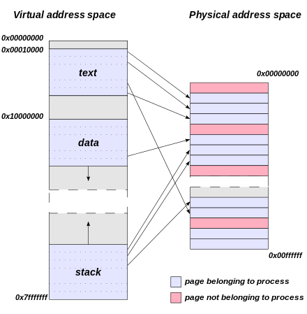
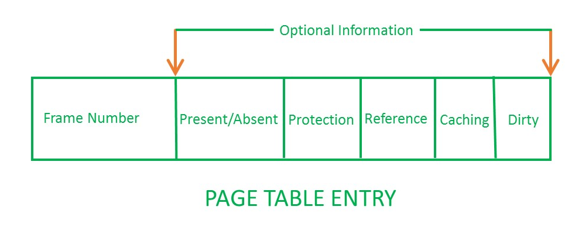
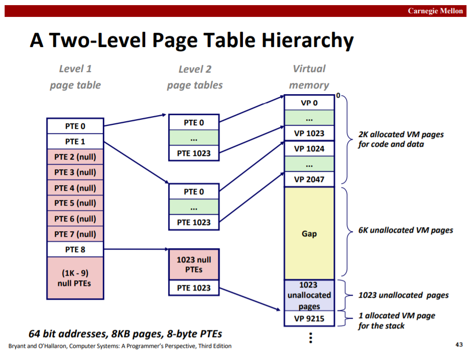

[toc]

# Memory

## Introduction

**Prompt: Give me an introduction about operating system memory management.**

Operating system memory management is a fundamental aspect of computer systems that plays a critical role in ensuring the efficient and secure utilization of a computer's memory resources. It is the operating system's responsibility to oversee the allocation, tracking, protection, and organization of memory in a way that allows multiple processes to run concurrently while safeguarding the integrity of each process's data. 

Memory management involves several key functions, including:

1. **Memory Allocation**: The operating system allocates memory to processes, determining how much memory each process can use. This allocation may be in the form of physical RAM or virtual memory that includes a combination of RAM and disk storage.

2. **Memory Protection**: To prevent processes from interfering with one another, the OS enforces memory protection mechanisms. These safeguards ensure that one process cannot access or modify the memory areas of another, which is crucial for system stability and security.

3. **Address Translation**: In systems with virtual memory, the OS uses address translation to map virtual memory addresses to physical memory locations. This allows processes to operate under the assumption that they have their dedicated memory, even though it's actually shared among multiple processes.

4. **Swapping and Paging**: When physical RAM becomes insufficient, the OS may transfer parts of a process's data or code from RAM to disk storage, and vice versa. This technique, known as swapping or paging, allows the efficient use of memory resources.

5. **Memory Cleanup**: After a process completes or is terminated, the OS is responsible for releasing the memory used by that process and ensuring that resources are properly reclaimed. 

6. **Memory Fragmentation Management**: Memory fragmentation, whether internal (within a block of memory) or external (between memory blocks), can lead to inefficient memory usage. The operating system employs strategies to manage fragmentation, such as memory compaction and various memory allocation algorithms.

7. **Memory Sharing**: The OS provides mechanisms for processes to share memory, facilitating efficient communication between them.

Effective memory management is crucial for optimizing a computer's performance and enabling multiple programs to run simultaneously without conflicts. It is an intricate and essential part of any operating system, with specific strategies and mechanisms varying depending on the OS's design and the hardware it runs on. By maintaining memory in a systematic and controlled manner, the operating system ensures the reliability, stability, and security of the entire computer system.

## Translation

### Overview

**Prompt: Give me an overview about virtual address and physical address and how virtual address is translated into physical address.**

Virtual addresses and physical addresses are central concepts in computer memory management. Here's an overview of each and how virtual addresses are translated into physical addresses:

**Virtual Address**:
- A virtual address is an address generated by a program running on a computer. It represents the memory location that the program believes it is accessing.
- Virtual addresses are used to create an abstraction layer that separates a program's view of memory from the actual physical memory. This allows for greater flexibility in memory management.
- Virtual addresses are generated by processes, and they allow processes to operate as if they have their dedicated contiguous memory space.

**Physical Address**:
- A physical address is the actual location in the computer's physical memory, such as RAM (Random Access Memory).
- The physical address represents the real, tangible location where data is stored in the computer's hardware memory chips.
- Physical addresses are used by the computer's hardware to access and retrieve data from memory.

**Translation from Virtual Address to Physical Address**:
The translation from virtual addresses to physical addresses is primarily achieved through the memory management unit (MMU) in coordination with the operating system. Here's how the translation process works:

1. **Virtual Address Splitting**: When a program running on the CPU references a memory location using a virtual address, the virtual address is split into two parts: the virtual page number (VPN) and the offset within the page. The offset represents the location within the page and does not require translation.

2. **Page Table Lookup**: The VPN is used as an index into the page table, which is a data structure that stores the mapping between virtual and physical addresses. The page table entry retrieved contains the physical page frame number (PFN) corresponding to the virtual page.

3. **Address Formation**: The physical address is formed by concatenating the PFN from the page table entry with the offset from the original virtual address. This combination creates the physical memory address that the CPU can use to access the required data in RAM.

4. **Access Control**: Before allowing access to the physical address, the MMU checks the permissions specified in the page table entry. If the access is allowed, the CPU can read from or write to that memory location. If access is not permitted, the MMU raises an exception or interrupt, indicating a violation of memory protection.

5. **Page Fault Handling**: If the page table entry indicates that the required page is not currently in physical memory (e.g., marked as invalid), a page fault occurs. The operating system must then load the required page from secondary storage (e.g., a disk) into an available page frame in RAM. The page table entry is updated to indicate the new location in physical memory.

This translation process ensures that a program interacts with its virtual address space while the operating system manages the mapping to physical memory. It allows multiple processes to run concurrently without interfering with each other, provides memory protection, and enables efficient utilization of physical memory resources. Proper page table management is essential to ensure accurate address translation and efficient memory operations.

### Page Table

**Prompt: Give me an introduction about page table.**

Page tables are a fundamental component of modern computer memory management, enabling memory protection, efficient use of physical memory, and the safe and concurrent execution of multiple processes. They are a critical part of the interaction between the CPU, the memory management unit (MMU), and the operating system in a virtual memory environment.

- A page table is a data structure used in virtual memory systems to manage the mapping between virtual addresses and physical addresses.
- It provides a mechanism for translating the memory addresses used by processes (virtual addresses) into the actual physical memory locations where data is stored.
- Page tables enable processes to have the illusion of a contiguous, dedicated memory space while sharing the underlying physical memory with other processes.

### Page Table Entry

**Prompt: What is the structures of a page table entry?**

A typical page table entry (PTE) includes the following components:

1. **Virtual Page Number (VPN)**:
   - The VPN is a field that stores the portion of the virtual address that represents the page number. It is used to index the page table to find the corresponding entry for the page being accessed.
2. **Page Frame Number (PFN)**:
   - The PFN is a field within the page table entry that holds the physical page frame number in RAM where the corresponding virtual page is located.
   - This mapping from the virtual page to the physical page allows the CPU to access the actual data in physical memory.
3. **Page Table Flags**:
   - Page table entries often include various control bits or flags that convey information about the page and its status. Common flags include:
     - Valid/Invalid Bit: Indicates whether the page is currently in physical memory (valid) or not (invalid).
     - Read/Write Permissions: Specifies whether the page is read-only, read-write, or has other access permissions.
     - Dirty Bit: Indicates whether the page has been modified since it was last loaded from secondary storage.
     - Accessed Bit: Marks whether the page has been accessed recently.
     - Additional bits for memory protection, cache management, or other hardware-specific features.
4. **Additional Bits/Fields**:
   - Depending on the system and hardware architecture, additional bits or fields may be included in the page table entry for specific purposes, such as hardware-specific control or memory protection.

### Multi-Level Page Table

**Prompt: Why do we need multi-level page table and how does it work?**

Multi-level page tables, also known as hierarchical page tables, are used in virtual memory systems to address the challenges posed by large address spaces and to efficiently manage memory resources. They work by organizing the page table structure into multiple levels, creating a hierarchical tree-like structure. Here's why we need multi-level page tables and how they work:

**Why We Need Multi-Level Page Tables**:

1. **Conserving Memory**: In systems with large address spaces, maintaining a flat page table structure can be highly memory-intensive. Every possible virtual address must have an entry in the page table, even if it's not currently in use. Multi-level page tables help conserve memory by allocating page table entries only where needed, reducing the memory overhead.
2. **Efficient Use of Memory**: In a flat page table, if a significant portion of the virtual address space is unused or sparsely populated, a lot of memory is allocated to store empty or rarely used page table entries. Multi-level page tables allocate memory for page table entries only in the regions of the address space that are actively used. This makes more efficient use of memory resources.

**How Multi-Level Page Tables Work**:

1. **Hierarchical Structure**: In a multi-level page table, the page table structure is organized into multiple levels. The number of levels and the size of each table are determined by the system's architecture and design. The structure typically resembles a tree.
2. **Address Translation**:
   - When a program running on a CPU references a virtual address, the virtual address is divided into multiple fields.
   - Each field is used to index a page table at a specific level. The most significant bits index the top-level page table, leading to the intermediate-level page table, and so on.
   - The final-level page table provides the physical page frame number that corresponds to the virtual address.
3. **Memory Hierarchy**: The top-level page table covers a large portion of the address space, and its entries point to intermediate-level page tables.
   - Intermediate-level page tables cover smaller address ranges and map virtual addresses to lower-level page tables or physical frames.
   - The lowest-level page tables map virtual addresses to physical page frames.
4. **Dynamic Memory Allocation**: In a multi-level page table, page table entries are allocated as needed. If a portion of the address space is not used, there is no need to allocate page table entries for that region, saving memory.
5. **Access Control and Page Fault Handling**: Access control and page fault handling processes work similarly to flat page tables. The MMU checks permissions, and if a page is not present in physical memory (resulting in a page fault), the operating system loads the necessary page from secondary storage into physical memory, updating the page table entries as required.

## Paging

### Page Load

**Prompt: How to load a page?**

**Loading a Page:**

1. **Page Fault Occurs:** When a process tries to access a virtual page that is not currently in physical memory (RAM), a page fault occurs. The page table of the process indicates that the page is not present in memory.
2. **Page Fault Handling:**
   - The operating system's memory management unit (MMU) traps the page fault and transfers control to the page fault handler.
   - The page fault handler is a part of the operating system responsible for managing page faults.
3. **Determine Page Location:**
   - The page fault handler checks the process's page table to find the location of the required page in secondary storage, such as a hard drive or SSD.
4. **Load the Page:**
   - The operating system initiates a process to read the required page from secondary storage into an available physical memory frame (page frame).
   - This operation is typically done asynchronously, and the process might be scheduled to wait while the page is being loaded.
5. **Update Page Table:**
   - Once the page is loaded into a page frame, the page table entry for that virtual page is updated to indicate that it is now present in physical memory.
   - The page table entry may also be updated with the physical address of the page frame.
6. **Restart the Faulting Instruction:**
   - After the required page is loaded into memory, the instruction that caused the page fault is restarted.
   - This time, the page is in memory, and the instruction can execute as expected.

### Page Replacement

**Prompt: How to load a page?**

**Evicting a Page:**

1. **Page Replacement Decision:**
   - When a page fault occurs due to a lack of free memory frames, the operating system's page replacement algorithm (e.g., LRU, FIFO, etc.) is used to determine which page to evict or replace.
2. **Select a Page to Evict:**
   - The page replacement algorithm selects a page that is a candidate for eviction. This is often a page that is least recently used or chosen based on the replacement policy's criteria.
3. **Check for Dirty Bit:**
   - Before evicting a page, the operating system checks if the page has been modified (dirty bit set). If it is dirty, the page must be written back to secondary storage to preserve data integrity.
4. **Write Back (if necessary):**
   - If the selected page is dirty, it is written back to its location in secondary storage (e.g., a swap file on disk) to ensure that any changes are saved.
5. **Update Page Table:**
   - The page table is updated to reflect that the evicted page is no longer in memory. The page table entry for that page is marked as not present.
6. **Load New Page:**
   - The page frame that previously held the evicted page is now available for a new page to be loaded. The page fault handling process described in the "Loading a Page" section is then followed to bring in the new page.
7. **Continue Execution:**
   - Once the new page is loaded, the process that encountered the page fault can continue executing from where it left off.

**Prompt: What are some common page replacement algorithm?**

Page replacement algorithms are used in operating systems and virtual memory systems to manage the allocation of physical memory (RAM) when it becomes full. The choice of a page replacement algorithm can significantly impact system performance. Some common page replacement algorithms include:

1. **FIFO (First-In-First-Out):** This algorithm replaces the oldest page in memory with the new page that needs to be loaded. It's simple to implement but doesn't always perform well because it doesn't consider the access history or the importance of pages.
2. **LRU (Least Recently Used):** LRU replaces the page that has not been used for the longest period. Implementing a true LRU algorithm can be expensive, but various approximations, such as the use of stacks or counters, can be used to approximate LRU behavior.
3. **LFU (Least Frequently Used):** LFU replaces the page that has been referenced the least number of times. It focuses on eliminating pages that are used infrequently. However, it may not work well in some situations, such as when a page is used frequently initially but not later on.
4. **ARC (Adaptive Replacement Cache):** ARC is a self-tuning replacement algorithm that adapts to changing access patterns. It combines elements of both LRU and LFU to maintain a balanced replacement policy.
10. **MFU (Most Frequently Used):** MFU replaces the page that has been used the most frequently. This algorithm assumes that pages that have been frequently used in the past will continue to be used frequently in the future.

## Allocator

**Prompt: What are some common memory allocation algorithms?**

Memory allocation algorithms are techniques used by operating systems to manage and allocate memory to processes efficiently. These algorithms determine how processes are assigned memory space, whether in physical RAM or virtual memory. Here are some common memory allocation algorithms:

1. **Contiguous Memory Allocation:**
   - In this scheme, each process is allocated a contiguous block of memory.
   - Algorithms used in contiguous memory allocation include:
     - **First Fit:** Allocates the first available block of memory that is large enough to accommodate the process.
     - **Best Fit:** Allocates the smallest available block that is large enough, reducing external fragmentation.
     - **Worst Fit:** Allocates the largest available block, which can lead to increased fragmentation.

2. **Paging:**
   - Paging divides physical memory into fixed-size blocks (frames) and virtual memory into fixed-size blocks (pages).
   - The process is divided into pages, which do not have to be stored in contiguous physical memory frames.
   - Operating systems use page tables to map virtual pages to physical frames.
   - Paging helps avoid external fragmentation and simplifies memory management.
   - Page replacement algorithms like LRU, FIFO, and others are used to handle page faults.

3. **Segmentation:**
   - Segmentation divides memory into variable-sized segments, with each segment representing a different type of data or code.
   - Segmentation allows for more flexibility than paging but can still suffer from external fragmentation.
   - A segment table maps segments to their physical locations.

4. **Dynamic Memory Allocation:**
   - Dynamic memory allocation is used for allocating memory at runtime.
   - Common functions for dynamic memory allocation include `malloc`, `free`, and `realloc`.
   - Algorithms like the buddy system, bin packing, and segregated free lists are used to manage the heap memory for dynamic memory allocation.

5. **Buddy System:**
   - In the buddy system, memory is allocated in fixed-sized blocks (powers of 2).
   - Blocks are merged with their "buddy" when they are freed, forming larger blocks.
   - It is efficient but can lead to internal fragmentation.

6. **Slab Allocation:**
   - Slab allocation is used in the Linux kernel for memory allocation.
   - Memory is organized into caches or "slabs" of objects with similar sizes.
   - This reduces memory fragmentation and improves memory allocation efficiency.

7. **Best Fit Decreasing:**
   - This is a variant of the best fit allocation strategy.
   - It allocates the largest block of memory among those that are large enough to accommodate the process.
   - It aims to minimize fragmentation and can be more efficient than regular best fit.

8. **Bounded Buffer Allocation:**
   - This strategy allocates memory within a fixed-sized buffer.
   - It's often used in real-time and embedded systems to ensure predictable memory allocation and avoid memory leaks.

9. **Worst Fit Decreasing:**
   - Similar to the worst fit allocation strategy.
   - Allocates the smallest block of memory among those that are large enough.
   - Can help mitigate fragmentation but may be less efficient.

The choice of memory allocation algorithm depends on the specific characteristics of the system, the type of memory management required (e.g., real-time or general-purpose), and the trade-offs between fragmentation, efficiency, and overhead. Different systems and applications may benefit from different memory allocation strategies.
