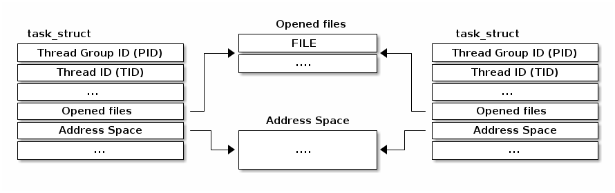
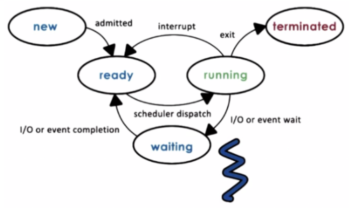

[toc]

# Process

## Introduction

**Give me an introduction about operating system process.**

An operating system process is a fundamental concept where each **program's execution** is represented as an independent unit. It allows the operating system to manage and execute multiple tasks concurrently, ensuring the efficient use of resources and the isolation of programs from one another. Key details of a process are stored in a Process Control Block (PCB), enabling the operating system to switch between processes and manage them effectively. Processes are essential for multitasking and resource management in modern computer systems.

## Components

**Prompt: What are the key components of a process?**


The key components of a process and how to represent a process can be summarized as follows:

**Key Components of a Process:**

1. **Program Code:** The executable code that the CPU executes.
2. **Process Control Block (PCB):** A data structure storing process information.
3. **Process State:** Current state, e.g., running, ready, blocked, or terminated.
4. **Program Counter (PC):** Keeps track of the next instruction.
5. **CPU Registers:** Store data and control process execution.
6. **Stack:** For local variables and function call management.
7. **Data Section:** Global and static variables.
8. **Heap:** For dynamic memory allocation.
9. **File Descriptors and I/O Information:** Access to files and devices.
10. **Parent-Child Relationship:** Parent process, child processes.
11. **Inter-Process Communication (IPC):** Channels for communication.
12. **Signal Handlers:** Registered signals and associated handlers.
13. **Resource Usage:** CPU time, memory, and other resource consumption.

### PCB

**Representation of a Process:**



- A process is represented using a **Process Control Block (PCB)** or **Task Control Block (TCB)**, which is a data structure.
- The PCB contains all the information about a process, including its state, program counter, CPU registers, stack pointer, memory management details, priority, program code, data, and more.
- It is typically stored in the kernel of the operating system.
- When a context switch occurs, the operating system saves the state of the currently executing process into its PCB and loads the state of the next process from its PCB.
- This representation allows the operating system to efficiently manage and control processes, enabling multitasking and resource sharing in a computer system.

### Stack and Heap

**Prompt: What is the difference between heap and stack in a process address space?**

The heap and the stack are two distinct regions within a process's address space, and they serve different purposes and have different characteristics:

1. **Stack:**
   - **Purpose:** The stack is primarily used for the management of function call frames, including parameter passing, return addresses, and local variables. It is a last-in, first-out (LIFO) data structure.
   - **Characteristics:**
     - Fixed-size: The stack typically has a fixed size determined during process creation.
     - Fast access: Stack operations are fast because they involve simple pointer manipulation.
     - Allocation and deallocation: Memory allocation and deallocation on the stack are automatic and implicit as functions are called and return.
     - Limited lifetime: Variables on the stack have a limited lifetime, tied to the function's scope.
     - Thread-specific: Each thread in a multi-threaded process has its own stack.

2. **Heap:**
   - **Purpose:** The heap is used for dynamic memory allocation, where data can be allocated and deallocated at runtime. It is suitable for managing data structures with a non-deterministic lifetime.
   - **Characteristics:**
     - Variable size: The heap can grow or shrink as needed during the program's execution.
     - Slower access: Heap operations are relatively slower compared to the stack because they involve memory management.
     - Explicit allocation and deallocation: Memory must be explicitly allocated and deallocated by the programmer (e.g., using `malloc` and `free` in C/C++ or `new` and `delete` in C++).
     - Longer lifetime: Variables on the heap can have a longer lifetime and persist across function calls.
     - Shared among threads: The heap is typically shared among all threads in a process and managed by the memory allocation functions.

**Key Differences:**

- **Usage:** The stack is primarily used for the management of function call frames, while the heap is used for dynamic memory allocation.
- **Allocation and Deallocation:** Stack memory is automatically allocated and deallocated as functions are called and return, while heap memory requires explicit allocation and deallocation by the programmer.
- **Lifetime:** Variables on the stack have a limited lifetime tied to the function's scope, while variables on the heap can persist beyond function calls.
- **Access Speed:** Stack operations are faster than heap operations because they involve simple pointer manipulation. Heap operations require memory management, which can be slower.
- **Thread-Specific:** Each thread has its own stack, while the heap is typically shared among all threads in a process.
- **Size:** The stack usually has a fixed size determined at process creation, while the heap can grow or shrink as needed during program execution.

In summary, the stack and heap serve different purposes in managing a process's memory. The choice of whether to use the stack or heap for a particular data or variable depends on its lifetime, scope, and memory management requirements.

## Lifecycle

**What is the process lifecycle?**



The process lifecycle, also known as the process state lifecycle, refers to the various states and transitions that a process goes through during its existence in an operating system. These states and transitions are managed by the operating system's process scheduler. The typical process lifecycle includes the following states:

1. **New:** The process is created by the operating system, but it has not yet started executing. Resources, such as memory and data structures, may be allocated during this phase.

2. **Ready:** In this state, the process is prepared to run, but the CPU is currently allocated to another process. It is waiting in a queue to be executed when the CPU becomes available.

3. **Running:** The process is currently being executed by the CPU. It is the active state in which the instructions of the program are being executed.

4. **Blocked (or Waiting):** A process may enter this state if it needs to wait for some event or resource to become available. For example, it might be waiting for user input or the completion of I/O operations. While in the blocked state, the process does not consume CPU time.

5. **Terminated (or Exit):** The process has finished its execution, either successfully or due to an error, and is being terminated. Resources associated with the process are released, and it is removed from the system.

The transitions between these states occur due to various events and actions. For example:

- A new process transitions to the ready state when it's ready to run.
- A ready process transitions to the running state when the CPU is available.
- A running process may voluntarily yield the CPU or be preempted by the scheduler, transitioning back to the ready state.
- A process waiting for I/O or other events moves to the blocked state.
- A terminated process moves to the exit state when it completes its execution.

The process lifecycle is dynamic, and processes can move between these states based on the operating system's scheduling policies, external events, and the program's logic. Understanding and managing the process lifecycle is crucial for efficient resource utilization and multitasking in modern operating systems.

## Scheduling

### Category

**Prompt: What is I/O bound and CPU bound process?**

I/O-bound and CPU-bound processes are two types of processes that have different resource usage characteristics and performance considerations:

1. **I/O-Bound Process:**
   - An I/O-bound process is one that spends a significant portion of its execution time performing input and output (I/O) operations, such as reading from or writing to disks, network communication, or user interaction.
   - These processes frequently pause their execution while waiting for I/O operations to complete. As a result, they often spend more time in a blocked or idle state than actively using the CPU.
   - Examples of I/O-bound processes include web servers handling client requests, database servers performing read and write operations, and interactive applications waiting for user input.

2. **CPU-Bound Process:**
   - A CPU-bound process is one that primarily requires CPU resources for computation and data processing. These processes are characterized by long and intense computations that keep the CPU busy for extended periods.
   - CPU-bound processes typically do not spend much time waiting for I/O operations to complete and remain actively using the CPU for most of their execution time.
   - Examples of CPU-bound processes include mathematical simulations, video encoding, scientific calculations, and rendering tasks in graphics applications.

The distinction between I/O-bound and CPU-bound processes is crucial for system performance and resource management. Different scheduling and resource allocation strategies are employed to handle these two types of processes effectively. For I/O-bound processes, priority and responsiveness to I/O operations are vital, while for CPU-bound processes, fair distribution of CPU time and optimization of computational resources are key considerations.

### Context Switch

**Prompt: How does operating system do context switch?**

A context switch is the process by which an operating system saves the state of a running process and restores the state of another process so that multiple processes can share a single CPU. Context switching is a fundamental operation in multitasking and multiprocessing operating systems. Here's how it's typically done:

1. **Interrupt Handling:** The need for a context switch often arises due to an interrupt. This can be a timer interrupt (when a process's time quantum expires), a hardware interrupt (e.g., I/O completion), or a software interrupt (e.g., a system call).

2. **Save Current Process State:** When an interrupt occurs, the CPU switches from user mode to kernel mode. The interrupt service routine (ISR) associated with the interrupt (e.g., a timer ISR) executes. The current process's context is saved. This includes saving the program counter (the location in the program where the process was interrupted), register values, and other relevant CPU state information.

3. **Choose a New Process:** The operating system's scheduler selects a new process from the ready queue or scheduling queue to execute next. The choice is determined by the scheduling algorithm (e.g., Round Robin, Priority Scheduling) and the priority or other criteria associated with each process.

4. **Load New Process State:** The context switch involves loading the saved state of the selected process from its process control block (PCB) into the CPU registers. This includes restoring the program counter, registers, and other CPU state information. The CPU switches from kernel mode back to user mode.

5. **Resume Execution:** The CPU resumes execution of the new process from where it was last interrupted. The new process enters the running state, and its instructions are executed.

Context switching is a crucial mechanism for enabling multitasking in operating systems. It allows multiple processes to share a single CPU while preserving the illusion of concurrent execution for each process. Efficient context switching is a performance-critical aspect of operating system design, as it affects the overall system responsiveness and resource utilization. The time it takes to perform a context switch can impact system performance, and operating systems aim to minimize this time through optimization techniques.

### Algorithm

**Prompt: Give me an introduction about common scheduling algorithms and their application scenario.**

Scheduling algorithms are essential in operating systems to determine the order in which processes are executed on the CPU. Each algorithm has its own characteristics and is suited to different scenarios. Here's an introduction to some common scheduling algorithms and their typical application scenarios:

1. **First-Come, First-Served (FCFS):**
   - **Overview:** FCFS is the simplest scheduling algorithm, where processes are executed in the order they arrive.
   - **Application Scenario:** FCFS is suitable when the order of arrival is significant and process execution times are unpredictable. It is often used in batch processing and non-interactive environments.
2. **Shortest Job Next (SJN) or Shortest Job First (SJF):**
   - **Overview:** SJN/SJF schedules processes based on their expected burst times, with the shortest job being executed first.
   - **Application Scenario:** Ideal for minimizing average waiting time in environments where burst times are known in advance. It may not be practical in real-world scenarios with unpredictable job lengths.
3. **Round Robin (RR):**
   - **Overview:** RR allocates each process a fixed time quantum (time slice) to execute. When the time slice expires, the process is placed at the end of the queue.
   - **Application Scenario:** RR is ideal for time-sharing systems, interactive environments, and ensuring fair CPU time allocation. It prevents any single process from monopolizing the CPU.
4. **Priority Scheduling:**
   - **Overview:** Priority scheduling assigns a priority level to each process, and the process with the highest priority executes first.
   - **Application Scenario:** Priority scheduling is valuable in real-time systems and environments where critical tasks must be executed promptly. It can be effective when different processes have varying importance levels.
5. **Multilevel Queue Scheduling:**
   - **Overview:** Processes are categorized into multiple queues based on priority or other attributes. Each queue can use its own scheduling algorithm.
   - **Application Scenario:** Multilevel queue scheduling is effective in scenarios where different classes of processes need to be managed separately. For example, it can prioritize real-time tasks over background tasks.
6. **Multilevel Feedback Queue Scheduling:**
   - **Overview:** Similar to multilevel queue scheduling, but processes can move between queues based on their behavior.
   - **Application Scenario:** This dynamic scheduling approach is suitable for environments with varying workload characteristics, as it adapts to the changing needs of processes.

The choice of scheduling algorithm depends on the specific needs and goals of the system. Real-world operating systems often use a combination of these algorithms and policies to balance fairness, responsiveness, and resource utilization effectively.

## Signal and Interrupt

### Introduction

**Prompt: What is signal and what is interrupt, what's the difference?**

Signals and interrupts are both mechanisms used in computing and operating systems to handle asynchronous events, but they serve different purposes and are triggered in distinct ways:

**Signal:**
- A signal is a software interrupt delivered to a process or thread to notify it of a specific event or condition. Signals are generated within the software and are typically used for inter-process communication (IPC) or to alert a process to various events.
- Signals are a form of software-based communication, often used to handle events like user interruptions (e.g., Ctrl+C to terminate a program), error conditions, or specific requests from other processes.
- Signals are part of the process management in an operating system and are used for tasks like process termination, process suspension, or custom event handling.

**Interrupt:**
- An interrupt is a hardware signal sent to the CPU to alert it to an event that needs immediate attention. Interrupts are generated by external hardware devices, like timers, keyboards, or network cards, and are used to request the CPU's attention for a particular event.
- Interrupts are a fundamental mechanism for handling external events and ensuring that the CPU can respond quickly to these events without needing to continually poll devices.
- Interrupts are low-level hardware operations that can lead to context switches and may be used to initiate various operations, including handling I/O operations, system calls, and hardware-related functions.

**Difference between Signals and Interrupts:**
1. **Source of Generation:**
   - Signals are generated within the software (by processes or the operating system) to communicate specific events or requests.
   - Interrupts are generated by external hardware devices (e.g., I/O devices or timers) to request the CPU's immediate attention.

2. **Purpose:**
   - Signals are used for software-based event notifications, custom event handling, and inter-process communication.
   - Interrupts are used to alert the CPU to external hardware events that require immediate attention or servicing.

3. **Initiation:**
   - Signals are initiated by software, either manually (e.g., by a user pressing a key combination) or programmatically (e.g., using the `kill` command in Unix-like systems).
   - Interrupts are initiated by hardware devices and occur spontaneously based on the timing or completion of hardware operations.

4. **Handling Mechanism:**
   - Signals are typically handled by processes, which can define custom signal handlers to respond to specific signals.
   - Interrupts are handled by the operating system's interrupt handler routines and often lead to context switches or servicing of I/O requests.

In summary, signals and interrupts are both mechanisms for handling events, but they differ in their source of generation, purpose, and the level at which they operate. Signals are a form of software-based communication within a process or between processes, while interrupts are low-level hardware events generated by external devices to request the CPU's immediate attention for specific tasks.

### Signal Handling

**Prompt: How does OS handle signals?**

Operating systems handle signals by providing a mechanism for processes to communicate with each other or with the operating system itself. Signals are used to notify a process about specific events or conditions, and processes can define how they respond to different signals. Here's an overview of how operating systems handle signals:

1. **Signal Generation:**
   - Signals can be generated by various events, including user actions, hardware interrupts, or other processes.
   - Examples of signal-generating events include:
     - User actions (e.g., pressing Ctrl+C to generate a "SIGINT" signal for process termination).
     - Hardware exceptions (e.g., division by zero or invalid memory access).
     - I/O events (e.g., data arrival on a socket or a file descriptor).
     - Timer and alarm signals.

2. **Signal Delivery:**
   - When a signal is generated, it is delivered to the target process or processes. The delivery mechanism depends on the type of event or condition that triggered the signal.
   - For example, a user-generated signal is delivered to the specific process to which it is directed, while a hardware exception may be delivered to the offending process.

3. **Signal Handling:**
   - Each process can define how it handles various signals. Signal handling involves specifying the action to be taken when a particular signal is received.
   - Common signal handling options include:
     - Termination: The process terminates.
     - Ignoring the signal: The process ignores the signal entirely.
     - Custom handler function: The process executes a custom signal handler function defined by the programmer.
     - Default action: The process takes a default action, which varies by signal (e.g., terminating for SIGINT, ignoring for SIGCHLD).

4. **Default Actions:**
   - Every signal has a default action associated with it, which is taken if the process does not specify a custom handler. For example, the default action for SIGINT is to terminate the process.
   - Default actions ensure that signals always have some effect, even if not explicitly handled.

5. **Signal Queuing:**
   - Signals can be queued if they arrive while a process is already handling another signal. In this case, signals are placed in a queue, and the process handles them sequentially.
   - Certain signals, such as SIGCHLD (sent when a child process terminates), are queued by default.

6. **Blocking Signals:**
   - Processes can choose to block certain signals temporarily, preventing them from being delivered until the block is lifted. This allows processes to ensure that critical sections of code are not interrupted by signals.

7. **Inter-Process Communication (IPC):**
   - Signals can be used for inter-process communication. For example, a parent process may send a signal to a child process to notify it of events or to instruct it to perform a specific action.

The handling of signals is an essential aspect of process management and inter-process communication in operating systems. It allows processes to respond to various events and conditions, ensuring that the system operates smoothly and that processes can communicate and coordinate their actions. The flexibility of custom signal handling functions allows developers to implement specific behaviors for their applications.

### Interrupt Handling

**Prompt: How does OS handle interrupts?**

Operating systems handle interrupts through a combination of hardware and software mechanisms to ensure that the CPU responds to external events in a controlled and efficient manner. Here's an overview of how the OS handles interrupts:

1. **Interrupt Generation:**
   - Interrupts are generated by various hardware devices, such as I/O controllers, timers, or other external events. Software can also generate software interrupts (e.g., system calls).
   - The specific event triggering an interrupt can include I/O completion, timer expiration, hardware errors, or other asynchronous events.

2. **Interrupt Request (IRQ):**
   - When a hardware device generates an interrupt, it sends an Interrupt Request (IRQ) to the CPU. Each type of interrupt is associated with a specific IRQ line.

3. **CPU Response:**
   - The CPU responds to the interrupt by suspending its current execution and entering kernel mode or supervisor mode.
   - The CPU's program counter (PC) and register state are saved, which allows for a return to the interrupted code later.

4. **Interrupt Handling:**
   - The CPU transfers control to a predefined interrupt service routine (ISR) associated with the particular interrupt. Each type of interrupt has its own ISR, which is a piece of code provided by the operating system to handle the event.
   - The ISR's primary task is to identify the source of the interrupt, process the associated event or data, and perform any necessary actions.

5. **Context Switch:**
   - If the interrupt requires switching from one process to another (e.g., for a timer interrupt or I/O completion), a context switch may occur. This involves saving the state of the currently executing process, loading the state of the new process, and changing the program counter to the new process's code.

6. **Interrupt Acknowledgment:**
   - After handling the interrupt, the CPU acknowledges the interrupt controller, indicating that the interrupt has been processed. This acknowledgment may involve sending a signal to the device or clearing a flag to indicate that the interrupt has been serviced.

7. **Return from Interrupt:**
   - Once the ISR completes its execution, control returns to the interrupted program. The CPU restores the previously saved state, including the program counter and register values, and continues executing the program as if it was never interrupted.

8. **Interrupt Prioritization:**
   - Operating systems use mechanisms to prioritize and manage different types of interrupts. Some interrupts, such as clock interrupts, are given higher priority to ensure timely responses.

9. **Masking and Unmasking:**
   - Operating systems allow the masking (disabling) and unmasking (enabling) of specific interrupts. This provides control over which interrupts are allowed to interrupt the CPU's current execution.

The handling of interrupts is a critical part of the operating system's functionality, as it enables the efficient handling of external events and allows the system to respond to hardware and software needs in a controlled manner. Proper interrupt handling is essential for maintaining system stability and responsiveness.

## Inter Process Communication

**Prompt: What are common types of IPC??**

Inter-process communication (IPC) encompasses various methods and mechanisms for processes to communicate and share data in a computing environment. Common types of IPC methods include:

1. **Pipes:**
   - **Description:** Pipes are a simple and efficient form of IPC for one-way communication between related processes.
   - **Usage:** They are often used for communication between a parent process and its child processes.

2. **Named Pipes (FIFOs):**
   - **Description:** Named pipes, or FIFOs (first in, first out), are similar to pipes but can be used for communication between unrelated processes.
   - **Usage:** They have a named file system entry, allowing unrelated processes to communicate.

3. **Message Queues:**
   - **Description:** Message queues provide a mechanism for sending and receiving messages between processes in a structured and asynchronous manner.
   - **Usage:** They are commonly used for inter-process communication when processes need to exchange data reliably.

4. **Shared Memory:**
   - **Description:** Shared memory allows processes to share a common region of memory, enabling them to read and write data directly into that memory area.
   - **Usage:** It is one of the fastest IPC methods but requires synchronization mechanisms to prevent conflicts.

5. **Sockets:**
   - **Description:** Sockets are a network-based IPC mechanism used for communication between processes on the same machine or across a network.
   - **Usage:** They are commonly used for client-server applications and networked communication.

6. **Signals:**
   - **Description:** Signals are a form of asynchronous IPC used for event notification and process control.
   - **Usage:** Processes can send and receive signals to notify each other of various events or to request specific actions.

7. **Semaphores:**
   - **Description:** Semaphores are synchronization mechanisms that coordinate access to shared resources.
   - **Usage:** They are used to control access to critical sections and avoid race conditions in multi-threaded or multi-process applications.

8. **Locks and Mutexes:**
   - **Description:** Locks (mutual exclusion) and mutexes (mutual exclusion objects) are synchronization mechanisms used to ensure exclusive access to a resource or code section.
   - **Usage:** They are commonly used in multi-threaded applications to prevent multiple threads from accessing shared resources simultaneously.

9. **File-based IPC:**
   - **Description:** Processes can communicate through files, with one process writing to a file while another reads from it.
   - **Usage:** This method is useful for simple data sharing and persistence.

10. **Remote Procedure Call (RPC):**
    - **Description:** RPC is a mechanism for distributed systems that allows processes to call functions or procedures in remote processes as if they were local.
    - **Usage:** It is commonly used in client-server architectures and distributed applications to abstract the complexities of network communication.

Each type of IPC method has its own advantages, limitations, and use cases. The choice of IPC method depends on the specific requirements of the application, including data sharing, communication speed, and synchronization needs.

### Message Queue

**Prompt: Give me an example and explanation for using POSIX Message Queue for IPC.**

Using POSIX message queues for inter-process communication (IPC) allows processes to communicate by sending and receiving structured messages through named message queues. Here's an example and an explanation of how to use POSIX message queues for IPC in C on a Unix-like system, such as Linux:

**Example:**

```c
#include <stdio.h>
#include <stdlib.h>
#include <string.h>
#include <sys/types.h>
#include <sys/ipc.h>
#include <mqueue.h>

#define QUEUE_NAME "/my_message_queue"
#define MAX_MSG_SIZE 100

int main() {
    mqd_t mq;
    struct mq_attr attr;
    char message[MAX_MSG_SIZE];
    unsigned int prio;

    // Define message queue attributes.
    attr.mq_flags = 0;
    attr.mq_maxmsg = 10;        // Maximum number of messages in the queue.
    attr.mq_msgsize = MAX_MSG_SIZE;

    // Create or open the message queue with read/write permissions.
    mq = mq_open(QUEUE_NAME, O_CREAT | O_RDWR, 0666, &attr);
    if (mq == (mqd_t)-1) {
        perror("mq_open");
        exit(1);
    }

    // Send a message to the message queue.
    strcpy(message, "Hello from Process 1!");
    if (mq_send(mq, message, strlen(message), 0) == -1) {
        perror("mq_send");
        exit(1);
    }

    printf("Message sent from Process 1: %s\n", message);

    // Receive a message from the message queue.
    ssize_t msg_len = mq_receive(mq, message, MAX_MSG_SIZE, &prio);
    if (msg_len == -1) {
        perror("mq_receive");
        exit(1);
    }

    message[msg_len] = '\0';
    printf("Received message in Process 1: %s\n", message);

    // Close and optionally unlink the message queue.
    if (mq_close(mq) == -1) {
        perror("mq_close");
        exit(1);
    }
    // Optionally remove the message queue (it remains if not unlinked).
    // mq_unlink(QUEUE_NAME);

    return 0;
}
```

**Explanation:**

In this example, we use POSIX message queues for IPC as follows:

1. We define the name of the message queue and the maximum message size.

2. We define the message queue attributes using the `struct mq_attr` structure, specifying attributes such as the maximum number of messages in the queue and the maximum message size.

3. We create or open the message queue using `mq_open` with the `O_CREAT | O_RDWR` flags to create the queue if it doesn't exist and open it for reading and writing. We pass the desired attributes to set the message queue properties.

4. We send a message to the message queue using `mq_send`. We set the message to "Hello from Process 1!" and specify its length.

5. We receive a message from the message queue using `mq_receive`. The received message length and message priority are returned. We null-terminate the message and print it.

6. We close the message queue using `mq_close` when we're done with it. Closing releases system resources associated with the queue.

7. Optionally, we can unlink the message queue using `mq_unlink`. Unlinking removes the message queue. If you don't unlink it, the queue remains until the system is rebooted or it is explicitly unlinked.

You can create a similar program for Process 2 to interact with the same message queue. In Process 2, you would open the queue, receive messages, and send messages as needed. Message queues are suitable for asynchronous communication between processes and are useful when processes need to exchange structured data efficiently.

### Shared Memory

**Prompt: Give me an example and explanation for using POSIX Shared Memory for IPC.**

Using POSIX Shared Memory for inter-process communication (IPC) allows multiple processes to share a common region of memory. This shared memory region can be used to exchange data among the processes efficiently. Here's an example and an explanation of how to use POSIX Shared Memory for IPC in C on a Unix-like system, such as Linux:

**Example:**

```c
#include <stdio.h>
#include <stdlib.h>
#include <string.h>
#include <sys/mman.h>
#include <sys/stat.h>
#include <fcntl.h>
#include <unistd.h>

#define SHARED_MEMORY_NAME "/my_shared_memory"
#define SHARED_MEMORY_SIZE 4096

int main() {
    int shm_fd;
    void* shared_memory;
    char* shared_message = "Hello from Process 1!";

    // Create or open the shared memory object.
    shm_fd = shm_open(SHARED_MEMORY_NAME, O_CREAT | O_RDWR, 0666);
    if (shm_fd == -1) {
        perror("shm_open");
        exit(1);
    }

    // Set the size of the shared memory object.
    if (ftruncate(shm_fd, SHARED_MEMORY_SIZE) == -1) {
        perror("ftruncate");
        exit(1);
    }

    // Map the shared memory object into the process's address space.
    shared_memory = mmap(0, SHARED_MEMORY_SIZE, PROT_READ | PROT_WRITE, MAP_SHARED, shm_fd, 0);
    if (shared_memory == MAP_FAILED) {
        perror("mmap");
        exit(1);
    }

    // Write a message to the shared memory.
    strcpy(shared_memory, shared_message);

    printf("Message sent from Process 1: %s\n", (char*)shared_memory);

    // Unmap and close the shared memory object.
    if (munmap(shared_memory, SHARED_MEMORY_SIZE) == -1) {
        perror("munmap");
        exit(1);
    }
    if (close(shm_fd) == -1) {
        perror("close");
        exit(1);
    }

    // Remove the shared memory object (optional).
    if (shm_unlink(SHARED_MEMORY_NAME) == -1) {
        perror("shm_unlink");
        exit(1);
    }

    return 0;
}
```

**Explanation:**

In this example, we use POSIX Shared Memory for IPC as follows:

1. We define the name of the shared memory object and its size.

2. We create or open the shared memory object using `shm_open`. The `O_CREAT | O_RDWR` flags indicate that we want to create the object if it doesn't exist and open it for reading and writing.

3. We set the size of the shared memory object using `ftruncate` to ensure it's large enough to hold the data.

4. We map the shared memory object into the process's address space using `mmap`. This makes it accessible for reading and writing. The `MAP_SHARED` flag specifies that the memory is shared between processes.

5. We write a message, "Hello from Process 1," to the shared memory.

6. We unmap and close the shared memory object when we're done with it. Unmapping is important to release system resources.

7. We have the option to remove the shared memory object using `shm_unlink` (similar to unlinking a file) when it's no longer needed. Removing it allows other processes to create a new shared memory object with the same name.

You can create a similar program for Process 2 to read from the shared memory. In Process 2, you would map the shared memory and read the message from it. Shared memory is a fast and efficient IPC method when processes need to exchange large amounts of data.

### RPC

**Prompt: Give me an example and explanation for gRPC in C++.**

gRPC is a powerful remote procedure call (RPC) framework that allows efficient communication between distributed systems. Below is an example of how to use gRPC in C++ to create a simple client-server application where the server calculates the square of a number, and the client calls this method.

**Example:**

1. **Define the gRPC service using Protocol Buffers (`.proto` file):**

   Create a file named `calculator.proto` with the following content:

   ```protobuf
   syntax = "proto3;

   service Calculator {
       rpc CalculateSquare (Number) returns (Result);
   }

   message Number {
       int32 value = 1;
   }

   message Result {
       int32 value = 1;
   }
   ```

2. **Generate C++ code from the `.proto` file:**

   Use the `protoc` compiler to generate C++ code for the gRPC service and message classes.

   ```bash
   protoc -I=. --cpp_out=. calculator.proto
   protoc -I=. --grpc_out=. --plugin=protoc-gen-grpc=`which grpc_cpp_plugin` calculator.proto
   ```

3. **Implement the gRPC server in C++:**

   Create a C++ server script, e.g., `calculator_server.cc`.

   ```cpp
   #include <iostream>
   #include <memory>
   #include <string>

   #include <grpc++/grpc++.h>
   #include "calculator.grpc.pb.h"

   class CalculatorServiceImpl final : public Calculator::Service {
   public:
       ::grpc::Status CalculateSquare(::grpc::ServerContext* context, const ::Number* request, ::Result* response) override {
           response->set_value(request->value() * request->value());
           return ::grpc::Status::OK;
       }
   };

   int main(int argc, char** argv) {
       std::string server_address("0.0.0.0:50051");
       CalculatorServiceImpl service;

       ::grpc::ServerBuilder builder;
       builder.AddListeningPort(server_address, ::grpc::InsecureServerCredentials());
       builder.RegisterService(&service);

       std::unique_ptr<::grpc::Server> server(builder.BuildAndStart());
       std::cout << "Server listening on " << server_address << std::endl;
       server->Wait();

       return 0;
   }
   ```

4. **Implement the gRPC client in C++:**

   Create a C++ client script, e.g., `calculator_client.cc`.

   ```cpp
   #include <iostream>
   #include <memory>
   #include <string>

   #include <grpc++/grpc++.h>
   #include "calculator.grpc.pb.h"

   int main(int argc, char** argv) {
       CalculatorClient client(grpc::CreateChannel("localhost:50051", grpc::InsecureChannelCredentials()));
       Number number;
       Result result;
       number.set_value(5);

       grpc::Status status = client.CalculateSquare(&number, &result);
       if (status.ok()) {
           std::cout << "Square: " << result.value() << std::endl;
       } else {
           std::cout << "RPC failed: " << status.error_code() << ": " << status.error_message() << std::endl;
       }

       return 0;
   }
   ```

5. **Compile and run the server and client:**

   Compile the server and client scripts using a C++ compiler. For example:

   ```bash
   g++ -std=c++11 -o calculator_server calculator_server.cc calculator.grpc.pb.cc calculator.pb.cc -lgrpc++ -lgrpc -lprotobuf -lpthread -ldl
   g++ -std=c++11 -o calculator_client calculator_client.cc calculator.grpc.pb.cc calculator.pb.cc -lgrpc++ -lgrpc -lprotobuf -lpthread -ldl
   ```

   Run the server:

   ```bash
   ./calculator_server
   ```

   In another terminal, run the client:

   ```bash
   ./calculator_client
   ```

**Explanation:**

- The `.proto` file defines the `Calculator` service with a single method, `CalculateSquare`, which takes a number and returns the square of that number.
- The `protoc` compiler generates C++ code for the gRPC service and message classes based on the `.proto` file.
- The server script (`calculator_server.cc`) implements the `CalculatorServiceImpl` class, which defines the behavior of the gRPC service. It calculates the square of a number.
- The server initializes a gRPC server, registers the `CalculatorServiceImpl`, and starts listening on port 50051.
- The client script (`calculator_client.cc`) connects to the gRPC server, prepares a `Number` message, and calls the `CalculateSquare` method on the server. It then prints the result.
- The code also handles error reporting and printing the result.

This example demonstrates how to create a simple gRPC client-server application in C++. gRPC is known for its efficiency and versatility, and it supports various features such as authentication, streaming, and bi-directional communication.
