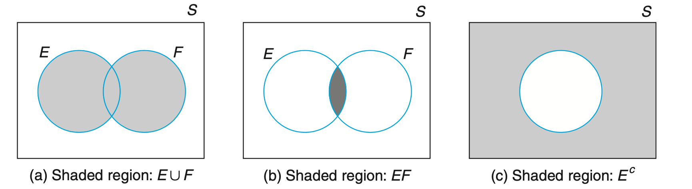
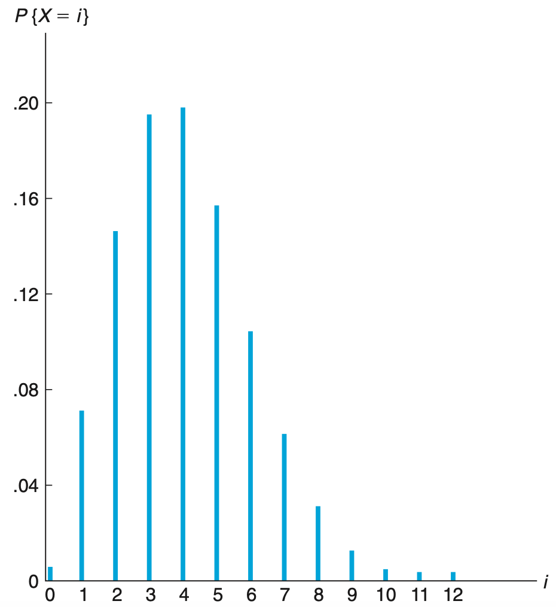

# Probs and Stats

[toc]

## Fundamental

### Data Collection

- Collect data from real word, sensor, etc.

- Use statistical theory to design an appropriate experiment to generate data (Random Experiment)

### Statistics

- Descriptive statistics: description and summarization of data

- Inferential statistics: statistics for drawing of conclusions

### Population and sample

- population: a total collection of elements

- sample: subgroup of a population

In practice, a given sample generally cannot be assumed to be representative of a population unless that sample has been chosen in a random manner. 

### Descriptive Statistics

- Statistics

  - Frequency: times of occurrences, can be drawed into tables and graphs
  - Relative Frequency: frequency/total, can be described as tables and graphs
  - Sample Mean: the arithmetic average of values; sample mean makes use of all the data values and is affected by extreme values that are much larger or smaller than the others
  - Sample Median: the value in position (*n* + 1)/2; if *n* is even, it is the average of the values in positions *n*/2 and *n*/2 + 1; the sample median makes use of only one or two of the middle values and is thus not affected by extreme values
  - Sample Mode: the value that occurs with the greatest frequency
  - Sample Variance: $s^2=\sum_{i=1}^n(x_i-\bar x)^2/(n-1)$
  - Sample Standard Deviation:   $s=\sqrt{\sum_{i=1}^n(x_i-\bar x)^2/(n-1)}$
  - Sample Percentile: at least 100*p* percent of the data are less than or equal to it and at least 100(1 − *p*) percent are greater than or equal to it

- Graph

  line graph: plots the distinct data values on the horizontal axis and indicates their frequencies by the heights of vertical lines

bar graph: lines in a line graph are given added thickness

*frequency polygon*: plots the frequencies of the different data values on the vertical axis, and then 	connects the plotted points with straight lines

*pie chart*: indicate relative frequencies when the data are not numerical

*frequency histogram*: a bar graph plot of class data representing frequency

*relative frequency histogram*: a bar graph plot of class data representing relative frequency

*stem and leaf plot*: dividing each data value into two parts — its stem and its leaf

*box plot*: 

### Chebyshev's inequality

- Two-Sided chebyshev's inequality

$$
S_k=\{i, 1\le i\le n:|x_i-\bar x|<ks\}
$$

$$
\frac{|S_k|}{n}\ge 1-\frac{n-1}{nk^2}\ge 1-\frac{1}{k^2}
$$

- One-Sided chebyshev's inequality

$$
N_k=\{i, 1\le i\le n:x_i-\bar x\ge ks\}
$$

$$
\frac{N(k)}{n}\le \frac{1}{1+k^2}
$$

### Normal Data

- normal histograms

- approximatedly normal

- skewed to the left

- skewed to the right

- bimodal

### Paired Data

- sample correlation coefficient: 

$$
r=\frac{\sum_{i=1}^n(x_i-\bar x)(y_i-\bar y)}{\sqrt{\sum_{i=1}^n(x_i-\bar x)^2\sum_{i=1}^n(y_i-\bar y)^2}}
$$

When *r* > 0 we say that the sample data pairs are *positively correlated*, and when *r* < 0 we say that they are *negatively correlated*

Correlation measures association, not causation, we can not conclude that high correlation means one factor contributes to another

## Probability

Frequency interpretation: the probability of the outcome will be observable as being the proportion of the experiments that result in the outcome

Bayesian interpretation: the probability of an outcome is considered a statement about the beliefs of the person who is quoting the probability

### Sample Space

- sample space: set of all possible outcomes of an experiment

- event: any subset *E* of the sample space
- set operation
  - Intersaction: $E \cap F$
  - Union: $E \cup F$
  - Complement: $E^c$
  - mutually exclusive: $E \cap F=\phi$
  - E is contained in F: $E \subset F$
  - communative law: $E \cup F=F\cup E$
  - associative law: $(E\cup F)\cup G=E\cup (F\cup G)$
  - distributive law: $(E\cup F)\cap G=(E\cap G) \cup (F\cap G)$

### Principal of Counting

If *r* experiments that are to be performed are such that the first one may result in any of *n*1 possible outcomes, and if for each of these *n*1 possible outcomes there are *n*2 possible outcomes of the second experiment, and if for each of the possible outcomes of the first two experiments there are *n*3 possible outcomes of the third experiment, and if, . . . , then there are a total of *n*1 · *n*2 · · · *n**r* possible outcomes of the *r* experiments.

### Conditional Probability

- general formula

$$
P(E|F)=\frac{P(EF)}{P(F)}
$$

- Bayes formula

$$
P(E)=P(EF)+P(EF^c)=P(E|F)P(F)+P(E|F^c)(1-P(F))
$$

$$
P(E)=\sum_{i=1}^nP(EF_i)=\sum_{i=1}^nP(E|F_i)P(F_i)
$$

$$
P(F_j|E)=\frac{P(E|F_j)P(F_j)}{\sum_{i=1}^nP(E|F_i)P(F_i)}
$$

### Independence

- Two events

$$
P(EF)=P(E)P(F)
$$

- Three events

$$
P(EFG)=P(E)P(F)P(G)
$$

$$
P(EF)=P(E)P(F)
$$

$$
P(EG)=P(E)P(G)
$$

$$
P(FG)=P(F)P(G)
$$

## Random Variables

- random variables: quantities of interest that are determined by the result of the experiment

- discrete random variables: Random variables whose set of possible values can be written either as a finite sequence *x*1, . . . , *x**n*, or as an infinite sequence *x*1, . . . 

- continuous random variables: random variables that take on a continuum of possible values

- cumulative distribution function: $F(x)=P(X\le x)$

- probability mass function: $p(a)=P(X=a)$

  for discrete random variables: $F(a)=\sum_{x\le a}p(x)$

  for continuous random variables: $F(a)=\int_{-inf}^ap(x)dx$

### Jointly Distributed Random Variables

- joint cumulative probability distribution: $F(x,y)=P(X\le x,Y\le y)$
- marginal probability distribution: $F_X(x)=F(x, inf), F_Y(y)=F(inf, y)$
- joint probability mass function: $f(x_i, y_j)=P(X=x_i, Y=y_j)$
- marginal probability mass function: $f_X(x)=\int f(x, y)dy, f_Y(y)=\int f(x, y)dx$

### Independent Random Variables

- $F(a,b)=F_X(a)F_Y(b)$
- $p(x,y)=p_X(x)p_Y(y)$

### Conditional Distribution

- $p_{X|Y}(x|y)=\frac{p(x,y)}{p_Y(y)}$

### Expectation

- Definition
  - discrete variables: $E[X]=\sum_{i=1}^n x_ip(x_i)$
  - continuous variables: $E[X]=\int xf(x)$
- Properties
  - $E[g(x)]=\sum_xg(x)p(x)$, $E[g(x)]=\int g(x)f(x)dx$
  - $E[aX+b]=aE[X]+b$
  - $E[g(X,Y)]=\sum_y \sum_xg(x,y)p(x,y)$, $E[g(X,Y)]=\int \int g(x,y)f(x, y)dxdy$
  - linearity of expectation: $E[X+Y]=E[X]+E[Y]$

### Variance

- Definition: $Var(X)=E[(X-\mu)^2]=E[X^2]-E[X]^2$
- Properties: $Var(aX+b)=a^2Var(X)$

### Covariance

- Definition: $Cov(X, Y)=E[(X-\mu_x)(Y-\mu_y)]=E[XY]-E[X]E[Y]$
- Properties:
  - $Cov(X,Y)=Cov(Y,X)$
  - $Cov(X, X)=Var(X)$
  - $Cov(aX, Y)=aCov(X,Y)$
  - $Cov(X_1+X_2,Y)=Cov(X_1,Y)+Cov(X_2,Y)$
  - $Cov(\sum_i X_i, \sum_j Y_j)=\sum_i\sum_jCov(X_i, Y_j)$
  - $Var(X+Y)=Var(X)+Var(Y)+2Cov(X, Y)$
  - $Var(\sum_i X_i)=\sum_i Var(X_i)+\sum_i\sum_jCov(X_i, X_j)$
  - Independent random variables X Y => $Cov(X,Y)=0$
  - $Corr(X,Y)=\frac{Cov(X,Y)}{\sqrt{Var(X)Var(Y)}}$

### Moment Generating

- Definition: $\phi(t)=E[e^{tX}]$
- Properties:
  - $\phi'(t)=E[Xe^{tX}]$
  - $\phi^n(0)=E[X^n]$
  - sum of independent random variables is just the product of the individual moment generating functions: $\phi_{X+Y}(t)=\phi_X(t)\phi_Y(t)$
  - the moment generating function uniquely determines the distribution

### Law of large numbers

- Markov's inequality:  X is a random variable that takes only nonnegative values, for any value a > 0

$$
P(X\ge a)\le \frac{E[X]}{a}
$$

- Chebyshev's inequality: X is a random variable with mean $\mu$ and variance $\sigma^2$, then for any value k > 0

$$
P\{|X-\mu|\ge k \}\le\frac{\sigma^2}{k^2}
$$

- Weak law of large numbers: X1,X2,..., be a sequence of independent and identically distributed random variables, each having mean $E[X_i] = \mu$, then for any $\epsilon$ > 0, with n -> inf

$$
P\{|\frac{X_1+...+X_n}{n}-\mu|>\epsilon\}->0
$$

## Special Random Variables

### Bernoulli

An experiment whose outcome can be classified as either a “success” or as a “failure”
$$
P(x=0)=1-p
$$

$$
P(x=1)=p
$$

$$
E[X]=p
$$

$$
Var(X)=p(1-p)
$$

### Bionomial

*n* independent trials, each of which results in a “success” with probability *p* and in a “failure” with probability 1 − *p*, If *X* represents the number of successes that occur in the *n* trials, then *X* is said to be a *binomial* random variable with parameters (*n*, *p*)
$$
P(x=i)=C_n^ip^i(1-p)^{n-i}
$$

$$
E[X]=np
$$

$$
Var(X)=np(1-p)
$$

### Possion

A random variable *X*, taking on one of the values 0, 1, 2,..., is said to be a Poisson random variable with parameter$\lambda$, $\lambda$ > 0, and it means $\lambda$ events occur in a time period. The probablity mass function is given by
$$
P(X=i)=e^{-\lambda}\frac{\lambda^i}{i!}
$$

$$
\phi(t)=exp(\lambda(e^t-1))
$$

$$
E[X]=\phi'(0)=\lambda
$$

$$
Var(X)=\phi''(0)-(E[X])^2=\lambda
$$

$$
\frac{P(X=i+1)}{P(X=i)}=\frac{\lambda}{i+1}
$$

The Poisson random variable may be used as an approximation for a binomial random variable with parameters (*n*, *p*) when *n* is large and *p* is small, in that case $\lambda=np$

The passion process is the events occurring at random time points, and N(t) denotes the number of events that occurs in the time interval [0, t]

- $N(0)=0$
- The number of events that occur in disjoint time intervals are independent
- The distrubution of the number of events that occur in a given interval depends only on the length of the interval and not on its location
- $lim_{h->0}\frac{P(N(h)=1)}{h}=\lambda$
- $lim_{h->0}\frac{P(N(h)\ge2)}{h}=0$

### Hypergeometric

A bin contains *N* + *M* batteries, of which *N* are of acceptable quality and the other *M* are defective. A sample of size *n* is to be randomly chosen (without replacements) in the sense that the set of sampled batteries is equally likely to be any of the 􏰍*N*+*M*􏰀 subsets of *n* size *n*. If we let *X* denote the number of acceptable batteries in the sample, then
$$
P(X=i)=\frac{C_N^iC_{M}^{n-i}}{C_{N+M}^n}
$$

$$
E[X]=\frac{nN}{N+M}
$$

$$
Var(X)=\sum_iVar(X_i)+2\sum\sum Cov(X_i,X_j)=\frac{nNM}{(N+M)^2}(1-\frac{n-1}{N+M-1})
$$

For fixed *p*, as *N* + *M* increases to ∞, Var(*X*) converges to *np*(1 − *p*), which is the variance of a binomial random variable with parameters (*n*, *p*)

### Uniform

$$
f(x)=\frac{1}{\beta-\alpha},\ if\ \alpha\le x \le \beta
$$

$$
E[X]=\frac{\alpha+\beta}{2}
$$

$$
Var(X)=\frac{(\beta-\alpha)^2}{12}
$$

### Normal

$$
f(x)=\frac{1}{\sqrt{2\pi}\sigma}e^{-(x-\mu)^2/2\sigma ^2}
$$

### Exponential

In probability theory and statistics, the **exponential distribution** is the probability distribution of the time between events in a Poisson point process
$$
f(x)=\lambda e^{-\lambda x}, \ if\ x\ge0
$$

$$
E[X]=1/\lambda
$$

$$
Var(X)=1/\lambda^2
$$

$$
P(X>s+t|X>t)=P(X>s)
$$

Exponentially distributed random variables are memoryless

### Gamma

$$
f(x)=\frac{\lambda e^{-\lambda x}(\lambda x)^{\alpha-1}}{\Gamma (\alpha)}
$$

$$
\Gamma(\alpha)=\int _0^{inf}\lambda e^{-\lambda x}(\lambda x)^{\alpha-1}dx=(\alpha-1)\Gamma(\alpha-1)
$$

$$
E[X]=\frac{\alpha}{\lambda}, Var(X)=\frac{\alpha}{\lambda^2}
$$

If *X*1 and *X*2 are independent gamma random variables having respective parameters (α1, λ) and (α2, λ), then *X*1 + *X*2 is a gamma random variable with parameters (α1 + α2, λ)

### Chi-square

$$
X=Z_1^2+Z_2^2+...+Z_n^2
$$

$$
E[X]=n
$$

$$
Var[X]=2n
$$

chi-square with *n* degrees of freedom and gamma with parameters *n*/2 and 1/2 — are identical

### t-Distribution

$$
T_n=\frac{Z}{\sqrt{X_n^2/n}}​
$$

### F-Distribution

$$
F_{n,m}=\frac{X_n^2/n}{X_m^2/m}
$$

## Parameter Estimation

- Parametric Inference: Problems in which the form of the population distribution is specified up to a set of unknown parameters are called *parametric* inference
- Nonparametric Inference: Problems that nothing is assumed about the form of population distribution are called *nonparametric* inference problems

### Sample Statistics

If *X*1,...,*Xn* are independent random variables having a common distribution *F*, then we say that they constitute a *sample* (sometimes called a *random sample*) from the distribution *F*

- sample mean: $\bar X=\frac{X_1+...+X_n}{n}$
- expectation: $E[X]=\mu$
- variance: $Var(\bar X)=\frac{\sigma^2}{n}$

### Central Limit Theorem

$$
\frac{\bar X-\mu}{\sigma/\sqrt n}\sim N(0,1)
$$

No matter how nonnormal the underlying population distribution is, the sample mean of a sample of size at least 30 will be approximately normal

### Maximum Likelihood Estimation

The maximum likelihood estimate $\theta$ is defined to be that value of $\theta$ maximizing $f (x_1,...,x_n|\theta)$ where $x_1,...,x_n$ are the observed values. The function  is $f (x_1,...,x_n|\theta)$ often referred to as the *likelihood* function of $\theta$

MLE for Normal Distribution: $\mu = \bar X$,  $S=[\sum_{i=1}^n (X_i-\bar X)^2/n]^{1/2}$

MLE for Uniform Distribution: $\hat \theta=max(X_1, X_2, ..., X_m)$

### Interval Estimation

- Confidence Interval for a Normal Mean and Variance

- THE DIFFERENCE IN MEANS OF TWO NORMAL POPULATIONS

- CONFIDENCE INTERVAL FOR THE MEAN OF A BERNOULLI RANDOM VARIABLE: *X* is approximately normally distributed with mean *np* and variance *np*(1 − *p*)

### Prediction Intervals

Suppose that *X*1, . . . , *Xn*, *Xn*+1 is a sample from a normal distribution with unknown mean μ and unknown variance σ. Suppose further that the values of *X*1 , . . . , *X*n are to be observed and that we want to use them to predict the value of *X*n+1
$$
P(-t_{\alpha/2,n-1}<\frac{X_{n+1}-\bar X_n}{S_n\sqrt{1+1/n}}<t_{\alpha/2,n-1})
$$

### Bayes Estimation

Prior to the observance of the outcomes of the data *X*1, . . . , *X**n*, we have some information about the value of θ and this information is expressible in terms of a probability distribution.

Bayes Estimator: $E[\theta|X_1,X_2,...,X_n]$
$$
f(\theta|x_1,...,x_n)=\frac{f(\theta,x_1,...x_n)}{f(x_1,...,x_n)}=\frac{p(\theta)f(x_1,...,x_n|\theta)}{\int f(x_1,...,x_n|\theta)p(\theta)d\theta}
$$

$$
E[\theta|X_1,X_2,...,X_n]=\int \theta f(\theta|x_1,...,x_n)d\theta
$$

## Hypothesis Testing

### Overview

A statistical hypothesis is usually a statement about a set of parameters of a population distribution.

- null hypothesis: a default hypothesis that a quantity to be measured is zero (null). The null hypothesis is set to be rejected
- type I error:  the test incorrectly calls for rejecting *H*0 when it is indeed correct
- type II error: the test calls for accepting *H*0 when it is false
- level of significance of the test: usually set in advance, with commonly chosen values being α = .1, .05, .005, the classical approach to testing *H*0 is to fix a significance level α and then require that the test have the property that the probability of a type I error occurring can never be greater than α
- *p*-value of the test: gives the critical significance level in the sense that *H*0 will be accepted if the significance level α is less than the *p*-value and rejected if it is greater than or equal.

### Power of Test

Type2 Error: The null hypothesis is false, but we fail to reject it, the probability is 1 - $\beta$, called the power-function of the test
$$
\beta=P(-z_{\alpha/2}\le \frac{\bar X-\mu_0}{\sigma/\sqrt n}\le z_{\alpha/2})=P(\frac{\mu_0-\mu}{\sigma/\sqrt n}-z_{\alpha/2}\le Z\le \frac{\mu_0-\mu}{\sigma/\sqrt n}+z_{\alpha/2})
$$
The power function is useful in determining how large the random sample need be to meet certain specifications concerning type II errors. We assume that $\mu_1>\mu_0$,  therefore $\phi(\frac{\mu_0-\mu_1}{\sigma/\sqrt n}-z_{\alpha/2})\approx 0$
$$
\beta=P(\frac{\mu_0-\mu_1}{\sigma/\sqrt n}-z_{\alpha/2}\le Z\le \frac{\mu_0-\mu_1}{\sigma/\sqrt n}+z_{\alpha/2})
$$

$$
\beta\approx \phi(\frac{\mu_0-\mu_1}{\sigma/\sqrt n}+z_{\alpha/2})
$$

$$
-z_\beta\approx \frac{\mu_0-\mu_1}{\sigma/\sqrt n}+z_{\alpha/2}
$$

$$
n\approx \frac{(z_{\alpha/2}+z_\beta)^2\sigma^2}{(\mu_1-\mu_0)^2}
$$

### Mean of a Normal Population

- Known Variance

- Unknown Variance

### Means of Two Normal Populations

### Mean of Paired Population

$$
H_0:\mu_w=0\ \ versus\ \ H_1:\mu_w\ne 0
$$

$$
accept\ H_0\ if\ -t_{\alpha/2,n-1}<\sqrt n \frac{\bar W}{S_W}<t_{\alpha/2,n-1},\ else\ reject
$$

### Variance of a Normal Population

- test of a population variance

$$
H_0: \sigma^2=\sigma_0^2 \ \ \  versus\ \ \ H_1:\sigma^2 \ne \sigma^2_0
$$

$$
\frac{(n-1)S^2}{\sigma_0^2}\sim X_{n-1}^2
$$

$$
accept\ H_0\ if\ X_{1-\alpha/2,n-1}^2\le \frac{(n-1)S^2}{\sigma_0^2}\le X_{\alpha/2,n-1}^2\ else \ reject
$$

$$
p-value=2min(P(X_{n-1}^2<c),1-P(X_{n-1}^2<c))
$$

- test of two populations variance

$$
H_0: \sigma_x^2=\sigma_y^2\ versus\ H_1: \sigma_x^2\ne \sigma_y^2
$$

$$
S_x^2/S_y^2\sim F_{n-1,m-1}
$$

$$
accept\ H_0\ if\ F_{1-\alpha/2,n-1,m-1}\le S_x^2/S_y^2\le F_{\alpha/2,n-1,m-1}\ else \ reject
$$

$$
p-value=2min(P(F_{n-1,m-1}<v),1-P(F_{n-1,m-1}<v))
$$

### Bernoulli Populations

When the sample size *n* is large, we can derive an *approximate* significance level α test of *H*0 : *p* ≤ *p*0 versus *H*1 : *p* > *p*0 by using the normal approximation to the binomial.
$$
\frac{X-np_0}{\sqrt{np_0(1-p_0)}}\ge z_{\alpha}
$$

## Regression

### Overview

In many situations, there is a single *response* variable $Y$ , also called the *dependent* variable, which depends on the value of a set of *input*, also called *independent*, variables $x_1,...,x_r$
$$
Y=\beta_0+\beta_1x_1+...+\beta_rx_r+e
$$

$$
E[Y|\bold x]=\beta_0+\beta_1x_1+...+\beta_rx_r
$$

### Least Squares Estimate

The method of least squares chooses as estimators of $\alpha$ and $\beta$ the values of *A* and *B* that minimize *SS*
$$
SS_R=\sum_{i=1}^n(Y_i-A-Bx_i)^2
$$

$$
\frac{\partial SS}{\partial A}=-2\sum(Y_i-A-Bx_i)=0
$$

$$
\frac{\partial SS}{\partial B}=-2\sum x_i(Y_i-A-Bx_i)=0
$$

$$
S_{xY}=\sum(x_i-\bar x)(Y_i-\bar Y)=\sum x_iY_i - n\bar X\bar Y
$$

$$
S_{xx}=\sum (x_i-\bar x)^2=\sum x_i^2-n\bar x^2
$$

$$
S_{YY}=\sum(Y_i-\bar Y)^2=\sum Y_i^2-n\bar Y^2
$$

$$
SS_R=\frac{S_{xx}S_{YY}-S_{xY}^2}{S_{xx}}
$$

$$
B=\frac{\sum x_iY_i-n\bar x \bar Y}{\sum x_i^2-n\bar x^2}=\frac{S_{xY}}{S_{xx}}
$$

$$
A=\bar Y-B\bar x
$$

$$
\frac{SS_R}{\sigma^2}\sim X_{n-2}^2
$$

### Parameter Distribution

### Determination

 How much of the variation in the values of the response variables is due to the different input values
$$
R^2=\frac{S_{YY}-SS_R}{S_{YY}}=1-\frac{SS_R}{S_{YY}}
$$

$$
r^2=\frac{S_{xY}^2}{S_{xx}S_{YY}}=R^2
$$

### Analysis of Residual

$$
Standardized\ Residuals: \frac{Y_i-(A+Bx_i)}{\sqrt{SS_R/(n-2)}}
$$

When the simple linear regression model is correct, the standardized residuals are approximately independent standard normal random variables

### Weighted Least Squares

The variance of a response is not constant but rather depends on its input level. If these variances are known — at least up to a proportionality constant — then the regression parameters α and β should be estimated by minimizing a weighted sum of squares.
$$
Var(Y_i)=\frac{\sigma^2}{w_i}
$$

$$
\sum_i \frac{[Y_i-(A+Bx_i)]^2}{Var(Y_i)}=\frac{1}{\sigma ^2}\sum_i w_i(Y_i-A-Bx_i)^2
$$

### Multiple Linear Regression

$$
\bold Y=\bold X \beta+\bold e
$$

$$
\bold X'\bold X \bold B=\bold X'\bold Y
$$

$$
\bold B=(\bold X'\bold X)^{-1}\bold X'\bold Y
$$

## ANOVA

### Overview

The mean of a random variable depends only on a single factor is called a *one-way analysis of variance*

Models that assume that there are two factors that determine the mean value of a variable is called a *two-way analysis of variance*

In all of the models considered in this chapter, we assume that the data are normally distributed with the same (although unknown) variance $\sigma^2$

### ONE-WAY ANOVA

$$
H_0: \mu_1=\mu_2=...=\mu_m
$$

$$
H_1: not\ all\ means\ are\ equal
$$

### TWO-WAY ANOVA

$$
\mu_{ij}=E[X_{ij}]=\mu+\alpha_i+\beta_j
$$

$$
X_{ij}\sim N(\mu+\alpha_i+\beta_j, \sigma^2)
$$

## Goodness of Fit

Statistical tests that determine whether a given probabilistic mechanism is appropriate are called *goodness of fit* tests
$$
H_0: P(Y=i)=p_i, \ i=1,...,k
$$

$$
H_1:P(Y=i)\ne p_i, \ i=1,...,k
$$

