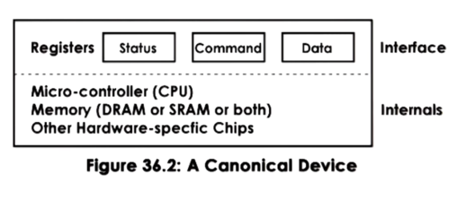
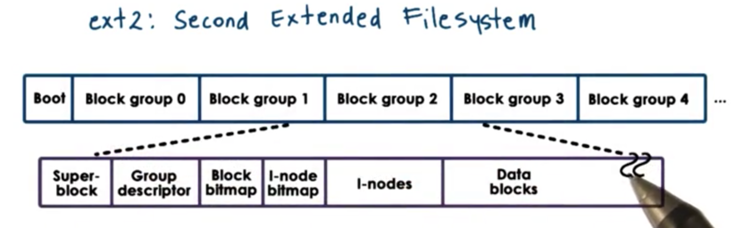
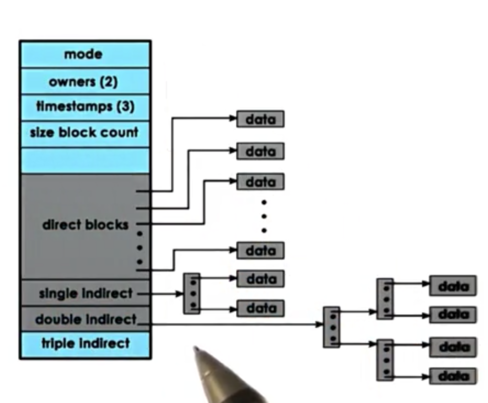

## I/O Devices

- a device will have a set of control registers which can be accessed by the CPU and permit CPU/device interactions
  - **command registers**: that the CPU uses to control the device
  - **data registers**: used by the CPU to transfer data in and out of the device
  - **status registers**: used by the CPU to understand what is happening on the device.

- **microcontroller**: the device's CPU on device memory, as well as any other logic needed by the device

  

- Device Interconnect: Devices interface with the rest of the system via a controller, **Peripheral Component Interconnect** (PCI) bus is typical one way for interconnect
- Device drivers are specific software components that manage device access, management, and control.

## Device Management

### Devices Types

- **Block devices**: like disks - operate at the granularity of blocks of data that are delivered to and from the device via the CPU interconnect.
- **Character devices**: like keyboards - work with a serial sequence of characters and support a get/put character interface.

- **Network devices**: They deliver more than a character at a time, but their granularity is not a fixed block size. They are more like a stream of data chunks of potentially different sizes.

- The interface a device exposes to the operating system is standardized based on the type of device, with block devices supporting read/write operations and character devices supporting get/put operations.
- The operating system maintains a representation of each device available on the platform using a file abstraction, where each file represents a device, allowing the OS to interact with devices using the same interface it uses for files.
- Devices on UNIX-like systems appear as files under the /dev directory and are treated by the filesystems tmpfs and devfs.

### CPU/Device interaction

- Device registers appear to the CPU as memory locations at a specific physical address, allowing the CPU to write to these locations to route accesses to the appropriate device via the integrated PCI controller.
- A portion of physical memory is reserved for device interactions via memory-mapped I/O controlled by Base Address Registers (BAR) configured during boot in accordance with the PCI protocol, while x86 platforms use special in/out instructions for accessing devices in the I/O Port Model.
- Devices can generate interrupts or be polled by the CPU for communication
  - interrupts offering faster response times but interrupt handlers consuming CPU cycles
  - polling allowing the OS to choose when to check for device status to minimize cache pollution but possibly introducing delay or CPU overhead.

## Device Access

### PIO

- A CPU can request an operation from an I/O device using programmed I/O (PIO), which requires no extra hardware support and involves the CPU writing into the command registers of the device and controlling data movement by reading/writing into data registers.
- To transmit a network packet via a network interface card (NIC) device, the CPU must write a command to instruct the device to perform transmission and then copy the packet into data registers, repeating as many times as necessary until the whole packet is sent.
- The number of CPU accesses required for this operation depends on factors such as the size of the packet and the size of the data registers, with the example of a 1500B packet using 8 byte data registers requiring a total of 189 CPU accesses.

### DMA

- DMA is an alternative to using PIO that requires additional hardware support in the form of a DMA controller.
- With DMA, the CPU still writes commands directly to the device's command registers, but data movement is controlled by configuring the DMA controller with information about the memory address and size of the buffer holding the data.
- DMA configuration takes many more cycles than a memory access, so for smaller transfers, PIO is still more efficient. Also, DMA requires the data buffer to be in physical memory until the transfer completes, making the memory regions involved in DMA pinned and non-swappable.

### Access Type

- OS Bypass: In OS bypass, any memory/registers assigned for use by the device is directly available to a user process. we need a **user-level driver** - basically a library - that the user process links in order to interact with the device. 
- Sync access: For synchronous operations, the calling thread will block. The OS kernel will place the thread on the corresponding wait queue associated with the device, and thread will eventually become runnable again when the response to its request becomes available.
- Async access: With asynchronous operations, the thread is allowed to continue as soon as it issues the request. At some later time, the user process can be allowed to check if the response is available.

## Virtual File System

- File: Files are abstracted via file descriptors, which are integers created when a file is opened.
- Inode: For each file, the VFS maintains an inode that lists all the data blocks corresponding to that file and contains metadata such as file size and permissions.
- Dentry: Directories are represented by dentry objects that correspond to each path component being traversed to reach a particular file. The dentry cache helps to optimize directory traversal by storing previously visited directories in memory.
- Superblock: The superblock abstraction provides information about how a particular filesystem is laid out on a storage device, including a map of inodes and data blocks belonging to different files. Each filesystem maintains additional metadata in the superblock.
- Blocks: The files are written to disk as blocks. The inodes - which track all of the blocks that correspond to a file - are persisted as well in a block.

### ext2

- The first block is the super block, which contains information about the overall block group:

-  The overall state of the block group is further described by the group descriptor, which contains information about: bitmaps, number of free nodes, number of directories
- the block group contains the actual data blocks themselves that hold the data.

### Inode

- A file is uniquely identified by its inode. The inode contains a list of all of the blocks that correspond to the actual file.
- To extend the number a disk blocks that can be addressed via a single inode element, while also keeping the size of the inode small, we can use indirect pointers.
  - An indirect pointer will point to a block of pointers, where each pointer points to data. 
  - A double indirect pointer will point to a block of single indirect pointers, while will point to pointers to data

### Disk Access

- Filesystems use buffer caches in main memory to reduce the number of disk accesses, and periodically flush the data to disk using the fsync system call.
- I/O scheduling is used to reduce disk head movement by maximizing sequential accesses over random accesses.
- Prefetching can increase cache hits by fetching nearby blocks during a request to reduce access latency.
- Journaling writes updates to a log instead of directly to disk to avoid random disk access, and periodically applies the writes to proper disk locations.

## Distributed File System

Environments that involve multiple machines for the delivery of the filesystem service are called **distributed filesystems** (DFS).

- replicated: all the files are replicated and available on every server machine. If one machine fails, other machines can continue to service requests.
- partitioned:  each server holds only some subset of the total files. If you need to support more files, you can just partition across more machines.

### Remote File Service

- Remote file service allow clients to benefit from using local memory/disk for storing part of the file they are accessing, including downloading and prefetching blocks.
- Clients need to interact with the server more frequently to notify modifications and detect changes in cached files.
- Server maintains insight into client activities, while allowing some operations to occur on the client, reducing load.

- Stateless server: No state, suitable for extreme models, self-contained requests.
- Stateful server: Maintains state, allows caching, guarantees consistency, requires recovery and incurs runtime overheads.

### File Sharing Semantics

- Unix semantics: Whenever a file is modified by any process, that change is immediately visible to any other process in the system.

- Session semantics: the client writes back whatever data was modified on `close`. Whenever a client needs to `open` a file, the cache is skipped, and the client checks to see if a more recent version is present on the file server.
- Periodic updates: In order to avoid long periods of inconsistency, the client may write back changes periodically to the server. In addition, the server can send invalidation notifications periodically, which can enforce time bounds on inconsistency.
- immutable files: you never modify an old file, but rather create a new file instead.
- transactions: the filesystem exports some API to allow clients to group file updates into a single batch to be applied atomically.

### Networking File System

- Clients access files via VFS using local file descriptors and operations. VFS determines if file is local or remote (NFS) and forwards requests accordingly. NFS client interacts with NFS server via RPC.
- NFS server receives request, forms it into a filesystem operation, and passes it to local VFS. Requests from NFS server treated like requests from any other application on server machine.
- NFS server creates file handle for open requests, containing server and file information. File handle returned to client for subsequent NFS file access. Stale file handle if file is deleted or server machine fails.
- NFSv3 is stateless, whereas NFSv4 is stateful. Since NFSv4 is stateful, it can support operations like file caching and file locking.

- NFS uses session semantics for files not accessed concurrently, with changes flushed on close and cached portions updated on open. NFS supports periodic updates by default, with different intervals for files and directories. NFSv4 incorporates delegation mechanism to avoid periodic updates.
- NFS supports locking using lease-based mechanism, where client is responsible for releasing or extending locks within specified time frame.
- NFSv4 supports reader/writer lock called "share reservation" and mechanisms for upgrading from reader to writer, and vice versa.

### Sprite File System

- Clients write back blocks that have not been modified within the last 30 seconds every 30 seconds, to avoid sending frequently modified blocks to the server. The 30-second threshold is based on the observation that 20-30% of new data is deleted within 30 seconds.
- When a client wants to open a file being written by another client, the server collects outstanding dirty blocks from the writer.
- Directories cannot be cached on the client as every open operation has to go to the server.
- Caching is disabled on concurrent writes, and writes are serialized on the server-side, but this cost is not significant as concurrent writes are infrequent.

- Multiple clients can access a file for reading, and one client can access the file for writing. All open operations go through the server.
- All clients, including the writer, are allowed to cache blocks, and the writer needs to keep timestamps on modified blocks for the 30-second write-back policy.
- When the writer closes the file, the contents are stored in the writer's cache, but the server and the client need to keep version numbers to stay in sync.
- If a new writer comes along after the first writer has closed the file (sequential writer), the server contacts the old writer to gather dirty blocks and updates the writer value to point to the new writer.
- If a third writer wants to write to the file concurrently with the current writer (concurrent sharing), the server contacts the current writer to gather dirty blocks. If the current writer hasn't closed the file, caching is disabled for both writers.
- The server maintains a cacheable flag on a per-file basis to enable/disable caching. Both writers can continue to have access to the file, but all operations go through the server. When a writer closes a file, the server sees it and makes the file cacheable again as every operation goes through the server.