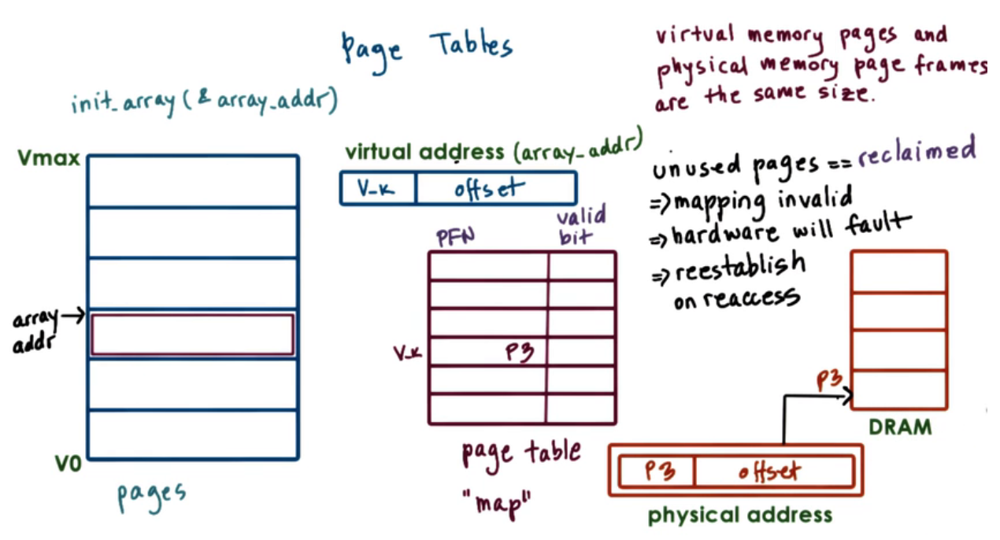
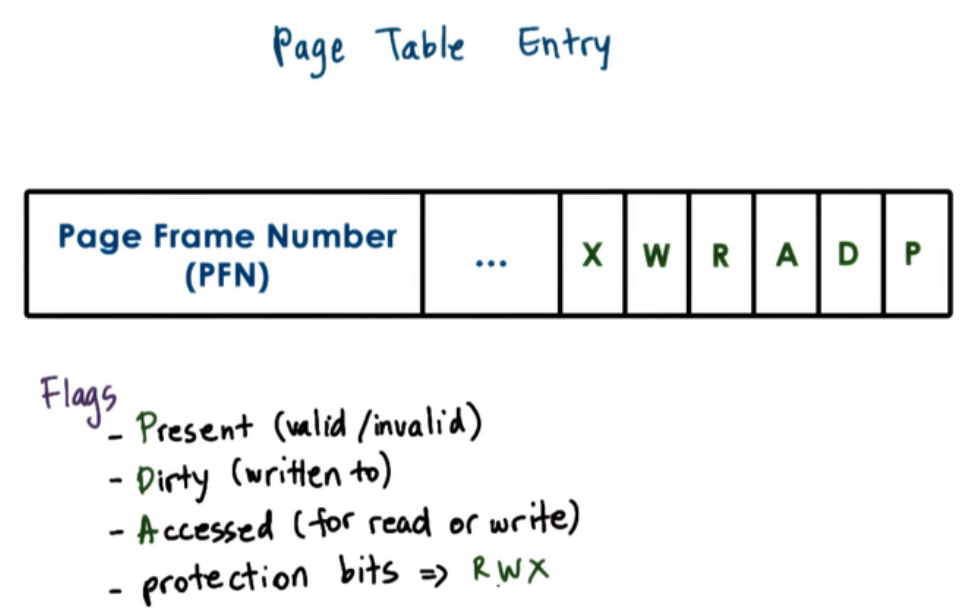
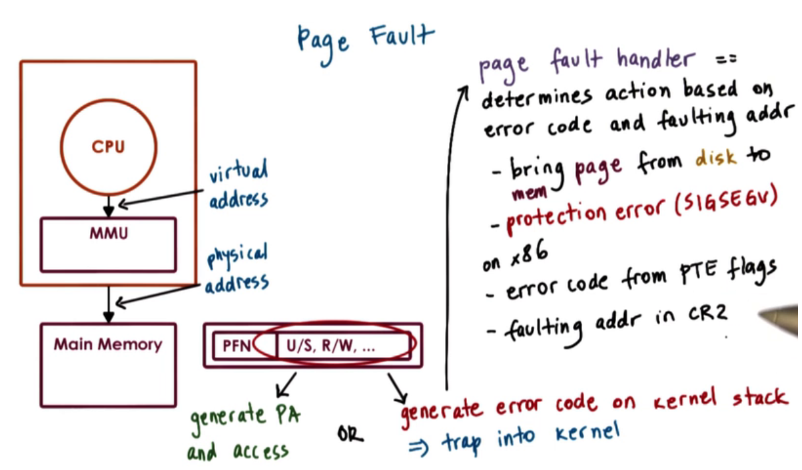
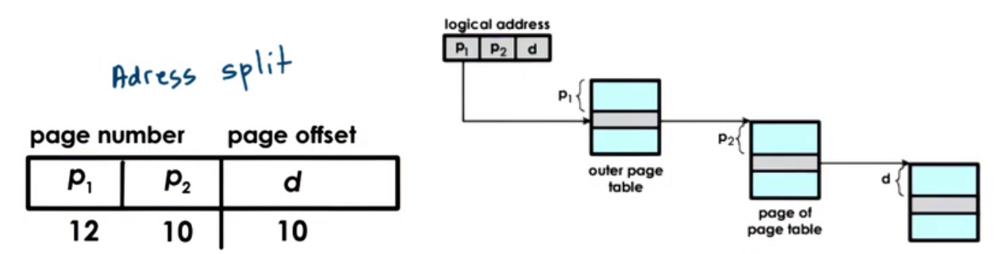
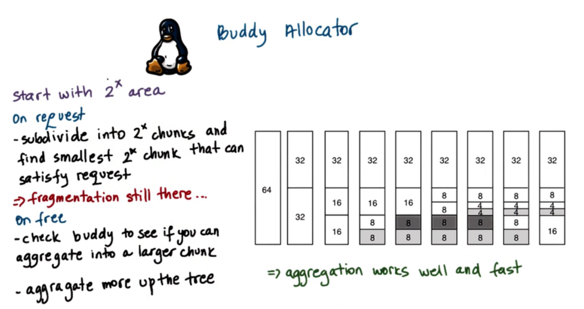
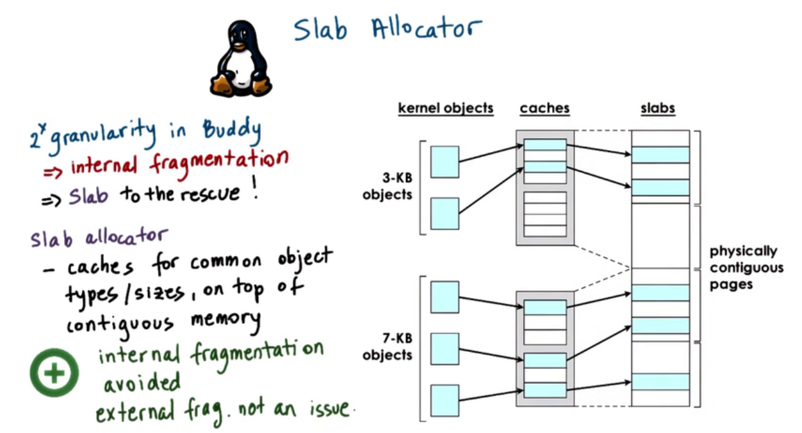

## Concepts

Memory management is supported by both hardware and operating system mechanisms. The hardware performs the actual translation of physical addresses from virtual addresses while the OS maintains the necessary data structures such as page tables.

- OS provides allocation and arbitration for memory management
  - Allocation requires tracking memory usage and what's free, and replacing contents in physical memory with contents from disk.
  - Arbitration requires quick translation of virtual addresses to physical addresses and verification of legal access.
  - Paging and segmentation are two ways for memory management.Paging is the dominant mechanism, where the virtual address space is divided into fixed-size pages that are mapped to page frames in physical memory using page tables.
- Hardware supports memory management
  - The memory management unit (MMU) in a CPU package is responsible for converting virtual addresses to physical addresses.
  - Hardware mechanisms such as designated registers and translation lookaside buffers (TLB) make the memory translation process faster and more efficient.

## PageTable

- Page tables are used to map virtual memory addresses to physical memory addresses.
- Virtual addresses are broken down into virtual page numbers (VPN) and offsets, with the VPN being used to index into the page table to retrieve the physical frame number (PFN).
- Pages are only allocated physical memory when they are accessed, using a technique called "allocation on first touch".
- Page table entries have bits that indicate the validity of the mapping, and if the MMU encounters an invalid mapping, it will trap to the OS to determine if the access should be permitted and where the page should be located.
- Accessing a page that has been swapped out to disk will result in a new page mapping being established.

### Page Table Entry

- Page table entries have a PFN and a valid/present bit to indicate virtual memory presence in physical memory
- Other bits in the page table entry are used by the operating system and hardware for memory management decisions
- Dirty bit is set when a page is written to and is useful for file system caching
- Access bit tells whether the page has been accessed or not
- Protection bits specify whether a page can be read, written, or executed
- The MMU uses page table entries for address translation and access validity determination, generating page faults when necessary

- Page fault handler uses error code and faulting address to determine necessary action
- Error code is generated from page table entry flags and the faulting address is stored in the CR2 register on x86 platforms.

### Page Table Size

- Page table size depends on the number of virtual page numbers in a virtual address space and the size of each entry.
- In a 32-bit architecture, each entry is 4 bytes and we need 2^22 bytes (4MB) to represent the page table.
- In a 64-bit architecture, each entry is 8 bytes and we need 32PB to represent the page table.
- Page tables are a per-process allocation and assume an entry for every VPN, regardless of whether it's needed or not. This can make them unnecessarily large.
- Larger pages use more bits for the offset, resulting in fewer pages and a smaller page table.
- Large pages can lead to fewer page table entries, smaller page tables, and more TLB hits, but also result in internal fragmentation if not densely populated.
- Different system/hardware combinations may support different page sizes, such as 8KB, 4MB, and 2GB for Solaris 10 on SPARC machines.

### Multi Level Page

- The current approach is to use a hierarchical page table structure rather than a flat one.
- The outer level is called the page table directory and contains pointers to page tables rather than individual page frames.
- The inner level contains page tables that point to actual page frames in physical memory.
- Internal page tables only exist for valid virtual memory regions and are dynamically allocated as needed.
- The virtual address is split into components to find the correct element in the page table structure.
- The hierarchical page table can be extended to more levels to reduce the size of page tables and save memory.
- Adding more levels increases translation latency due to more memory accesses required for translation.

### TLB

- The MMU integrates a hardware cache called the translation lookaside buffer (TLB), which is used for address translations and contains all the necessary protection/validity bits to ensure access correctness.
- Even a small number of addresses cached in TLB can result in a high TLB hit rate due to high temporal and spatial locality in memory references.

### Inverted Page Table

- Inverted page tables are managed on a system-wide basis, not on a per-process basis. Each entry in the inverted page table points to a frame in main memory.
- The memory address contains the process id (PID) of the process attempting the memory address, as well as the virtual address and the offset.
- A linear scan of the inverted page table is performed when a process attempts to perform a memory access. 
- Inverted page tables can be supplemented with hashing page tables to speed up the linear search by looking up a hashed address in a hash table.

### Segmentation

- Segmentation can be used in combination with paging, where the linear address produced by the segmentation process is passed to the paging unit to ultimately produce the physical address.
- Segments divide the address space into components of arbitrary size, such as code, heap, data, and stack.
- A virtual address in the segmented memory mode includes a segment selector and an offset. The selector is used in combination with a descriptor table to produce a physical address, which is combined with the offset to describe a precise memory location.

## Allocator

an allocator must allocate memory in such a way that it can coalesce free page frames when that memory is no longer in use in order to limit external fragmentation.

- Kernel level allocators are responsible for allocating pages for the kernel and also for certain static state of processes when they are created - the code, the stack and so forth. 

- User level allocators are used for dynamic process state - the heap. This is memory this is dynamically allocated during the process's execution.

### Buddy Allocator

- The buddy allocator starts with some consecutive memory region that is free that is a power of two. Whenever a request comes in, the allocator subdivides the area into smaller chunks such that every one of them is also a power of two. It will continue subdividing until it finds a small enough chunk that is power of two that can satisfy the request.

- This buddy checking step can continue up the tree, aggregating as much as possible.

- The reason that the chunks are powers of two is so that the addresses of budding only differs by one bit.

### Slab allocator

-  The slab allocator builds custom object caches on top of slabs. The slabs themselves represent contiguously allocated physical memory.

- when an allocation request occurs, it will go straight to the cache and it will use one of the elements in the cache. If none of the entries is available, the kernel will allocate another slab, and it will pre-allocate another portion of contiguous memory to be managed by the slab allocator.

## Paging

### Demand Paging

- Paging or demand paging allows for pages to be stored in secondary storage when not present in physical memory.
- When a page is referenced but not present in memory, a page fault is raised and the kernel retrieves the page from secondary storage.
- Pages can be pinned to maintain their presence in memory and original physical address.
- Pinning is useful for direct memory access devices that do not pass through the memory management unit (MMU).
- The kernel determines the location of a swapped out page on the secondary device and issues an I/O operation to retrieve it.
- Once a page is brought into memory, the OS finds a free frame to place it in and updates the corresponding page table entry with the page frame number (PFN). Control is then handed back to the process and the reference can succeed.

### Page Replacement

- When memory usage reaches a threshold, the OS runs a page-out daemon to free up pages. Pages should be swapped out when memory usage is high and CPU usage is low.
- The Least-Recently Used (LRU) policy is a common algorithm to determine which pages to swap out based on recent usage.
- Pages that do not need to be written out to disk and non-swappable pages can also be considered for swapping.
- In Linux, parameters such as threshold page count and number of pages replaced per time period can be configured, and the default replacement algorithm is a variation of LRU policy.

### Copy on Write

- Copy-on-Write (COW) is a mechanism that avoids unnecessary copying of pages when creating a new process.
- A new process's address space may point to the address space of its parent to save memory and CPU cycles.
- If a write request is issued for a protected page, the MMU will issue a page fault, and the operating system will create a copy of the memory page and update the page table.
- Only the pages that need to be updated will be copied, which is why it's called copy-on-write.

## Distributed Shared Memory

- Distributed shared memory manages memory across multiple nodes to give the illusion of a single shared-memory machine
- Each node owns a portion of the physical memory and provides read and write operations
- Consistency protocols are necessary to ensure meaningful semantics for shared memory access
- DSM enables affordable scaling beyond the limitations of single machines with large amounts of memory
- Network costs may slow down overall memory access, but the right application design choices can mitigate this
- Commodity interconnect technologies, such as RDMA interfaces, have made DSM increasingly relevant.

### DSM Design

In DSM, memory is physically distributed across multiple nodes, and access to memory locations on remote nodes incurs network communication overhead.

- Sharing Granularity: 
  - In SMP (Symmetric Multiprocessor) systems, the granularity of sharing is the cache line.
  - In DSM, generating coherence traffic at the granularity of the cache line will be too expensive.
  - larger granularities such as variable, page, or object can be used to amortize the cost of remote access across these larger granularities
- Access Algorithm:
  - Different types of memory accesses such as single reader/single writer or multiple readers/multiple writers have different consistency and sharing-related challenges
  - The DSM layer should provide the application with the ability to access additional, remote memory while ensuring that reads return the most recent value and all writes are correctly ordered
- Migration and Replication:
  - In the single reader/single writer case, migration can be used to copy the state to a node
  - In the multiple readers and multiple writers case, replication is used to copy the state on multiple nodes, but this requires consistency management
- Consistency Management:
  - In DSM, write-invalidate and write-update coherence operations used in SMP are too expensive, so other strategies like proactive or optimistic approach can be used.

### DSM Architecture

- DSM system consists of nodes, each with their own physical memory, contributing a portion to global shared memory. Every address is identified by node ID and page frame number.
- Home node drives coherence operations related to a page. Home node keeps track of page state, including access, modifications, caching, and lock status.
- Owner node may be different from the home node, and owner can control state modifications.
- Pages can be cached, replicated for load balancing or reliability.
- Manager information for every page is replicated.

### DSM Implementation

- DSM layer intercepts every access to shared memory to detect whether it is local or remote.
- MMU hardware can be leveraged to dynamically engage/disengage DSM layer when necessary. MMU can provide additional information for implementing different consistency policies.
- Accessing a remote address generates a trap to send out the appropriate remote message.
- Cached memory is write-protected to generate coherence messages.
- Object-based DSM system at the language runtime level can leverage underlying OS services or be implemented entirely in software.

### Consistency Model

Consistency models are used in distributed systems to describe how multiple copies of data are synchronized across nodes. The primary goal of these models is to ensure that the system behaves in a predictable way.

- Strict consistency is the strongest consistency model, where all nodes see the same sequence of operations at the same time. all operations appear to be executed in a single global order, which can be achieved through locking or other synchronization mechanisms.

- Sequential consistency is a weaker form of consistency where operations on a single node appear to execute in order, but operations across different nodes may be interleaved in any order. This model allows for some degree of parallelism and is commonly used in multi-core processors.
- Causal consistency is a model that preserves causality between related operations. Specifically, if one operation causally depends on another, then all nodes must see the same order of those two operations. However, if two operations are independent, they can be reordered arbitrarily.
- Weak consistency is the weakest form of consistency, where there is no guarantee that different nodes will see the same order of operations. This model is commonly used in distributed databases where high availability and partition tolerance are more important than consistency.