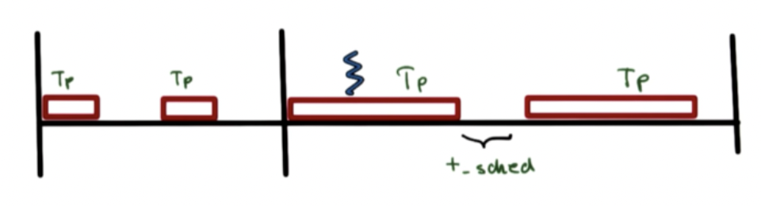
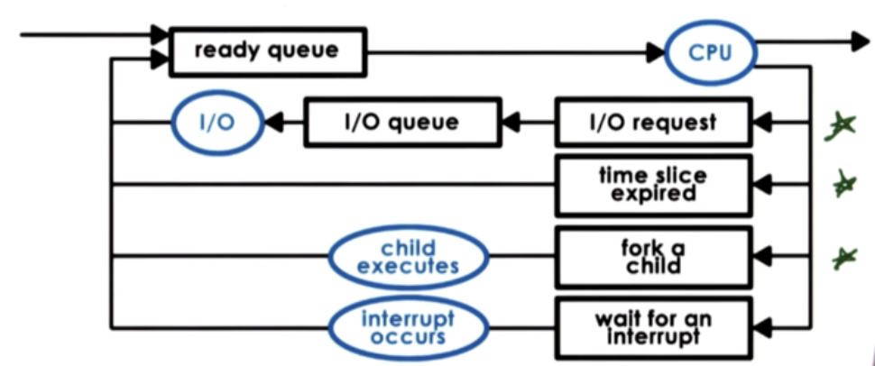
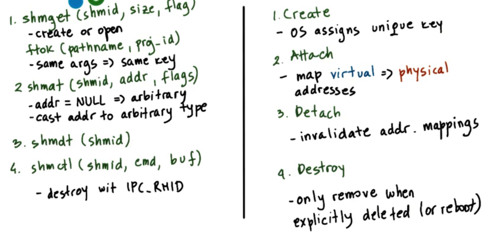
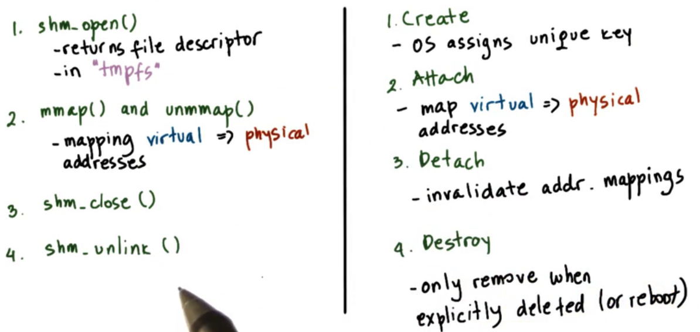
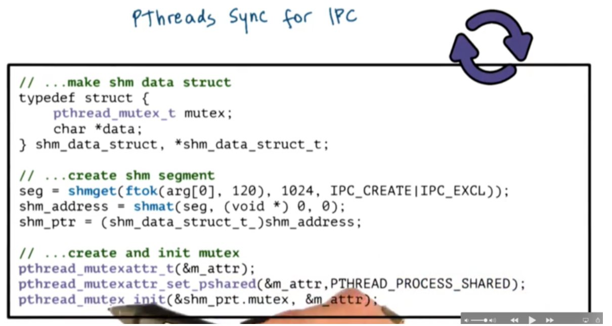

## Process

The **process** is the major OS abstraction of a running program. 

### Address Space

Address space is the memory the process can access

- Code: program code
- Data: static data of program
- Heap: dynamically created to store free variables
- Stack: dynamically created, usually store function variables

- virtual address: Potential range of addresses in process address space go from V_0 to V_max.
- memory mapping: OS creates a mapping between the virtual address and the physical address so that processes can access their data without knowing its physical location.
- dynamically allocated: the stack and heap are dynamically allocated. OS decides dynamically which portion of the process's address space will live in physical memory and which portion will be swapped temporarily to disk.

### Process Management

- program counter (PC): which instruction of the program will execute next
- stack pointer (SP): manage the stack for function parameters
- process control block (PCB): maintain all of this useful information for every single process, including process state, process number, program counter, memory limits, etc.

### Process States

- New: newly created process
- Ready: a process is ready to run
- Running: a process is running on a processor
- Waiting: a process has performed some kind of operation that makes it not ready to run until some other event takes place
- terminated: a process exit and is no longer running on the processor

- Creation: A process can create one or more *child processes*. The creating process is the parent and the created process is the child. All of the processes exist in a tree-like heirarchy
  - Fork: operating system will create a new PCB for the child, and then will copy the exact same values from the parent PCB into the child PCB. Both processes will continue executing with the exact same state at the instruction immediately following the fork
  - Exec: Operating system loads a new program, and the child's PCB will now point to values that describe this new program. The program counter of the child will now point to the first instruction of the new program.
- Context Switch: operating system to switch from one running process to another process.
  - Direct cost: number of cycles for load and store instructions
  - indirect cost: cold cache, cache miss
  - the length of context switch and process determines the efficiency of CPU

- I/O: When a process makes an I/O request, the operating system will deliver that request, and move the process to the **I/O queue** for that particular I/O device.

### Inter Process Communication

- Message Passing IPC: Operating system establishes a communication channel - like a shared buffer
  - OS managed, can use existed system call to handle this
  - may add some overheads
- Shared Memory IPC:  operating system establishes a shared memory channel, and then maps it into the address space of both processes.
  - No overheads incur
  - Need to implement new APIs because OS is out of the way

## Scheduling

### Overview

- The scheduler selects one of the tasks in the run queue and then schedules it on the CPU, the scheduling algorithm decides which task to be selected and the structure of run queue
- A common way that schedulers share time within the system is by giving each task some amount of time on the CPU, which is known to be timeslice
- Once the scheduler selects a task to be scheduled, that task is dispatched onto the CPU. The operating system context switches to the new task, enters user mode, sets the program counter, and execution begins. 

Common metrics to compare schedulers

- throughput
- Average job completion time
- average job wait time
- CPU utilization

Simple scheduling algorithm

- First Come First Serve: tasks are simply scheduled in the order they arrive, maintain a FIFO queue for this
- shortest job first: schedule jobs in order of their ececution time, maintain an ordered queue or a tree structure for the runqueue, where runqueue is a tree and doesn't necessarily to be a queue

### Preemptive Scheduling

- Shortest job first: each task may arrive at different time, when shorter job comes, the current job is preempted to schedule the shorter job. The job execution time can be concluded from the heuristic running time of similar tasks
- priority scheduling: scheduling based on priority
  - starvation: low priority tasks will never run because higher priority tasks continually enter the system and take precedence
  - priority aging: the priority of a task is not just the numerical priority, but rather a function of the actual priority and the amount of time the task has spent in the runqueue. 
  - priority inversion: The high priority task may not run because low priority task hold the mutex, solve this problem by temporarily boost the priority of the mutex owner
- Round Robin scheduling: each task takes turn to run on the CPU, give each task a window of one time unit before interrupting it to schedule a new task.

### Timesharing

A **timeslice** (also known as a time quantum) is the maximum amount of uninterrupted time that can be given to a task.

- CPU bound task: CPU bound tasks prefer longer timeslices as this limits the number of context switching overheads that the scheduling will introduce. This ensures that CPU utilization and throughput will be as high as possible.
- I/O bound task: I/O bound tasks prefer short timeslices. This allows I/O bound tasks to issue I/O requests as soon as possible, and as a result this keeps CPU and device utilization high and well improves user-perceived performance

The runqueue data structure is designed so that the scheduler can easily determine which task should be scheduled next. We can use history based heuristics to determine what a task has done in the past as a way to inform what it might do in the future. 

**multi-level feedback queue**

- When a new task enters the system, we will place it on the topmost queue
- If the task yields before the timeslice has expired, we will place this task back on this queue when it becomes runnable again.
- If the task has to be preempted still, we can push the task down level by level until it yields before expire or reach the bottom level of queues
- If a task in a lower queue begins to frequently release the CPU due to I/O waits, the scheduler may boost the priority of that task and place it in a queue with a smaller timeslice.

### Linux Scheduler

- Linux O(1) Scheduler

  - O(1) complexity: The O(1) scheduler has a constant time complexity, so its performance remains consistent even with a large number of processes.

  - Priority-based scheduling: The scheduler gives higher priority to interactive processes and processes with higher user priorities.

  - Time slice-based algorithm: Each process is given a fair share of CPU time using a time slice-based algorithm.

  - Two priority arrays: The active array contains processes that are currently executing or waiting to execute, while the expired array contains processes that have used up their time quantum.

  - Runqueue data structure: The scheduler uses a runqueue data structure that is optimized for quick access and management of processes.

  - Improved performance and scalability: The O(1) scheduler was designed to provide better performance and scalability for systems with multiple processors.

- Linux CFS Scheduler

  - Fairness: The CFS scheduler strives to provide fair allocation of CPU time to all processes, regardless of their priority or resource requirements.

  - Virtual runtime: The scheduler maintains a virtual runtime for each process, which represents the amount of time it has spent waiting for CPU time.

  - Weighted tasks: Each process is assigned a weight based on its priority and resource requirements, which determines its share of CPU time.

  - Red-black tree data structure: The scheduler uses a red-black tree data structure to keep track of tasks and their virtual runtimes, which allows it to quickly find the next task to schedule.

  - Low-latency responsiveness: The CFS scheduler is designed to provide good responsiveness for interactive tasks, such as user input, while still providing good performance for CPU-bound tasks.

### Multiprocess Scheduling

- Multicore systems have multiple cores within each CPU, each with its own private L1/L2 cache and shared LLC, with DRAM also present.
- The operating system sees all CPUs and cores as entities for task scheduling, aiming to maximize CPU cache usage and cache affinity by scheduling tasks on the same CPU as before.
- Hierarchical scheduling with load balancing is used to divide tasks among CPUs, with each CPU having its own scheduler and runqueue.
- Load balancing across CPUs is achieved by monitoring the length of each runqueue and rebalancing work from the other queues onto an idle CPU.
- NUMA(Non-uniform memory access)-aware scheduling keeps tasks on the CPU closest to the memory node where their state is to maximize memory access speed.

## Inter Process Communicaition

Inter process communication (IPC) refers to a set of mechanisms that the operating system must support in order to permit multiple processes to interact amongst each other.

### Message based IPC

processes create messages and then send and receive them. The operating system is responsible for creating and maintaining the channel that is used to send these messages.

- Negative: request-response interaction between two processes requires a total of four user/kernel crossings and four data copying operations.
- Positive: relative simplicity

The messaged based IPC includes pipes, message queues, and sockets

- pipes: Pipes are characterized by two endpoints, so only two processes can communicate via a pipe
- Message queues: A sending process must submit a properly formatted message to the channel, and then the channel can deliver this message to the receiving process.
- Sockets: The socket API supports send and recv operations that allow processes to send message buffers in and out of the kernel-level communication buffer.

### Shared Memory IPC

processes read and write into a shared memory region. The operating system is involved in establishing the shared memory channel between the processes. 

- Positive: once the physical memory is mapped into both address spaces, the operating system is out of the way
- Negative: the shared memory area can be concurrently accessed by both processes, this means that processes must explicitly synchronize their shared memory operations

### Sysv API

- Operating systems support segments of shared memory that do not need to correspond to contiguous physical pages.
- Shared memory is treated as a shared resource using system-wide policies, with limits on the total number of segments and the total size of shared memory.
- When a process creates a shared memory segment, the operating system allocates the required amount of physical memory and assigns a unique key to identify the segment.
- Multiple processes can attach to the same shared memory segment using this key, and reads and writes to the segment will be visible across all attached processes.
- Detaching a segment invalidates the virtual address mappings for the virtual address region corresponding to that segment within that process.
- Once a segment is created, it is essentially a persistent entity until there is an explicit request for it to be destroyed, unlike memory that is local to a process and reclaimed when the process exits.

### POSIX API

- POSIX shared memory standard uses files instead of segments
- The files live in the tmpfs filesystem which is in physical memory
- Shared memory regions are represented by a bunch of pages in physical memory
- Shared memory is referenced by a file descriptor, eliminating the need for key generation process

### Synchronization

- Mutexes and condition variables can be specified as private or shared among processes using the attribute PTHREAD_PROCESS_SHARED.
- Synchronization variables specified as shared must also reside in shared memory.
- To create a shared memory segment, use ftok to create a segment identifier and then use shmget with specified flags.
- Attach the segment using shmat to get the shared memory address.
- Cast the address to the datatype of the defined struct containing the data buffer and mutex.
- To create the shared mutex, create the mutexattr struct and set the pshared attribute to PTHREAD_PROCESS_SHARED.
- Initialize the mutex using the pointer to the mutex inside the struct that lives in the shared memory region.

- Shared memory accesses can be synchronized using OS-provided mechanisms for inter-process interactions.
- PTHREAD_PROCESS_SHARED option for pthreads isn't supported on every platform, so we need other means of synchronization in those cases.
- Message queues can be used to implement mutual exclusion via send/recv operations.
- Semaphores are an OS-supported synchronization construct with a binary state of 0 or 1, and can be used to block processes or allow them to proceed.

To communicate between two multithreaded processes via shared memory, the following considerations should be taken:

- Determine the number of segments needed to communicate between the processes. Options include using one large segment with a memory manager or having multiple segments, one for each pairwise communication with a queue of segment IDs.

- Decide on the size of the segments. If the size of the data is known up front and is static, then make all segments that size. If arbitrary message sizes are needed, data can be transferred in rounds with a protocol to track the progress of the data movement through the shared memory region.

## Remote Procedure Call

- Remote Procedure Call (RPC) simplifies the development of interactions across address spaces and machines by offering a high-level interface for data movement and communication.
- The RPC model is intended for interprocess communication (IPC) interactions matching client/server interactions and has synchronous call semantics and type checking.
- RPC handles errors that may arise from low-level communication/transmission interactions and hides the complexities of cross-machine interactions.
- RPC systems should hide differences in data type representation between client and server machines and support different types of protocols.
- RPC should incorporate higher-level mechanisms like access control, authentication, and fault tolerance.

### RPC Structure

Client:

- Client can call a function without holding the implementation using RPC.
- Execution jumps to a stub implementation instead of the actual implementation.
- Client stub creates a buffer with the function name and arguments and sends it to the server process.
- Stub code is generated automatically.

Server:

- Packets are received on the server and handed off to the server stub.
- Server stub extracts the information and calls the local function with the given arguments.
- Server sends the result back to the client through an appropriate connection.
- Client function returns and the result of the call is available.

Steps:

- Bind: Binding occurs in the first step to establish a connection between the client and server.
- Call: Client makes the actual RPC call in the second step, control passed to stub, client code blocked
- Marshall: Client stub creates a data buffer and populates it with the arguments using marshaling.
- Send: RPC runtime sends the message to the server.
- Receive: Server receives message, passes message to serve stub
- Unmarshall: Server stub unmarshalls the data and populates the appropriate data structures.
- Actual Call: Procedure call is made with the implementation in the server process.
- Result: Server computes the result and passes it to the server-side stub to be returned to the client.

### Interface Design Language

- RPC allows client and server to be written in different programming languages by different developers.
- An agreement is needed for the server to explicitly state the procedures it supports and arguments it requires, which is expressed through an interface definition language (IDL).
- IDL describes the server interface, including procedure names, argument types, result types, and version numbers.
- IDL can be language-agnostic (e.g., SunRPC's XDR) or language-specific (e.g., Java RMI).
- The IDL is used solely to define the interface and generate stubs, but not for implementing the service.

### RPC Details

- Marshaling: Marshaling is a process of encoding data into an agreed-upon format for interpretation by the server.

  - In a client-server model, when a client calls a function with arguments i and j, the data needs to be sent as a contiguous buffer to the server over a socket.

  - The marshaling code generates this buffer, which includes a descriptor for the procedure and the necessary arguments.

  - The encoding layout specifies how the data will be serialized into a byte stream.

- Unmarshalling code extracts correct chunks of bytes from buffer for argument types

  - Initializes data structures corresponding to argument types
  - variables allocated in server address space with values from client's buffer

- Binding
  - Binding determines which server to connect to based on service name and version number Binding also determines how to connect to server, including IP address and network protocol
  - Registry maintains database of available services and serves as a yellow pages for services 
  - Registry provides contact information including IP address, port, and transport protocol
  - Registry can be distributed online platform or dedicated process on server machine
  - Registry requires naming protocol, can be simple or sophisticated to consider synonyms.

### SunRPC

SunRPC is an RPC package originally developed by Sun in the 1980s for UNIX systems.

- SunRPC assumes the server machine is known up front, with one registry per machine
- SunRPC uses a language-agnostic IDL, XDR, for interface and data type encoding
- SunRPC allows use of pointers and serializes pointed-to data
- SunRPC supports mechanisms for dealing with errors, including a retry mechanism with user-specified retry count

Sun RPC relies on a language-agnostic IDL - XDR - which is used both for the specification of the interface and for the specification of the encoding of data types.

- The .x file specifies datatypes and procedures for the RPC service The .x file also specifies a service ID, a version ID for the procedure, and a service name
- To generate C stubs from the .x file, run "rpcgen -C <interface>.x" Generated files include <interface>.h, <interface>_svc.c, <interface>_clnt.c, and <interface>_xdr.c. <interface>_svc.c contains code for server-side stub and includes registration code. <interface>_clnt.c contains code for client-side stub and includes a wrapper function for RPC calls to server-side process
- The developer must implement the actual procedure invoked in the server process
- To generate thread-safe code, use "rpcgen -C -M <interface>.x"

Registry: In SunRPC, the registry process runs on every machine, and is called **portmapper**.

- Autogenerated code is needed for the server to register with the registry as part of the rpcgen compilation step.
- Portmapper needs to be contacted by both the server and client.
- To check the services running with the RPC daemon, use "/usr/sbin/rpcinfo -p". This command will return program id, version, protocol, socket port number, and service name for each service running on the machine.
- Portmapper is registered with TCP and UDP protocols on socket 111.
