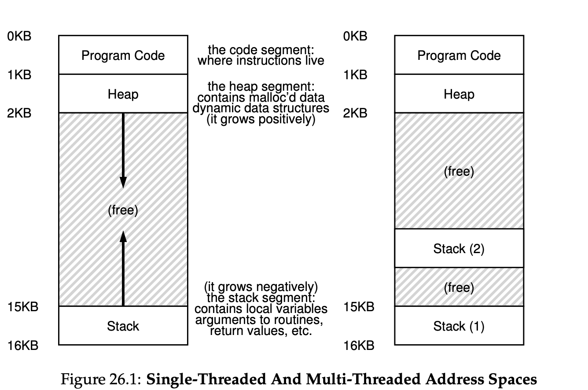
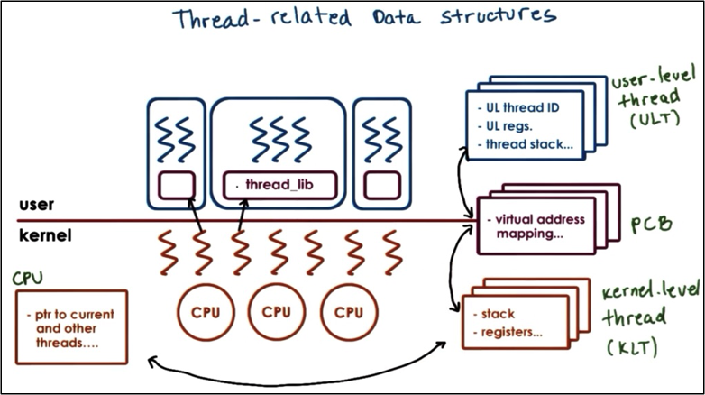
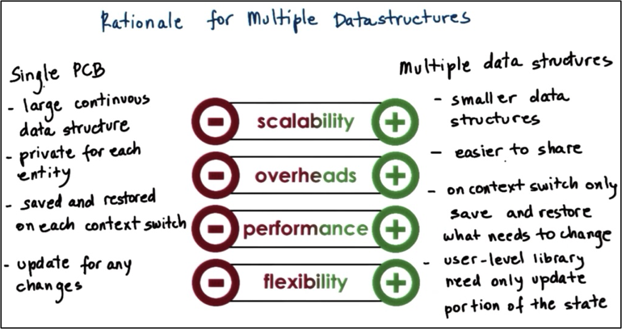
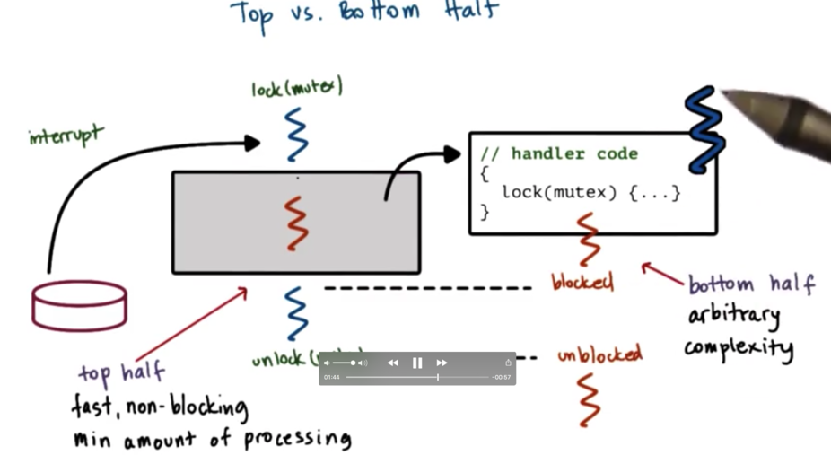
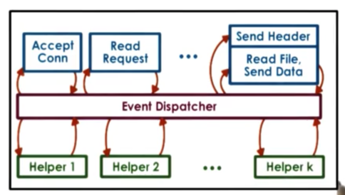
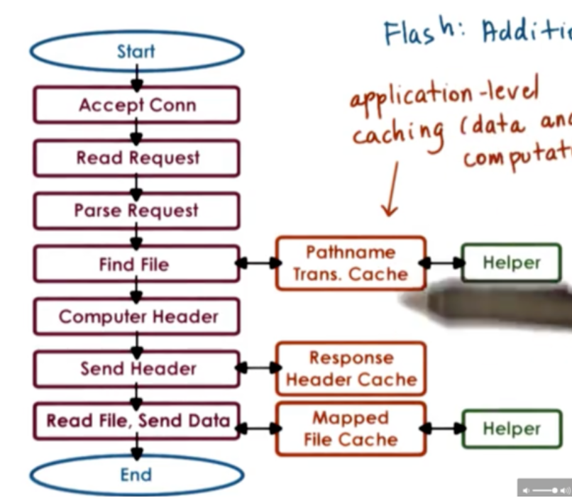
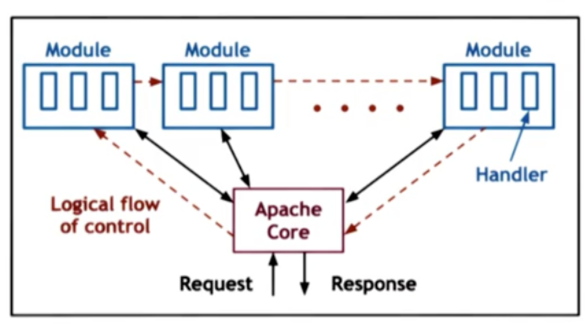

## Thread

- Shared address space (heap, program code)
- Separated execution context (stack, stack pointer, program counter)



### Benefit

- different threads can work in parallel on different components of the program's workload.

- designate certain threads to accomplish only certain tasks or certain types of tasks

- thread keep it's entire state within the processor cache (hot cache) and doesn't need to do page table switch in context switch, enhancing the speed at which the thread continuously performs it task.

### Thread Creation

- Fork: fork(proc, args) creates a thread with proc to run and args to pass to proc
- join: thread will be blocked until the child thread is finished processing

### Linux Tasks

Linux use task to represent an execution context. A task is the execution context of a kernel level thread

- A task(thread) is identified by `pid_t pid` and a process is identified by `pid_t tgid`
- task structure maintains a list of all tasks, and its head is identified by `struct list_head tasks`
- `clone ` creates new tasks and give its `sharing_flags`, which denotes the state of a task be shared betweem the parent and childs 

## Thread Synchronization

- Mutual exclusion: when the lock work, it prevents multiple threads from entering a critical section
- Fairness: each thread contending for the lock get a fair shot at acquiring it once it is free
- Performance: the time overheads added by using the lock

### Spinlock

- Spinlocks are a basic synchronization primitive that can be used to implement more complicated synchronization constructs.
- When a thread attempts to lock a spinlock, it spins and repeatedly checks the lock until it becomes free.
- We need the checking of the lock value and the setting of the lock value to happen **atomically**, so that we can guarantee that only one thread at a time can successfully obtain the lock.
  - test_and_set
  - read_and_increment
  - compare_and_swap

### Mutex

A **mutex** is like a lock that should be used whenever you access data/state that is *shared* among threads.

```
lock(mutex);
// critical section
unlock(mutex);
```

### Condition Variable

A **condition variable** is a construct that can be used in conjunction with mutexes to control the execution of concurrent threads

- wait: passing in a mutex and the condition variable it must wait on.
- signal: allows a thread to signal to another thread waiting on a condition that the condition has been met.
- broadcast: allows a thread to signal to all other threads waiting on a condition that the condition has been met.

Wait Structure: 

```
Wait(mutex, cond){
	// automatically release mutex and put thread on wait queue
	// ...
	// wait
	// ...
	// remove thread from wait queue
	// reacquire mutex
	// exit wait
}
```

### Semaphores

- Semaphores allow us to express count related synchronization requirements. Semaphores are initialized with an integer value.
- Threads arriving at a semaphore with a nonzero value will decrement the value and proceed with their execution. Threads arriving at a semaphore with a zero value will have to wait.
- The number of threads that will be allowed to proceed at a given time will equal the initialization value of the semaphore.
- When a thread leaves the critical section, it signals the semaphore, which will increment the semaphore's counter.
- If a semaphore is initialized with a 1, a binary semaphore is created which behaves like a mutex, only allowing one thread at a time to pass.

API call:

- Sem_wait(): decrement the value of semaphore s by one, wait if value of semaphore s is negative
- Sem_post(): increment the value of semaphore s by one, if there are one or more threads waiting, wake one

```c
// producer-consumer problem
void *producer(void *arg) {
  	int i;
  	for (i=0; i<loops; i++) {
      	sem_wait(&empty);
      	sem_wait(&mutex);
      	put(i);
      	sem_post(&mutex);
      	sem_post(&full);
    }
}
void *consumer(void *arg) {
  	int i;
  	for (i=0; i<loops; i++) {
      	sem_wait(&full);
      	sem_wait(&mutex);
      	int temp = get();
      	sem_post(&mutex);
      	sem_post(&empty);
      	printf("%d\n", tmp);
    }
}
```

### Reader Writer Lock

- Reader/writer locks are useful for distinguishing between read and write access to a shared resource. They provide access control for read/write access behind the scenes.
- They have a similar API to mutexes but are specified for read and write access.
- The Linux API for reader/writer locks includes the rwlock_t datatype and lock/unlock operations for both reads and writes.
- The implementation details may vary, such as how recursively-obtained read locks are unlocked and whether readers can upgrade to writer locks mid-execution. Some implementations block incoming readers if there is a writer already waiting, while others allow readers to acquire their lock.

Realized with condition variable: 0 or more readers can access the shared state at a given time, and 0 or 1 writers can access the shared state at a given time.

- Resource counter = 0: resource is free, both read and write are ok
- Resource counter > 0: reader exist, read is ok, write is not permitted
- Resource counter < 0: writer exist, neither read nor write is permitted

```
// Reader
Lock(counter_mutex){
	while(resource_counter == -1)
		Wait(counter_mutex, read_phase);
	resource_counter++;
}
// ... read data ...
Lock(counter_mutex){
	resource_counter--;
	if(readers == 0)
		Signal(write_phase);
}
```

```
// Writer
Lock(counter_mutex){
	while(resouce_counter != 0)
		Wait(counter_mutex, write_phase);
	resource_counter--;
}
// ... write data ...
Lock(counter_mutex){
	resource_counter = 0;
	Broadcast(read_phase);
	Signal(write_phase);
}
```

Realize with semaphore

```c
// reader-writer problem
typedef struct _rwlock_t {
  	sem_t lock;      // binary semaphore (basic lock)
  	sem_t writelock; // allow ONE writer/MANY readers
  	int   readers;   // #readers in critical section
  	rwlock_t;
void rwlock_init(rwlock_t *rw) {
  	rw->readers = 0;
  	sem_init(&rw->lock, 0, 1);
  	sem_init(&rw->writelock, 0, 1);
}
void rwlock_acquire_readlock(rwlock_t *rw) {
    sem_wait(&rw->lock);
    rw->readers++;
    if (rw->readers == 1) // first reader gets writelock
      	sem_wait(&rw->writelock);
    sem_post(&rw->lock);
}
void rwlock_release_readlock(rwlock_t *rw) {
    sem_wait(&rw->lock);
    rw->readers--;
    if (rw->readers == 0) // last reader lets it go
      	sem_post(&rw->writelock);
    sem_post(&rw->lock);
}
void rwlock_acquire_writelock(rwlock_t *rw) {
  	sem_wait(&rw->writelock);
}
```

### Other Structure

- Monitors are a higher-level synchronization construct that allows developers to avoid manually invoking synchronization operations. Monitors specify a shared resource, entry procedures, and potential condition variables used to wake up waiting threads.
- Serializers allow developers to define priorities and hide the need for explicit signaling and explicit use of condition variables from the programmer.
- Path Expressions require developers to specify a regular expression that captures the correct synchronization behavior.
- Barriers and Rendezvous Points wait for multiple threads to arrive at a particular point in execution.
- Wait-free synchronization constructs are optimistic and aim to achieve concurrency without explicitly locking and waiting. Examples of wait-free synchronization constructs include read-copy-update (RCU) lock.

### Common Pitfall

- spurious wake-ups: unnecessarily wake up a thread when there is no possible way for it proceed

- deadlock: deadlock occurs when two or more competing threads are waiting on each other to complete, but none of them ever do.
  - maintain the lock order
  - detect deadlocks and recover from them by analysis of the wait graph
  - apply the ostrich algorithm by doing nothing, if deadlock then reboot

### Shared Memory Multiprocessor

- A multiprocessor system consists of more than one CPU and a shared memory unit. Shared memory multiprocessors are also called SMPs. There are two types of configurations: interconnect-based and bus-based
- Each CPU in an SMP has a cache. Accessing data in the cache is faster than accessing data in main memory
  - No write: A write will go directly to main memory, and any cache references will be invalidated. 
  - Write through: the CPU write may be applied both to the cache and in memory
  - Write back: apply the write immediately to the cache, and perform the write in main memory at some later point in time
- Non-cache-coherent (NCC) architectures require software intervention to ensure cache coherence between multiple CPUs.
- Cache-coherent (CC) architectures use hardware to ensure cache coherence.
  - Write Invalidate invalidates all cache entries of X once one CPU updates its copy. WI reduces the bandwidth requirements on the shared interconnect, and X can change multiple times before it needs to be updated on another CPU.
  - Write update updates all cache entries of X once one CPU updates its copy. WU ensures immediate availability of X on other CPUs that need to access it.
- atomic instructions on SMP systems are more expensive than on single CPU system because of bus or I/C contention

- atomics in general are more expensive because they bypass the cache and always trigger coherence traffic.

### Queuing Lock

- The queuing lock controls which threads see that the lock is free at which time. The queuing lock uses an array of flags with up to n elements, one for each thread in the system.
- Each element in the array has one of two values: has_lock or must_wait.
- When a new thread arrives at the lock, it receives a ticket corresponding to its position in the queue. The thread spins as long as the value of its corresponding element in the flags array is must_wait.
- When the value of the element becomes has_lock, the thread can attempt to enter its critical section.
- The queuelast pointer must be incremented atomically to handle multiple threads arriving at the lock simultaneously.
- Releasing the lock requires signaling the next thread by setting the corresponding element in the array to has_lock.
- The queuing lock requires more space than other locks because it needs n memory locations, one for each thread in the system.
- The queuing lock requires support for the read_and_increment atomic, which is less common than test_and_set.

## Pthread

### Creation

```c
int pthread_create(pthread_t *thread, const pthread_attr_t *attr, void * (*start_routine)(void *), void *arg);
int pthread_attr_init(pthread_attr_t *attr);
int pthread_attr_destroy(pthread_attr_t *attr);
pthread_attr_{set/get}{attribute};
```

- `pthread_t`: a thread identifier and will describe a thread
- `pthread_attr_t`: set various options such as stack size, shceduling policy, inheritance, etc. (init the attr variable)
- Start routine: a starting function for new thread
- arg: the argument for starting function
- return value: whether the thread creation is successful or not

```c
int pthread_join(pthread_t thread, void **status);\
```

- Take the thread to be joined and status variable about the thread status
- return an interger whether the join is successful or not

```c
int pthread_detach(pthread_t thread);
```

- A detached thread can not be joined to the parent, allowing the parent to exit early and child to continue execution

### Mutex

```c
int pthread_mutex_lock(pthread_mutex_t *mutex);
int pthread_mutex_unlock(pthread_mutex_t *mutex);

int pthread_mutex_init(pthread_mutex_t *mutex, const pthread_mutexattr_t *attr);
int pthread_mutex_destroy(pthread_mutex_t *mutex);
```

- Mutual exclusion ensures that only a thread at a time can access the shared variables
- `pthread_mutex_t`: mutex identifier
- Mutex must be initialized before use, and destroyed after use

```c
int pthread_mutex_trylock(pthread_mutex_t *mutex);
```

### Condition Variable

```c
int pthread_cond_init(pthread_cond_t *cond, const pthread_condattr_t *attr);
int pthread_cond_destroy(pthread_cond_t *cond);

int pthread_cond_wait(pthread_cond_t *cond, pthread_mutex_t *mutex);
```

- `pthread_cond_t`: condition variable identifier
- init condition variable before use, destroy it after use
- `pthread_cond_wait`: call to wait on a condition variable

## Multithreading

- kernel-level thread: Kernel level threads are visible to the kernel and are managed by kernel level components like the kernel level scheduler. Operating system itself is multithreaded
- User-level thread: the processes themselves are multithreaded. There is a user level library linked with the application

### Multithreading Models

- One-to-one model: each user level thread has a kernel level thread associated with it
  - convenient: operating system can see the user level threads. the user libraries can benefit directly from the multithreading support available in the kernel
  - expensive: for every operation we must go to the kernel and pay the cost of a system call
- Many-to-one model: all of the user level threads for a process are mapped onto a single kernel level thread
  - portable: Everything is done at the user level, which frees us from being reliant on the OS limits and policies
  - ignore application need: If the user level library schedules a thread that performs some blocking operation, the OS will block the entire process
- Many-to-many model: some user threads to have a one-to-many relationship with a kernel thread
  - get the best of both worlds
  - requires extra coordination between the user- and kernel-level thread managers

### Design Pattern

- Boss-Worker Pattern: The boss/workers pattern is characterized by having one boss thread and some number of worker threads.
  - Boss assign tasks: keep track of which workers are currently working, and send a direct signal to a worker that is idle. workers do not need to synchronize, but boss needs to do extra work.
  - Producer-consumer queue: the boss is the sole producer, while the workers are consumers. boss doesn't need to know the details, but need extra synchronization.
  - how to assign workers: first option is to use a worker pool, but it ignores the variant of different threads; second option is to have different workers seecialized for different tasks, but it needs to do extra work for load balancing

- Pipeline Pattern: the overall task is divided into subtasks and each of the subtasks are assigned a different thread
  - A key benefit of this approach is specialization and locality
  - A downside of this approach is that it is difficult to keep the pipeline balanced over time
- Layer Pattern: similar subtasks are grouped together into a "layer" and the threads that are assigned to a layer can perform any of the subtasks in that layer
  - we can have specialization while being less fine-grained than the pipeline pattern
  - it may not be suitable for all applications and that synchronization may be more complex as each layer must know about the layers above and below it to both receive inputs and pass results.

### Thread Data Structures

- Process Control Block(PCB): process infomation is stored in PCB, including stack, registers, address mapping
- User-level thread data structure: user-level thread ID, user-level thread registers, user-level thread stack
- Kernel-level thread data structure: kernel-level stack, kernel-level register pointer



- hard process state: relevant for all user level threads in a given process
- light process state: only relevant for a subset of user level threads associated with a particular kernel level thread

Single PCB vs Multiple data structures:



### Thread Management

The kernel level thread and user level library have no insight into one another. The kernel exposes system calls and special signals to allow the kernel and user level library to interact and coordinate

- Kernel: kernel level threads, CPU, kernel level scheduler
- User: userlevel threads, available kernel level threads

## Signal and Interrupt

### Definition

- Interrupts: Interrupts are events that are generated **externally** by components other than the CPU to which the interrupt is delivered. Examples like I/O devices, Timer, Other CPU
  - Device send interrupt to CPU by sending a signal through interconnect (use MSI to connect the device to CPU)
  - CPU looks up the interrupt number in a table to find the handler
  - Interrupt handler handle the interrupt
- Signal: Signals are events that are triggered by the CPU and the software running on it.
  - For each process, OS maintains a mapping for the signal number to the handler
  - When signal is generated, PC is adjusted to point to the start address of handler
  - Handler handle the signal

### Disable Interrupt/Signal

Disable interrupt/signal: when the handler is called, the stack pointer will remain the same, meaning we could still hold the lock of mutex, which may cause deadlock if the handler try to lock the mutex again. Therefore, we use signal/interrupt mask to disable interrupt/signal

- When an signal/interrupt occurs, first check the mask to see whether the interrupt/signal is enabled
- If enabled, call the handler, else pending the interrupt/signal until the mask changes
- Before acquiring the mutex, disable interrupt/signal, and enable interrupt/signal after releasing mutex

### Interrupt/Singal Mask

- Interrupt masks are maintained on per CPU basis, which means CPU handle the interrupt; A multicore system usually has at least one CPU interrupt enabled


- Singal masks are maintatined per execution context, which means OS kernel will handle the signal


### Interrupt handling

To avoid deadlock situation, have handler code exist in its own thread

- Kernel pre-creates and initializes thread structures for interrupt routines to eliminate the cost of dynamic thread creation
- Only create a new thread if we may have the deadlock



- Top half of signal handling occurs in the context of interrupted thread, must be fast and non-blocking
- After creating new thread to handle the interrupt, the botton half can contain arbitrary complexity

### Signal Handling

- One-shot signal: signals that will only interrupt once, n signals look like one signal. One-shot signal must be explicitly re-enabled every time
- Real-time signal: signals that will interrupt as many times are they are raised. n signals will call n times handler

Both user and kernel have signal masks, when a signal occurs, the kernel checks the kernel signal mask and send the signal to corresponding user thread

- If kernel and user both enable signal, kernel wil send the signal to the user thread
- If the kernel enable the signal, but one of corresponding user threads disable signal, the library will invoke the scheduler to swap in another thread that can handle the signal
- If the kernel sends the signal but no corresponding user thread enable signal, the library will send a signal back another kernel thread whose corresponding user thread has the signal enabled to handle the signal
- If no user threads enable the signal, the user library will call system calls to disable kernel signal; After user thread enable signal, the user library will call system call again to enable kernel signal

## Thread Performance

### Performance Metric

- Execution time
- throughput
- request rate
- CPU utilization

### Event-Driven Model

- Reasons: One execution context process multiple requests, no context switch until a wait is necessary

- Implementation: Sockets and files are represented by file descriptors, `select` and `poll` system calls can scan the list of file descriptors and returns the first descriptor that has input on it.



- Event dispatcher: in a loop looks for incoming events and based on the events invokes registered handlers
- Event handler: handle different types of events
- Helper: use asynchronous I/O calls to avoid waiting for I/O; when a handler needs to initiate an I/O that can block, handler passes the call to the operation to a helper and returns to the event dispatcher; helper communicate through pipe or socket

### Web Server

- Flash web server: an event-driven web server followed AMPED(Asymmetric Multi-Process Event-Driven) model
  - asymmetric helper process to help with blocking I/O operation
  - Communication from helpers to event dispatcher is performed via pipes
  - application level caching is performed at multiple handler levels(data and computation can both be cached)



- Apache web server: a combination of a multiprocess and multithreaded model
  - each instance is a process, implements a multithreaded boss/workers configuration with a dynamic thread pool
  - total number of processes can be dynamically adjusted depending on number of outstandinug requests/connections



