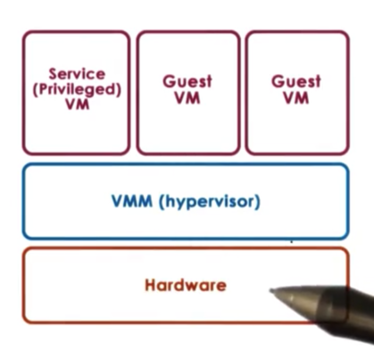
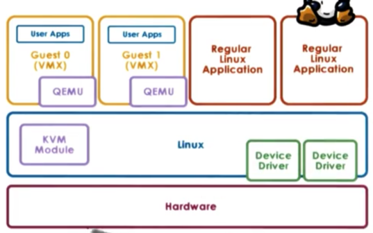
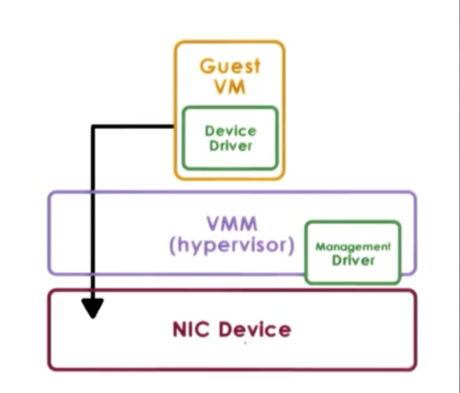
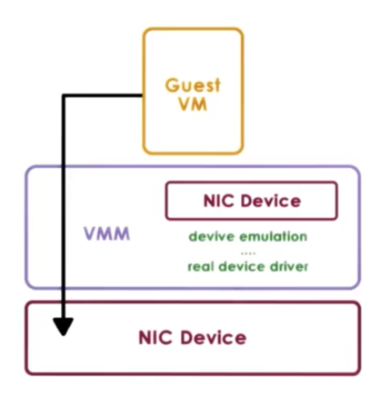
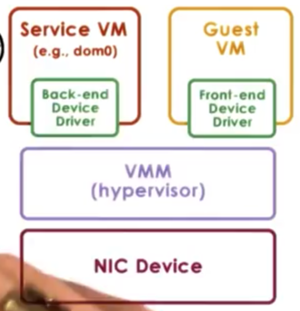

## Introduction

- Virtualization allows multiple operating systems to concurrently run on the same physical hardware platform. Each operating system and its applications, along with its virtual resources, are referred to as a virtual machine (VM).
- The virtualization layer, also called a virtual machine monitor or hypervisor, provides functionality to manage the allocation and management of real hardware resources. The hypervisor also provides isolation guarantees across VMs.

Virtualization is supported by the virtual machine monitor (VMM). 

- First, the VMM must provide an environment that is essentially identical to the original machine.
- Second, programs that run in VMs must show at worst only minor decreases in speed.
- Finally, the VMM is in complete control of the system resources.

### Benefits

- Virtualization enables consolidation by running multiple virtual machines on a single physical platform, leading to cost reduction and improved manageability.
- Virtualization makes migration easier by decoupling the operating system and applications from the physical system, allowing for easy setup, teardown, and cloning of virtual machines.
- Virtualization improves availability and reliability by allowing for easy migration of virtual machines to a different physical platform in case of hardware failure.
- Virtualization encapsulates OS and applications in VMs, making it easier to contain bugs or malicious code without affecting other VMs or the physical platform.
- Virtualization facilitates operating systems research by allowing for quick boot-up and testing of OSes in development without restarting hardware.
- Virtualization provides affordable support for legacy operating systems by allowing them to run as one VM of many, sharing physical resources with other applications.

## Virtualization Models

### Bare Metal

- Bare-metal virtualization (type 1 virtualization) is a model where the VMM manages hardware resources and supports VMs.
- In this model, the hypervisor must manage all possible devices, which can be problematic for device manufacturers who have to provide drivers for different hypervisors.
- The hypervisor model integrates a service VM that runs a standardized OS with full hardware access privileges to manipulate hardware natively. The service VM runs all device drivers and controls how the devices on the platform are used.
- Xen and ESX hypervisors use this model, where all device drivers run in a privileged domain referred to as dom0.

### Hosted

- The hosted (type 2) virtualization model has a full-fledged host OS that manages hardware resources and integrates a VMM responsible for providing VMs with their virtual platform interface.
- The VMM module invokes device drivers and other host components as needed, and the host OS can run both guest VMs and native applications.
- This model can leverage all services and mechanisms developed for the host OS, reducing the functionality needed for the VMM module.
- Kernel-based VM (KVM) is an example of the hosted model built into Linux, providing physical hardware management and the ability to run regular Linux applications directly.
- KVM uses a combination of the KVM module and a hardware emulator called QEMU to support running guest VMs.
- QEMU acts as a virtual interface between the VM and the physical hardware and intervenes only during certain critical instructions, such as I/O management.

## Processor Virtulizaiton

### Hardware Protection

- Commodity hardware has multiple protection levels, with x86 architecture having four protection levels called rings.
  - Ring 0 is the highest privilege level, and it is where the operating system resides in a native model, while ring 3 is the least privileged and where applications reside.
  - In virtualization, the hypervisor sits in ring 0, pushing the OS to ring 1 and leaving applications at ring 3.
- More recent x86 architectures have introduced root and non-root protection modes, each with its own four rings.
  - When running in root mode, everything is permitted, with the hypervisor residing in ring 0.
  - In non-root mode, certain operations are not allowed, and guest VMs operate in this mode, with their OS in ring 0 and their applications in ring 3.
  - Attempts by the guest OS to perform privileged operations cause VMExits, triggering a switch to root mode and control to the hypervisor.
  - After the hypervisor completes its operation, it passes control back to the virtual machine with a VMEntry, which switches out of root mode.

### Vituralization Mechanism

- Guest instructions are executed directly by hardware without VMM interference. Guest OS operates within allocated resources and instructions operate at hardware speeds.
- Privileged instruction causes a trap to the hypervisor. Hypervisor determines if the operation is allowed and provides necessary emulation if needed. Hypervisor intervention must be invisible to the guest OS.

### Binary Translation

- Binary translation is used to avoid certain hardware instructions when running a virtual machine (VM). The goal is to run unmodified guest operating systems for full virtualization.
- The virtualization layer intercepts and translates instruction sequences that may contain bad hardware instructions at runtime. 
- Code blocks without bad instructions are marked as safe and allowed to execute at hardware speeds. Bad instructions are translated into alternate instruction sequences that emulate the desired behavior.
- Binary translation adds overhead, which can be reduced by caching translated code fragments and only analyzing kernel code.

### Paravirtualization

- Paravirtualization is an approach that prioritizes performance over unmodified guests.
- In paravirtualization, the guest OS is aware that it is running in a virtualized environment.
- Paravirtualized guests make explicit calls to the hypervisor for desired behavior via hypercalls, similar to system calls.
- The hypervisor performs the required operation with the data supplied by the guest and passes control back to the guest.

## Memory Virtualization

### Full Virtualization

- Full virtualization requires that the guest OS observes a contiguous, linear address space that starts from address zero. Three types of addresses are used: virtual, physical, and machine addresses.
- Map virtual address to physical address, then to machine address
  - The guest OS maps virtual addresses to physical addresses, and the hypervisor maps physical addresses to machine addresses. 
  - The MMU and TLB help with address translation at the hardware level.
- Using hardware components for address translation is expensive, so another option is for the hypervisor to maintain a shadow page table. 
  - In the shadow page table, the hypervisor remaps virtual addresses to machine addresses without considering physical addresses.
  - The hypervisor must maintain consistency between the shadow page table and the guest's page table and write protect the page table to keep track of new mappings.

### Paravirtualizaiton

- Paravirtualization doesn't require the guest OS to have a contiguous physical memory starting from 0.
- The guest OS can register its page tables with the hypervisor, eliminating the need for two page tables.
- The guest can't have write permissions to this page table to avoid memory corruption, so every write causes a trap to the hypervisor.
- The guest can batch page table updates into a single hypercall to amortize the cost of the VM exit.

## Device Virtualization

### Passthrough Model

- Passthrough model involves VMM-level driver configuring access permissions to a device for a guest VM
- Guest VM has exclusive access to the device and can directly access it without VMM interaction
- Problem: difficult to share devices across VMs and requires continuous reassignment of device ownership
- Device driver in guest VM directly controls the device, requiring the same type of device on the physical platform as the guest OS expects
- Passthrough model breaks the decoupling of guest VMs from physical hardware, making migration across nodes difficult and reintroducing migration complexity.

### Hypervisor Direct Model

- The hypervisor translates the device access request to a generic representation of an I/O operation for a particular family of devices. The hypervisor then traverses the I/O stack to finally invoke the actual real device driver.
- The model decouples the VM from the physical platform/device, making migration easy and device sharing possible.
- However, the device emulation step adds latency to device accesses. This model requires that the hypervisor supports all drivers, exposing it to the complexities and complications of various device drivers.

### Split Device Driver Model

- In the split device driver model, a component in a guest VM and a component in a hypervisor layer control device accesses.
- The front-end driver is modified to wrap device operations in a standard format to be delivered to the back-end driver residing in the service VM or host.
- This model can only be used in paravirtualized guests.
- Benefits include elimination of device emulation overhead and better management of shared devices through the centralized back-end component.

## Hardware Virtualization

- AMD Pacifica and Intel Vanderpool are virtualization-friendly architectures created in 2005.
- The 17 non-virtualizable hardware instructions were fixed to cause a trap and pass control to the hypervisor in privileged mode.
- Protection mode was introduced with "root" and "non-root" modes (host and guest).
- Support was added for hardware to interpret the state of virtual processors and capture it in a VM control block.
- Memory structures were tagged with different VM identifiers for context switches.
- Hardware support for I/O virtualization was added, including multiqueue devices and better interrupt routing.
- New instructions were added to x86 to implement these features, including one for switching into new protection mode.