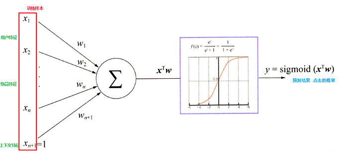
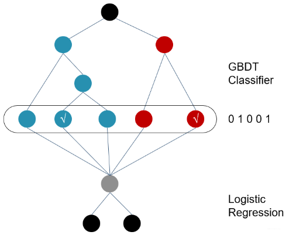
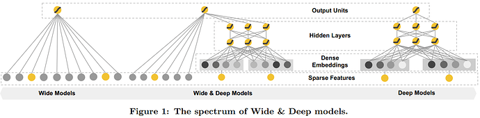
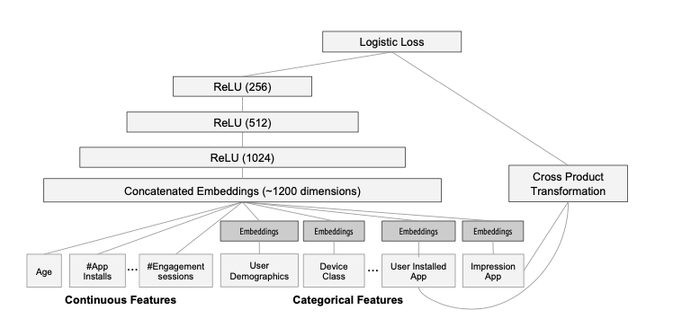

## 概述

对用户而言，推荐系统是一种帮助用户快速发现有用信息的工具，对公司而言，一种帮助用户快速发现有用信息的工具

目前工业界常用的推荐系统分为召回、排序两个模块，召回阶段负责将海量的候选集快速缩小为几万到几千的规模；而排序层则负责对缩小后的候选集进行精准排序。

• **召回层：** 待计算的候选集合大、计算速度快、模型简单、特征较少，尽量让用户感兴趣的物品在这个阶段能够被快速召回，即保证相关物品的召回率

• **排序层：** 首要目标是得到精准的排序结果。需要处理的物品数量少，可以利用较多的特征，使用比较复杂的模型

对于召回层而言，目前常用的召回技术包括多路召回、Embedding召回等等；对于排序层而言，常用的召回技术包括逻辑回归、因子分解机等

## 协同过滤

协同过滤算法是推荐系统最经典、最常用的算法，基本思想是根据用户之前的喜好以及其他兴趣相近的用户的选择来给用户推荐物品，一般是仅仅基于用户的行为数据, 而不依赖于物品自身特征或者用户的任何附加属性信息。

协同过滤的核心问题是确定用户-物品矩阵，这个矩阵表示用户对不同物品的评分或者是否购买，通常是稀疏的

• 基于用户的协同过滤(UserCF)：给用户推荐和他之前兴趣相似的其他用户喜欢的物品

• 基于物品的系统过滤(ItemCF)：给用户推荐和他之前喜欢的物品相似的物品

相似度度量：

• Jaccard similarity: 两个用户 u 和 v 交互商品交集的数量占这两个用户交互商品并集的数量的比例，无法反映用户评分

• Cosine similarity: 使用cos函数度量两个用户的距离，未评分的项目有误差

• Pearson correlation: 标准化后度量cosine距离

### UserCF

1. 找到和目标用户兴趣相似的集合(Top K)
2. 找到这个集合中的用户喜欢的， 且目标用户没有听说过的物品推荐给目标用户

预测用户i对物品j的评分，选取相似度最高的topK用户对物品的评分做加权平均

此处减去用户k的平均值是考虑到不同用户评分标准不一致的情况
$$
P_{i,j}=\bar R_i + \frac{\sum_{k=1}^{K} S_{i,k}(R_{k,j}-\bar R_k)}{\sum_{k=1}^{K} S_{i,k}}
$$
适用场景：

UserCF在线计算用户之间的相似度，适用于用户少、物品多、时效性强的场合，可能发现用户潜在喜好但自己尚未察觉的物品

### ItemCF

1. 计算物品之间的相似度

2. 根据物品的相似度和用户的历史行为给用户生成推荐列表

$$
P_{i,j}=\bar R_j + \frac{\sum_{k=1}^{K} S_{j,k}(R_{i,k}-\bar R_k)}{\sum_{k=1}^{K} S_{j,k}}
$$

适用场景：

ItemCF离线计算物品相似度矩阵，适用于物品少、用户多、用户兴趣稳定的场合

### 评价指标

用户真实喜好物品集合为$True(u)$，预测用户喜好物品集合为$Pred(u)$

• 召回率：$\frac{|Pred(u)\cap True(u)|}{|True(u)|}$

• 准确率：$\frac{|Pred(u)\cap True(u)|}{|Pred(u)|}$

• 覆盖率：$\frac{|Pred(u)|}{|I|}$预测物品占所有物品的比例

• 新颖度：推荐列表中物品的平均流行度度量推荐结果的新颖度

### 缺陷

泛化能力弱：无法将两个物品相似的信息推广到其他物品的相似性上。 导致热门物品具有很强的头部效应， 容易跟大量物品产生相似， 而尾部物品由于特征向量稀疏， 导致很少被推荐

无外部信息：没有利用到物品本身或者是用户自身的属性， 仅仅利用了用户与物品的交互信息就可以实现推荐，忽略有效信息

## 矩阵分解

矩阵分解算法将 m×n 维的共享矩阵R分解成 m×k 维的用户矩阵U和 k×n 维的物品矩阵V相乘的形式。 其中m是用户数量，n是物品数量，k是隐向量维度
$$
p_{i,j}=\sum _k u_{i,k}*v_{k, j}
$$
使用传统的SVD分解的方法需要对稀疏矩阵的缺失值进行补全，这种方法计算复杂度高，且补全值不精确，无法使用。常用的矩阵分解方法是给定用户矩阵于物品矩阵的初值，转化矩阵分解问题为最优化问题，通过梯度下降的方法进行求解
$$
SSE=\sum_{i,j}e_{i,j}^2=\sum_{i,j}(r_{i,j}-\sum _k u_{i,k}*v_{k, j})^2
$$
在实际应用中，有些固有的属性和用户物品无关， 而用户也有些属性和物品无关， 物品也有些属性和用户无关。 在基础模型中加入偏置项， 可以消除用户和物品打分的偏差
$$
\hat p_{i,j}=\mu + b_u + b_i + \sum _k u_{i,k}*v_{k, j}
$$
• $\mu$ : 训练集中所有记录的评分的全局平均数

• $b_u$: 用户偏差系数， 可以使用用户u给出的所有评分的均值， 也可以当做训练参数

• $b_i$ : 物品偏差系数， 可以使用物品i收到的所有评分的均值， 也可以当做训练参数

矩阵分解算法相比协同过滤方法而言，泛化能力强，在一定程度上解决了矩阵稀疏问题，同时仅需要储存用户矩阵于物品矩阵，空间复杂度有所降低，同时可以学习到一些隐特征；但是矩阵分解算法没有用到用户属性和物品属性，损失了部分有效信息

## GBDT+LR

相比于协同过滤和矩阵分解，GBDT+LR的方法引入了用户特征与物品特征，通过GBDT自动进行特征筛选和组合， 进而生成新的离散特征向量， 再把该特征向量当做LR模型的输入， 来产生最后的预测结果

### 逻辑回归

1. 将用户年龄、性别、物品属性、物品描述、当前时间、当前地点等特征转成数值型向量
2. 确定逻辑回归的优化目标，比如把点击率预测转换成二分类问题， 这样就可以得到分类问题常用的损失作为目标， 训练模型
3. 在预测的时候， 将特征向量输入模型产生预测， 得到用户“点击”物品的概率
4. 利用点击概率对候选物品排序， 得到推荐列表

优点：

1. LR模型形式简单，可解释性好，从特征的权重可以看到不同的特征对最后结果的影响。
2. 训练时便于并行化，在预测时只需要对特征进行线性加权，所以**性能比较好**，往往适合处理**海量id类特征**
3. 资源占用小,尤其是内存。在实际的工程应用中只需要存储权重比较大的特征及特征对应的权重。
4. 方便输出结果调整。逻辑回归可以很方便的得到最后的分类结果，因为输出的是每个样本的概率分数，容易根据阈值划分0-1

缺点：

1. 表达能力不强， 无法进行特征交叉， 特征筛选等一系列高级操作
2. 模型简单，准确率并不高
3. 处理非线性数据较麻烦。逻辑回归在不引入其他方法的情况下，只能处理线性可分的数据
4. LR 需要进行**人工特征组合**，这就需要开发者有非常丰富的领域经验，并且迁移起来比较困难

### GBDT

**训练时**，GBDT 建树的过程相当于自动进行的特征组合和离散化，然后从根结点到叶子节点的这条路径就可以看成是不同特征进行的特征组合，用叶子节点可以唯一的表示这条路径，并作为一个离散特征传入 LR 进行**二次训练**

1. 通过GBDT进行特征组合之后得到的离散向量是和训练数据的原特征一块作为逻辑回归的输入

2. 建树的时候用ensemble建树的原因就是一棵树的表达能力很弱，不足以表达多个有区分性的特征组合

3. GBDT前面的树，特征分裂主要体现对多数样本有区分度的特征；后面的树，主要体现的是经过前N颗树，残差仍然较大的少数样本。优先选用在整体上有区分度的特征，再选用针对少数样本有区分度的特征

4. 在CTR预估中， GBDT一般会建立两类树，非ID特征建一类， ID类特征建一类

   • 非ID类树：不以细粒度的ID建树，此类树作为base，即便曝光少的广告、广告主，仍可以通过此类树得到有区分性的特征组合

   • ID类树：以细粒度的ID建一类树，用于发现曝光充分的ID对应有区分性的特征、特征组合

## 因子分解机FM

传统的逻辑回归模型是线性模型，且每个特征对最终输出结果独立，需要手动特征交叉。为了便于特征组合，构建多项式模型，考虑所有二阶交叉项，当交叉项参数全为0的时候，整个模型就退化为普通的LR模型。对于有 n 个特征的模型，特征组合的参数数量共有 n(n−1)/2 个，并且任意两个参数之间是独立的
$$
y=w_0+\sum_{i=1}^{n}w_ix_i+\sum_{i=1}^{n-1}\sum_{i+1}^{n}<v_i,v_j>x_ix_j
$$
所有二次项系数$w_{ij}$可以组成一个对称矩阵$W$，矩阵分解成$V V^T$形式，这种方法等价于利用两个特征的Embedding做内积得到二阶特征交叉的权重

## Wide & Deep

在广告业务中，通常情况下需要对广告的点击率进行预测，从而结合广告的出价给出排序。Wide & Deep适合解决广告点击率预测的问题

在FM模型中，当用户物品矩阵稀疏并且高秩时，较难学习低纬度的表征，而embedding层导致用户物品矩阵预测非零，存在过度泛化的问题，可能会推荐一些不相关的物品。而Wide & Deep模型可以平衡模型的记忆能力与泛化能力，推荐结果更精确

• Memorization: 通过用户与商品的交互信息矩阵学习规则，协同过滤、矩阵分解类模型记忆能力强

• Generalization: 通过用户信息与物品信息学习规则，FM模型、LR模型泛化能力强

下面是wide&deep模型的结构图，由左边的wide部分(一个简单的线性模型)，右边的deep部分(一个典型的DNN模型)。在构建模型时，根据使用场景选择部分特征放在Wide部分，部分特征放在Deep部分。

• Wide部分训练时候使用的优化器是带 L1 正则的FTRL算法(Follow-the-regularized-leader)，Wide部分的大部分参数都为0，压缩了模型权重及特征向量的维度。Wide部分模型训练完之后留下来的特征都是非常重要的，那么模型的“记忆能力”就可以理解为发现"直接的"，“暴力的”，“显然的”关联规则的能力

• Deep部分是一个DNN模型，输入的特征主要分为两大类，一类是数值特征(可直接输入DNN)，一类是类别特征(需要经过Embedding之后才能输入到DNN中)

最终将Wide和Deep部分的输出结果结合后做联合训练，将输出重新使用一个逻辑回归模块做最终的预测

如下图所示是Wide&Deep模型的一个实例，Wide部分的特征引入了用户信息、物品信息、上下文信息以及他们的二阶交叉项，这些特征做一个简单的逻辑回归作为Wide模型；Deep部分对这些变量中的一部分做了embedding，并与其他特征进行拼接构成一个1200维度的向量，经过一个3层的神经网络后，通过逻辑回归层输出。Wide&Deep模型对Wide部分和Deep部分的损失函数相加后加一个sigmoid函数并进行联合训练，最终通过梯度下降法同时更新wide部分和deep部分的参数，最终训练得到完整的模型参数。

