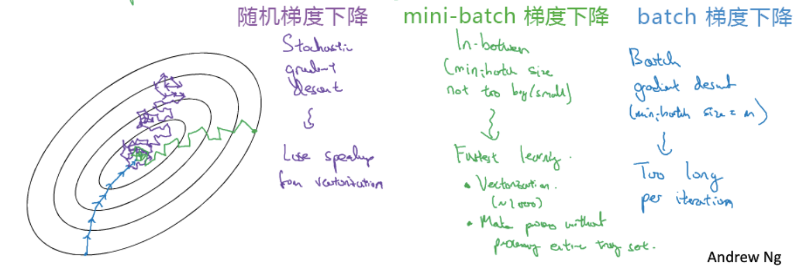
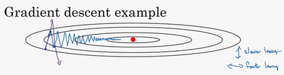
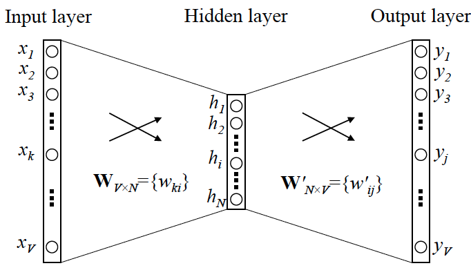
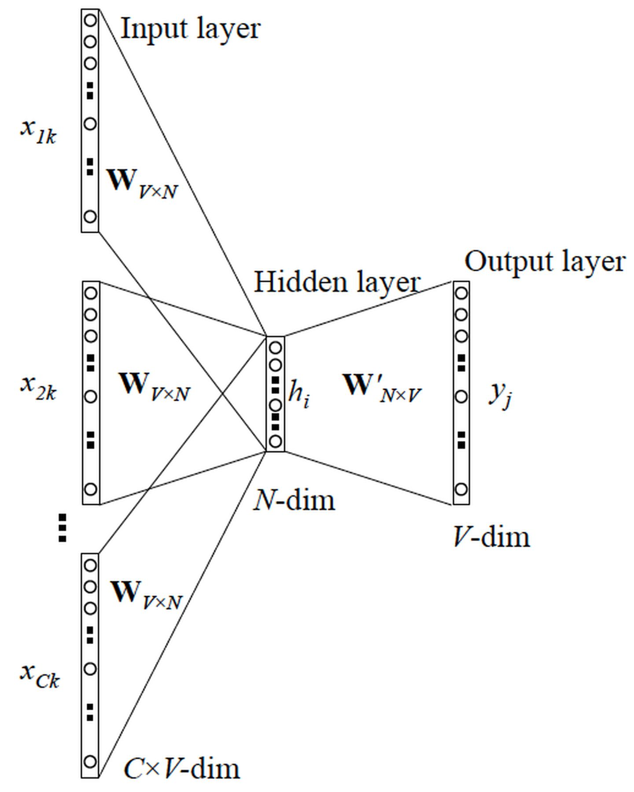
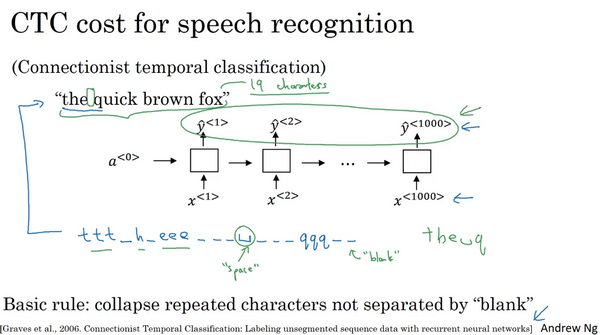

## 神经网络

### 正向传播

$$
f(x)=f^{(3)}(f^{(2)}(f^{(1)}(x)))
$$

神经网络是链式嵌套结构，输出值从前向后传播，每一层是一个线性层，加一个激活函数。线性层中包括w和bias，bias term可以使得我们分类的直线平移，增加了一个自由度，更加灵活，也可以视作激活函数的阈值；激活函数为线性函数加入了非线性，可以表征非线性数据。

在初始化时，通常采用随机数初始化，如果将权值初始化为 0 ，或者其他统一的常量，会导致后面的激活单元具有相同的值，所有的单元相同意味着它们都在计算同一特征，网络变得跟只有一个隐含层节点一样，这使得神经网络失去了学习不同特征的能力

- sigmoid 函数 ：$a=\frac{1}{1+e^{-z}}$

常用的激活函数，也是逻辑回归中的激活函数，当z趋近于无穷时，梯度趋近于0，可能会有梯度消失问题，在梯度下降时，收敛速度很慢

- tanh 函数（the hyperbolic tangent function，双曲正切函数）：$a = \frac{e^z - e^{-z}}{e^z + e^{-z}}$

效果通常好于sigmoid函数，值域在-1到1之间，有数据中心化的效果，当z趋近于无穷时，梯度趋近于0，可能会有梯度消失问题，在梯度下降时，收敛速度很慢

- ReLU 函数（the rectified linear unit，修正线性单元）：$a=max(0,z)$

当 z > 0 时，梯度始终为 1，从而提高神经网络基于梯度算法的运算速度，收敛速度远大于 sigmoid 和 tanh。然而当 z < 0 时，梯度一直为 0

Leaky ReLU（带泄漏的 ReLU）：$a=max(0.01z,z)$

Leaky ReLU 保证在 z < 0 的时候，梯度仍然不为 0。理论上来说，Leaky ReLU 有 ReLU 的所有优点，但在实际操作中没有证明总是好于 ReLU，因此不常用

### 反向传播

神经网络中根据链式法则，误差项反向传播，计算最终结果的误差对各个节点的导数，从而对整个网络的所有节点的参数值进行优化，反向传播通常通过计算图来计算导数

深度神经网络在反向传播过程中，多层的导数相乘，若每层的导数较大，则会发生梯度爆炸，最终结果很大。若每层导数较小，则会发生梯度消失，最终结果很小，常用的解决方法有更换激活函数、batchnorm、采用残差结构等。Relu激活函数的导数恒为1，不存在梯度消失和梯度爆炸的问题；Batchnorm对每一层的输出进行标准化，保证均值和方差一致；残差网络对上一层预测的残差进行训练，解决了梯度消失和爆炸的问题。

## 优化

### 基础方法

神经网络问题通常无法求出目标函数的闭式解，所以通常采用基于梯度的优化方法

- Batch Gradient Descend：最常用的梯度下降形式，即同时处理整个训练集；每一步梯度下降法需要对整个训练集进行一次处理，如果训练数据集很大的时候，处理速度就会比较慢

- Mini-batch Gradient Descend：每次同时处理单个的 mini-batch，其他与 batch 梯度下降法一致。对整个训练集的一次遍历（称为一个 epoch）能做 mini-batch 个数个梯度下降。之后，可以一直遍历训练集，直到最后收敛到一个合适的精度。这种方法在神经网络中最常用，适合并行计算

- Stochastic Gradient Descend：对每一个训练样本执行一次梯度下降，训练速度快

Batch梯度下降对所有样本做一次梯度下降，每次的迭代时间较长；Mini-batch梯度下降使用部分样本做梯度下降，兼容了模型的训练速度和梯度下降方向的准确性；随机梯度下降对每个样本进行一次梯度下降，速度最快，但噪声较大，且永远不会收敛

### 梯度下降的优化器

- 动量梯度下降（Gradient Descent with Momentum）：计算梯度的指数加权平均数，并利用该值来更新参数值

$$v_{dW^{[l]}} = \beta v_{dW^{[l]}} + (1 - \beta) dW^{[l]}$$

$$v_{db^{[l]}} = \beta v_{db^{[l]}} + (1 - \beta) db^{[l]}$$

$$W^{[l]} := W^{[l]} - \alpha v_{dW^{[l]}}$$ 

$$b^{[l]} := b^{[l]} - \alpha v_{db^{[l]}}$$

使用动量梯度下降时，通过累加过去的梯度值来减少抵达最小值路径上的波动，加速了收敛，因此在横轴方向下降得更快，从而得到图中红色的曲线

- Adagrad(Adaptive Gradient Problem): 学习率调整算法

$$s_{dw} = s_{dw} + (dw)^2$$

$$s_{db} = s_{db} + (db)^2$$ 

$$w := w - \frac{\alpha}{\sqrt{s_{dw} + \epsilon}}dw$$

$$b := b - \frac{\alpha}{\sqrt{s_{db} + \epsilon}}db$$

- RMSProp（Root Mean Square Propagation，均方根传播）：在对梯度进行指数加权平均的基础上，引入平方和平方根。RMSProp 有助于减少抵达最小值路径上的摆动，并允许使用一个更大的学习率 α，从而加快算法学习速度

$$s_{dw} = \beta s_{dw} + (1 - \beta)(dw)^2$$

$$s_{db} = \beta s_{db} + (1 - \beta)(db)^2$$ 

$$w := w - \frac{\alpha}{\sqrt{s_{dw} + \epsilon}}dw$$

$$b := b - \frac{\alpha}{\sqrt{s_{db} + \epsilon}}db$$

- Adam 优化算法（Adaptive Moment Estimation，自适应矩估计）：将 Momentum 和 RMSProp 算法结合在一起，通常有超越二者单独时的效果。

$$v_{dW} = \beta_1 v_{dW} + (1 - \beta_1) dW$$ 

$$v_{db} = \beta_1 v_{db} + (1 - \beta_1) db$$

$$s_{dW} = \beta_2 s_{dW} + (1 - \beta_2) {(dW)}^2$$ 

$$s_{db} = \beta_2 s_{db} + (1 - \beta_2) {(db)}^2$$

$$v^{corrected}_{dW} = \frac{v_{dW}}{1-{\beta_1}^t}$$ 

$$v^{corrected}_{db} = \frac{v_{db}}{1-{\beta_1}^t}$$

$$s^{corrected}_{dW} = \frac{s_{dW}}{1-{\beta_2}^t}$$ 

$$s^{corrected}_{db} = \frac{s_{db}}{1-{\beta_2}^t}$$

$$W := W - \frac{\alpha}{{\sqrt{s^{corrected}_{dW}} + \epsilon}}v^{corrected}_{dW}$$

$$b := b - \frac{\alpha}{{\sqrt{s^{corrected}_{db}} + \epsilon}}v^{corrected}_{db}$$

### 学习率

学习率过小，学习速度较慢，较多时间才能获得最优解

学习率过大，可能会错过最优解，梯度下降过程不收敛

### 优化问题

在微积分中，通常情况下我们判断一个驻点是否是极值点使用二阶导数，而针对多维数据，二阶导数是Hessian矩阵，Hessian矩阵正定，驻点为极小值点；二阶导数负定，驻点为极大值点，二阶导数不定，驻点为鞍点

**鞍点（saddle）**是函数上的导数为零，但不是轴上局部极值的点。当我们建立一个神经网络时，通常梯度为零的点是下图所示的鞍点，而非局部最小值。减少损失的难度也来自误差曲面中的鞍点，而不是局部最低点。因为在一个具有高维度空间的成本函数中，如果梯度为 0，那么在每个方向，成本函数或是凸函数，或是凹函数。而所有维度均需要是凹函数的概率极小，因此在低维度的局部最优点的情况并不适用于高维度。

在低维空间中局部最小值最常见，在高维空间中鞍点最常见。局部最小值的Hessian矩阵特征值全为正，鞍点的Hessian矩阵特征值有正有负，这也能解释为什么在高维空间中鞍点常见。

### 超参数搜索

Random search：随机搜索，在参数空间中随机选择参数组合，计算效率相比网格搜索更高

Grid search：网格搜索，M个参数，每个参数有N个候选值，尝试$M^N$种不同的参数组合

## 正则化

适用于传统机器学习算法解决过拟合问题的方法同样适用于深度学习，例如L1 L2正则化，在深度学习中，常常使用weight decay方法做正则化，等同L2正则

除此之外深层神经网络还可以采用Dropout、BatchNorm、Early stopping、Data Augmentation等方法解决过拟合

- Dropout: 神经网络的每个单元都被赋予在计算中被暂时忽略的概率p。超参数p称为丢失率，通常将其默认值设置为0.5。然后，在每次迭代中，根据指定的概率随机选择丢弃的神经元。因此，每次训练会使用较小的神经网络，这种方法减小了模型的复杂度。

  训练模型阶段：在训练网络的每个单元都要添加一道概率流程，以一定概率舍弃某个神经元，同时对权重进行缩放，乘概率 $\frac{1}{1-p}$

  测试模型阶段：用所有神经元参与计算

- BatchNorm：在神经网络的训练中，为了减少梯度消失和梯度爆炸的情况，通常在全连接层后加入批标准化层，减去均值除以方差，使得求梯度的值在0附近；批标准化同时也具有正则化的作用，见笑了数据的不稳定性

- Early stopping：在用梯度下降法的过程中，在模型开始过拟合之前就中断学习过程，通常通过训练集误差和验证集误差来判断

- 数据扩增（Data Augmentation）：通过图片的一些变换（翻转，局部放大后切割等），得到更多的训练集和验证集，数据扩增等于加入了一些噪音在原始数据中，会带来更好的泛化性能，使用数据扩增时，通常在前几个epoch会发生测试集准确率高于训练集准确率的情况

## 卷积运算

### 二维卷积

卷积运算的求解过程是从左到右，由上到下，每次在原始图片矩阵中取与滤波器同等大小的一部分，每一部分中的值与滤波器中的值对应相乘后求和，将结果组成一个矩阵。

假设输入图片的大小为$n×n$，而滤波器的大小为$f×f$，则卷积后的输出图片大小为$(n−f+1)×(n−f+1)$

普通卷积运算存在的问题是：每次卷积运算后，输出图片的尺寸缩小；原始图片的角落、边缘区像素点在输出中采用较少，输出图片丢失边缘位置的很多信息。为了解决这个问题，在进行卷积操作前，对原始图片在边界上进行**填充（Padding）**，以增加矩阵的大小。通常将 0 作为填充值。

设每个方向扩展像素点数量为$p$，则填充后原始图片的大小为$(n+2p)×(n+2p)$，滤波器大小保持$f×f$不变，则输出图片大小为 $(n+2p−f+1)×(n+2p−f+1)$

卷积过程中，有时需要通过填充来避免信息损失，有时也需要通过设置**步长（Stride）**来压缩一部分信息。
$$
⌊\frac{n+2p−f}{s}+1⌋×⌊\frac{n+2p−f}{s}+1⌋
$$
卷积操作的原理

- **参数共享（Parameter sharing）**：特征检测如果适用于图片的某个区域，那么它也可能适用于图片的其他区域。即在卷积过程中，不管输入有多大，一个特征探测器（滤波器）就能对整个输入的某一特征进行探测。
- **稀疏连接（Sparsity of connections）**：在每一层中，由于滤波器的尺寸限制，输入和输出之间的连接是稀疏的，每个输出值只取决于输入在局部的一小部分值。

### 三维卷积

如果我们想要对三通道的 RGB 图片进行卷积运算，那么其对应的滤波器组也同样是三通道的。过程是将每个单通道（R，G，B）与对应的滤波器进行卷积运算求和，然后再将三个通道的和相加，将 27 个乘积的和作为输出图片的一个像素值。

如果想同时检测垂直和水平边缘，或者更多的边缘检测，可以增加更多的滤波器组。例如设置第一个滤波器组实现垂直边缘检测，第二个滤波器组实现水平边缘检测。设输入图片的尺寸为$n×n×n_c$（$n_c$为通道数），滤波器尺寸为$f×f×n_c$，则卷积后的输出图片尺寸为$ (n−f+1)×(n−f+1)×n′_c$，$n′_c$为滤波器组的个数。

与之前的卷积过程相比较，卷积神经网络的单层结构多了激活函数和偏移量。随着神经网络计算深度不断加深，图片的高度和宽度 $n_H$、$n_W$一般逐渐减小，而$n_c$在增加。

对于一个 3x3x3 的滤波器，包括偏移量 bb在内共有 28 个参数。不论输入的图片有多大，用这一个滤波器来提取特征时，参数始终都是 28 个，固定不变。即**选定滤波器组后，参数的数目与输入图片的尺寸无关**。因此，卷积神经网络的参数相较于标准神经网络来说要少得多。这是 CNN 的优点之一。

### 池化层

卷积网络也经常使用池化层来缩减模型的大小，提高计算速度，同时提高所提取特征的鲁棒性

**最大池化（Max Pooling）**：将输入拆分成不同的区域，输出的每个元素都是对应区域中元素的最大值

**平均池化（Average Pooling）**：从取某个区域的最大值改为求这个区域的平均值

## 经典模型

### LeNet

- LeNet-5 针对灰度图像而训练，因此输入图片的通道数为 1。
- 该模型总共包含了约 6 万个参数，远少于标准神经网络所需。
- 典型的 LeNet-5 结构包含卷积层（CONV layer），池化层（POOL layer）和全连接层（FC layer），排列顺序一般为 CONV layer->POOL layer->CONV layer->POOL layer->FC layer->FC layer->OUTPUT layer。一个或多个卷积层后面跟着一个池化层的模式至今仍十分常用。
- 当 LeNet-5模型被提出时，其池化层使用的是平均池化，而且各层激活函数一般选用 Sigmoid 和 tanh。现在，我们可以根据需要，做出改进，使用最大池化并选用 ReLU 作为激活函数。

### AlexNet

- AlexNet 模型与 LeNet-5 模型类似，但是更复杂，包含约 6000 万个参数。另外，AlexNet 模型使用了 ReLU 函数。同时pooling layer使用了max pooling。同时加入了dropout进行正则化（全链接层之后）在训练过程中使用了数据增强。
- 当用于训练图像和数据集时，AlexNet 能够处理非常相似的基本构造模块，这些模块往往包含大量的隐藏单元或数据。

### VGG-16

- VGG 又称 VGG-16 网络，“16”指网络中包含 16 个卷积层和全连接层。
- 超参数较少，只需要专注于构建卷积层。
- VGG使用可重复使用的卷积块来构建深度卷积神经网络。结构不复杂且规整，在每一组卷积层进行滤波器翻倍操作。
- VGG 需要训练的特征数量巨大，包含多达约 1.38 亿个参数。

### ResNets

在理论上，随着网络深度的增加，性能应该越来越好。但实际上，对于一个普通网络，随着神经网络层数增加，训练错误会先减少，然后开始增多。但残差网络的训练效果显示，即使网络再深，其在训练集上的表现也会越来越好。

对于残差网络来说，加入了跳跃连接部分，发生梯度消失时，额外的残差块不会降低网络性能。而如果没有发生梯度消失时，训练得到的非线性关系会使得表现效果进一步提高。

### Inception

在之前的卷积网络中，我们只能选择单一尺寸和类型的滤波器。而 **Inception 网络的作用**即是代替人工来确定卷积层中的滤波器尺寸与类型，或者确定是否需要创建卷积层或池化层

下图中的inception块从4个不同路径抽取信息，然后在输出通道合并。

## 序列模型

$$
P(x)=P(x_1,x_2,...,x_T)=P(x_1)P(x_2|x_1)P(x_3|x_1,x_2)...P(x_T|x_1,...,x_{T-1})
$$

$$
P(x)=P(x_1,x_2,...,x_T)=P(x_T)P(x_{T-1}|x_T)P(x_{T-2}|x_{T-1},x_T)...p(x_1|x_2,...,x_T)
$$

自回归模型：使用序列数据的前部分样本进行预测

马尔可夫假设：当前数据之根过去t个数据相关（可以使用mlp进行训练）

潜变量模型： 引入潜变量ht来表示过去的信息

## RNN模型

### 语句表示

对于一个序列数据 x，用符号 x⟨t⟩来表示这个数据中的第 tt个元素，用 y⟨t⟩来表示第 t个标签，用 Tx和 Ty来表示输入和输出的长度。对于一段音频，元素可能是其中的几帧；对于一句话，元素可能是一到多个单词。

想要表示一个词语，需要先建立一个**词汇表（Vocabulary）**，或者叫**字典（Dictionary）**。将需要表示的所有词语变为一个列向量，可以根据字母顺序排列，然后根据单词在向量中的位置，用 **one-hot 向量（one-hot vector）**来表示该单词的标签：将每个单词编码成一个 R|V|×1向量，其中 |V|是词汇表中单词的数量。一个单词在词汇表中的索引在该向量对应的元素为 1，其余元素均为 0。one-hot 向量是最简单的词向量。它的**缺点**是，由于每个单词被表示为完全独立的个体，因此单词间的相似度无法体现。

### 正向传播

$$
W_a=[W_{aa},W_{ax}]
$$

$$
a^{<t>}=g_1(W_a[a^{<t-1>};x^{<t>}]+b_a)
$$

$$
\hat y^{<t>}=g_2(W_{ya}a^{<t>}+b_y)
$$

### 反向传播

单个位置上（或者说单个时间步上）某个单词的预测值的损失函数采用**交叉熵损失函数**，将单个位置上的损失函数相加，得到整个序列的成本函数

通过RNN来预测一个序列的值通常需要两步，第一步是构建一个语言模型，第二部是通过采样来构建序列

RNN的反向传播是通过时间的(Back Propagation Through Time BPTT)，前一个时间步的梯度相乘，当时间序列过程时，非常容易出现梯度消失或者梯度爆炸问题

梯度爆炸：梯度值特别大

- Truncated BPTT：将RNN分成不同的chunk，每次梯度计算只在特定的chunk上计算，例如3个rnn unit为一个trunk

- 梯度裁剪gradient clipping：防止梯度爆炸，若梯度过大，则除以梯度的模长$g=min(1,\frac{\theta}{||g||})g$

梯度消失：梯度值特别小

- 激活函数：使用RELU激活函数可以减小梯度消失问题，RELU激活函数的导数为1
- 使用LSTM：LSTM结构的forget gate擅长处理梯度消失问题
- 初始化：将权重矩阵初始化为

### 语言模型

建立语言模型所采用的训练集是一个大型的**语料库（Corpus）**，指数量众多的句子组成的文本。建立过程的第一步是标记化，即建立字典；然后将语料库中的每个词表示为对应的 one-hot 向量。第二步是将标志化后的训练集用于训练 RNN

### 采样

在训练好一个语言模型后，可以通过**采样（Sample）**新的序列来了解这个模型中都学习到了一些什么

在第一个时间步输入 a⟨0⟩a⟨0⟩和 x⟨1⟩x⟨1⟩为零向量，输出预测出的字典中每个词作为第一个词出现的概率，根据 softmax 的分布进行随机采样（`np.random.choice`），将采样得到的 ŷ ⟨1⟩作为第二个时间步的输入 x⟨2⟩。以此类推，直到采样到 EOS，最后模型会自动生成一些句子，从这些句子中可以发现模型通过语料库学习到的知识。

## 改进RNN模型

传统的RNN存在梯度消失问题，不善于捕捉语句长期的依赖关系，通过GRU与LSTM模型可以解决长期依赖的问题

### GRU

GRU 单元有一个新的变量称为 c，代表记忆细胞，其作用是提供记忆的能力，记住例如前文主语是单数还是复数等信息。

更新门$\Gamma_u$代表是否要更新参数，在0-1取值；相关门$\Gamma_r$表示 c̃ ⟨t⟩和 c⟨t⟩的相关性
$$
\Gamma_u=\sigma(W_u[c^{<t-1>},x^{<t>}]+b_u)
$$

$$
\Gamma_r=\sigma(W_r[c^{<t-1>},x^{<t>}]+b_r)
$$

$$
\tilde c^{<t>}=tanh(W_c[\Gamma_r*c^{<t-1>},x^{<t>}]+b_c)
$$

$$
a^{<t>}=c^{<t>}=\Gamma_u * \tilde c^{<t>}+(1-\Gamma_u)*c^{<t-1>}
$$

### LSTM

相比于GRU，LSTM引入了遗忘门$\Gamma_f$和输出门$\Gamma_o$输入门$\Gamma_i$
$$
\Gamma_i=\sigma(W_i[a^{<t-1>},x^{<t>}]+b_i)
$$

$$
\Gamma_f=\sigma(W_f[a^{<t-1>},x^{<t>}]+b_f)
$$

$$
\Gamma_o=\sigma(W_o[a^{<t-1>},x^{<t>}]+b_o)
$$

$$
\tilde c^{<t>}=tanh(W_c[c^{<t-1>},x^{<t>}]+b_c)
$$

$$
c^{<t>}=\Gamma_i * \tilde c^{<t-1>}+\Gamma_f*c^{<t-1>}
$$

$$
a^{<t>}=\Gamma_o*tanh(c^{<t>})
$$

### BRNN双向循环神经网络

**双向循环神经网络（Bidirectional RNN，BRNN）**可以在序列的任意位置使用之前和之后的数据。**缺点**是需要完整的序列数据，才能预测任意位置的结果。

### DRNN深度循环神经网络

循环神经网络的每个时间步上也可以包含多个隐藏层

## 词嵌入

### 概念

使用OneHot离散编码训练的RNN模型有两个缺点，分别是参数量大以及不同词之间正交，因此引入了词嵌入机制，将OneHot向量映射到一个低位空间上。

**词嵌入**是 NLP 中语言模型与表征学习技术的统称，概念上而言，它是指把一个维数为所有词的数量的高维空间（one-hot 形式表示的词）“嵌入”到一个维数低得多的连续向量空间中，每个单词或词组被映射为实数域上的向量。

用词嵌入做迁移学习可以降低学习成本，提高效率。其步骤如下：

1. 从大量的文本集中学习词嵌入，或者下载网上开源的、预训练好的词嵌入模型；
2. 将这些词嵌入模型迁移到新的、只有少量标注训练集的任务中；
3. 可以选择是否微调词嵌入。当标记数据集不是很大时可以省下这一步。

训练过程：

将语料库中的某些词作为目标词，以目标词的部分上下文作为输入，Softmax 输出的预测结果为目标词。嵌入矩阵 E 和 w、b 为需要通过训练得到的参数。这样，在得到嵌入矩阵后，就可以得到词嵌入后生成的词向量。

### word2vec

word2vec的目标是通过一个语料库来学习词嵌入矩阵，通常有两种Skip-gram和CBOW两种方法。word2vec模型背后的基本思想是对出现在上下文环境里的词进行预测。对于每一条输入文本，我们选取一个上下文窗口和一个中心词，并基于这个中心词去预测窗口里其他词出现的概率。因此，word2vec模型可以方便地从新增语料中学习到新增词的向量表达，是一种高效的在线学习算法

**CBOW**是从原始语句推测目标字词；而**Skip-Gram**正好相反，是从目标字词推测出原始语句。**CBOW**对小型数据库比较合适，而**Skip-Gram**在大型语料中表现更好。

• Skip-gram：根据词预测目标上下文

从左到右是 One-hot 向量，乘以 center word 的矩阵 W 于是找到词向量，乘以另一个 context word 的矩阵 W′ 得到对每个词语的“相似度”，对相似度取 Softmax 得到概率，与答案对比计算损失

• CBOW：根据上下文预测目标词

CBOW与Skip-gram相反，使用上下文的词来预测目标词，对输出相似度取 Softmax 得到概率，并计算loss

由于在OneHot向量的纬度可能很大，使用Softmax输出结果是要计算所有指数项的和，使用分层softmax和负采样的技术可以加速

• 分层Softmax：将 N 分类问题变成 log(N)次二分类

在实践中分级**softmax**分类器不会使用一棵完美平衡的分类树或者说一棵左边和右边分支的词数相同的对称树。实际上，分级的**softmax**分类器会被构造成常用词在顶部，然而不常用的词像**durian**会在树的更深处，因为更常见的词会更频繁，所以可能只需要少量检索就可以获得常用单词像**the**和**of**。

• 负采样：预测总体类别的一个子集

生成数据的方式是我们选择一个上下文词，再选一个目标词，这就是正样本，给定标签为1；然后我们将用相同的上下文词，再从字典中选取随机的词，并标记0，这些就会成为负样本

## Seq2seq模型

**Seq2Seq（Sequence-to-Sequence）**模型能够应用于机器翻译、语音识别等各种序列到序列的转换问题。一个 Seq2Seq 模型包含**编码器（Encoder）**和**解码器（Decoder）**两部分，它们通常是两个不同的 RNN，将编码器的输出作为解码器的输入，由解码器负责输出正确的翻译结果。

这种编码器-解码器的结构也可以用于图像描述。将 AlexNet 作为编码器，最后一层的 Softmax 换成一个 RNN 作为解码器，网络的输出序列就是对图像的一个描述。

• 贪心搜索Greedy Search：生成第一个词的分布以后，它将会根据你的条件语言模型挑选出最有可能的第一个词进入你的机器翻译模型中，在挑选出第一个词之后它将会继续挑选出最有可能的第二个词，然后继续挑选第三个最有可能的词

• 集束搜索Beam Search：考虑每个时间步多个可能的选择。设定一个**集束宽（Beam Width）**B，代表了解码器中每个时间步的预选单词数量。例如 B=3B=3，则将第一个时间步最可能的三个预选单词及其概率值 P(ŷ ⟨1⟩|x)保存到计算机内存，以待后续使用。第二步中，分别将三个预选词作为第二个时间步的输入，得到 P(ŷ ⟨2⟩|x,ŷ ⟨1⟩)P(y^⟨2⟩|x,y^⟨1⟩)。在每次迭代时选取集束宽B个结果，依次迭代。

在做Beam Search时，多个条件概率相乘可能造成数值下溢，通过取对数方法缓解

Beam Search倾向于选择句长更短的句子，我们可以做长度标准化来解决这个问题

### Attention机制

注意力模型的一个示例网络结构如下图所示。其中，底层是一个双向循环神经网络（BRNN），该网络中每个时间步的激活都包含前向传播和反向传播产生的激活。顶层是一个“多对多”结构的循环神经网络，第 t 个时间步的输入包含该网络中前一个时间步的激活 s⟨t−1⟩、输出 y⟨t−1⟩以及底层的 BRNN 中多个时间步的激活 c

## 应用

### 情感分类

情感分类是指分析一段文本对某个对象的情感是正面的还是负面的，实际应用包括舆情分析、民意调查、产品意见调查等等。情感分类的问题之一是标记好的训练数据不足。但是有了词嵌入得到的词向量，中等规模的标记训练数据也能构建出一个效果不错的情感分类器。

使用 RNN 能够实现一个效果更好的情感分类器，相比于普通的基于平均值的情感分类器，RNN的情感分类器考虑了单词时序

### 语音识别

在语音识别任务中，输入是一段以时间为横轴的音频片段，输出是文本。

语音识别系统可以用注意力模型来构建，在输入音频的不同时间帧上，可以用一个注意力模型，来输出文本描述

**CTC**损失函数

由于输入是音频数据，使用 RNN 所建立的系统含有很多个时间步，且输出数量往往小于输入。因此，不是每一个时间步都有对应的输出。CTC 允许 RNN 生成下图蓝字所示的输出，并将两个空白符中重复的字符折叠起来，再将空白符去掉，得到最终的输出文本。

