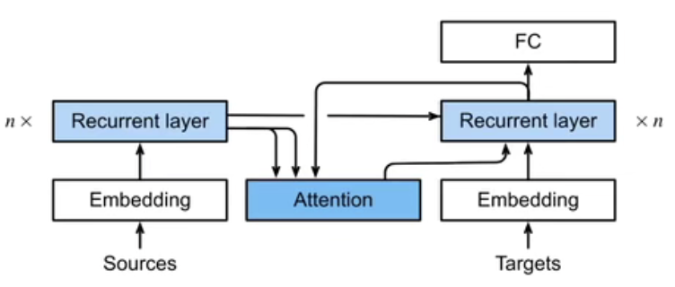
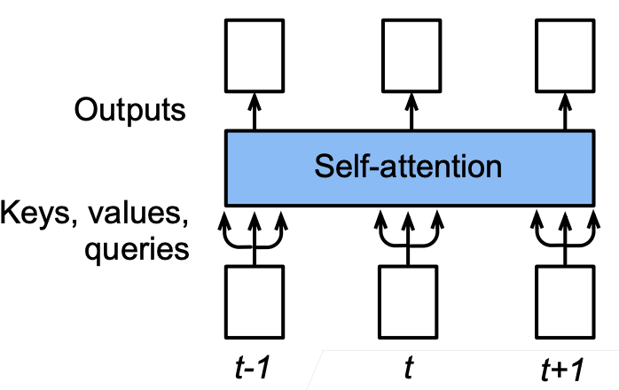
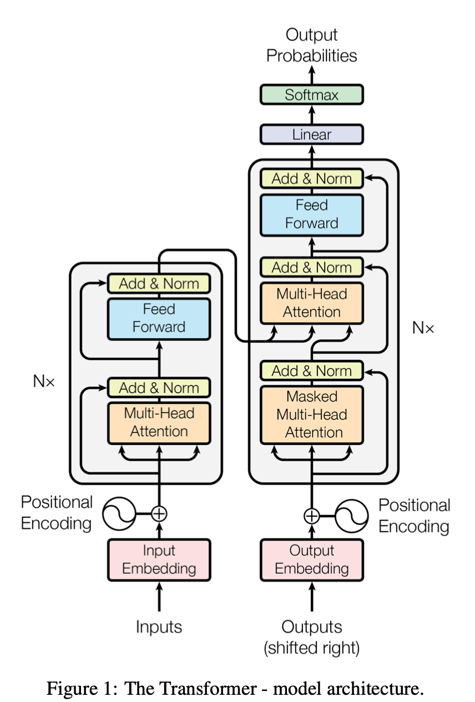
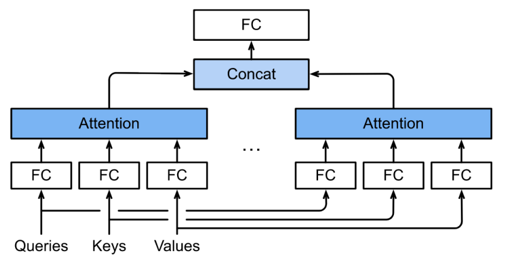
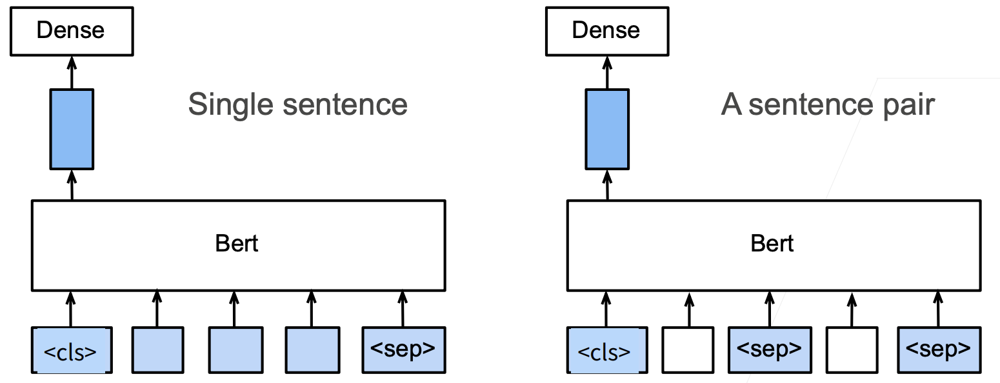
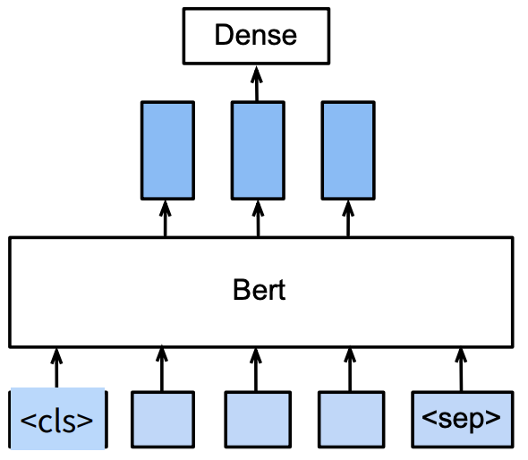
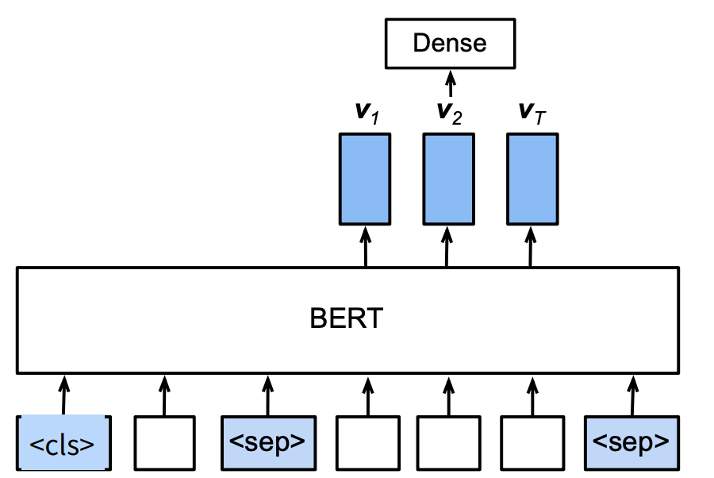

## Attention机制

### Attention

注意力机制值得是模型只关注特定位置的输入

不随意线索：卷积、全联接、池化；考虑所有输入信息

随意线索：氛围key value query三部分，通过key和query的相似度来选择特定的value

注意力机制可以写为：$f(x)=\sum_i\alpha(x,x_i)y_i$

- 非参注意力池化层：$\alpha$ 中没有参数可以学习

- 参数化注意力层：$\alpha$ 中有参数可以学习

针对query q，key k， value v，注意力机制可以写为$f(\bold q,\bold k, \bold v)=\sum_i \alpha(\bold q, \bold k_i)\bold v_i$

- Additive Attention: $a(\bold k, \bold q)=\bold v^Ttanh(\bold W_k\bold k+\bold W_q\bold q)$

- Dot-Product Attention: $a(\bold q, \bold k_i)=<\bold q, \bold k_i>/\sqrt d$ ,  $a(\bold Q, \bold K)=\bold Q\bold K^T/\sqrt d$

### Seq2seq with Attention

- 编码器对每次词的输出作为key和value
- 解码器RNN对上一个词的输出是query
- 注意力输出和下一个词的输入合并作为特征

### Self-Attention

给定序列，将$x_i$来当作query key value的注意力机制

位置编码：自注意力并没有记录位置信息，通常使用位置编码矩阵记录位置信息

位置编码矩阵：通常使用周期函数进行位置编码

## Transformer

### Multi-Head Attention

- 对同一个query key value，抽取不同信息，类似于卷积操作中的多通道

- 不同头的输出：$\bold h_i=f(\bold W_i^{(q)}\bold q, \bold W_i^{(k)}\bold k, \bold W_i^{(v)}\bold v)$
- 多头注意力输出：$\bold W_o[\bold h_1, \bold h_2, ..., \bold h_h]$

### Masked Multi-Head Attention

- 在解码器中，对序列元素进行输出时，不应考虑元素之后的元素

- 计算i的输出时，只考虑长度为i的序列

### Add & Norm

- 本层参考resnet的结构，加入了残差连接，减少梯度消失的情况

- 层归一化：由于NLP任务中每个输入序列的长度不同，因此对每个输入进行归一化

### 信息传递

- 编码器中输出$\bold y_1, \bold y_2, ..., \bold y_n$

- 将编码器的输出作为解码器中第i个Transformer块中的key和value，query来自目标序列
- 通过self attention层完成编码器到解码器的信息传递

- 在预测过程中，预测t+1个输出时，解码器中输入前t个预测值，类似递归

## BERT

### Transfer Learning

- 基于特征：例如word2vec，首先通过大量语料学习词的低维表征，然后在新的任务中使用这种表征
- 基于模型：使用BERT模型在大量语料进行训练，针对特定任务进行微调(fine tune)

### BERT架构

仅有编码器的Transformer

- Base: blocks=12, hidden size=768, heads=12, parameters=110M
- Large: blocks=24, hidden size=1024, heads=16, parameters=340M

### BERT预训练

输入：BERT的输入是一些句子对，整个输入以<cls>开始，不同句子以<seq>进行分隔

带掩码的语言模型：以15%的概率将一些词元替换成新的词

- 80%概率下替换成mask
- 10%概率下替换成随机词
- 10%概率下保持原有词元

预测相邻句子

- 50%概率选择下一个句子，作为正例
- 50%概率选择随机句子，作为负例

- <cls>的信息输出到一个全联接层做出输出信息

### BERT微调

- 句子分类：将<cls>对应的向量输入到全联接层进行分类

- 命名实体识别：将非特殊词元输入到全联接层进行分类

- 问题回答：对片段中每个词元预测是否为回答的开始或者结束

