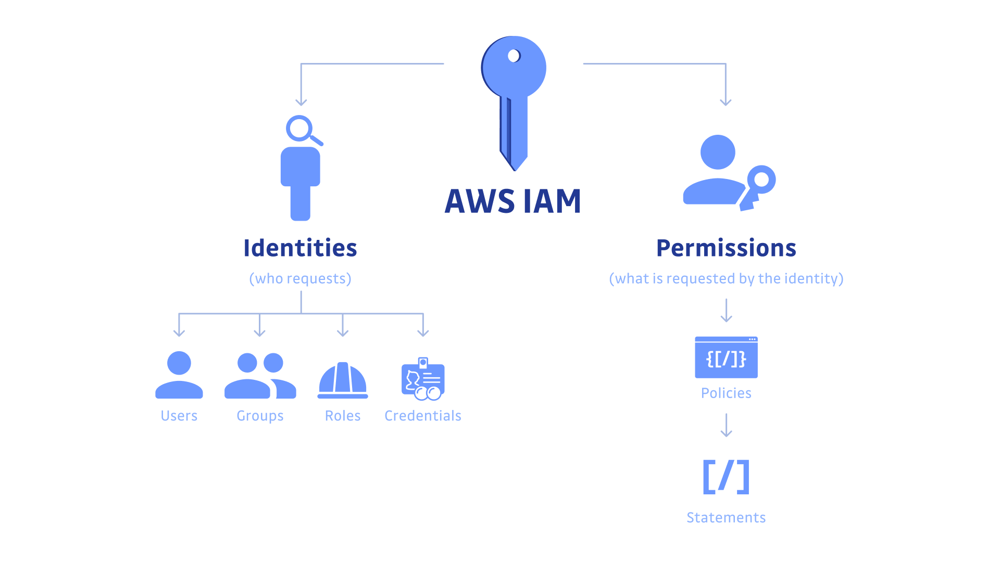

[toc]

# IAM

## Overview

**Prompt: Tell me some basics about AWS IAM.**

IAM plays a critical role in ensuring the security of your AWS environment by controlling who can do what within your AWS account. Properly configuring and managing IAM is essential for maintaining the security and compliance of your AWS infrastructure.

1. **User and Permission Management:**
   - Create and manage user accounts, groups, and roles.
   - Users can be individuals or applications.
   - Groups and roles help organize and assign permissions.
2. **Fine-Grained Access Control:**
   - Granular control over who can access AWS resources and what actions they can perform.
   - Define policies for specific resource access and operations.

## Identities

### Users

**Prompt: Give me an introduction about AWS IAM Users.**

Certainly, here's an introduction to AWS IAM Users with several bullet points:

- **AWS IAM Users:** 
  - AWS Identity and Access Management (IAM) users are entities within an AWS account.
  - They represent individuals, applications, or services that require access to AWS resources.
  - IAM users are separate from the AWS account owner and serve as the basis for controlled access.

- **Access Control and Security:**
  - IAM users are created and managed to control access to AWS services and resources.
  - They allow organizations to enforce the principle of least privilege by granting specific permissions only to those who need them.
  - This fine-grained access control enhances security and reduces the risk of unauthorized access.

- **Access Types:**
  - IAM users can be configured for different types of access:
    - **Programmatic Access:** Via access keys (access key ID and secret access key) for API operations.
    - **Console Access:** For interaction with the AWS Management Console.

- **Permissions and Policies:**
  - IAM policies are used to define what AWS resources users can access and what actions they can perform.
  - Policies are attached to IAM users and determine their level of access.
  
- **Enhanced Security Measures:**
  - IAM users can have multi-factor authentication (MFA) enabled for an additional layer of security.
  - Password policies can be applied to enforce strong password requirements.

- **Accountability and Auditing:**
  - IAM users enable organizations to maintain accountability by tracking who has access to AWS resources.
  - Detailed audit trails are maintained, aiding in security monitoring and compliance.

In summary, AWS IAM Users are a fundamental component of access control and security in AWS. They allow organizations to manage and delegate access while enforcing security best practices and ensuring accountability for resource access.

### Roles

**Prompt: Give me an introduction about AWS IAM Roles**

- **AWS IAM Roles:**
  - AWS Identity and Access Management (IAM) Roles are a core feature of AWS IAM.
  - Roles are used to delegate permissions securely to AWS resources, services, and external entities.
  - They play a crucial role in managing access within AWS environments while enhancing security and eliminating the need for long-term credentials.
- **Trusted Entities:**
  - Roles are intended to be assumed by trusted entities, such as AWS services, applications, or external users.
  - When a trusted entity assumes a role, it gains temporary permissions to perform actions based on the role's policies.
- **Temporary Credentials:**
  - One key aspect of roles is the issuance of temporary security credentials, including an access key ID, secret access key, and session token.
  - These temporary credentials have a limited lifespan (usually 1 hour by default) and are automatically rotated, reducing the risk associated with long-term access keys.
- **Cross-Account Access:**
  - Roles enable secure sharing of resources between AWS accounts, providing a mechanism for cross-account access.
  - This facilitates collaboration, centralized resource management, and resource sharing with trusted partners or third-party services.
- **Role-Based Access Control:**
  - Roles follow the principle of role-based access control (RBAC), where permissions are assigned to roles, and entities assume roles to acquire those permissions.
  - This approach simplifies access management and ensures that permissions are only granted when needed.
- **Trust Policy and Permissions Policy:**
  - Roles consist of two key policies: the trust policy and permissions policy.
  - The trust policy defines the trusted entities that can assume the role.
  - The permissions policy defines the permissions granted to the entity that assumes the role.
- **Secure and Dynamic Access:**
  - IAM roles contribute to a more secure AWS environment by reducing the exposure of long-term credentials.
  - They also facilitate dynamic and just-in-time access to resources.

In summary, AWS IAM Roles are a fundamental component of AWS security and access management. They enable secure delegation of permissions, reduce the risk associated with access keys, and support a variety of use cases, enhancing security, and access control in AWS environments.

## Permissions

### Policies

**Prompt: Give me an introduction about AWS IAM policies.**

Certainly, here's an introduction to AWS IAM policies:

- **AWS IAM Policies:**
  - AWS Identity and Access Management (IAM) policies are essential components for controlling access to AWS resources securely.
  - They define the permissions and access rights that determine what users, groups, and roles can do within an AWS environment.
- **Access Control Rules:**
  - IAM policies serve as access control rules that specify who has access to which AWS resources and what actions they can perform on those resources.
  - They are used to enforce the principle of least privilege, granting only the necessary permissions for individuals and entities to carry out their tasks.
- **Policy Components:**
  - IAM policies are typically written in JSON (JavaScript Object Notation) format, making them human-readable and machine-readable.
  - A policy consists of one or more statements, each describing a specific permission or restriction.
  - Each statement contains:
    - An effect (allow or deny).
    - A resource (the AWS resource to which the statement applies).
    - An action (the AWS actions that are allowed or denied).
    - Conditions (optional criteria for when the policy is applied).
- **Managed and Custom Policies:**
  - AWS provides managed policies that cover common use cases and best practices. These managed policies can be attached to users, groups, and roles.
  - Organizations can also create custom policies tailored to their unique requirements, granting precise control over permissions.
- **Permission Inheritance:**
  - IAM policies can be attached directly to users, groups, or roles.
  - When a user is a member of a group or assumes a role, they inherit the permissions of the group or role in addition to their individual permissions.
- **Versioning and Auditing:**
  - IAM policies support versioning, allowing organizations to manage changes to policies over time.
  - Organizations can audit and monitor access to AWS resources by reviewing detailed logs and activity reports generated based on policy evaluations.

In summary, AWS IAM policies are a fundamental component of access control and security in AWS environments. They define who can access what resources and what actions they can perform, offering organizations the flexibility to tailor access permissions to their specific needs while maintaining a secure and compliant AWS environment.
