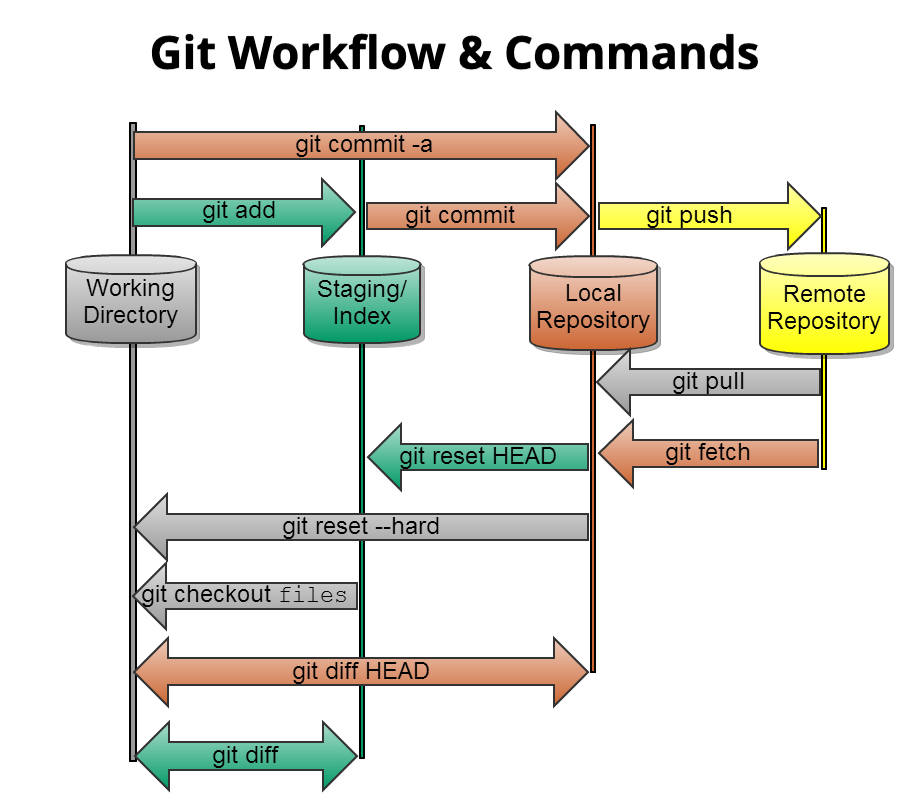
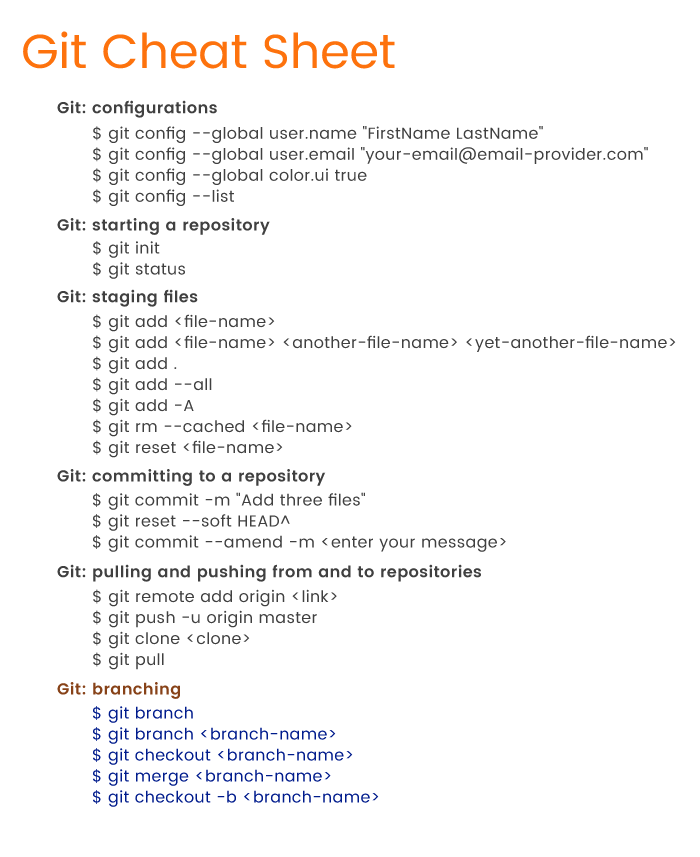

[toc]

# Git

## Overview

**Prompt: What is Git and what is Github?**

Git is a distributed version control system that is used to track changes in source code during software development. It was created by Linus Torvalds in 2005 and has since become the most widely used version control system in the world. Git allows multiple developers to collaborate on a project, making it easier to manage changes, track revisions, and work on different aspects of a codebase simultaneously.

Key features of Git include: 
1. **Version Control:**  Git keeps track of changes made to files and directories, allowing developers to revert to previous versions or merge changes from different branches. 
2. **Branching and Merging:**  Git enables developers to work on multiple branches of code, making it easy to experiment with new features or fix bugs without affecting the main codebase. Branches can be merged back into the main code when ready. 
3. **Distributed:**  Git is a distributed version control system, meaning that each developer has a complete copy of the code and its history on their local machine. This allows for offline work and easier collaboration among team members. 
4. **Speed and Efficiency:**  Git is designed to be fast and efficient, making it suitable for both small and large projects.

GitHub, on the other hand, is a web-based platform that provides hosting for Git repositories. It was created in 2008 and has become one of the most popular platforms for software development collaboration. GitHub offers a wide range of features and tools for developers, including: 
1. **Repository Hosting:**  GitHub allows users to create remote Git repositories and provides a platform for hosting and managing them. Developers can push their local Git repositories to GitHub for backup and collaboration. 
2. **Collaboration:**  GitHub facilitates collaboration among developers by providing tools for code review, issue tracking, and project management. Teams can work together on projects, discuss code changes, and track issues and feature requests. 
3. **Version Control:**  GitHub provides a web-based interface for viewing the history of a Git repository, comparing different versions of files, and exploring code changes. 
4. **Continuous Integration and Deployment:**  GitHub integrates with various CI/CD (Continuous Integration/Continuous Deployment) tools, making it easier to automate testing and deployment processes. 
5. **Community and Open Source:**  GitHub is widely used by the open-source community, making it a hub for sharing and contributing to open-source projects. Many open-source projects are hosted on GitHub.

In summary, Git is the underlying version control system that helps developers manage and track changes in code, while GitHub is a web-based platform that provides hosting and collaboration tools for Git repositories. Together, they form a powerful combination for version control and software development collaboration.

## Workflow

### Overview

**Prompt: Show me the basic Git workflow.**



The basic Git workflow typically involves the following steps. This workflow assumes you have Git installed and configured on your local machine and a Git repository set up, either locally or on a platform like GitHub. 

1. **Clone a Repository (Optional):** 
If you are starting a new project or joining an existing one, you might want to clone an existing Git repository to your local machine. Cloning creates a local copy of the remote repository.

```bash
git clone <repository_url>
```
2. **Create or Modify Files:** 
Create or modify files in your local working directory. These changes are considered "untracked" by Git until you add them to the staging area. 
3. **Stage Changes:** 
Before committing changes, you need to stage them. Staging means you select which changes you want to include in the next commit.

To stage changes for a specific file:

```bash
git add <file_name>
```

To stage all changes:

```bash
git add .
```
4. **Commit Changes:** 
Once you have staged your changes, you can commit them with a meaningful commit message. A commit represents a snapshot of your code at a specific point in time.

```bash
git commit -m "Your commit message here"
```
5. **Push Changes (For Remote Repositories):** 
If you are working with a remote repository (e.g., on GitHub), you can push your committed changes to the remote server to share them with others.

```bash
git push origin <branch_name>
```
6. **Pull Changes (For Remote Repositories):** 
If you are collaborating with others and they have made changes to the remote repository, you can pull those changes to your local repository to keep it up-to-date.

```bash
git pull origin <branch_name>
```
7. **Branching (Optional):** 
You can create branches to work on new features or bug fixes without affecting the main codebase. Branches are useful for isolating changes and later merging them back into the main branch.

To create a new branch:

```bash
git checkout -b <new_branch_name>
```

To switch between branches:

```bash
git checkout <branch_name>
```
8. **Merging (Optional):** 
Once you've completed your work in a feature branch, you can merge it into the main branch (e.g., `master` or `main`) to incorporate your changes into the main codebase.

```bash
git checkout <main_branch>
git merge <feature_branch>
```
9. **Resolving Conflicts (If Necessary):** 
If Git detects conflicts during a merge or pull operation, you'll need to manually resolve them in the affected files. After resolving conflicts, you must commit the changes. 
10. **Repeat Steps 2-9:** 
Continue this cycle of modifying files, staging, committing, and optionally pushing or pulling changes as needed to collaborate with others or maintain your codebase.

This basic Git workflow covers the fundamental steps for tracking changes in your code and collaborating with others using Git. Depending on your specific project and team, you may also incorporate additional practices like code reviews, issue tracking, and continuous integration.



### Reset

**Prompt: Tell me about how git reset work and when do we need to use that?**

`git reset` is a Git command that allows you to move the branch pointer (HEAD) to a different commit, effectively changing the state of your working directory and commit history. It's a powerful but potentially dangerous command, so it should be used with caution. `git reset` is often used in situations where you need to undo changes, unstage files, or reposition the branch pointer.

Here's how `git reset` works: 
1. **Three Main Modes:**  Git reset has three primary modes, each indicated by an argument: 
- `--soft`: Moves the branch pointer but leaves the working directory and staged changes as they are. This is used to "undo" commits without losing changes. 
- `--mixed` (default): Moves the branch pointer and resets the staging area (index) to the specified commit, but leaves your changes in the working directory. This is used to unstage changes. 
- `--hard`: Moves the branch pointer, resets the staging area, and discards all changes in the working directory. This is used to discard all changes, including commits. 
2. **Specifying the Target Commit:**  You specify which commit you want to reset to by providing a commit hash, a branch name, a tag, or a relative reference (e.g., HEAD~2 to refer to the second previous commit). This target commit becomes the new HEAD of the branch.

Here are common scenarios when you might need to use `git reset`: 
1. **Undoing Commits (Soft Reset):**  If you made one or more commits and want to "undo" them while keeping your changes in the working directory and staging area, you can use a soft reset. This effectively moves the branch pointer to a previous commit, making those commits no longer part of the branch's history.

```bash
git reset --soft HEAD~1  # Move back one commit, preserving changes in working directory and staging area
```
2. **Unstaging Changes (Mixed Reset):**  If you've staged changes but want to unstage them while keeping the changes in your working directory, you can use a mixed reset.

```bash
git reset HEAD <file_name>  # Unstage a specific file
git reset HEAD  # Unstage all changes
```
3. **Discarding Changes (Hard Reset):**  If you want to completely discard all changes, including both committed and uncommitted changes, you can use a hard reset. Be extremely cautious when using this command, as it cannot be easily undone.

```bash
git reset --hard HEAD~1  # Discard the last commit and all changes
```
4. **Reverting to a Specific Commit:**  You can use `git reset` to move your branch pointer to a specific commit, effectively resetting your branch to that state. This is useful if you want to start a new branch from an earlier point or if you want to discard all changes since a particular commit.

```bash
git reset --hard <target_commit>  # Reset the branch to a specific commit
```
5. **Branch Cleanup:**  If you have a branch with unnecessary commits that you want to remove from the branch's history, you can use `git reset` combined with a force push (e.g., `git push --force`) to update the remote repository and remove the unwanted commits.

**Note:**  Be cautious when using force push, especially on shared branches, as it can disrupt collaboration and lead to data loss.

Remember that `git reset` can rewrite history, so it's important to use it carefully, especially when working in a collaborative environment. Always communicate with your team when making significant changes to shared branches to avoid confusion and conflicts.

### Revert

**Prompt: Tell me about how git revert work and when do we need to use that?**

`git revert` is a Git command used to create a new commit that undoes the changes introduced by a previous commit. Unlike `git reset`, which rewrites history by removing commits, `git revert` is a safer way to reverse commits while preserving the commit history.

Here's how `git revert` works: 
1. **Choose the Target Commit:**  You specify the commit you want to revert. The changes made in this commit will be undone in a new commit. 
2. **Create a Revert Commit:**  Git creates a new commit that contains the inverse changes of the target commit. Essentially, `git revert` applies the opposite of the changes made in the target commit to your working directory. 
3. **Commit Message:**  Git opens a text editor (usually configured as `vim` or `nano`) for you to edit the commit message. By default, Git prepopulates the commit message with information about the commit being reverted. 
4. **New Commit Created:**  After you save and exit the text editor, Git creates a new commit with the reversed changes. This new commit is added to the branch's history.

Here's the basic syntax for using `git revert`:

```bash
git revert <target_commit>
```

Now, let's discuss when you might need to use `git revert`: 
1. **Reverting Mistaken or Unwanted Changes:**  If you or someone else on your team has made a commit that introduced a mistake or an unwanted change, you can use `git revert` to undo those changes while keeping the commit history intact.

```bash
git revert <commit_with_mistake>
```
2. **Safe Undo of Commits:**  Unlike `git reset`, which can be destructive and rewrite history, `git revert` creates a new commit that explicitly undoes the changes. This is safer when you want to undo committed changes without affecting other collaborators or the commit history. 
3. **Collaborative Workflows:**  When working in a team, it's essential to maintain a clean and collaborative history. If someone else's commits introduce issues, using `git revert` allows you to address the problems without interfering with their work. 
4. **Maintaining a Stable Main Branch:**  If you have a stable main or release branch and a bug is discovered in a previous commit, you can use `git revert` to fix the issue without having to rewrite history or make drastic changes to the branch. 
5. **Documenting Reversions:**  When you use `git revert`, Git automatically generates a commit message that references the commit being reverted. This makes it clear in the commit history why the changes were undone, aiding in documentation and code review. 
6. **Gradual Changes:**  In situations where you want to gradually remove the impact of a particular commit or changeset, you can use multiple `git revert` commands to create a sequence of revert commits.

Remember that `git revert` is a non-destructive way to undo changes and is suitable for collaborative workflows and situations where preserving history is essential. If you need to rework your branch's commit history or make more substantial changes, you might consider other Git commands like `git reset` or interactive rebasing.

### Rebase

**Prompt: Tell me about how git rebase work and when do we need to use that?**

Git rebase is a powerful and flexible Git operation that allows you to modify the commit history of a branch. It works by moving or combining a sequence of commits to a new base commit, typically on the same branch. Unlike merging, which creates a new merge commit, rebasing rewrites the commit history to make it appear as if the changes were made on top of the specified base commit.

Here's how Git rebase works: 
1. **Choose a Base Commit:**  When you perform a rebase, you specify a commit that serves as the new base for your branch. This base commit can be any existing commit in your branch's history, including a commit from a different branch. 
2. **Identify the Commits to Rebase:**  Git identifies the commits that are unique to your branch and need to be rebased onto the new base commit. These are typically the commits that you've made in your branch since it diverged from the base. 
3. **Create Patches:**  Git generates patches for each of the selected commits, storing the changes introduced by those commits. 
4. **Apply Patches:**  Git then applies these patches one by one on top of the new base commit, effectively reapplying your changes in a linear fashion. It's like taking your branch's changes and putting them on top of the base commit. 
5. **Update Branch Reference:**  Finally, Git moves the branch reference to point to the last commit in the rebased sequence, effectively replacing the old branch history with the new linear history.

Here's when you might need to use `git rebase`: 
1. **Maintaining a Clean and Linear History:**  One common use case for rebasing is to create a clean and linear commit history. By rebasing your feature branch onto the latest changes in the main branch, you can avoid unnecessary merge commits and keep the commit history more straightforward and easier to understand. 
2. **Synchronizing with the Main Branch:**  If you're working on a feature branch, and changes have been made to the main branch since you started your work, you can use rebase to incorporate those changes into your branch. This helps keep your branch up to date with the latest developments. 
3. **Interactive Rebasing:**  Git also allows interactive rebasing, which enables you to squash or split commits, edit commit messages, reorder commits, and even drop commits if needed. Interactive rebasing is valuable for cleaning up your commit history before merging your changes into the main branch.

Here's how to perform an interactive rebase:

```bash
git rebase -i <base_commit>
```


1. **Collaboration and Pull Requests:**  In a collaborative environment, if you want to prepare your branch for a clean and straightforward pull request, you can use rebase to reorganize your commits and address feedback without cluttering the commit history. 
2. **Resolving Conflicts:**  When conflicts arise during a rebase operation (usually because the changes in your branch conflict with changes in the base), you'll need to resolve these conflicts just as you would during a merge. After resolving conflicts, you can continue the rebase.

Keep in mind that while rebasing can create a cleaner history, it rewrites commit IDs and can potentially cause confusion if others are collaborating on the same branch. Therefore, it's essential to use rebasing judiciously and communicate with your team when incorporating rebased changes into a shared branch.

### Merge

**Prompt: Tell me about how git merge work and when do we need that?**

`git merge` is a Git command used to combine changes from one branch into another. It is commonly used in Git workflows to integrate new features or bug fixes from one branch (often called a "feature branch" or "topic branch") into the main branch (such as `master` or `main`). Merging creates a new commit that represents the combined changes of the merged branches.

Here's how `git merge` works: 
1. **Choose a Source and a Target Branch:**  You specify the branch that you want to merge changes from (the source branch) and the branch where you want to apply those changes (the target branch). 
2. **Determine the Merge Base:**  Git identifies the common ancestor commit between the source and target branches. This common ancestor is known as the "merge base." 
3. **Apply Changes:**  Git compares the changes made in the source branch since the merge base with the changes in the target branch. It then applies the source branch's changes to the target branch, creating a new commit that combines the changes. 
4. **Commit Message:**  Git opens a text editor (usually configured as `vim` or `nano`) for you to edit the commit message for the merge commit. By default, Git prepopulates the commit message with information about the branches being merged. 
5. **New Merge Commit Created:**  After you save and exit the text editor, Git creates a new merge commit that represents the combination of changes from both branches. This commit has two parent commits: one from the target branch and one from the source branch.

Here's the basic syntax for using `git merge`:

```bash
# While on the target branch, merge changes from the source branch
git merge <source_branch>
```

Now, let's discuss when you might need to use `git merge`: 
1. **Incorporating Feature Branches:**  When you have feature branches where new features or changes are developed, you can use `git merge` to integrate these changes into the main development branch (e.g., `master` or `main`) once the feature is complete and tested.

```bash
# Merge changes from the feature branch into the main branch
git checkout main
git merge feature-branch
```
2. **Bug Fixes:**  If a bug is discovered in a separate branch, you can use `git merge` to bring the bug fix into the main branch or other relevant branches to address the issue.

```bash
# Merge a bug fix from a bugfix branch into the main branch
git checkout main
git merge bugfix-branch
```
3. **Long-Term Branch Maintenance:**  In long-term development projects, `git merge` is used to periodically integrate changes from one branch (e.g., a development or testing branch) into a more stable branch (e.g., a production or release branch).

```bash
# Merge development changes into the release branch
git checkout release
git merge development
```
4. **Collaborative Development:**  In team settings, multiple developers may work on different branches concurrently. `git merge` allows you to combine everyone's changes into a common branch. 
5. **Pull Requests:**  In platforms like GitHub or GitLab, pull requests (or merge requests) often use `git merge` to merge proposed changes from feature branches into the main branch. This is a common workflow for open-source and collaborative development.

The process typically involves creating a pull request, which is a request to merge changes from one branch into another. When the pull request is approved and merged, `git merge` is used behind the scenes to combine the changes.

Overall, `git merge` is a fundamental Git command used to integrate changes from one branch into another. It's essential for maintaining code quality, managing feature development, and ensuring collaborative development efforts are smoothly integrated into a project.

## GitHub

### Overview

**Prompt: Tell me how to use GitHub to collaborate with other developers?**

Collaborating with other developers on GitHub involves using the platform's features and workflows to efficiently work on and manage shared projects. Here's a step-by-step guide on how to use GitHub for collaboration:

1. **Create a GitHub Account:**
   If you don't already have one, sign up for a GitHub account at https://github.com/. You can use a free GitHub account for public repositories, or you can choose a paid plan for private repositories, depending on your project's needs.

2. **Create or Join a Repository:**
   - **Create a New Repository:** To start a new project, click the "New" button on your GitHub dashboard, give your repository a name, and configure its visibility (public or private).
   - **Join an Existing Repository:** If you're joining an existing project, you can either fork the repository (create a personal copy) or be added as a collaborator by the repository owner.

3. **Clone the Repository:**
   To work on the project locally, clone the repository to your development environment using Git. Replace `<repository_url>` with the actual URL of the repository:

   ```bash
   git clone <repository_url>
   ```

4. **Create a Branch:**
   Before making changes, create a branch for your work. This keeps your changes isolated from the main branch until they are ready to be merged.

   ```bash
   git checkout -b <branch_name>
   ```

5. **Make Changes and Commit:**
   Make your code changes and commit them to your branch. Use `git add` to stage changes and `git commit` to create a commit with a meaningful message.

   ```bash
   git add .
   git commit -m "Your commit message here"
   ```

6. **Push Changes:**
   Push your branch with changes to the remote repository on GitHub. Replace `<branch_name>` with the name of your branch:

   ```bash
   git push origin <branch_name>
   ```

7. **Create a Pull Request (PR):**
   If you're working on a forked repository or a branch, create a pull request to propose your changes to the main repository. This is the mechanism for collaboration and code review on GitHub. Click the "New Pull Request" button on the GitHub repository page.

8. **Describe Your Changes:**
   In the pull request, provide a clear and concise description of the changes you've made. Mention any issues or relevant context. You can also assign reviewers to your PR.

9. **Review and Discuss:**
   Collaborators and reviewers can review your code, leave comments, and discuss the changes. Address their feedback by making additional commits and pushing them to your branch.

10. **Continuous Integration (CI):**
    Many projects use CI/CD (Continuous Integration/Continuous Deployment) tools integrated with GitHub. Automated tests are run to ensure code quality and compatibility before merging a PR.

11. **Merge the Pull Request:**
    Once your PR is approved and all discussions are resolved, it can be merged into the main branch by a repository collaborator or maintainer. GitHub provides options for merging, including merge commits, squash merging, and rebase merging.

12. **Delete the Branch:**
    After your changes are merged, you can delete the feature branch both locally and remotely if it's no longer needed.

   ```bash
   # Locally delete the branch
   git branch -d <branch_name>
   
   # Delete the remote branch (if needed)
   git push origin --delete <branch_name>
   ```

13. **Stay Updated:**
    To stay informed about changes in the project, use GitHub's watch and notification features to receive updates when issues are opened, PRs are created, or discussions take place.

14. **Contribute to Discussions:**
    Participate in discussions, report issues, and contribute to the project's documentation or README file to improve the project and engage with the community.

GitHub provides a rich set of collaboration features, including issue tracking, project boards, code reviews, and more. The specific workflow and practices may vary from one project to another, but the above steps outline the fundamental process for collaborating with other developers on GitHub.

### Actions

**Prompt: Tell me how to use GitHub Actions to perform CI/CD?**

GitHub Actions is a powerful automation and CI/CD (Continuous Integration/Continuous Deployment) platform provided by GitHub. It allows you to automate workflows, build, test, and deploy your code directly from your GitHub repositories. Here's a step-by-step guide on how to use GitHub Actions for CI/CD:

**1. Setting Up GitHub Actions:**

   - **Enable GitHub Actions:** Ensure that GitHub Actions is enabled for your repository. It's enabled by default for public repositories and can be enabled for private repositories in your repository's settings.

**2. Creating a Workflow File:**

   - **Workflow Definition File:** To define a CI/CD workflow, create a YAML file named `.github/workflows/<your_workflow_name>.yml` in the root of your repository. This file defines the steps and triggers for your workflow.

   - **Example Workflow File:**

     ```yaml
     name: CI/CD Pipeline

     on:
       push:
         branches:
           - main

     jobs:
       build:
         runs-on: ubuntu-latest

         steps:
           - name: Checkout code
             uses: actions/checkout@v2

           - name: Build and Test
             run: |
               # Your build and test commands go here

           - name: Deploy to Production
             if: success()  # Deploy only if previous steps are successful
             run: |
               # Your deployment commands go here
     ```

   - In this example, the workflow runs on every push to the `main` branch and consists of three steps: checking out the code, building and testing it, and deploying it to production.

**3. Configuring Your Workflow:**

   - Customize the workflow according to your project's needs. You can add or remove steps, specify environment variables, set up caching, and define conditional steps.

**4. Commit and Push the Workflow File:**

   - After creating and configuring your workflow file, commit and push it to your repository on GitHub.

**5. Workflow Triggers:**

   - By default, workflows can be triggered by various events, such as pushes, pull requests, and scheduled jobs. You can customize the triggers in the `on` section of your workflow file.

**6. Monitoring and Debugging:**

   - After pushing your workflow file, go to the "Actions" tab on your GitHub repository to monitor the progress of your workflows. You can view logs, debug issues, and access artifacts generated during the workflow run.

**7. Secrets and Environment Variables:**

   - Store sensitive information like API keys or deployment credentials as secrets in your repository's settings. You can then access these secrets in your workflow using environment variables.

**8. Artifacts:**

   - You can use artifacts to store and share files produced during workflow runs. Artifacts can be downloaded and reused in subsequent steps or jobs.

**9. Notifications:**

   - Configure notifications for workflow status using GitHub Actions. Notifications can be sent to Slack, email, or other messaging services to keep your team informed about workflow results.

**10. Deployment:**

- Configure deployment steps within your workflow to deploy your application to the desired environment. This may involve pushing to a production server, deploying to a cloud platform, or publishing artifacts to a package registry.

**11. Branch Protection:**

- To ensure the quality of your code, consider enabling branch protection rules that require successful workflow runs before allowing merges into certain branches.

**12. Scale and Parallelism:**

- GitHub Actions can run workflows on multiple runners in parallel, allowing you to scale your CI/CD pipeline as needed.

**13. GitHub Actions Marketplace:**

- Explore the GitHub Actions Marketplace to find pre-built actions and workflows created by the community. You can easily integrate these actions into your workflows.

**14. Documentation and Resources:**

- GitHub provides comprehensive documentation and resources for GitHub Actions, including syntax, examples, and best practices. Refer to the documentation for more advanced use cases and customization options.

With GitHub Actions, you can automate various aspects of your software development pipeline, from building and testing code to deploying applications, and create a seamless and efficient CI/CD process for your projects.