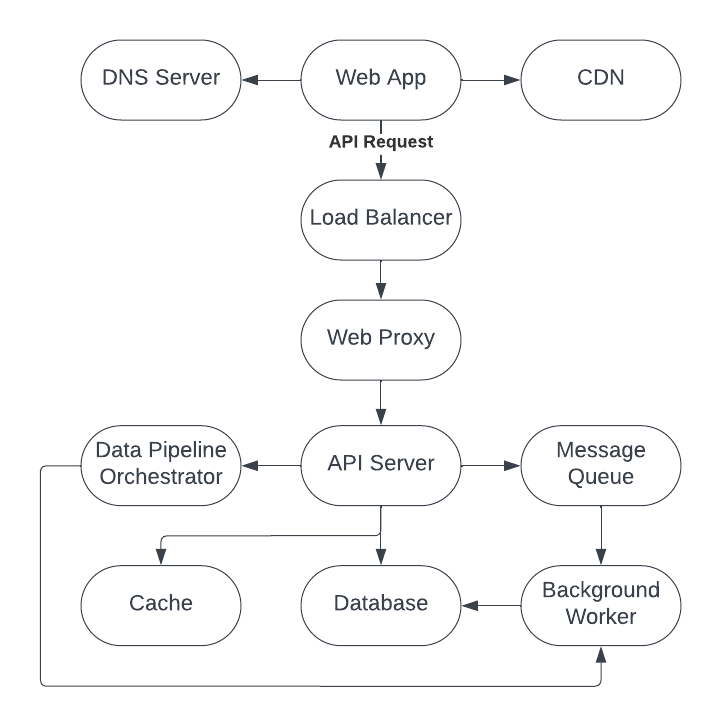

# Incident Insights

## Requirments

- **User Authentication and Account Management:**
  - Implement a secure user signup and login process.
  - Allow users to create and manage their own accounts.
  - Enable users to invite others to join their account with appropriate access controls and permissions.
- **Data Integration with Ticketing Tools:**
  - Develop integrations to ingest ticket data from various ticketing tools like PagerDuty, Opsgenie, etc.
  - Ensure compatibility and secure data transfer protocols for these integrations.
  - Provide options for users to customize the data they want to import from these tools.
- **Data Analysis and Incident Clustering:**
  - Design algorithms to analyze ticket data and cluster incidents based on patterns.
  - Implement machine learning or statistical techniques to identify and categorize incident patterns.
  - Develop functionality to update and refine clustering algorithms based on new data.
- **Incident Trend Visualization:**
  - Create a dashboard to visualize incident trends using charts and graphs.
  - Allow users to filter, sort, and drill down into specific data points for detailed analysis.
  - Provide options for users to customize the dashboard based on their preferences.
- **Integration with GenAI for Command Generation:**
  - Integrate with GenAI or similar services to generate debugging commands for incidents or clusters.
  - Ensure that the integration securely handles data and respects user privacy.
  - Provide users with options to refine or customize the command suggestions.
- **Remote Command Execution Capability:**
  - Develop a secure, remote command execution feature that allows users to run commands on their clusters, virtual machines, etc., directly from the app.
  - Ensure robust authentication and authorization mechanisms to prevent unauthorized access.
  - Include features to track and log command execution for auditing and troubleshooting purposes.
- **User Interface and Experience:**
  - Design an intuitive and user-friendly interface that allows easy navigation and access to all features.
  - Ensure the application is responsive and accessible on various devices and browsers.
  - Implement feedback mechanisms to gather user input for continuous improvement.
- **Documentation and Support:**
  - Provide comprehensive documentation on how to use the application, including guides for integration and troubleshooting.
  - Set up a support system for users to report issues or seek help.

## High-Level Design

### Architecture

1. **Web App:**The main interface that users interact with. It serves the client-side of your application, typically consisting of HTML, CSS, and JavaScript.
2. **CDN (Content Delivery Network):**A distributed network of servers that delivers static content to users based on their geographic location to reduce latency.
3. **DNS Server:**Translates domain names into IP addresses so browsers can load internet resources. It directs the user's request to the appropriate server.
4. **Load Balancer:**Distributes incoming network traffic across multiple servers to ensure no single server becomes overwhelmed and to improve redundancy and reliability.
5. **Web Proxy:**Acts as an intermediary between the users’ requests from the internet and the API server. It can also cache content and handle SSL termination.
6. **API Server:**The server that processes API requests. It executes business logic, interacts with the database, and communicates with other services.
7. **Message Queue:**Decouples processes by allowing them to communicate asynchronously. The API server sends messages to the queue, which are then processed by background workers.
8. **Background Worker:**A service that processes jobs from the message queue. This can include tasks such as sending emails, processing files, or performing batch operations.
9. **Database:**Stores and manages data. The API server queries the database to retrieve, update, or delete data as requested.
10. **Cache:**Temporarily stores frequently accessed data to reduce database load and speed up response times.
11. **Data Pipeline Orchestrator:**Manages and automates the flow of data between systems. It ensures that data processing tasks are executed in the correct order and manages dependencies between tasks.

### Technology

- **Web App:** React, Typescript
- **CDN (Content Delivery Network):** AWS Cloudfront
- **DNS Server:** AWS Route 53
- **Load Balancer:** AWS Elastic Load Balancer (ELB)
- **Web Proxy:** Nginx deployed on Kubernetes
- **API Server:** Python Flask gunicorn deployed on Kubernetes
- **Message Queue:** Redis Queue
- **Background Worker:** Kubernetes pods listening on Redis Queue
- **Database:** PostgreSQL
- **Cache:** Redis
- **Data Pipeline Orchestrator:** Airbyte
- **Monitoring:** Sentry, Pagerduty, Prometheus
- **CI/CD:** Github Action, ArgoCD

## Deep Dive

### Integrations

1. **Website:**
   - A user provides credentials for their ticketing tool.
   - These credentials are then verified by the system to ensure they are correct.
   - Upon successful verification, a connection to the user's ticketing tool is established.
2. **API Server:**
   - The API server saves the integration details in database
   - It can submit a job to message queue to load data steammingly.
   - It can create a workflow in Airbyte, which is a data pipeline orchestrator.
3. **Message Queue:**
   - The message queue receives the data load job and holds it until a background worker is available to process it.
4. **Data Pipeline Orchestrator:**
   - The orchestrator schedules and manages the execution of data workflows.
   - It performs the initial run of the workflow and schedules subsequent runs as necessary.
5. **Background Worker:**
   - A background worker picks up the data load job from the message queue. This worker is responsible for loading streaming incidents into the system.
   - Another background worker can also be triggered from Data Pipeline Orchestrator to load history data or do incremental data update.
   - Once the data load is finished, the data is saved into database.
6. **Database:**
   - The database serves as the persistent storage for all data related to tickets and integration details.
   - It stores the processed ticket information from the streaming incidents and the integration details from the data pipeline orchestrator.
7. **Cron Job:**
   - The cron job kicks off every 15 minute to transform the new data in the database to the unified schema
   - The unified schema unifies the schema from different ticketing tools

### Runbooks

1. **Website:**
   - Users input ticket data or prompts into the website.
   - The website sends this data via an API request to the backend to initiate runbook generation or conduct a search.
   - Periodically, the frontend makes API requests to check the status and results of the runbook generation job.
   - Users can save the generated runbooks, prompting the frontend to send a save request to the backend.

2. **API Server:**
   - On receiving a request to generate a runbook, the server submits the task to the message queue and records the job status in the database.
   - If it receives a save or delete runbook request, the server updates the runbook vector DB index with the new data or removes the existing data.

3. **Message Queue:**
   - Manages the queue of jobs for runbook generation, ensuring they're processed sequentially or based on priority.

4. **Background Worker:**
   - Listens to the message queue and dequeues jobs for processing.
   - Interacts with OpenAI using the RAG approach, where it first retrieves relevant commands or content from the runbooks index and then generates a new runbook by sending prompts based on ticket data or user input to OpenAI.
   - Saves the generated runbook or search results to the database and updates the job status to reflect completion.

5. **Cache:**
   - Stores frequently accessed data, like active runbook jobs and their statuses, to provide quicker access and reduce database load.

6. **Database:**
   - Holds temporary results of runbook generations and job statuses.
   - Permanently stores runbooks if a user decides to save them.

7. **Runbook Index:**
   - A vector database that indexes the content of runbooks, allowing for efficient retrieval during the RAG process.
   - Updated when runbooks are saved or deleted to maintain an accurate and searchable index.

### Automations

1. **Website:**
   - Guides users through integrating with AWS, detailing how to set up roles with the necessary permissions to access AWS services like EKS, EC2, VPC, etc.
   - Collects AWS credentials, including the role and AWS Lambda function names, from the user and securely transmits them to the API server.
2. **User AWS Account:**
   - The user follows the website's instructions to create a role within their AWS account, granting specific permissions needed for automation tasks.
   - The user creates an AWS Lambda function intended for automation of tasks based on runbook instructions.
   - Once set up, the user submits their AWS credentials to the web app, enabling it to execute actions on their AWS resources.
3. **API Server:**
   - Safely stores the received AWS user credentials in a secure manner adhering to best practices for handling sensitive information.
   - Keeps a record of automation details, which include configurations and scripts that specify the automation tasks.
4. **User Runbook:**
   - Users compile runbooks with detailed instructions for automating tasks on AWS resources.
   - Users configure triggers for runbooks, such as scheduled executions or event-based activations, and communicate these settings to the API server.
5. **Lambda Function:**
   - Stands by for execution, set to carry out the automation tasks as outlined in the user-defined runbook.
6. **Database:**
   - The database acts as the persistent storage for AWS credentials, automation configurations, and runbook details, facilitating quick retrieval and secure storage.
7. **Workflow Triggers:**
   - Users have the option to manually trigger runbooks, initiating the execution of the associated Lambda function.
   - The API server orchestrates the automation workflow, which can automatically invoke the Lambda function with parameters derived from the runbook.
   - The API server can programmatically trigger the user's Lambda function as outlined by the runbook's automation workflow.

## Wrap up

### Summary

1. **User Authentication and Account Management**: Secure signup and login, account management, and invitation with access controls.
2. **Data Integration with Ticketing Tools**: Ingesting data from ticketing tools, ensuring compatibility and customizable data import.
3. **Data Analysis and Incident Clustering**: Using algorithms and machine learning to cluster and categorize incident patterns.
4. **Incident Trend Visualization**: A dashboard for visualizing trends with customization options.
5. **Integration with GenAI for Command Generation**: Generating debugging commands, ensuring secure data handling.
6. **Remote Command Execution Capability**: Secure feature for running commands remotely with robust authentication and logging.

### Improvement

1. **Enhanced Machine Learning Models**: Refine the data analysis algorithms to improve accuracy in incident clustering and prediction.
2. **Real-time Data Processing**: Implement real-time data analytics for faster incident response and trend detection.
3. **Advanced Security Features**: Introduce additional layers of security, especially for the remote command execution feature.
