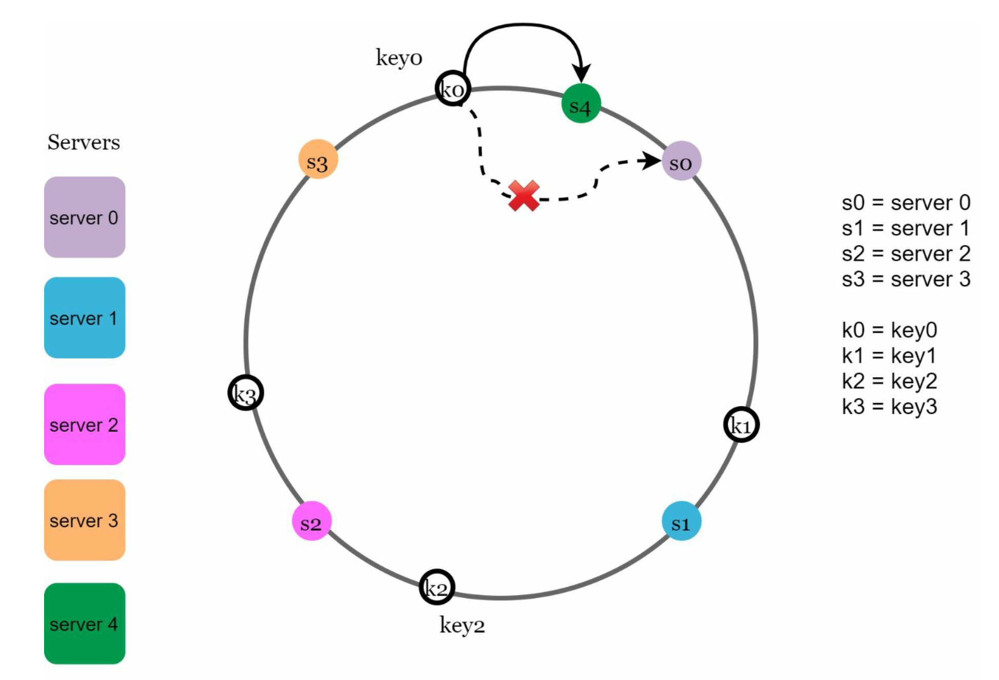
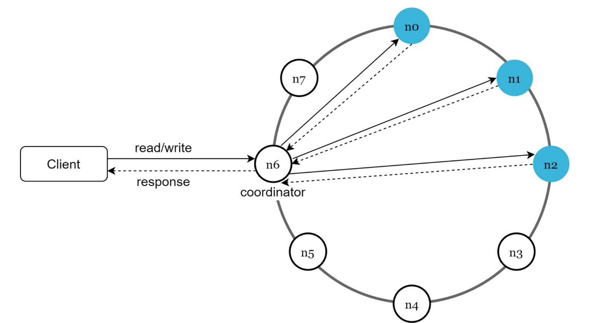

# Key-Value Store

## Requirments

### Functional Requirments

- **Basic Operations:**
  - **Put/Insert:** Store a key-value pair in the data store. If the key already exists, update the value.
  - **Get/Fetch:** Retrieve a value by its key. If the key does not exist, return a not found error.
  - **Delete:** Remove a key-value pair from the store. If the key does not exist, indicate that the operation had no effect or return an error.
- **Data Model:** Support for various data types for keys (e.g., strings, binary) and values (strings, binary, possibly more complex objects).
- **Transaction Support:**
  - Atomic operations for single key-value pairs.
  - Support for transactions (optional) for operations involving multiple key-value pairs.
- **Batch Operations:** Allow the insertion, retrieval, and deletion of multiple key-value pairs in a single operation to improve efficiency.
- **Concurrency Control:** Handle concurrent read/write operations gracefully to ensure data integrity.
- **TTL (Time To Live):** Optional expiration of keys after a specified duration.

### Non Functional Requirments

- **Performance:**
  - High throughput for read/write operations.
  - Low latency for key access, ideally sub-millisecond for reads and writes.
- **Scalability:**
  - Ability to scale out (horizontally) to support increased load.
  - Efficient distribution of data across multiple nodes to balance load.
- **Availability:**
  - High availability and fault tolerance, minimizing downtime.
  - Replication across multiple nodes to prevent data loss.
- **Durability:** Data is not lost after being written (e.g., persisted to disk or replicated).
- **Consistency:** Consistency model that suits the application requirements (e.g., eventual consistency, strong consistency).

## High Level Design

### Single Node Key-Value Store

- **In-Memory Hash Table**: Utilize a hash table for fast retrieval, insertion, and deletion of key-value pairs.
- **Persistence to Disk (Optional)**: Implement file-based storage to periodically save the in-memory data, ensuring durability.
- **Basic Operations**: Support 'Get', 'Put', and 'Delete' operations for managing key-value pairs.
- **Concurrency Control**: If multi-threading is involved, use locks or mutexes to prevent race conditions.
- **Error Handling and Validation**: Implement input validation for keys and values and handle errors like failed writes or invalid operations.
- **Simple API**: Provide a basic interface with methods like `get(key)`, `put(key, value)`, and `delete(key)`.

### Multiple Nodes Key-Value Store

1. **Data Distribution and Partitioning**

- **Sharding**: Divide the data into partitions or shards, each managed by different nodes. This can be done based on key ranges or using consistent hashing for more uniform distribution.
- **Replication**: For each shard, create replicas on different nodes to ensure data availability and fault tolerance.

2. **Replication and Consistency**

- **Choose a Replication Model**: Decide between master-slave replication (where one node is the authoritative source for a shard) or multi-master replication (where any node can accept writes).
- **Consistency Model**: Define the consistency model (strong, eventual, etc.) and implement mechanisms (like quorum consensus or vector clocks) to maintain it.

3. **Load Balancing and Request Routing**

- **Load Balancer**: Implement a load balancer to distribute requests evenly across nodes.
- **Routing Logic**: Develop logic to route requests to the appropriate node based on the key being accessed or modified.

4. **Handling Node Failures and Network Partitions**

- **Fault Tolerance**: Implement strategies to handle node failures (like hinted handoff or anti-entropy protocols).
- **Network Partition Handling**: Ensure the system can continue to operate under network partitions, possibly with reduced functionality.

5. **Data Synchronization**

- **Synchronization Mechanisms**: Establish processes for keeping data synchronized across nodes, taking into account the chosen consistency model.
- **Conflict Resolution**: Implement conflict resolution strategies for scenarios where data might become out of sync.

6. **Scalability and Performance Tuning**

- **Horizontal Scaling**: Design the system to easily add or remove nodes.
- **Performance Optimization**: Monitor and optimize the performance, considering aspects like caching, data compression, and efficient serialization.

7. **Monitoring and Maintenance**

- **Monitoring Tools**: Implement monitoring tools to track the health and performance of each node and the system as a whole.
- **Automated Recovery Processes**: Develop automated processes for recovery from failures and for routine maintenance tasks.

8. **API and Client Libraries**

- **Update API**: Modify the existing API to handle distributed operations, ensuring backward compatibility if necessary.
- **Client Libraries**: Provide updated client libraries that are aware of the distributed nature of the system and can interact with it efficiently.

## Deep Dive

### CAP Theorem

1. **Consistency**: Every read receives the most recent write or an error. In other words, once a write is successful, any subsequent read operation should return the value of that write or a newer value. This does not mean the system must be in a consistent state at all times, but that any read operation will eventually return a consistent result.
2. **Availability**: Every request receives a (non-error) response – without the guarantee that it contains the most recent write. This means the system should always be operational and never become unavailable or non-responsive, even during network partitions or failures.
3. **Partition Tolerance**: The system continues to operate despite an arbitrary number of messages being dropped (or delayed) by the network between nodes. In simpler terms, the system should continue to function even if there is a failure in communication among the nodes in the system.

In essence, the CAP Theorem suggests that in any distributed system, there are trade-offs to be made between these three properties:

- A system that is **Consistent and Available** in the presence of a network partition (P) is not achievable.
- A system can be **Consistent and Partition-Tolerant (CP)**, but this may compromise availability. For instance, if a network partition prevents communication between nodes, the system might choose to respond with an error or a timeout rather than returning potentially outdated data.
- A system can be **Available and Partition-Tolerant (AP)**, but this may lead to temporary inconsistencies. For example, during a network partition, the system continues to operate and serve requests, but some of the responses might not reflect the most recent state of the system.

### Consistent Hashing

- **Basic Idea**: Consistent hashing maps data to nodes in a way that minimizes data movement when nodes are added or removed.
- **Hash Ring**: It visualizes the distribution of data as a circular space (a ring) where both data items and nodes are mapped. Each data key is hashed to a point on the ring, and the nearest node moving clockwise is where the data is stored.
- **Hash Function**: A consistent hash function is used to assign each node and key to a point on the ring. The hash function should distribute keys uniformly across the ring to avoid load imbalance.
- **Adding Nodes**: When a new node is added, only a small portion of keys from the neighboring nodes will be moved to the new node, reducing the amount of data transfer.
- **Removing Nodes**: If a node fails or is removed, its keys are distributed among its neighboring nodes, ensuring data remains accessible.
- **Virtual Nodes**: To improve load balancing, each node is represented by multiple points on the ring, known as virtual nodes. This helps distribute the load more evenly, as each physical node is responsible for multiple segments of the ring.

### Consistency

- **Replica (*N*)**: *N* is the number of replicas of all the nodes.

- **Write Quorum (*W*)**: A write operation must be acknowledged by *W* nodes to be considered successful. This ensures that the written data is reliably stored across multiple nodes.
- **Read Quorum (*R*)**: A read operation must gather data from at least *R* nodes. This is to ensure that the most recently written data is read.
- **Quorum Condition**: 
  - If *R = 1* and *W = N*, the system is optimized for a fast read.
  - If *W = 1 and R = N*, the system is optimized for fast write.
  - If *W + R > N*, strong consistency is guaranteed (Usually *N = 3, W = R = 2*).
  - If *W + R <= N*, strong consistency is not guaranteed
- **Consistency Models**:
  - Strong consistency: any read operation returns a value corresponding to the result of the most updated write data item. A client never sees out-of-date data.
  - Weak consistency: subsequent read operations may not see the most updated value.
  - Eventual consistency: this is a specific form of weak consistency. Given enough time, all updates are propagated, and all replicas are consistent.
- **Vector Clock Versioning**:
  - **Initialization**: Each node in the system starts with a vector clock with all elements set to zero.
  - **Increment on Update**: When a node updates a data item, it increments its own element in the vector clock.
  - **Propagation with Data**: Whenever data is sent from one node to another, the vector clock accompanies the data.
  - **Update on Receive**: When a node receives data, it updates its vector clock by taking the element-wise maximum of its own clock and the received clock.
  - **Determining Causality**: Vector clocks allow a system to determine if one operation causally precedes another or if they are concurrent.
  - **Resolving Conflicts**: If the system detects concurrent updates (where no vector clock is less than or equal to another), it can employ a conflict resolution strategy, such as merging values, selecting one based on predefined rules, or even letting the client resolve the conflict.
  

### Fault Tolerance

- **Temporary failures**: Instead of immediately failing or dropping the write request, the system temporarily stores ("hints at") the data along with information about its intended destination.
  - **Data Write Attempt**: A node attempts to write data to a replica node.
  - **Detection of Unavailability**: If the target replica node is unavailable, the writing node stores the data locally, along with a "hint" indicating the intended destination.
  - **Storing the Hint**: This hint includes enough information to deliver the data to the correct node once it becomes available again.
  - **Node Recovery**: When the unavailable node comes back online, the node holding the hinted data forwards it to the correct destination.
  - **Data Synchronization**: The previously unavailable node then processes and stores the data as if it had been available at the time of the initial write.
- **Permanent failures**: We use anti-entropy protocols to handle permanent failures. The primary goal of anti-entropy protocols is to detect and reconcile differences between replicas in a distributed system.
  - **Regular Synchronization**: Nodes in the system periodically communicate with each other to compare their data states.
  - **Detection of Divergence**: During these synchronizations, nodes detect if there are any discrepancies or divergences in their data.
  - **Data Reconciliation**: If differences are found, the nodes will exchange the necessary data to update and reconcile their states.
  - **Merkle Trees**: A common method involves using Merkle trees (hash trees) for efficient comparison of data sets. Merkle trees allow nodes to quickly identify which parts of their data are out of sync without exchanging the entire dataset.
  - **Gossip Protocol**: Another approach is the gossip protocol, where nodes randomly exchange information with other nodes. This method disseminates updates throughout the network and aids in identifying inconsistencies.
- **Data center outages**: replicate data across multiple data centers. Even if a data center is completely offline, users can still access data through the other data centers.

### Architecture

- **Equal Roles**: In a P2P architecture, each node plays an equal role. There is no designated master or slave; instead, every node can handle both reads and writes.
- **Data Replication**: Data is replicated across multiple nodes, and any node can initiate or propagate updates.
- **Decentralized Control**: There is no single point of control or failure. The architecture is decentralized, enhancing fault tolerance.
- **Conflict Resolution**: P2P systems often require sophisticated mechanisms for conflict resolution, like vector clocks, since any node can update data independently.
- **Scalability**: P2P architectures are typically highly scalable, as adding new nodes evenly distributes the responsibility and load.

### Write Path

1. **Client Request**: A write request (e.g., `PUT key, value`) is initiated by a client.
2. **Routing**: The request is routed to the appropriate node(s). This can involve a load balancer or a routing algorithm based on the key (like consistent hashing).
3. **Write to Leader or Master Node** (in Master-Slave Architecture):
   - The request is first processed by the leader or master node responsible for the key.
   - The master node writes the data locally.
4. **Replication** (in both architectures):
   - The data is replicated to other nodes (slave nodes in Master-Slave, or peer nodes in P2P).
   - Replication can be synchronous (waiting for acknowledgment from all replicas before responding to the client) or asynchronous (not waiting).
5. **Acknowledgment and Response**:
   - Once the write is successfully replicated (based on the system's consistency model), the system sends an acknowledgment back to the client.
   - In some systems, a quorum (a majority of replicas) must acknowledge the write for it to be considered successful.
6. **Failure Handling**:
   - If a node is temporarily unavailable, mechanisms like hinted handoff might be used.
   - The system might use retry mechanisms or write-ahead logs for durability.

### Read Path

1. **Client Request**: A read request (e.g., `GET key`) is initiated by a client.
2. **Routing**: The request is routed to the node(s) responsible for the key.
3. **Read from Appropriate Node**:
   - In a Master-Slave setup, reads can be served by either the master or slave nodes.
   - In a P2P system, any node responsible for the shard containing the key can serve the read.
4. **Data Retrieval**:
   - The node retrieves the value associated with the key from its local storage.
   - If the data is not found, the system may check with other replicas.
5. **Consistency Check**:
   - The system might perform a consistency check, especially in eventual consistency models, to ensure the most recent data is read.
   - Techniques like read-repair (where discrepancies between replicas are fixed during a read operation) might be used.
6. **Response to Client**:
   - The retrieved value is sent back to the client.
   - If the key is not found or if there's an error, an appropriate response is sent back.
7. **Caching** (Optional):
   - Frequently accessed data might be cached for faster access.
   - Cache invalidation or update strategies are employed when data changes.

## Summary

1. **Single-Node Key-Value Store**:
   - Began with a basic design including in-memory hash table, optional persistence, basic CRUD operations, concurrency control, and simple API.
2. **Scaling to Multiple Nodes**:
   - Discussed data partitioning (sharding), replication for redundancy, consistency models, and handling node failures.
   - Covered load balancing, distributed caching, and synchronization strategies.
3. **Node Communication**:
   - Explored how nodes in a distributed system communicate, including network protocols (TCP/IP, UDP), RPC, RESTful APIs, gossip protocols, and secure communication methods.
4. **Write and Read Paths**:
   - Detailed the processes for handling write and read requests, including routing, replication, consistency checks, and response handling.

