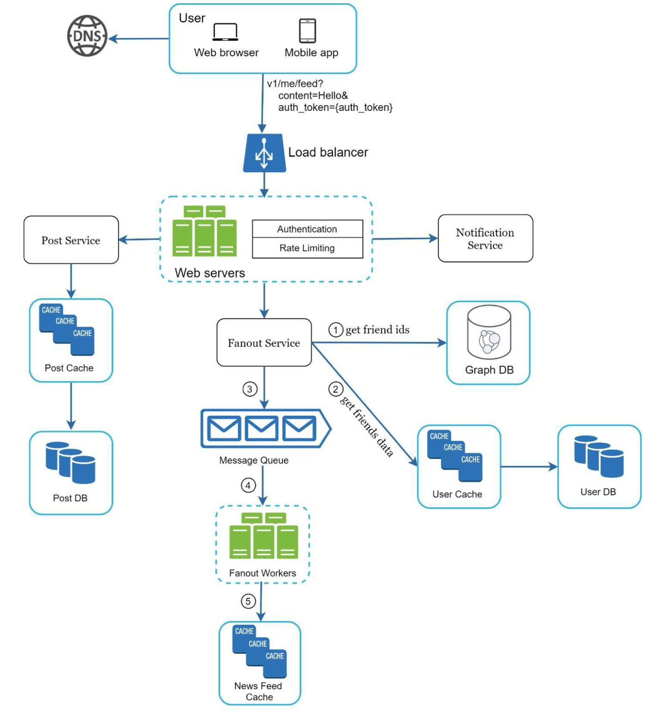

# News Feed System

## Clarify Question

1. What is the primary purpose of the feed system?
   - The feed system is designed to deliver personalized news articles and blog posts to users based on their interests and past interactions.
2. What types of content will the feed include?
   - The feed will primarily include text-based articles and blog posts, with occasional embedded images and videos.
3. What are the expected traffic and scalability requirements?
   - The system should be able to handle up to 500,000 active users daily with the capability to scale up as the user base grows. Performance metrics like load time and response time are critical, with an emphasis on maintaining a smooth user experience during peak traffic hours.

## High Level Design

### Feed Publishing Flow

1. **User Interaction**: 
   - A user posts content using the feed publishing API: `POST /v1/me/feed` with parameters `content` (text of the post) and `auth_token` (for authentication).

2. **Load Balancer**: 
   - Distributes incoming post requests to appropriate web servers for load management.

3. **Web Servers**: 
   - Redirect post requests to internal services for processing.

4. **Post Service**: 
   - Persists the post in both the database and cache for immediate availability.
   - Ensures data consistency between the database and cache.

5. **Fanout Service**: 
   - Pushes the new content to the poster's friends' news feeds.
   - Updates the news feed cache for these friends for quick access.

6. **Notification Service**: 
   - Informs friends of the new content availability.
   - Sends push notifications to friends’ devices.

### News Feed Building Flow

1. **User Request**: 
   - User requests their news feed using the API: `GET /v1/me/feed` with `auth_token`.

2. **Load Balancer and Web Servers**: 
   - Load balancer redirects the request to web servers.
   - Web servers route the request to the newsfeed service.

3. **Newsfeed Service**: 
   - Fetches the news feed from the cache.
   - Aggregates friends' posts in reverse chronological order.

4. **Newsfeed Cache**: 
   - Stores news feed IDs required to render the user's news feed.
   - Ensures quick access to the latest news feed data.

## Deep Dive

### Fanout

- **Fanout on Write:** News feed is pre-computed and delivered to friends' cache immediately after a post is published.

  - Real-time generation and immediate push of the news feed to friends.

  - Fast news feed fetching due to pre-computation during write time.

  - Slow and resource-intensive for users with many friends (hotkey problem).

  - Wastes computing resources on inactive users or those who rarely log in.

- **Fanout on Read:** News feed is generated on-demand when a user loads their homepage.

  - Efficient for inactive users, as it doesn't waste resources on them.

  - Avoids the hotkey problem as data isn't pushed to friends.

  - Slower news feed fetching since it's not pre-computed.

- **Workflow:**

  - **Fetch Friend IDs**: From the graph database, which is effective for managing friend relationships and recommendations.

  - **Get Friend Info**: From the user cache, filtering out friends based on user settings (e.g., muted friends).

  - **Send to Message Queue**: Friends list and new post ID are sent to the message queue.

  - **Fanout Workers**: Retrieve data from the message queue and store news feed data in the cache, which maps `<post_id, user_id>`.

  - **Cache Storage**: Stores `<post_id, user_id>` in the news feed cache, with a configurable limit to manage memory consumption, focusing on recent posts as they are of most interest to users.

### Newsfeed Retrieval

1. A user sends a request to retrieve her news feed. The request looks like this: */v1/me/feed* 2. The load balancer redistributes requests to web servers.
2. Web servers call the news feed service to fetch news feeds.
3. News feed service gets a list post IDs from the news feed cache.
4. A user’s news feed is more than just a list of feed IDs. It contains username, profile picture, post content, post image, etc. Thus, the news feed service fetches the complete user and post objects from caches (user cache and post cache) to construct the fully hydrated news feed.
5. The fully hydrated news feed is returned in JSON format back to the client for rendering.

### Cache

- News Feed: It stores IDs of news feeds.

- Content: It stores every post data. Popular content is stored in hot cache.

- Social Graph: It stores user relationship data.

- Action: It stores info about whether a user liked a post, replied a post, or took other actions on a post.

- Counters: It stores counters for like, reply, follower, following, etc.