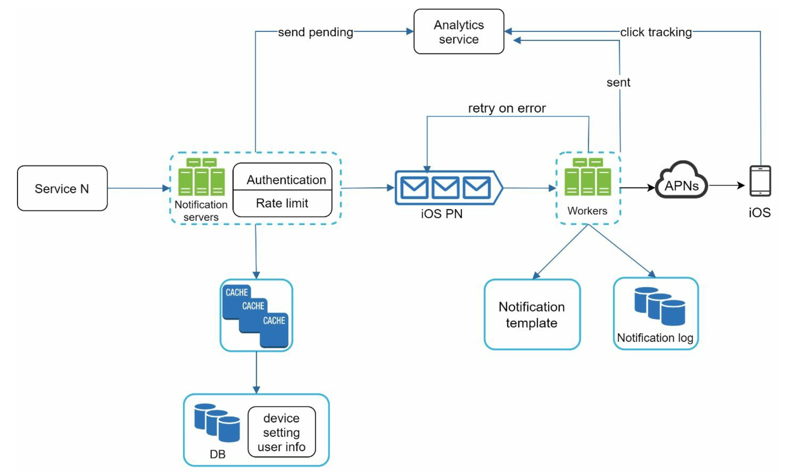

# Notification System

## Clarify Question

1. **What is the expected scale of the system?**
   - The system should be able to handle millions of users and send tens of millions of notifications per day. It needs to be scalable to accommodate growth in user base and notification volume.
2. **What types of notifications are we dealing with?**
   - The system will handle a mix of push notifications, email notifications, and SMS messages, allowing for flexibility based on user preferences and the nature of the notification.
3. **Are there different priority levels for notifications?**
   - Yes, there are high-priority notifications, like security alerts or critical updates, which require immediate delivery, and low-priority notifications, like promotional content, where some delay is acceptable.
4. **Can users customize their notification preferences?**
   - Users should be able to set preferences for the types of notifications they receive, opt in/out of certain categories, and possibly set quiet hours where only high-priority notifications are delivered.
5. **What are the requirements for system reliability and redundancy?**
   - The system should be highly reliable, with minimal downtime. It should have redundancy built in to handle failures and ensure continuous operation. Notifications, especially high-priority ones, should have a near 100% delivery rate.

## High Level Design

### Components

1. **User Interface (UI) / API Layer:**
   - Users interact with this layer to set their notification preferences and view notifications.
   - API endpoints are exposed for other services or systems to trigger notifications.
2. **Notification Service:**
   - Central component that processes incoming notification requests.
   - Manages different types of notifications (push, email, SMS).
   - Handles prioritization and scheduling of notifications.
3. **User Preferences and Subscription Management:**
   - Stores and manages user preferences regarding notification types, channels, and quiet hours.
   - Manages user subscriptions and opt-in/opt-out settings.
4. **Notification Delivery Modules:**
   - Separate modules for each type of notification: Push Notification Service, Email Service, SMS Service.
   - Responsible for the actual delivery of notifications to users.
5. **Queueing System:**
   - Buffers notification requests to handle high load and ensure reliable delivery.
   - Facilitates asynchronous processing of notifications.
6. **Database:**
   - Stores user data, notification logs, delivery status, and other relevant information.
   - Could be split into different databases optimized for specific tasks (e.g., a NoSQL database for logs, a relational database for user data).
7. **Monitoring and Analytics:**
   - Tracks the performance of the notification system (delivery rates, open rates, etc.).
   - Monitors system health and alerts in case of failures.

### Workflow

1. **Triggering Notifications:**
   - Notifications are triggered via the API, either by user actions or by other services.
2. **Processing Requests:**
   - The Notification Service receives the request and checks user preferences.
   - The request is then queued in the appropriate queue (based on priority and type).
3. **Delivery:**
   - The relevant Delivery Module picks up the notification from the queue.
   - It sends the notification through the chosen channel (push, email, or SMS).
4. **Monitoring and Analytics:**
   - Delivery status and user interactions are logged.
   - System health and performance metrics are continuously monitored

## Deep Dive

### Retry Mechanism

- **Persistence:** To avoid data loss, the system persists notification data in a database. This ensures that even if there's a failure in the notification delivery process, the data isn't lost and can be retried.
- **Notification Log Database:** A dedicated database is used to store notification logs, providing a historical record and enabling retries in case of delivery failures.
- **Deduplication Mechanism:** Due to the distributed nature of the system, there's a possibility of delivering duplicate notifications. To mitigate this, a deduplication (dedupe) mechanism is implemented.
  - Each notification event is assigned a unique event ID.
  - When an event arrives, the system checks if this ID has been seen before.
  - If it's a duplicate (already seen), the event is discarded; otherwise, the notification is sent out.

### Notification Setting

- **Notification Template:** To streamline the creation of notifications, especially when many follow a similar format. A notification template is a preformatted structure that allows customization of parameters, styling, and tracking links.
- **User Control:** To prevent users from feeling overwhelmed by too many notifications, apps and websites offer fine-grained control over notification settings
- **Rate Limiting:** It's crucial to limit notification frequency as receiving too many notifications can lead users to disable them entirely.

### Monitoring

- **Key Metrics:** Metrics like open rate, click rate, and engagement are crucial for understanding customer behaviors.
- **Event Tracking:** An analytics service is used to implement event tracking, capturing various interactions users have with notifications.

## Summary

- **Scalability and Variety:** Designed to manage millions of users and tens of millions of notifications daily, supporting push, email, and SMS formats.
- **User Interface and API Layer:** Facilitates user interactions and external triggers for notifications.
- **Central Notification Service:** Processes and manages incoming notification requests, ensuring efficient handling of various notification types.
- **Delivery Modules:** Dedicated modules for each type of notification ensure tailored delivery mechanisms.
- **Queueing System:** Enhances reliability and manages high load, ensuring smooth notification processing.
- **User Preferences Management:** Allows users to customize their notification settings, enhancing user experience.
- **Reliability Features:** Includes a retry mechanism and deduplication strategy to prevent data loss and reduce duplicates.
- **Efficiency Tools:** Utilizes notification templates for streamlined creation and rate limiting to avoid overwhelming users.
- **Monitoring and Analytics:** Comprehensive system to track performance metrics and user engagement, informing continual improvements.
- **Comprehensive Design:** A blend of user-friendliness, reliability, and efficiency, tailored to meet diverse needs and scalable for future demands.
