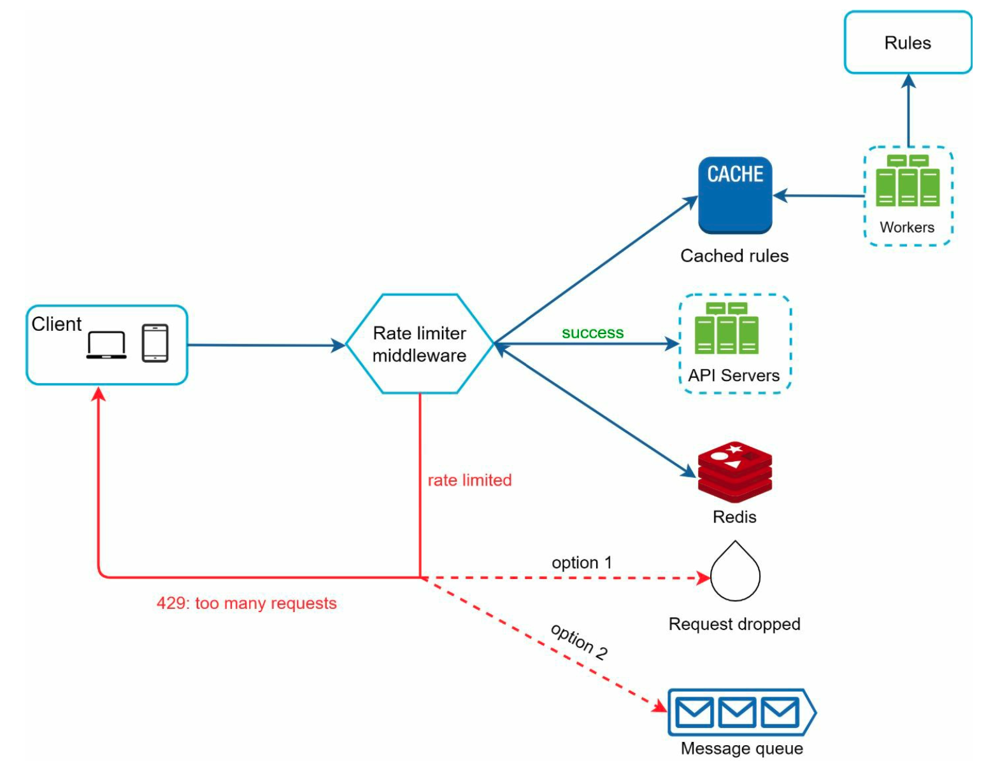

# Rate Limiter

## Clarify Question

1. **What is the primary goal of the rate limiter?**
   **Answer**: To prevent service overuse, ensure fair resource allocation, and protect against denial-of-service attacks.

2. **Should the rate limiter be user-specific or global?**
   **Answer**: It depends on the use case. For APIs, it's often user-specific (per API key or account), while for general web traffic, it might be IP-based.

3. **What are the rate limits we want to enforce?**
   **Answer**: This varies based on the service. For example, an API might allow 1000 requests per hour per user.

4. **How should the system respond to requests exceeding the rate limit?**
   **Answer**: Typically, it should send an HTTP 429 (Too Many Requests) response, possibly with a `Retry-After` header.

5. **What kind of traffic volume and pattern are we expecting?**
   **Answer**: For high-volume, bursty traffic, a Token or Leaky Bucket algorithm might be suitable. For steady traffic, a Fixed or Sliding Window approach could suffice.

6. **What data store is preferred for maintaining rate limiting data?**
   **Answer**: In-memory stores like Redis are common for their performance, but the choice might depend on existing infrastructure and scalability requirements.

7. **How will users be informed about the rate limiting policies?**
   **Answer**: Through documentation and API response headers, informing them of their current limit and usage.

8. **Are there any specific security or compliance considerations?**
   **Answer**: Ensuring user privacy and adhering to regulations like GDPR, especially if user identification is involved.

9. **How should the rate limiter handle distributed systems?**
   **Answer**: Synchronization across nodes is crucial. A centralized data store or a distributed cache might be needed for consistency.

10. **What monitoring and logging capabilities are required?**
    **Answer**: Real-time monitoring of rate limit hits/misses, alerts for abnormal patterns, and detailed logs for audit and analysis purposes.

## High Level Design

1. **Objective and Scope**

   - **Purpose**: Protect services from being overwhelmed by too many requests, ensuring fair usage and system stability.
   - **Scope**: Define if the rate limiting is per user/IP, per service, or global.

2. **Algorithm Choice**

   - **Fixed Window Counter**: Simple, counts requests in a predefined time window. Good for uniform traffic.
   - **Sliding Window Log**: More complex, tracks exact timestamps of requests for precise rate limiting. Suitable for non-uniform traffic.
   - **Token Bucket**: Allows for bursts within a defined limit. Good for use-cases with sporadic bursts.
   - **Leaky Bucket**: Smoothens out the request rate. Effective for systems requiring a steady request rate.

3. **System Architecture**

   - **Client Requests**: Users or services making requests to your system.
   - **Load Balancer**: Distributes incoming requests across servers, can also perform initial rate limit checks.
   - **Rate Limiter Component**: Central component implementing the chosen algorithm.
   - **Data Store**: Stores rate limiting data (e.g., Redis for fast, in-memory access).
   - **Application Servers**: Handle requests after they pass through the rate limiter.

4. **Rate Limiter Implementation**

   - **Identification**: Identify users/IPs to apply rate limits (e.g., by IP address, user ID, API key).
   - **Counting and Tracking**: Count requests in the current window or maintain timestamps/logs of requests.
   - **Decision Making**: Decide whether to allow or block a request based on current count/timestamps and policy.
   - **Response Strategy**: Send appropriate responses for blocked requests (e.g., HTTP 429 status).

5. **Distributed System Considerations**

   - **Synchronization**: Ensure consistent rate limiting across multiple instances of the application.
   - **Scalability**: Design to handle increasing load; rate limiter should scale with the application.

6. **Security and Compliance**

   - Implement security measures to prevent malicious circumvention of rate limits.
   - Ensure compliance with relevant regulations (e.g., GDPR, if handling user data).

7. **Monitoring and Logging**

   - **Real-time Monitoring**: Track rate limit hits, misses, and overall traffic patterns.
   - **Alerts and Notifications**: Set up alerts for anomalies or breaches in rate limits.
   - **Logging**: Maintain logs for audit trails and post-incident analysis.

8. **User Communication**

   - Inform users about rate limiting policies and current usage (e.g., through API headers).

9. **Fallback and Redundancy**

   - Implement fallback mechanisms in case of rate limiter failure.
   - Ensure redundancy to handle failures without impacting the overall system.

10. **Testing and Optimization**

   - Conduct load testing to ensure the rate limiter performs as expected under high traffic.
   - Continuously monitor and optimize the rate limiting strategy based on real usage patterns.

## Deep Dive

### Algorithm

1. **Fixed Window Counter**

- **Concept**: The time frame (window) is divided into fixed intervals (e.g., per minute or hour), and the count of requests is tracked for each interval.
- **Pros**: Simple to implement; Works well for applications with uniform traffic.
- **Cons**: Can allow twice the limit of requests near the boundary of two intervals (as the counter resets).
- **Use Case**: Good for services where traffic is predictable and evenly distributed.

2. **Sliding Window Log**

- **Concept**: Maintains a log of timestamps of each request. The window slides continuously, and the number of requests in the last N units of time (e.g., minutes) is counted.
- **Pros**: More accurate control over the request rate; Prevents the boundary condition issue seen in Fixed Window.
- **Cons**: Requires more storage and computational power as it needs to record the timestamp of each request.
- **Use Case**: Suitable for high-traffic applications where precise rate limiting is essential.

3. **Sliding Window Counter**

- **Concept**: A hybrid of Fixed Window and Sliding Log. It divides the time into slots but adjusts the rate limit based on the count in the current and previous windows.
- **Pros**: Balances between accuracy and resource utilization; Mitigates the boundary condition problem of Fixed Window Counter.
- **Cons**: More complex than Fixed Window Counter.
- **Use Case**: Useful when a balance between precision and resource efficiency is needed.

4. **Token Bucket**

- **Concept**: A bucket is filled with tokens at a steady rate. Each token allows for a request. If the bucket is empty, new requests are either queued or rejected.
- **Pros**: Allows for bursty traffic, as long as the average rate doesn't exceed the refill rate; Flexible and widely used.
- **Cons**: Can be complex to implement in distributed systems.
- **Use Case**: Ideal for APIs and services that need to handle bursty traffic.

5. **Leaky Bucket**

- **Concept**: Requests are added to a queue and processed at a steady rate. If the bucket (queue) overflows (too many requests), new requests are discarded.
- **Pros**: Ensures a steady output rate regardless of the burstiness of the input.
- **Cons**: Can lead to high latency during traffic spikes.
- **Use Case**: Best for scenarios where it's critical to maintain a uniform rate of request processing.

### Distributed

1. **Understanding the Challenges**

   - **Synchronization**: Ensuring consistent rate limiting across all nodes in a distributed system.
   - **Race Conditions**: Preventing simultaneous accesses from incorrectly modifying shared rate limiting data.

2. **Selecting a Suitable Rate Limiting Algorithm**

   - Algorithms like **Token Bucket** or **Sliding Window** can be adapted for distributed systems.
   - The algorithm choice should consider the trade-off between accuracy and performance in a distributed context.

3. **Distributed Data Store**

   - Use a centralized, high-performance, distributed cache like **Redis**.
   - The data store should support atomic operations to mitigate race conditions.

4. **Leveraging Distributed Locks**

   - Implement distributed locks when updating shared rate limiting data.
   - Tools like **Redisson** for Redis can be used to handle distributed locks.

5. **Atomic Operations**

   - Utilize atomic operations provided by the data store for incrementing counters or updating timestamps.
   - This ensures that simultaneous reads/writes do not lead to inconsistent states.

6. **Data Replication**

   - Ensure that the data store has robust replication mechanisms.
   - Replication must be fast enough to keep up with the rate limiter's access patterns.

7. **Timestamp Synchronization**

   - In algorithms like Sliding Window, ensure that all nodes use a synchronized time source (like NTP) to avoid inconsistencies due to time drift.

## Wrap Up

### Summary

1. **Understanding Requirements**: Clarifying the purpose, scope, and specific limits of the rate limiter based on the application's needs.
2. **Choosing an Algorithm**: Selecting an appropriate rate limiting algorithm, such as Fixed Window, Sliding Window, Token Bucket, or Leaky Bucket, based on traffic patterns and system requirements.
3. **Implementing the Rate Limiter**: This involves identifying users or services, tracking request counts or timestamps, and deciding on actions when the rate limit is exceeded.
4. **Data Store Integration**: Using a fast and reliable data store, often in-memory like Redis, for maintaining rate limiting data.
5. **Handling Distributed Systems**: Ensuring synchronization and consistency across multiple servers or instances, while avoiding race conditions.
6. **Security and Compliance**: Addressing security concerns and regulatory compliance, especially when user identification is involved.
7. **Monitoring and Optimization**: Implementing monitoring for the rate limiter's performance and optimizing it based on real usage patterns.

### Improvement

1. **Adaptive Rate Limiting**: Implement an adaptive rate limiting mechanism that can adjust limits in real-time based on current system load and usage patterns, improving resource allocation during varying traffic conditions.
2. **User Feedback Mechanism**: Enhance user communication by providing real-time feedback on their current rate limit status and potential reset times, improving the user experience and transparency.
3. **Distributed Lock Optimization**: For distributed environments, optimize the use of distributed locks to reduce latency and improve performance, possibly exploring lock-free algorithms.
