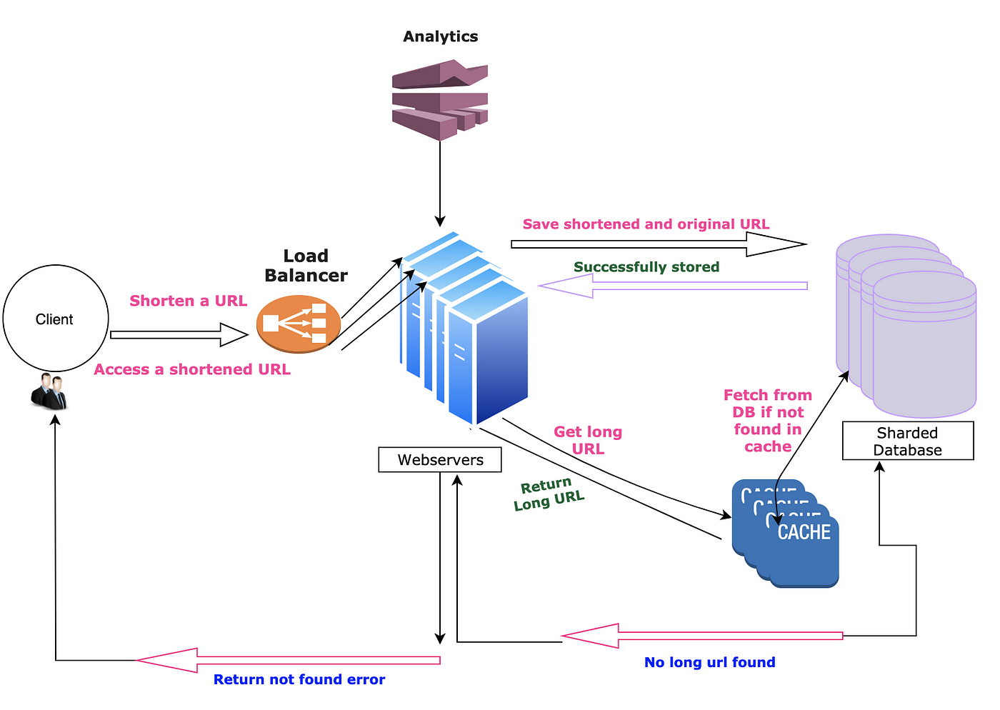

# URL Shortener

## Requirment

### Functional

- The system must accept a long URL and return a shorter, unique URL.

- The short URL should redirect users to the original long URL.
- The system should perform validation on input URLs to ensure they are properly formatted.

- When a long URL is submitted more than once, the system can return the existing short URL.

- The system must correctly redirect users accessing a short URL to the original long URL.
- The system should track and report on metrics such as the number of times a short URL is accessed (click-through rate).

### Non-functional

- **Performance:** The system should handle URL redirection with low latency, ideally in under a few hundred milliseconds.
- **Performance:**The system should be capable of processing a high volume of URL shortening requests per second.

- **Scalability:** The system architecture should support scaling to accommodate growth in user traffic and data volume.
- **Scalability:** It should be possible to scale the system horizontally by adding more servers.
- **Availability:** The system should be highly available, with a target uptime of 99.99% or higher.
- **Reliability:** The system should ensure that short URLs, once created, continue to function over time unless explicitly expired.

## Estimate

### Assumption

- 1 million URL write request per day, 100:1 Read-write ratio, 100 million URL read request per day
- 500 bytes for one url
- cache hit rate 80% for 20% data, cache expiration in one day

### Traffic

- Read request: 100 million / 24 / 3600 = 1157 query/second
- Write request: 1 million / 24 / 3600 = 11.6 query/second

### Storage

- URL storage for one day is 1 million * 500 bytes = 500 MB, and for 10 years is 1.825 TB

### Memory

- 101 million requests per day and cache 20% percent of the data, to be 0.2 * 101 * 500 bytes = 10.1 GB

## High Level Design

### Component

- **Web Application:** A simple, user-friendly web interface where users can enter URLs to be shortened and receive their shortened versions. It can also display analytics for URLs the user has created if account management is supported.
- **API Gateway:** Provides a programmable interface for developers to create, retrieve, and manage short URLs programmatically. This can be RESTful or GraphQL APIs.

- **URL Shortening Service:** The core logic for accepting long URLs, generating short codes (unique identifiers), and storing the mapping between the short code and the long URL in the database. This service also handles the generation of custom URLs if requested by the user.
- **Redirection Service:** Handles requests to short URLs, looks up the corresponding long URL, and redirects the client using HTTP 301 or 302 responses.

- **URL Storage:** A database capable of storing mappings between short codes and long URLs, along with metadata such as creation date, expiration date (if applicable), and the owner (if user accounts are implemented).
- **Load Balancer:** Distributes incoming traffic across multiple instances of the application to ensure scalability and reliability.
- **Cache:** Reduces database load by caching popular URLs. Commonly accessed short URLs and their corresponding long URLs are stored temporarily to speed up redirection and analytics processing.
- **CDN (Content Delivery Network):** (Optional) A CDN can be used to cache and serve static content, reducing latency for users distributed globally.

### Workflow

1. **Shortening a URL:**
   - User submits a long URL through the UI or API.
   - The URL shortening service validates the URL, generates a short code, stores the mapping in the URL storage, and returns the short URL to the user.
2. **Accessing a Short URL:**
   - A client requests a short URL.
   - The redirection service looks up the short code in the cache or the URL storage database.
   - If the short URL exists, the service redirects the client to the long URL; otherwise, it returns an error message.
3. **Viewing Analytics:**
   - (Optional) Users request analytics for a short URL through the UI or API.
   - The analytics service retrieves and aggregates data from the analytics database and presents it to the user.

## Design Deep Dive

### Schema

- URLs Table:
  - `short_code` (Primary Key): A unique identifier for the shortened URL.
  - `original_url`: The original URL that is being shortened.
  - `creation_date`: The date and time when the shortened URL was created.
  - `expiration_date` (Optional): If URLs are set to expire, this field stores that date.
  - `user_id` (Optional): If implementing user accounts, this associates a URL with a user.
- Analytics Table:
  - `short_code`: A foreign key linking to the URLs table.
  - `access_date`: The date and time of access.
  - `referrer`: The referring site, if available.
  - `ip_address`: The IP address of the requester.

### Shortening Algorithm

- **Base62 Encoding**:
  - Utilizes a character set comprising digits [0-9], lowercase [a-z], and uppercase [A-Z] letters.
  - Short URLs of varying lengths can represent a vast number of unique URLs (e.g., 5 characters for ~916 million URLs, 6 for ~56 billion, and 7 for ~3500 billion).
  - The decision to use 7 characters allows for the generation of approximately 3500 billion unique URLs.
- **Techniques for Generating Unique Short URLs**:
  - **Random Number Generation**: Selects random characters for each position in the short URL and checks for uniqueness in the database, which becomes less efficient as the database grows.
  - **Base Conversion**: Converts a large numeric counter value to base62, ensuring uniqueness. This method requires incrementing the counter for each new URL request.
  - **MD5 Hashing**: Generates a 128-bit hash (32 hexadecimal digits) of the original URL. The first 7 characters are used to create the short URL, ensuring its uniqueness through database checks.

