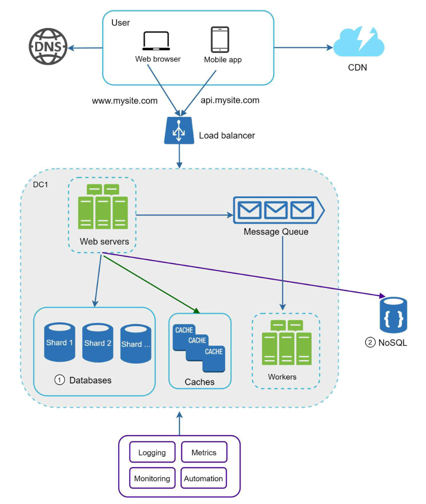
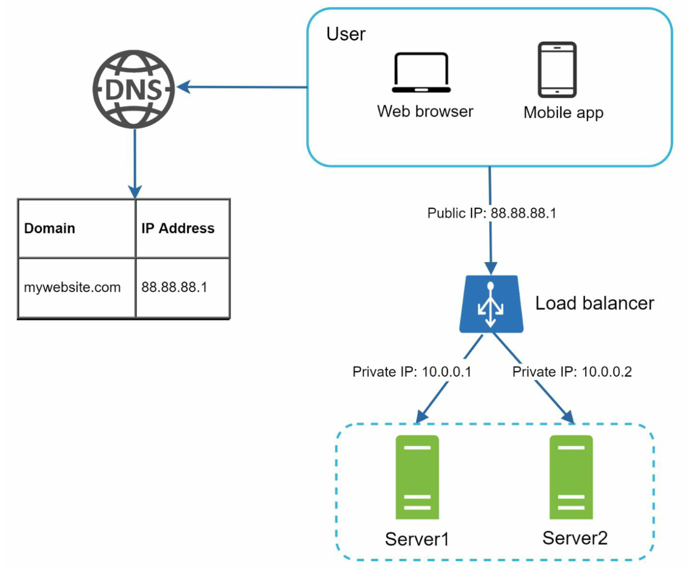
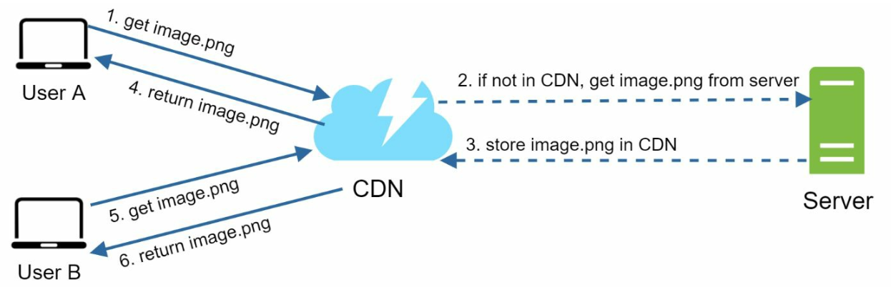
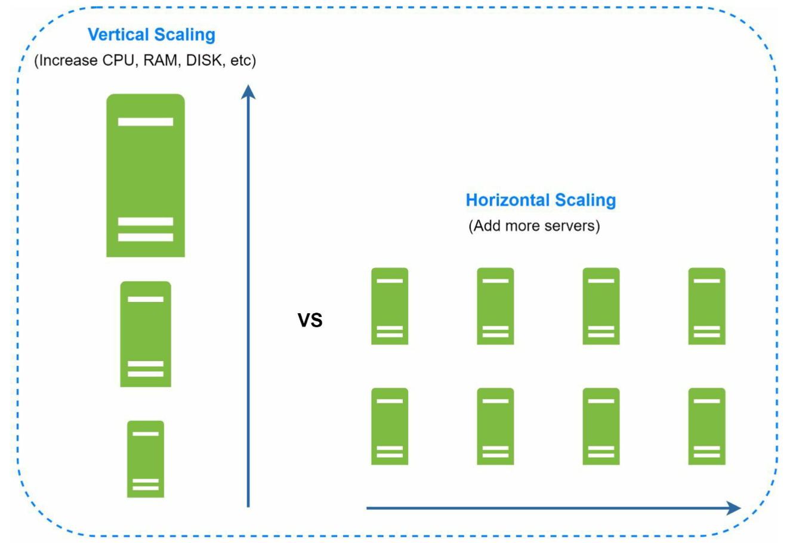
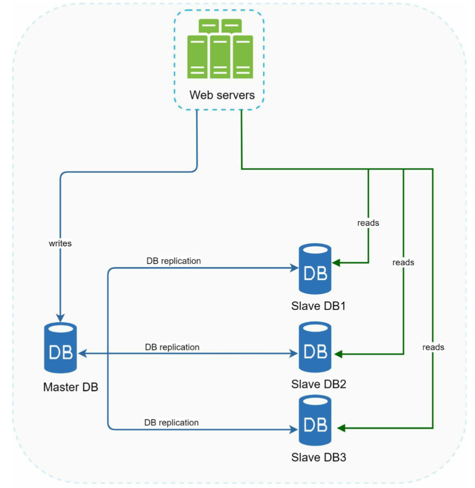

# Web Application

## Introduction

1. **User Initiates Request**: The user enters a URL in their browser or interacts with an app that generates a request to a web server.

2. **DNS Resolution**

      - The browser asks a DNS resolver to translate the domain name into an IP address.

      - The DNS resolver queries various DNS servers (root, TLD, and authoritative) to find the IP address of the server hosting the web application.

3. **CDN Interaction**

      - If the requested content is static (like images, CSS, JavaScript files), the DNS might direct the request to a Content Delivery Network (CDN).

      - The CDN serves the content from the nearest edge server to reduce latency. If the edge server doesn't have the content cached, it retrieves it from the origin server and caches it for future requests.

4. **Load Balancer Distribution**

      - If the request is for dynamic content, the IP address resolved by the DNS points to a load balancer.

      - The load balancer distributes the request to one of the web application servers, typically based on factors like current load, server health, or geographic location.

5. **Web Server Processing**: The web server receives the request and processes it. This may involve interacting with backend services, APIs, or a message queue for asynchronous processing tasks.

6. **Message Queue (Optional)**: For operations that don't require immediate processing (like sending emails or processing logs), the web server might place tasks in a message queue. Separate worker servers can asynchronously process these tasks later, reducing response time.

7. **Cache Check**

      - Before querying the database for data, the web server first checks if the requested data is available in the cache (like Redis or Memcached).

      - If a cache hit occurs (data found in cache), it returns the data to the user, significantly reducing the load on the database.

8. **Database Interaction**

      - If the data is not in the cache (cache miss), the web server queries the database.

      - The database processes the query and returns the results to the web server.

9. **Response to User**: The web server then sends the response back to the user, either the static content from the CDN, the dynamically generated content, or the data retrieved from the database/cache.

10. **Closing the Loop**: The web browser or client app receives the response and renders it for the user.

## Load Balancer

### Functions

- **Distribution of Client Requests**: It distributes incoming network traffic across a group of backend servers (also known as a server farm or server pool). This distribution ensures that no single server bears too much demand. By spreading the requests evenly, it increases the application's responsiveness and availability.
- **Health Checks**: Load balancers continually check the health of servers to ensure they can handle requests. If a server fails, the load balancer redirects traffic to the remaining online servers. When the offline server becomes healthy again, the load balancer resumes sending traffic to it.
- **Traffic Management and Optimization**: They can optimize the service delivery based on various metrics like server response time, the number of connections to a server, or even the current load of each server. This ensures users receive the quickest and most reliable access to the resources they request.

### Algorithms

- **Round Robin**: Distributes client requests sequentially among the servers in the pool.
- **Least Connections**: Directs traffic to the server with the fewest active connections.
- **IP Hash**: Determines which server to use based on the client’s IP address, ensuring a user is consistently sent to the same server.

## CDN

### Functions

- **Caching Static Resources**: CDNs store (cache) static content like HTML pages, javascript files, stylesheets, images, and videos. When a user requests this content, it is served from the nearest CDN server rather than the origin server, significantly reducing delivery time.
- **Reducing Bandwidth Costs**: By caching and delivering content from edge servers closer to the user, CDNs reduce the amount of data that the origin server needs to transmit, thus lowering bandwidth consumption and costs.
- **Improving Website Load Times**: By serving content from locations closer to the end-users, CDNs reduce latency and packet loss, resulting in faster loading of web pages.
- **Handling High Traffic Loads**: During traffic spikes, CDNs can efficiently distribute the load, preventing the origin server from becoming overwhelmed, ensuring the website remains available and responsive.
- **Enhancing Security**: Many CDNs offer security features like DDoS protection, web application firewalls, and SSL/TLS encryption to secure data in transit.

### Workflow

- When a user requests a webpage, the CDN redirects this request from the originating site’s server to a server in the CDN that is closest to the user.
- The CDN server checks if it has a cached version of the content. If yes, it delivers this content to the user. If not, it requests the content from the origin server, caches it for future requests, and then delivers it to the user.

## Server

### Scaling

- **Vertical Scaling (Scaling Up/Down)**
  - Advantages
    - **Simplicity**: Easier to implement as it involves a single machine.
    - **Data Management**: Managing data is simpler since everything is stored on a single machine.
  - Disadvantages
    - **Limited Scalability**: There's a limit to how much you can upgrade a single machine.
    - **Downtime**: Upgrading hardware may require downtime.
    - **Single Point of Failure**: If the server goes down, the entire service can become unavailable.
    - **Cost**: Beyond certain limits, it becomes more expensive to scale vertically compared to horizontally.
- **Horizontal Scaling (Scaling In/Out)**
  - Advantages
    - **Scalability**: Easily scales to handle increased load by simply adding more machines.
    - **Flexibility**: You can add or remove servers as needed, which is cost-effective and efficient.
    - **Redundancy**: Offers high availability and fault tolerance, as failure in one server does not bring down the entire system.
  - Disadvantages
    - **Complexity**: Requires more sophisticated networking and software architectures.
    - **Data Consistency**: Keeping data synchronized across servers can be challenging.

## Message Queue

### Functions

- **Asynchronous Processing**: Message queues decouple the components of a web application, allowing for asynchronous processing. When a task is sent to the queue, it can be processed at a later time without blocking the sender.
- **Load Balancing**: They help distribute workload evenly across multiple processing nodes, preventing any single node from being overwhelmed by high volumes of requests.
- **Fault Tolerance and Reliability**: In case of a failure in processing, message queues can retain the messages, allowing for reprocessing once the issue is resolved. This enhances the reliability of the application.
- **Scalability**: By decoupling components, message queues enable scaling parts of the system independently based on their individual load and processing requirements.
- **Ordering and Guarantees**: Some message queues can guarantee message ordering and delivery, ensuring that messages are processed in the order they are received and without loss.

### Use Cases

- **Background Processing**: Handling tasks like sending emails, generating reports, or processing analytics in the background, away from the main flow of user requests.
- **Inter-Service Communication**: Facilitating communication in a microservices architecture, where different services interact through messages.
- **Event-Driven Architecture**: Acting as an event bus to propagate events across different parts of the application.

## Database

### Master Slave

1. **Master Database**: This is the primary database that handles all the write operations (INSERT, UPDATE, DELETE). It's the authoritative source of data. If the master database goes offline, a slave database will be promoted to be the new master.
2. **Slave Database(s)**: These are the copies of the master database. They handle read operations (SELECT queries). Slaves replicate data from the master database to stay updated. If only one slave database is available and it goes offline, read operations will be directed to the master database temporarily

### Sharding

- **Data Division**: In sharding, data is divided across multiple databases. Each shard contains a subset of the total data. The division can be based on various sharding strategies.

- **Sharding Key**: A key or attribute is used to determine how data is distributed among the shards. This key is typically a column in the database, like user ID, geographical location, or a hash of one of the fields.

  - **Range-Based Sharding**: Data is partitioned according to a range of values in the sharding key (e.g., date ranges, alphabetical ranges).

  - **Hash-Based Sharding**: A hash function is applied to the sharding key to determine the shard. This helps in evenly distributing data.

  - **List-Based Sharding**: Data is partitioned based on a list of values. For example, different shards may handle data for different countries.

  - **Directory-Based Sharding**: A lookup service is used to map entries to the correct shard.

## Cache

- **Use Case: **Consider using cache when data is read frequently but modified infrequently
- **Expiration Policy:**
  - It is advisable not to make the expiration date too short as this will cause the system to reload data from the database too frequently
  - it is advisable not to make the expiration date too long as the data can become stale
- **Consistency:** Inconsistency can happen because data-modifying operations on the data store and cache are not in a single transaction
- **Eviction: **Once the cache is full, any requests to add items to the cache might cause existing items to be removed
  - LRU: Least Recently Used
  - LFU: Least Frequently Used
  - FIFO: First In First Out

## Session

To ensure a stateless architecture while handling user session data, the key is to store session information outside of your application servers. This approach allows the servers to process requests without maintaining any user-specific state, enabling scalability and flexibility, particularly in distributed environments.

## Automation

#### Continuous Integration (CI)

- **Automated Testing**: Automatically run tests whenever new code is committed to the source repository to ensure that new changes don't break the application.
- **Integration of Changes**: Regularly and frequently integrating code changes into a shared repository, reducing integration conflicts.

#### Continuous Delivery

- **Automated Release Process**: Automatically preparing and building the application for release to a production-like environment. This ensures the application is always in a deployable state.

#### Continuous Deployment

- **Automated Deployment**: Every change that passes the automated tests is automatically deployed to the production environment.