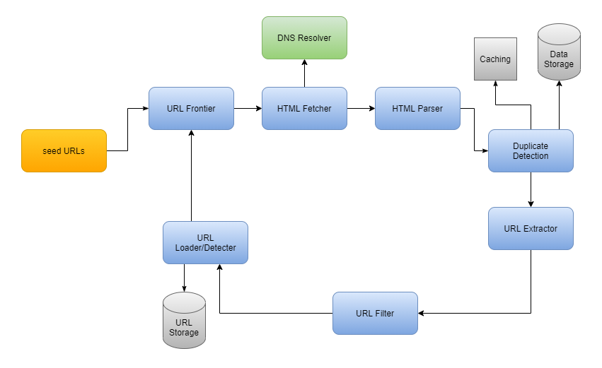

# Web Crawler

## Requirments

### Functional

- **URL Fetching**: Ability to retrieve web pages by URL.
- **Link Extraction**: Identifying and extracting links from a webpage to other pages.
- **Content Analysis**: Capability to analyze the content of webpages to determine relevance, categorize content, or extract specific information.
- **Robots.txt Compliance**: Respecting website crawl-delay, allow, and disallow directives to avoid overloading web servers.
- **Duplicate Detection**: Mechanism to identify and avoid crawling the same URL multiple times.

### Non-Functional

- **Performance**: High efficiency in processing URLs and analyzing content, with minimal latency.
- **Scalability**: Ability to scale horizontally to handle increases in load, potentially by adding more crawling instances.
- **Reliability**: High uptime and robustness, with mechanisms to recover from crashes or network failures.

## High-Level Design

### Component

- **Crawler Frontend**

  - **Scheduler**: Determines the order in which URLs are crawled, based on prioritization algorithms (e.g., depth-first, breadth-first, or priority-based on page importance).

  - **URL Frontier**: A queue of URLs to be visited, managed by the Scheduler. It stores URLs discovered but not yet crawled, ensuring they are unique to avoid duplicate crawling.

- **URL Fetcher**

  - Responsible for downloading web pages. This component sends HTTP requests to the URLs in the URL Frontier and fetches the web content.

  - Must handle various HTTP methods, status codes, and also respect `robots.txt` directives.

- **Link Extractor**

  - Parses the fetched web pages to extract links to other pages.

  - This module must be able to handle and normalize relative and absolute URLs, adding the new URLs back to the URL Frontier for crawling.

- **Content Processor**

  - Analyzes the content of each page to extract useful information, depending on the crawler's purpose (e.g., indexing content, data extraction).

  - Could include processing tasks like text extraction, keyword analysis, and metadata extraction.

- **Data Storage**

  - Stores the crawled information in a structured format for easy retrieval. This could involve a database or a file system, depending on the scale and purpose of the crawler.

  - Needs to be designed for efficient storage and retrieval, potentially including indexing mechanisms for quick searches.

- **Duplication Detector**

  - Ensures that the same content or URL is not processed multiple times, saving resources and avoiding data redundancy.

  - Often implemented using a fast lookup data structure, such as a hash table or Bloom filter.

### Workflow

1. The URL Frontier sends URLs to the URL Fetcher.
2. The URL Fetcher retrieves the content and passes it to the Link Extractor and Content Processor.
3. New URLs from the Link Extractor are filtered by the Duplication Detector and added back to the URL Frontier if unique.
4. Processed content from the Content Processor is stored in the Data Storage system.

## Deep Dive

### URL Frontier

- **Partitioning**: The URL frontier should be partitioned across multiple machines to balance the load. Partitioning can be based on URL domain, hash, or other criteria to ensure efficient distribution and minimize bottlenecks.
- **High Availability and Redundancy**: Implement redundancy and data replication strategies to prevent data loss and ensure the URL frontier is always available.
- **Central Coordinator**: A central system or service (like Apache ZooKeeper) that manages the distribution of tasks and coordination between different components of the crawler. It ensures that there are no conflicts and helps in managing the crawler state across the cluster.
- **Task Queue Management**: Use distributed queues (e.g., Apache Kafka, RabbitMQ) to manage URLs to be crawled. These queues serve as the URL Frontier, distributing crawl tasks across multiple crawling instances.

### Schema

URLs Table/Collections: This table stores information about each URL that needs to be or has been crawled.

- **URL_ID**: A unique identifier for each URL. This could be a hash of the URL.
- **URL**: The actual URL string.
- **Status**: Indicates the crawl status (e.g., pending, in-progress, completed, failed).
- **Priority**: A numerical value indicating the crawl priority of the URL. Higher values indicate higher priority.
- **Last_Crawled**: Timestamp of when the URL was last crawled.
- **Crawl_Frequency**: Indicates how frequently the URL should be recrawled.
- **Robots_Txt**: Cached `robots.txt` rules for the domain, to avoid fetching it before each crawl.
- **Hash_Content**: A hash of the last crawled content, used for detecting changes in the content.
- **Retry_Count**: Number of times the crawl was retried due to failures.

Content Table/Collections: NoSQL key-value store

