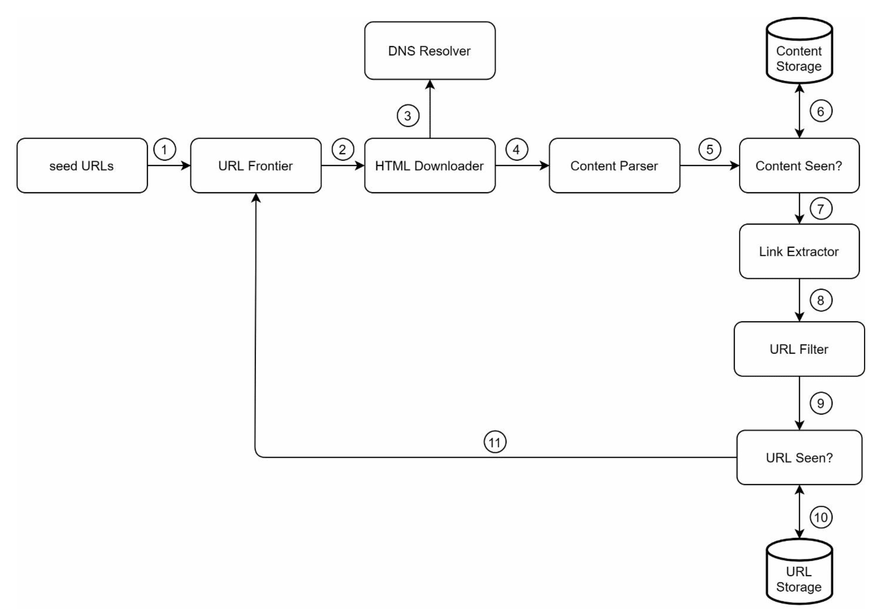
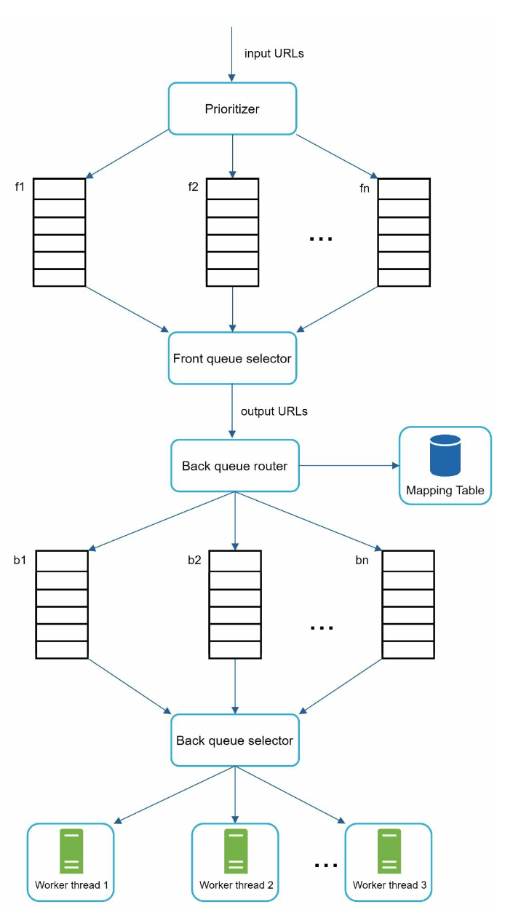

# Web Crawler

## Clarify Questions

1. **Scope and Scale:** "What is the intended scope and scale of the web crawler? Are we focusing on a specific type of website or content, and how much data do we expect to process?"
   - The crawler is intended for a broad range of websites to support a search engine index, implying a need for a highly scalable and robust system. It should be capable of handling diverse content types (text, images, videos) from various domains.
   - The target is to process approximately 1 billion pages per month, which requires a crawler capable of handling high volumes of data efficiently.
2. **Frequency of Crawling:** "How frequently should the web crawler revisit websites? Is there a need for real-time data, or are periodic updates sufficient?"
   - Given the scale, the crawler will likely employ a tiered crawling strategy, with more frequent visits to rapidly changing websites and less frequent visits to static sites.
   - A dynamic scheduling system could be used to prioritize crawling based on page importance, change frequency, and freshness requirements.
3. **Data Storage and Processing:** "What kind of data are we looking to extract and store? Do we need to process or analyze the data in any specific way?"
   - The crawler needs to extract and store web page content, metadata, and possibly structural data for indexing.
   - Considering the volume, efficient storage solutions like distributed databases and content delivery networks (CDN) might be required.
   - There should be an emphasis on preprocessing and normalizing data for ease of indexing and search.

## High-Level Design

### Component

1. **URL Frontier:**

   - **Seed URL Initialization:** Initiate the crawler with a set of seed URLs that represent a starting point.
   - **URL Management:** Handles the addition of new URLs (from the Link Extractor) and serves as a queue for the HTML Downloader.
   - **Duplication Check:** Integrates the "URL Seen?" component to ensure URLs aren't repeatedly processed.

2. **HTML Downloader:**

   - **URL Fetching:** Retrieves URLs from the URL Frontier in batches for efficiency.
   - **DNS Resolution:** Resolves IP addresses of URLs using a DNS resolver.
   - **HTML Downloading:** Downloads the HTML content of the web pages.

3. **Content Parser:**

   - **HTML Parsing:** Parses the downloaded HTML pages, extracting useful information.
   - **Validation:** Checks for malformed or irrelevant content, filtering out low-quality or non-compliant pages.

4. **Content Seen:**

   - **Duplication Check:** Determines if the content of a page has already been stored.
   - **Content Filtering:** Discards duplicates to avoid redundant processing and storage.

5. **Link Extractor:**

   - **Link Extraction:** Extracts new URLs from valid HTML pages.
   - **Link Normalization:** Ensures extracted links are in a standard format for processing.

6. **URL Filter:**

   - **URL Validation:** Filters out irrelevant or low-quality URLs based on predefined criteria (e.g., domain restrictions, content type).
   - **Relevance Assessment:** Assesses the potential value of URLs for indexing.

7. **URL Seen:**

   - **URL Duplication Check:** Verifies if a URL is already in the storage or has been processed.
   - **Filtering Processed URLs:** Prevents re-crawling of already processed URLs.

8. **Storage and Database Integration:**

   - **Content Storage:** Stores valid, unique content from parsed HTML pages.
   - **Metadata Storage:** Saves relevant metadata and link information.
   - **Distributed Database System:** Ensures scalability and efficient retrieval.

9. **Scalability and Performance Optimization:**

   - **Distributed Crawling:** Utilizes multiple crawler instances for parallel processing.
   - **Load Balancing:** Distributes tasks evenly across crawler nodes.
   - **Efficient Resource Utilization:** Optimizes bandwidth and computational resources.

### Workflow

1. Add seed URLs to the URL Frontier
2. HTML Downloader fetches a list of URLs from URL Frontier.
3. HTML Downloader gets IP addresses of URLs from DNS resolver and starts downloading.
4. Content Parser parses HTML pages and checks if pages are malformed.
5. After content is parsed and validated, it is passed to the “Content Seen?” component. Step 6: “Content Seen” component checks if a HTML page is already in the storage.
   - If it is in the storage, this means the same content in a different URL has already been processed. In this case, the HTML page is discarded.
   - If it is not in the storage, the system has not processed the same content before. The content is passed to Link Extractor.

6. Link extractor extracts links from HTML pages.
7. Extracted links are passed to the URL filter.
8. After links are filtered, they are passed to the “URL Seen?” component.
9. “URL Seen” component checks if a URL is already in the storage, if yes, it is processed before, and nothing needs to be done.
10. If a URL has not been processed before, it is added to the URL Frontier.

## Deep Dive

### URL Frontier

1. **Function of URL Frontier:** It's a data structure that stores URLs to be downloaded, playing a crucial role in managing politeness, URL prioritization, and ensuring the freshness of the content.

2. **Politeness:**
   - A web crawler should avoid overwhelming a server with requests, which could be perceived as impolite or a denial-of-service (DoS) attack.
   - The design includes a mapping from website hostnames to download threads, with each thread managing a separate FIFO (First In, First Out) queue for a specific host. This setup controls the request rate to each server.
   - Key components for politeness include a queue router, mapping table, FIFO queues, queue selector, and worker threads. A delay between download tasks can be implemented to further enforce politeness.

3. **Priority:**
   - URLs are prioritized based on factors like PageRank, website traffic, and update frequency.
   - The 'Prioritizer' component computes priorities for URLs.
   - The system includes multiple queues with assigned priorities, and the queue selector chooses queues for download, favoring higher-priority queues.

4. **Freshness:**
   - To maintain up-to-date data, the system periodically recrawls pages, with strategies to optimize this process.
   - These strategies include recrawling based on web pages’ update history and prioritizing important pages for more frequent updates.

5. **Storage for URL Frontier:**
   - Due to the vast number of URLs (potentially in the hundreds of millions), a hybrid storage approach is adopted.
   - Most URLs are stored on disk for scalability, with buffers in memory for efficient enqueue/dequeue operations. Data in the buffer is periodically written to disk to balance between speed and storage capacity.

### HTML Downloader

1. **Robots Exclusion Protocol (Robots.txt):**
   - This is a standard used by websites to instruct crawlers on which pages can be downloaded.
   - Crawlers must first check a website's robots.txt file and adhere to its rules before crawling.
   - To improve efficiency, the results of the robots.txt file are cached and periodically updated.
2. **Performance Optimization:**
   - The HTML downloader incorporates several strategies to enhance performance:
     - **Distributed Crawling:** The crawling process is distributed across multiple servers, with each server running multiple threads. The URL space is partitioned, and each downloader handles a subset of URLs.
     - **DNS Resolver Caching:** DNS lookups can be a bottleneck due to their synchronous nature and varying response times. By maintaining a DNS cache that stores domain-to-IP mappings, frequent DNS calls are reduced, speeding up the process. This cache is regularly updated.
     - **Geographical Locality:** Placing crawl servers geographically closer to website hosts can significantly decrease download times. This principle of locality is applied to various system components like servers, cache, queues, and storage.
     - **Short Timeout:** To avoid delays from slow or unresponsive servers, a maximum wait time is defined. If a host doesn't respond within this period, the crawler moves on to other pages.

## Summary

The web crawler design is tailored for indexing 1 billion pages monthly for a search engine. It includes a URL Frontier for managing and prioritizing URLs, an HTML Downloader for retrieving web content while adhering to robots.txt rules, and a content parsing system for data validation. The design emphasizes scalability, performance optimization, and compliance with ethical crawling guidelines. This ensures efficient operation, up-to-date content indexing, and respect for website policies.
